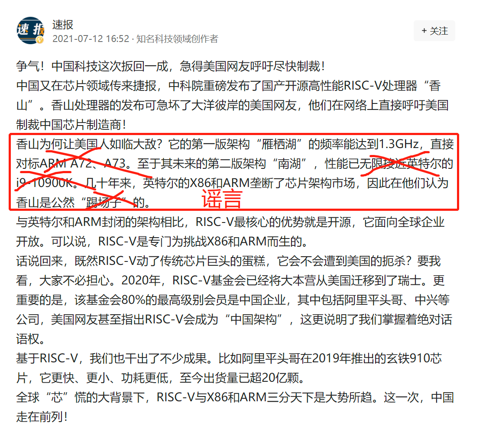

# 澄清

7月12日，我们注意到今日头条媒体上出现"知名科技领域作者"[速报署名的文章](https://www.toutiao.com/w/i1705068421667844)，其中提到了香山处理器，但其内容与事实严重不符。

我们强烈反对自媒体在没有和我们进行技术方面的确认前，就擅自对香山的技术水平进行演绎发挥，因此特意在此做出澄清。

## 对标A72、A73？接近i9？

**我们从来没有说过香山的雁栖湖版本能够对标A72或者A73，更没有说过南湖版本能够对标甚至接近i9-10900K。**

## 其他煽动性、赢麻了言论

香山团队始终坚持实事求是的原则，希望脚踏实地把事情做好，并不希望有任何煽动情绪的报道出现。

**香山的核心理念是开源与敏捷。**一方面，我们希望成为世界级的体系结构创新开源平台，服务于工业界、学术界、个人爱好者等的体系结构研究需求。另一方面，我们希望在香山的开发过程中，探索高性能处理器的敏捷开发流程，建立一套基于开源工具的高性能处理器设计、实现、验证流程，大幅提高处理器开发效率、降低处理器开发门槛。

**我们不希望将国产、自主可控等词汇用在香山的宣传上。**芯片卡脖子可以看成短期的燃眉之急与长期的切肤之痛两方面，香山并不能解决燃眉之急的问题，但有机会通过我们的持续努力缓解切肤之痛，通过香山项目形成处理器开发的基础设施、建立起人才培养的渠道等，助力芯片卡脖子问题的解决。

## 最大的误会：能和10900k对标？没法比

我们目前**和i9 10900k没法比，没法比**。我们目前只能跑到1.3GHz，10900k能跑5GHz，在主频差距巨大的情况下对比同频性能，在技术上是不科学的。并且我们的同频性能也不如10900k，所以绝对性能差距也非常大，现阶段还不能和10900k对标。

## 第二大的误会：现在版本的香山和A73对标吗？仍有一定差距

A73的性能功耗比是做得非常好的，在二发射的宽度下达到了高于香山处理器的性能。而香山目前是六发射，因此香山的效率是不如A73的。虽然我们未来的远期目标是和A76看齐，但是目前还在推进当中。

我们需要脚踏实地迭代优化，敏捷开发的目的不是弯道超车，Intel和ARM多年来积累的经验，我们也需要慢慢积累，类似“开发一年就达到Intel和ARM的先进水平”的说法，是违反事物发展的客观规律的，我们不提倡这种说法。