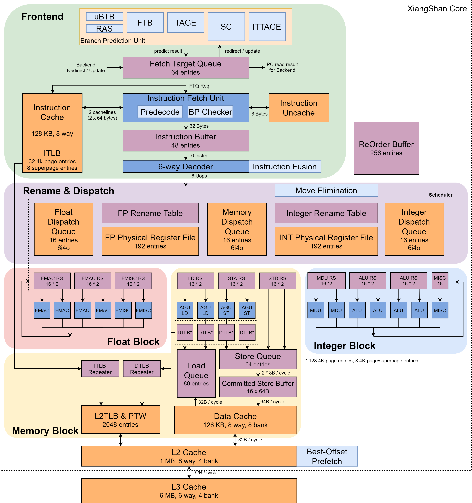

# Architecture design of Xiangshan

The Xiangshan processor is an out-of-order six-issue architecture design and currently supports RV64GCBK extension (the specific instruction set string is `RV64IMAFDC_zba_zbb_zbc_zbs_zbkb_zbkc_zbkx_zknd_zkne_zknh_zksed_zksh_svinval`). 

The Xiangshan processor frontend pipeline includes [branch prediction](./frontend/bp.md), [Instruction Fetch](./frontend/ifu.md) [Instruction Cache](./frontend/icache.md) and other modules, which sequentially fetch instructions.

The backend includes decoding, [renaming](./backend/rename.md), [reordering buffers](./backend/scheduler.md), [reservation stations](./backend/issue.md), integer/floating-point register files, and integer/floating-point arithmetic units. 

We separate the memory access subsystem, including 2 load pipelines, 2 store addr pipelines, 2 store data pipelines, as well as independent load queues, store queues, store buffers, etc. 

The cache includes modules such as ICache, DCache, L2/L3 Cache (HuanCun), TLB, and prefetcher. 

The position and parameter configuration of each part in the pipeline can be obtained from the figure below.

Read the introduction in the corresponding chapter for detailed specific structural design.
