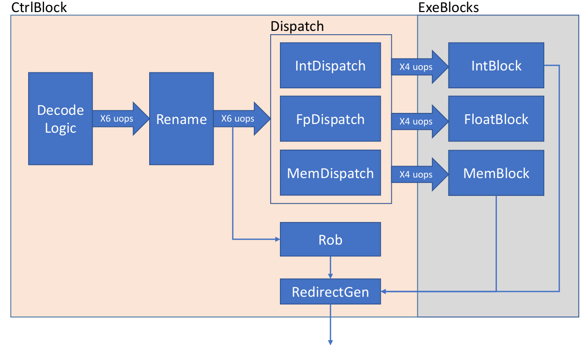
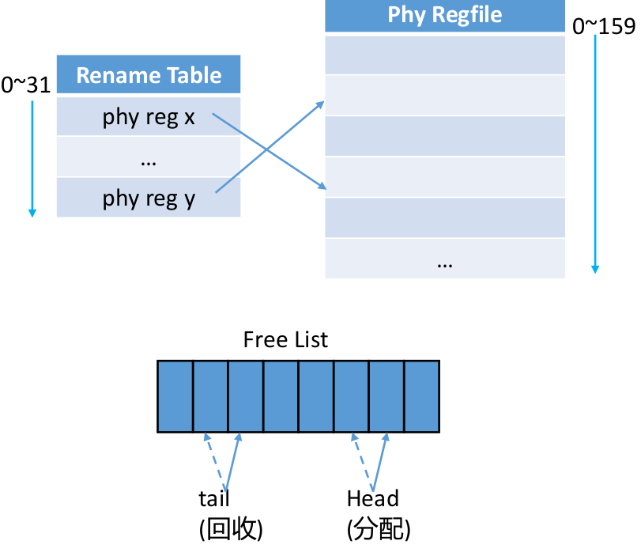
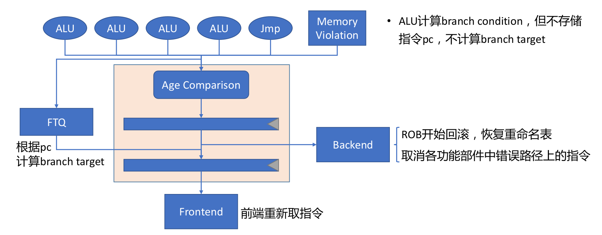
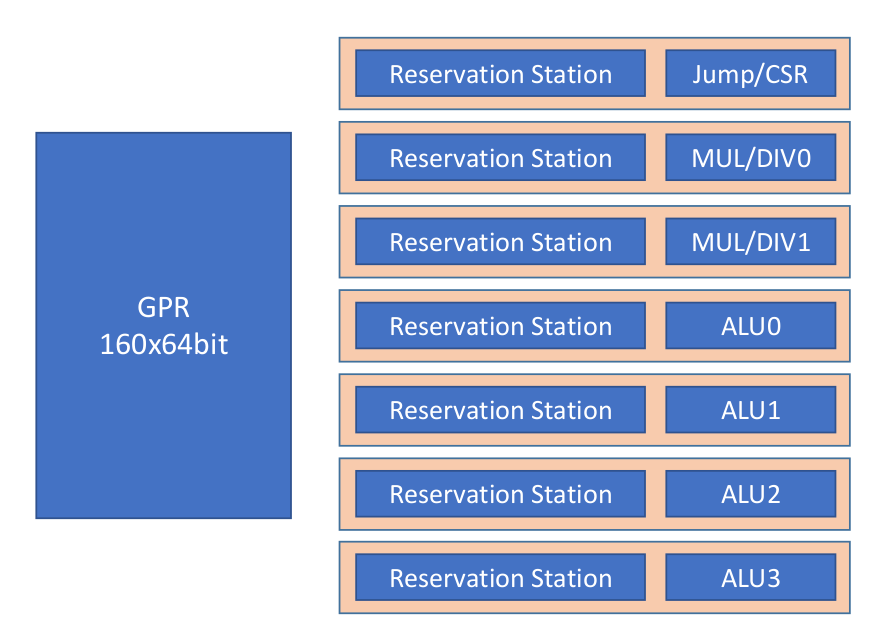

# 后端流水线

## 整体设计

香山处理器后端可以分为 CtrlBlock、IntBlock、FloatBlock、Memblock 4 个部分， CtrlBlock 负责指令的译码、重命名和分派， Intblock、FloatBlock、MemBlock 分别负责整数、浮点、访存指令的乱序执行。

在这些模块中，有很多可以配置的参数。在目前的代码中，上述 4 个 Block 分别默认采用如下配置：
- CtrlBlock
    - 译码 / 重命名 / 分派宽度 = 6
    - 发射前读寄存器堆
- IntBlock
    - 192 项物理寄存器
    - 4 * ALU + 2 * MUL/DIV + 1 * CSR/JMP
- FloatBlock
    - 192 项物理寄存器堆
    - 4 * FMAC + 2 * FMISC
- MemBlock
    - 2 * LOAD + 2 * STORE （其中 STORE 分为 data 和 address 独立进行运算）

## CtrlBlock

### 寄存器重命名

- 统一物理寄存器重命名，将 32 个逻辑寄存器映射到 192 个物理寄存器
- 重命名部件每拍可分配或释放 6 个物理寄存器
- 使用 ROB 回滚的方式对分支预测错误和 Memory Violation 进行恢复
- 回滚时正确路径上的指令可以正常写回

### 流水线重定向

雁栖湖版本中，在异常和中断之外，流水线后端还有 6 个重定向来源，包括 4 个 ALU 、1 个 JMP 部件以及 1 个来自 Memory Violation 的重定向源，香山会根据 6 个来源的年龄关系选出一个最老的重定向发到前端进行重新取指并对后端进行选择性刷新。

## IntBlock

- 4 个定点保留站（分别供 ALU0+ALU1, ALU2+ALU3, MUL0+MUL1, JUMP 部件使用）
- ALU 和 MUL 部件可提前唤醒其他保留站中的指令，实现背靠背执行
- 乘法采用 3 级流水线设计
- 除法采用 SRT-16 算法
