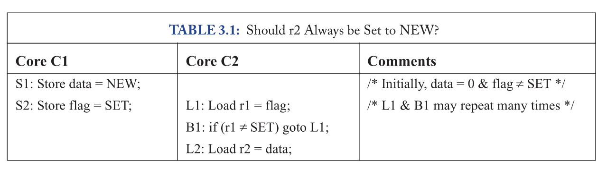

# 【2025 香山入门指南 · 我在 827 做访存】（一）乱序访存

在“2025 香山入门指南”系列文章中，我们希望构建一个基于 2025 年 6 月昆明湖 V2 版本的香山（XiangShan，提交哈希为 6318236）上手指南，通过一系列引导性的入门指南，来引导新同学们学习、了解并最终掌握香山。

827 是昆明湖项目访存组的主要办公室，“我在 827 做访存”系列以此为题介绍香山访存部分的设计。本文是本专题的第一部分，主要介绍了现代处理器中访存的概念，简要分析了高性能处理器乱序访存的情况与基础的内存一致性规范。

<!-- more -->

请注意，该文章仍然处于 WIP 状态，但这并不妨碍同学们的阅读学习，编者会持续更新新的内容。限于编者水平有限，势必会存在内容失真与笔误的情况，还请各位同学老师不吝指教，如有疑问可以直接联系编者，也可以在本篇下面评论。

## 写在前面

编者希望，**<font style="color:#AD1A2B;">让读者掌握学习未知知识、解决困难问题的系统能力</font>**，而不是局限于某个 RTL 模块、某行 RTL 代码。局限于代码本身的意思是十分狭隘的，代码随时会产生变化，大家的设计也随时会产生变化。如果编者依照代码本身进行解读，那对于不同时期的读者来说会十分困惑：因为不同时期的代码肯定是不一样的，甚至香山会随着开发进行大规模的重构。编者不可能将所有代码的更改都反映在这篇指南中。

而掌握系统的能力，对于大部分想要了解并参与系统相关工作的读者来说是至关重要的。只要你是立志于得到更高的提升，就不要把自己放在编写、了解 RTL 这么浅显直观的工作上来。

所谓系统的能力，每个人的理解都是不同的，这个系统中包含哪些领域，对于不同行业不同岗位的人来说也是不定的，编者在这里无法给出一个确切的说明，这就要留给不同领域的读者去探索了。但是我们可以得到一个基本的共识，那就是**可以独立地解决涉及到多个相关领域的复杂问题**。编者殷切地希望，读者可以通过阅读这篇文章，不仅仅了解香山处理器与访存相关的知识，更能**<font style="color:#AD1A2B;">掌握这么一个学习并解决问题的方式，不管是日常生活还是其他不相关的领域</font>**。

本文预计会通过以下方式来构建这么一套体系：

1. **<font style="background-color:#D8DAD9;">访存是什么</font>**
2. **<font style="background-color:#D8DAD9;">访存的目的是什么</font>**
3. **<font style="background-color:#D8DAD9;">如何实现访存</font>**
4. **<font style="background-color:#D8DAD9;">更快更好地访存</font>**
5. **<font style="color:#AD1A2B;background-color:#D8DAD9;">掌握系统的学习系统知识并解决问题的能力。</font>**


本文不会深入代码细节，也不会给出问题答案，请同学们在后面的阅读时牢记：
**<font style="color:#AD1A2B;background-color:#E8F7CF;">本文旨在通过引导的方式，来让同学们自发地去探索并掌握访存的世界。</font>**

### 文中问题

这一系列文章最初是作为香山访存组的新手入门指南而编写的，因此势必具有一定的专业性要求，我们可能要求读者最少具备大学计算机组成原理的基础知识。考虑到大家对于未来开发规划与基础知识的差异，本文设立了**多种多样不同层次的问题**，这其中：

---

**<font style="color:#DF2A3F;">这样的红色的标题是必答题：</font>**

**所有的问题都是采用这样的方式提问，并可能会附上参考链接与资料。**

---

---

**<font style="color:#74B602;">这样的绿色的标题是访存相关选答题：</font>**

**这些问题存在一定的难度，如果你志于了解并参与访存的工作，那你可以选择回答这些问题。**

---

---

**<font style="color:#ECAA04;">这样的黄色的标题是非访存相关的选答题：</font>**

**这些问题存在一定的难度，并且可能和昆明湖的访存部分不是很相关，如果你立志于扩展视野，那你可以选择回答这些问题。**

---

### 题外话

此外，我们还编写了一些**“题外话”**，这些题外话会以下面这样的信息呈现：


!!! note "蓝色扩展话题"
    蓝色的扩展话题一般会和处理器开发、香山实际情况贴合在一起，主要是编者想为自己的表达欲提供一个不那么正式、严谨的空间来进行发挥。

    读者可以直接无视这些蓝色扩展话题的内容，但如果你想和编者产生一些思想碰撞，那么也很欢迎读者了解这些内容。


!!! warning "黄色引用说明"
    本文势必会涉及到对其他文章内容的大量引用，因此当大段引用出现时，会以黄色框的形式呈现，并附以编者的一些个人理解。


!!! danger "红色重要提示"
    红色框的内容是一些重要的提示，你不应该错过这些。


## 什么是访存

访存，访问内存，access memory。

从名字来看，所谓访存就是访问内存，无论是读还是写。

但是显然，**在现代处理器中，绝大部分情况下访存指令并不是直接去访问内存，而是会先与 Cache 交互，由 Cache 决定是否需要访问内存。**

而对于香山来说，自然也是这样的。

在目前香山团队的普遍认知中，访存的硬件模块在整体上被我们称为 MemBlock。

MemBlock 主要作为访存顶层的模块，其中例化了真正支撑访存操作的模块，包括但不限于：

+ 访存流水线 Load/Store Unit
+ 访存队列 Load/Store Queue
+ 数据缓存 DCache
+ MMU 与 TLB
+ 向量访存控制模块
+ 非对齐访存控制模块
+ 原子访存模块
+ 写缓冲 Store Buffer

---


因此，对于尝试上手 MemBlock 的同学们来说，了解 MemBlock 中的所有模块，并掌握其他相关模块就是后面学习的重点了。

---

**<font style="color:#DF2A3F;">请思考并回答：</font>**

**在昆明湖 V2 中，访存是什么？为什么我们需要乱序访存？**

---

考虑到现代处理器为访存行为进行的各种优化，对于访存系统来说，一条访存指令往往并不需要直接访问内存，甚至也不一定要访问 Cache。但无论如何，访存指令总是会从一个统一的内存系统中访问指定的内容。而这个统一的内存系统就是我们下面要介绍的内容了。但无论如何，**访存，并不等于直接访问内存**。


## 乱序访存

香山支持访存指令的乱序执行。

所谓访存指令的乱序执行，就意味着我们可以像运算指令一样，乱序地调度执行访存指令。可能有些同学会觉得这是很正常很简单的事情，但我们确实为了支持乱序访存付出了很大的代价。

### 从内存一致性说起

在计算机程序的世界中，对于内存的访问会期望在满足某些规则的情况下总是得到符合一定规律的结果，而这些规则与得到的访问内存的结果一起构成了我们常说的**内存模型**。

所谓内存模型，规定了我们的软件以什么样的方式编写可以得到什么样的内存访问结果。这对于现代计算机系统来说是十分重要的。

通常来讲，内存一致性（Memory Consistency）是面向多核系统的约束。在单核的世界里，程序总是以程序序来执行的，这是不容置疑的。而在多核的世界中，每个核当然也是以自己的程序序来执行的，但是它们必然会涉及到一些公用的资源——内存。

内存作为所有核心公用的资源，理论上会对所有的核心可见，假设我们有一个无穷大和无穷快的内存，那么我们当然可以让所有的核心自己任意地访问内存。但很可惜，正是因为物理世界不存在这样的内存，所以硬件设计者为了提高访存的速度而在处理器核内部引入了各种 Cache 以及 Buffer。

我们认为，处理器的所有核心的支持访存指令执行的 Cache、Buffer 与内存一起构成了这个**处理器的内存系统**。在这个系统中，有些部分的数据是可以被所有核心观测到的，而有些则只能被所拥有的核心观测到。

对于香山而言，每个核心分别拥有：StoreQueue、Sbuffer、L1 DCache、L2 Cache。这其中，StoreQueue 与 Sbuffer 保存的 Store 指令的执行结果不会被其他核心以任何方式观测到，只有数据进入到 L1 DCache 之后，才有可能被其他核心访问观测到。

现在，我们假设正在编写下面这样的多核程序：



我们可能会期望 r2 的值总是 NEW。这是因为，如果我们从单核的角度来看，我们总是期望 S1 一定会在 S2 之前执行，B1 一定会在 L2 之前执行，L2 只有在 S2 执行后才能执行，因此我们会期望这里的执行序列是：

```
S1 -> S2
      L1 -> B1 -> L2
```

因此，如果真的按照上面这样的指令序列去执行，那么理论上最后会得到 `r2 = NEW`。

但是，如果我们真的编写了一段这样的代码，我们可能会得到一些奇怪的结果：

在不同架构、实现的机器上可能得到截然不同的结果。甚至在相同的机器上面多次运行得到的结果可能也不同。有可能最终 `r2 = 0`，也有可能 `r2 = NEW`。这就表现得十分奇怪。

这就产生了一些奇怪的冲突。硬件的设计者总是希望我们可以在大部分情况下执行得更快，而这就需要引入一些假设或者额外的要求。在单核程序上面，这些假设可能不会让软件开发者产生一些令人困惑的歧义，而在多核程序上，这些假设可能就会带来一些意想不到的结果。

这是因为，程序序与访存序是完全不同的两个概念。

**程序序：**程序中的 Load / Store 指令的**<font style="color:#AD1A2B;">指令序列。</font>**

**访存序：**Load / Store 指令引起的对**<font style="color:#AD1A2B;">处理器的内存系统的读写操作的顺序。</font>**

由于硬件乱序执行访存指令，因此在访存序上并不一定会严格按照程序序进行。而在多核程序上，除了每个核的程序序，还会有一个额外的为所有核的程序序排序的**全局序**。

因此，硬件开发者与软件开发者约定，**在一定的情况下硬件会满足一定的访存序，而这些每个核的访存序会以某种方式排列成全局访存序，且可以提供一些特殊的方式来手动保证指令执行的顺序**。这些约定，就是**内存一致性模型**了。

---

**<font style="color:#DF2A3F;">请带着问题阅读相关资料：</font>**

**内存一致性到底是什么？  
****内存一致性模型是如何保证内存一致性的？**

---

* **书籍**： _A Primer on Memory Consistency and Cache Coherence_
* [https://zhuanlan.zhihu.com/p/694673551](https://zhuanlan.zhihu.com/p/694673551)
* [https://web.csl.cornell.edu/courses/ece5750/gharachorloo.isca90.pdf](https://web.csl.cornell.edu/courses/ece5750/gharachorloo.isca90.pdf)

---

### RVWMO
内存一致性模型是硬件与软件的约定，自然，不同的硬件平台可能会带来一些截然不同的约定。

常见的，X86 平台可能采用 **TSO (Total Store Ordering) **内存一致性模型 (但其实看上去 Intel 和 AMD 从来没有保证是这样的)，ARM 平台可能采用 **RC (****Relaxed Consistency Model)** 内存一致性模型。

**<font style="color:#AD1A2B;">而 RISC-V 则采用 RVWMO (RISC-V Weak Memory Ordering) 内存一致性模型。</font>**

相对来说，RVWMO 主要部分仍然沿用了 RC（release consistency）内存一致性模型，整体上没有对内存访问顺序进行特别强力的约束，为硬件实现和性能优化提供了宽松的条件；同时，禁止若干过于复杂费解的乱序情况，方便了软件程序的开发利用。总体上 RVWMO 是一种**弱内存序模型**。

当然，考虑到 X86 平台存在的大量的依赖 TSO 内存一致性模型运行的程序，RISC-V 还提供了一个额外的拓展：**Ztso** 扩展来支持 **RVTSO (RISC-V Total Store Ordering)** 以兼容 X86 平台的程序。但这就属于后话了，目前香山还未实现 Ztso 扩展，不过 Ztso 扩展已经提上了我们的下一步开发计划惹。

一般情况下，我们认为 RVWMO 规定可以总结为：

**<font style="color:#AD1A2B;">十三条规则、四条公理</font>**

软件代码在编写时需要满足对应的规则，硬件自然会保证软件看到的内存操作是符合 RVWMO 模型的。

那具体的细节就留给各位同学们进行探索啦。

---

**<font style="color:#DF2A3F;">请带着问题阅读相关资料：</font>**

**RVWMO 的规范要求是什么？**

---

了解了 RVWMO 的规范之后，我们就很容易能够得到一些硬件上的优化方案，最直观的就是 RVWMO 对 Store Buffer 的极大宽容，使得我们可以轻易地添加这一模块对 Store/Load 进行硬件层面的优化。

并且，大家在阅读过 RVWMO 之后，应该可以理解到这一内存一致性模型的设计思路：**可以支持高性能高扩展的 RISC-V 硬件平台的内存一致性模型，并在一定程度上保证软件代码的编写方便。**

为了高性能的要求，我们保证了在单 Hart 下的访存序要保证其软件代码的程序序，而在多 Hart 的场景下，我们放宽了大部分情况下的多 Hart 间访存序与程序序的一致性要求，仅在部分场景保证多 Hart 间的一些一致性要求，其余大部分情况需要软件开发者手动显式地使用类似 Fence 之类的同步屏障指令进行访存序的维护。

---

!!! note "“No Silver Bullet”"
    从另一个角度来看，越弱的内存一致性模式势必会为软件编写者引入越多的心智负担，这是不可避免的。
    在软件工程的领域，常常有关于“银弹，Silver Bullet”是否存在的争议。
    一方面，有观点认为：不存在一种通用的方法或工具可以解决所有软件工程问题。
    而另一方面，有观点认为：最终肯定会存在一种方法可以解决这些概念性的本质性的问题。
    但无论他们的观点如何，我们始终要明白，最起码目前，在体系结构和硬件的世界，基本不可能存在可以兼顾所有方向，解决所有问题的方法。


    Trade-Off，是盘旋在每一个硬件开发者头顶的幽灵，所谓不可能三角也是如此，我们很难保证存在一种情况可以使得性能、面积、时序功耗都最优，只能是在开发过程中经过尝试，找到一个平衡的结果。
    RVWMO 也是这样的，我们很难去评判 RVWMO 是否一定优于其他的内存一致性模型，或者可以说，这些内存一致性模型可能本身就不存在绝对的优劣之分，无非就是在各个层面的取舍权衡罢了。
    因此，我们还希望可以通过 RVWMO 这个例子来让大家明白另一个关键问题：权衡与取舍，是大家最应该掌握的理念，无论是硬件设计还是人生。


### “染色的苔藓”
既然有了内存一致性模型的规范，那自然就需要硬件设计者去实现满足内存一致性模型规范的硬件，这其中又会带来一个老生常谈的问题：
**<font style="color:#AD1A2B;">如何保证内存一致性模型规范在硬件实现中的正确性？</font>**

一个直观的想法是：**使用针对内存一致性场景的系统测试软件，将特定平台在各个特定场景下的所有执行结果列举出来，与符合规范的模型进行比对。**

为此，**<font style="color:#AD1A2B;">Litmus </font>**—— 常用的内存一致性测试套件出现了。

Litmus 使用特殊的工具编写测试用例，再使用特定的工具生成 C 语言代码，最终编译出可执行文件。而对于 RISC-V 而言，有一套专门用来测试 RISC-V RVWMO 内存一致性模型的开源 Litmus 测试套件，香山也依赖这套测试套件进行内存一致性的验证测试。

[GitHub - litmus-tests/litmus-tests-riscv: RISC-V architecture concurrency model litmus tests](https://github.com/litmus-tests/litmus-tests-riscv)


下面是 RISC-V Litmus 测试套件中的其中一个测试。

这段 Litmus 的代码会使用特定的工具生成 C 语言与汇编代码来进行测试，我简单地为这段代码添加了一些注释来帮助大家理解。

```shell
RISCV LB+amoadd-data-amoadd.rl+amoadd.aq-data-amoadd

# 两个核心分别初始化的寄存器与内存情况。
{
 0:x3=x; 0:x6=y;
 1:x3=y; 1:x6=x;
}

# 测试主体代码
# 两个核心分别执行的指令序列，请注意，这里两个核心间不存在执行上的顺序约束。
 P0                     | P1                     ;
 ori x2,x0,1            | ori x2,x0,1            ;
 amoadd.w x1,x2,(x3)    | amoadd.w.aq x1,x2,(x3) ;
 xor x4,x1,x1           | xor x4,x1,x1           ;
 ori x4,x4,1            | ori x4,x4,1            ;
 amoadd.w.rl x5,x4,(x6) | amoadd.w x5,x4,(x6)    ;

# 断言，暂时可以无视。
exists ([x]=2 /\ [y]=2 /\ 0:x1=1 /\ 0:x5=0 /\ 1:x1=1 /\ 1:x5=0)

# --- 

# 上述 Litmus 主题代码通过工具生成的 RISC-V 汇编代码
Generated assembler
#START _litmus_P0
	ori t5,x0,1
	amoadd.w a1,t5,(a5)
	xor t4,a1,a1
	ori t4,t4,1
	amoadd.w.rl a0,t4,(a4)
#START _litmus_P1
	ori t5,x0,1
	amoadd.w.aq a1,t5,(a5)
	xor t4,a1,a1
	ori t4,t4,1
	amoadd.w a0,t4,(a4)
Test LB+amoadd-data-amoadd.rl+amoadd.aq-data-amoadd Allowed

# 在测试的主体代码循环运行 20000 次后得到的运行结果统计。
# 一共得到了三种运行结果，这三种结果都是符合 RVWMO 内存一致性模型的。
Histogram (3 states)
99703 :>0:x1=1; 0:x5=1; 1:x1=0; 1:x5=0; [x]=2; [y]=2;
365   :>0:x1=0; 0:x5=1; 1:x1=0; 1:x5=1; [x]=2; [y]=2;
99932 :>0:x1=0; 0:x5=0; 1:x1=1; 1:x5=1; [x]=2; [y]=2;

```

---

!!! note "缺失的内存一致性"
    在 2025 年 5 月份的时候，我们发现了 FPGA 上的 4 核 Litmus 系统测试中昆明湖 V2 出现了若干处内存一致性缺失。

    这是十分严重的问题，我们立马开始了一些尝试，先是尝试在帕拉丁上开启 DiffTest 重新运行，希望可以通过 DiffTest 来捕捉到一些问题。可惜由于 DiffTest 在多核场景上存在一些适配不足的情况，在开启 DiffTest 后会在比较早的阶段产生一些误报错，在多次修改之后仍然存在各种误报，考虑到交付的时间越来越紧迫，因此我们不得已在这个测试上暂时先放弃使用 DiffTest，转而思考使用一些特殊的方式来进行调试。

    这其中遇到了很多问题，也产生了很多失误，但最终，我们还是解决了这一问题。

    我们发现并修复了存在许久的、多核 RAR 场景下的一些未考虑到的 corner 情况，并成功通过了目前为止运行的所有 RVWMO Litmus 测试。但其实我们都知道，这并不能保证我们的处理器不存在内存一致性的问题。

    其实不只是一致性的问题，对我们来说，整个处理器的验证尚有许多空白，还需要大家携手共进 ······


---

**<font style="color:#74B602;">请带着问题阅读相关资料：</font>**

**下面这段 Litmus 代码与执行结果是上面提到的验证出的香山存在内存一致性缺失 Bug 的一个测试。**

**这个测试产生的结果一共有 10 种，其中只有一种结果违反了 RVWMO 规范。**

**请找出哪条结果违反了 RVWMO 规范并说明为什么违反了 RVWMO 规范。**

```shell
RISCV MP+fence.rw.rw+addr-[fr-rf]
"Fence.rw.rwdWW Rfe DpAddrdR FrLeave RfBack Fre"
{
 0:x5=2; 0:x6=x; 0:x7=1; 0:x8=y;
 1:x6=y; 1:x9=x;
 2:x5=1; 2:x6=x;
}
 P0          | P1            | P2          ;
 sw x5,0(x6) | lw x5,0(x6)   | sw x5,0(x6) ;
 fence rw,rw | xor x7,x5,x5  |             ;
 sw x7,0(x8) | add x10,x9,x7 |             ;
             | lw x8,0(x10)  |             ;
             | lw x11,0(x9)  |             ;

exists ([x]=2 /\ 1:x5=1 /\ 1:x8=0 /\ 1:x11=1)

Result:
Test MP+fence.rw.rw+addr-[fr-rf] Allowed
Histogram (10 states)
21427 :>1:x5=0; 1:x8=0; 1:x11=0; [x]=1;
25    :>1:x5=0; 1:x8=2; 1:x11=0; [x]=1;
3615  :>1:x5=0; 1:x8=1; 1:x11=1; [x]=1;
14    :>1:x5=1; 1:x8=1; 1:x11=1; [x]=1;
19775 :>1:x5=0; 1:x8=2; 1:x11=2; [x]=1;
21    :>1:x5=1; 1:x8=2; 1:x11=2; [x]=1;
5110  :>1:x5=0; 1:x8=0; 1:x11=0; [x]=2;
7     :>1:x5=0; 1:x8=1; 1:x11=1; [x]=2;
4     :>1:x5=0; 1:x8=2; 1:x11=2; [x]=2;
2     :>1:x5=1; 1:x8=2; 1:x11=2; [x]=2;
```

---

---

!!! note "AI 的一些比喻"
    在 2025 年的今天，AI 是任何一个学习者都要学会使用的工具，但同时，我们要学会掌握这个工具，而不是将这个工具视为绝对真理。**请读者记住，至少在 2025 年的今天，AI 只是一个工具，而不是真理。**

    香山的一些验证老师在某些一致性的问题上询问了 AI，下面是 AI 的回答。不论这些回答的真实性如何，编者都在这里摆出来供大家鉴赏学习，个中真假就让读者自行辩决了~ 通过比喻的方式进行学习确实是我们了解未知知识的好方式！

    **AI 回复：**

    CPU 的这种“预知未来”般的能力，其实是一种非常“笨拙”但高效的机制：

    **做事之前先打借条**：每个推测的加载（`ld`）就像打了一张借条，记录在 LSQ 账本上（借了哪个地址的数据）。

    **耳朵一直竖着听**：LSQ 不断监听着全村的广播（缓存一致性流量），看有没有人喊“某某地址的账要变了！”。

    **一听到自己的名字就撕借条**：一旦监听到自己借条上的地址被人动了，不管三七二十一，先把这张借条和基于它做的所有后续计划全部撕掉。

    **重新打借条**：从被撕掉的那张借条开始，一切重新来过。


### 访存队列：严格的秩序维护者
上面讲了很多和香山实际代码无关的内容，这其实主要是为了引出下面要提到的 **LSQ 访存队列**。

访存队列的概念十分的简单：**维护访存指令的生命周期**。

这里提到的生命周期主要是指访存指令的顺序、进入乱序访存的时间和结束的时间。

客观的讲，当一条访存指令进入到访存指令的 IssueQueue 之后，它在 MemBlock 中的生命就开始了。

这是因为，当一条访存指令进入访存 IssueQueue 时，它还会申请进入 (Virtual)LoadQueue 或 StoreQueue，并分配初始化一项基础的表项。

随后，当一条访存指令被从 IssueQueue 中发射出来后，它就会在对应的访存单元中进行执行，并会在合适的时机更新 LSQ 中的某些元数据或者标记位等信息。

而当一条访存指令执行完成后，会根据具体情况将这条指令在 LSQ 中标记为已经执行完毕，而后，LSQ 会按照顺序将这些指令占据的表项释放掉。

---

!!! note "分离的 LoadQueue"
    如果你有心去追溯香山的 LSQ 的实现过程，你会发现，Store 从始至终都是一整个模块，而 LoadQueue 却经历过由统一的大模块到拆分成若干个分离的小模块的重构过程。

    在最初，所有为了 Load 指令服务的 Queue 都集中在一起，由一个统一的大的 LoadQueue 来进行维护，而后来，随着香山发展，统一的 LoadQueue 渐渐产生了各种各样的问题，因此，我们在某一个版本将 LoadQueue 拆分成了若干个独立的小的 Queue，每个 Queue 分别只负责一部分任务。


对于 LSQ 来说，它负责在访存侧维护所有访存指令的顺序，并利用这些顺序进行**违例检查**。

从客观上来讲，LSQ 是类似 ROB 的，都是为了维护指令的顺序，区别可能主要在于 ROB 是维护所有指令的，而 LSQ 只维护**可以进行乱序访存的访存指令**。

自然的，ROB 为了在乱序处理器中维护指令的顺序，需要支持注入错误检查和恢复等功能，而 LSQ 为了维护访存指令的顺序，自然也需要实现一些类似的功能。


---

**<font style="color:#DF2A3F;">请带着问题阅读代码与文档：</font>**

**VirtualLoadQueue 与 StoreQueue 的入队分配方式是怎么样的？**

* [XiangShan/src/main/scala/xiangshan/mem/lsqueue/LSQWrapper.scala at bcdd2d6ce0ade31d0c1662abcb0fa57deef14257 · OpenXiangShan/XiangShan](https://github.com/OpenXiangShan/XiangShan/blob/bcdd2d6ce0ade31d0c1662abcb0fa57deef14257/src/main/scala/xiangshan/mem/lsqueue/LSQWrapper.scala#L324)
* [XiangShan/src/main/scala/xiangshan/mem/lsqueue/VirtualLoadQueue.scala at bcdd2d6ce0ade31d0c1662abcb0fa57deef14257 · OpenXiangShan/XiangShan](https://github.com/OpenXiangShan/XiangShan/blob/bcdd2d6ce0ade31d0c1662abcb0fa57deef14257/src/main/scala/xiangshan/mem/lsqueue/VirtualLoadQueue.scala#L163)
* [XiangShan/src/main/scala/xiangshan/mem/lsqueue/StoreQueue.scala at bcdd2d6ce0ade31d0c1662abcb0fa57deef14257 · OpenXiangShan/XiangShan](https://github.com/OpenXiangShan/XiangShan/blob/bcdd2d6ce0ade31d0c1662abcb0fa57deef14257/src/main/scala/xiangshan/mem/lsqueue/StoreQueue.scala#L374)

---

为了满足功能与内存一致性的需要，我们利用 LSQ 进行违例检查与 Load 指令的重发。

+ LoadQueueRAR：主要用于多核场景下 RAR 违例的检测。
+ LoadQueueRAW：主要用于 Store-Load 违例的检查。
+ LoadQueueReplay：主要用于基于 ReplayQueue 的 Load 指令重发。

我们还利用 VirtualLoadQueue 与 StoreQueue 进行 Load/Store 指令顺序的维护：

+ VirtualLoadQueue：用来维护 Load 指令的顺序，以供违例检查等。
+ StoreQueue：用来维护 Store 指令的顺序，保存地址与数据进行数据前递与写入下级数据缓存。

此外，我们还有一些其他的 Queue 来实现一些额外的功能。


---

**<font style="color:#DF2A3F;">请带着问题阅读代码与文档：</font>**

**LSQ 的各个部分的作用是什么？**

---

---

**<font style="color:#74B602;">请带着问题阅读代码与文档：</font>**

**上文没有展开讲，为什么我们需要为乱序访存额外维护指令的顺序呢？**

**这与一致性有关，并且不只是关系到 LSQ 访存队列，还与访存流水线有关。如果你现在还不了解，可以等待后续新的更新，可能到了后面你就会有答案了。**

---

到这里，已经简单介绍完了 LSQ 的基本功能，但实际上，LSQ 中还有许多的设计细节没有展开。考虑到这些细节往往和整个 MemBlock 比较耦合，要涉及到其他模块的一些设计思路，在这里就先不展开介绍了，后面介绍完其他模块之后会再展开给大家介绍一下。
