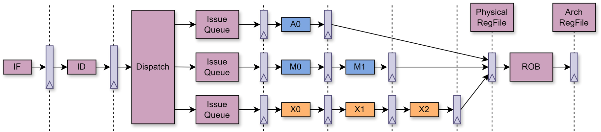

# 【2025 香山入门指南 · 我在 827 做访存】（二）访存流水线

在“2025 香山入门指南”系列文章中，我们希望构建一个基于 2025 年 6 月昆明湖 V2 版本的香山（XiangShan，提交哈希为 6318236）上手指南，通过一系列引导性的入门指南，来引导新同学们学习、了解并最终掌握香山。

827 是昆明湖项目访存组的主要办公室，“我在 827 做访存”系列以此为题介绍香山访存部分的设计。本文是本专题的第二部分，主要介绍了访存流水线相关内容。访存流水线是处理器实现访存的重要机制。通过将访存操作分解为多个阶段，访存流水线能够提高内存访问的并行度和效率，从而提升整体系统性能。

<!-- more -->

请注意，该文章仍然处于 WIP 状态，但这并不妨碍同学们的阅读学习，编者会持续更新新的内容。限于编者水平有限，势必会存在内容失真与笔误的情况，还请各位同学老师不吝指教，如有疑问可以直接联系编者，也可以在本篇下面评论。

## 访存流水线

对于访存来说，**Load/Store Unit 就是其主要的访存流水线，这也是访存的核心所在。**

**一方面**，访存流水线负责与 BackEnd 相关接口互联，负责接受来自 IssueQueue 所发射的指令，执行完成后写回 BackEnd。

**另一方面**，访存流水线还要与 MemBlock 内部的其他模块进行交互，会从 DCache 取得数据，也会从其他模块尝试 Bypass 数据，而且还要与 LSQ 进行交互，来进行生命周期的管理与违例检查。

而对于访存流水线本身而言，其实最核心的作用可以概括为一句话：**权限与违例检查**。如果是一个词的话，那就是：**检查/ Check**。

+ **检查这条指令是否可以访问这个地址，根据情况产生异常。**
+ **检查这条指令访问的这个地址是否存在违例，根据情况产生流水线刷新。**
  
在昆明湖 V2 中，一共有三个 Load Unit 与 两个 Store Unit。

---

---

**请带着问题阅读代码与文档：**

**Load Unit 与 Store Unit 的基本功能是什么？**

**请尽量概括性地分流水线阶段描述，不要拘泥于各个阶段的代码细节。**

---

* [Load 指令执行单元 LoadUnit - 香山开源处理器设计文档](https://docs.xiangshan.cc/projects/design/zh-cn/latest/memblock/LSU/LoadUnit/)
* [Store 地址执行单元 StoreUnit - 香山开源处理器设计文档](https://docs.xiangshan.cc/projects/design/zh-cn/latest/memblock/LSU/StoreUnit/)

---

### 永不停歇的流水线
为了实现高性能的乱序访存，我们为访存流水线与 DCache 等与访存相关的模块采用非阻塞的方式进行了实现。

这就要求：当发生各种问题，导致一条访存指令无法正常执行完成时，我们需要让 TA 退出流水，来让其他的访存指令继续执行。

为此，我们为 LoadUnit 实现了一套完整的重发机制，这套机制会涉及到多个访存模块，并非仅仅由 LoadUnit 实现。但作为刚入门的同学，我们在这里只需要先了解这个机制的工作原理即可。

根据不同的条件，我们有多做多样的需要 Load 指令重发的情况，包括但不限于：

+ TLB miss
+ DCache miss
+ RAR/RAW full
+ DCache bank conflict

而这些需要重发的情况根据实际表现不同，可以有两种重发的方式：

+ 基于 LoadQueueReplay 的重发
+ 基于 LoadUnit 的 Fast Replay

---

**请带着问题阅读代码与文档：**

**以 LoadUnit 为例，Load Unit 的 Replay 机制是如何工作的？**

**为什么会有两种不同的 Replay 方式？**

---

当然，LoadUnit 存在各种重发的情况，StoreUnit 自然也存在一些情况导致无法继续执行而需要重发。但是相对来说，Store 因为不需要查询 Cache，在一般情况下需要重发的情况是要比 Load 少很多的，因此，我们并没有为 Store 也实现一个 Store Replay Queue，而选择让 Store 在需要重发的时候通知 Issue Queue 来进行重发。

---

**请带着问题阅读代码与文档：**

**在昆明湖中，Load 指令完全不会由 Issue Queue 进行重发，而 Store 指令只能通过 Issue Queue 重发，这会给 Issue Queue 带来什么影响呢？**

---

---

!!! note "奇怪的重发判断"
    我们总是期望对于 Replay 情况的判断与不同 Replay 条件的选择是基于一些严谨的数据与分析的，我们总是期望现在这样的设计是可以得到更好的性能收益的。

    但令人感慨的是，其实有的时候很多条件也是大家拍脑袋想去来的，可能只是一些经验性的假设，而不是经过严谨的科学分析分后的结果。

    可能这也是敏捷开发的代价...?🧐😋

另一方，为了使得非阻塞式的访存流水线可以充分利用，Load/Store Unit 还有一些关于入口请求来源的仲裁。这其中，LoadUnit 的入口来源仲裁最为“恶心”。

LoadUnit 在 S0 阶段有一个**多达 11 个**来源的仲裁器，会根据情况在这 11 个来源中选择出一个我们认为的最应该先被执行的来源。并且与之配套的还有十分恶心的唤醒与元数据赋值逻辑。而 StoreUnit 的请求来源就很少了。

类似的，对于访存流水线的最后阶段，需要写回给 BackEnd。在这一点上，LoadUnit 与 StoreUnit 也展现出了极大的不同。

由于 Load 指令需要访问得到数据，而 Store 不需要获取数据，这就导致了 LoadUnit 不仅需要在多个数据来源中选择拼接数据，还需要将数据 Bypass 唤醒给其他依赖 TA 的指令。

当然，Bypass 和唤醒的工作不需要 LoadUnit 来支持，但是因为要考虑到唤醒电路的复杂性，LoadUnit 在数据的拼接时势必会受到时序压力的制约。

---

!!! note "抑制不住的关键路径"
    事实上，在目前的昆明湖 V2 中，LoadUnit 的数据拼接一直到唤醒的端口一直都是访存的关键路径之一。

    我们尝试了很多方式，始终无法将从 DCache 至 LoadUnit 数据拼接并发出数据唤醒的时序违例降低。这也是后续我们需要继续努力克服的地方。

    而对于 StoreUnit，由于其不需要承担上面提到的功能，其逻辑会简单许多，虽然目前 StoreUnit 仍然是 4 级流水线与 LoadUnit 一样，但是我们已经在考虑将 StoreUnit 缩短至 3 级流水了，起码在时序上这里不会存在问题。而 LoadUnit 就绝对做不到 3 级流水了。

### 并蒂同心的 Store
对于 Store 而言，我们需要同时准备两个源操作数：**数据和地址**。

从普遍思路来看，由于这两个操作数相互独立，且地址需要进行权限检查与其他相关操作，而数据只需要一些简单位操作即可，因此，将数据与地址分离开来进行处理可能是一个比较合理的方案。

香山以及大部分现代处理器就是这样的。

我们选择将一条普通的标量 Store 指令拆分成两个 Uop。**分别为 Sta(addr) 与 Std(data)**。分别由不同的执行单元进行执行。

Uop，香山处理器中在流水线上执行调度的基本单位，可以称为**微操作**。当然一般大家还是称呼为 Uop。

---

**请带着问题阅读代码与文档：**

**在香山昆明湖中，Uop 究竟表示什么？  
****从整体来看，Uop 的拆分为我们带来了什么好处与坏处？**

---

在普通情况下，一条简单的运算指令只会拆成一个 Uop，一条普通的标量 Load 指令也只会拆成一个 Uop，而一条普通的标量 Store 指令则会拆成上面提到的两个 Uop。

---

**请带着问题阅读代码与文档：**

**拆分 Store 指令的数据和地址有什么好处？**

**一个普通的标量 Store 指令拆分成的两个 Uop 分别是如何在 MemBlock 中执行的？**

---

* [Store 数据执行单元 StdExeUnit - 香山开源处理器设计文档](https://docs.xiangshan.cc/projects/design/zh-cn/latest/memblock/LSU/StdExeUnit/)

---

前面有提到，StoreUnit 支持基于 Issue Queue 的重发，之所以与 LoadUnit 不同，主要还是因为这是 Store 需要重发的情况较少，且 Store 对性能的影响不如 Load 那么大。

---

!!! note "另一种 Trade-Off 的体现"
    这其实可能也是一种 Trade-Off，事实上，无论如何，使用一个单独的 Replay Queue 来进行重发任务理论上都要比基于 Issue Queue 进行重发在性能上要更好。但是显然，如果要再设计一个 Store Replay Queue 的的话要付出额外的硬件代价，如果和 Load 复用 Replay Queue 的话可能影响到 Load 的 Replay，并引入额外的控制逻辑。

    但无论如何，这也只是我们的设想，我们也欢迎有同学取尝试其他的 Store 重发的实现方式。

另外，StoreUnit 会负责进行 RAW 的检查，以及将当前流水线的信息传递给 LoadUnit 进行 st-ld 的违例检查。

具体的，Store 指令会去查询 LoadQueueRAW，并根据查询情况判断是否需要生成流水线刷新。同时，会在 StoreUnit S1 将相关信息传递给 LoadUnit 进行 st-ld 违例检查。

在这之外，由于 StoreUnit 比较简单，我相信大家在完成了上面的问题之后已经对 StoreUnit 有了一个基本的了解，其他的内容在这里就不展开赘述了，更详细的指导会在后面继续。

### 诡计多端的 Load
前文已经提到很多了，对于 Load 与 Store 来说，由于指令特性关系，Load 天生就要比 Store 更复杂，**对于处理器性能的影响也要更大**。

---

**请回答问题：**

**为什么我们常说 Load 要比 Store 对处理器性能的影响更大？**

**这个问题的难度相对较大，可能涉及到整个计算机系统相关的知识，因此编者设计成了选做题。**

**读者可以从多个领域思考这个问题，包括但不限于：应用软件、编译器、体系结构。**

**如果读者认为需要进行实验，那么也可以经过充分的实验之后再回到这个问题。**

---

体现在微架构实现上，就表现为了：

+ LoadUnit 有三个，而 StoreUnit 只有两个。
+ Load 相关的 Bug 要比 Store 相关的 Bug 多出来一个数量级。
+ LoadUnit 的代码行数也要比 StoreUnit 多 150 %。

事实上，整个 LoadUnit 在整体的大的功能点上并不复杂，甚至可以完整的概括为两个功能点：**权限检查和获取数据**。但在微架构实现上，为了支持 LoadUnit 正确的完成这两项工作，我们却付出了非常大的代价。不仅仅是需要为 LoadUnit 建立一整套配套的模块，还不得不在 LoadUnit 中写出十分复杂的控制逻辑。

---

!!! note "不得不品鉴的代码"
    如果你是昆明湖访存模块的开发者，那么 LoadUnit 的代码绝对是你不得不品鉴的一环。

    **在这里，你可以看到千奇百怪的变量命名风格（虽然很多都是编者拉的一坨****💩****）。**

    **在这里，你可与看到像 Verilog 一样的赋值连线，足足有近一千行（。**

    **在这里，你还可以看到设计者在左脑攻击右脑中写下的冲突奇怪的代码逻辑（。**

    当然，面包会有的，牛奶也会有的。我们已经正在进行 MemBlock 的重构计划了，其实 LoadUnit 绝对是首先被进行现代化改造的模块！🙌

上面提到，LoadUnit 有着多达 11 个入口请求来源，这些请求来源会在 LoadUnit 的 S0 进行仲裁。

---

**请带着问题阅读代码与文档：**

**找到所有的 LoadUnit 的请求来源，分析这些请求来源仲裁的优先级以及为什么。**

---

由于多流水线乱序访存的缘故，Load 指令的数据来源便可能是来自各个来源。理论上，包括但不限于：

+ StoreUnit
+ StoreQueue
+ Sbuffer
+ DCache
+ Uncache
+ Other Hart

这些数据来源可能同时有效多个，在这样的情况下，我们就需要根据生命周期上的优先级来进行仲裁，选择有效的、优先级最高的数据来源。

---

**请带着问题阅读代码与文档：**

**找到所有的 LoadUnit 的数据来源，分析这些数据来源仲裁的优先级以及为什么。**

---

前面我们提到，LoadUnit 需要发出唤醒信号来唤醒依赖 Load 的指令，但这并非是无条件的。在一些情况下，LoadUnit 是不会发出唤醒信号的。但大多数情况下，对于一条普通的标量 Load 指令，在进入 LoadUnit 的时候就会发出唤醒信号，而如果一切顺利，这条 Load 指令不会取消掉这次唤醒，会伴随着写回唤醒其他依赖于 TA 的指令。而如果产生了各种各样不正常情况，例如需要 Replay，那么就需要发出 Cancel 信号，来通知 Issue Queue 取消这次唤醒。

---

**请带着问题阅读代码与文档：**

**了解 LoadUnit 的唤醒逻辑与 Cancel 逻辑。**

**目前，不需要了解全部的实现细节，只需要了解这套唤醒机制的工作逻辑即可。**

---

而除了上面这些以外，LoadUnit 还需要进行一些违例检查的操作，主要是根据情况申请进入 RAR/RAW Qeueu，以后后续进行违例检查。还需要根据 StoreUnit 传过来的位于 StoreUnit S1 的信息进行 st-ld 的违例检查，并根据情况生成流水线刷新。

---

**请带着问题阅读代码与文档：**

**了解完整的违例检查逻辑。**

**这可能需要你根据 LoadQueueRAR、LoadQueueRAW 以及 StoreUnit 综合来看。**

---

### 自由探索
到这里，访存流水线的一些基础的功能逻辑就引导大家看完了，但实际上，这里只是一些重要的基础功能。相信大家在阅读访存流水线的代码的时候已经发现了访存流水线还存在许多其他的功能细节，这一点就留在后面再为大家介绍了。

---

!!! note "其实可能也不会再展开了（"
    编者认为这个入门指南的目的并不是手把手教会大家所有东西，而是想为不了解、不清楚如何上手访存的新同学们提供一个学习的指引。编者想通过这篇文章让大家掌握如何自己学习，而不是由他人将内容答案直接输出给你。

    但话又说回来，学习和工作理应是不一样的。在学习中，如果你有时间，那么你当然可以把你所有不了解的都尝试学习掌握透彻，但在工作中，起码是在访存组的工作中，如果你遇到了你不了解且无法快速解决的问题，那么询问你周围的师兄师姐是最简单也是最合理的方式了，因为**工作不等人**。我们要明白，访存组乃至整个昆明湖目前是在疾驰向前的，如果你遇到了不能胜任的任务，并且这项任务又较为紧急，千万不要自己一个死磕到底，这反而是一种不负责任。这个时候你应该直接摇人，不要犹豫。你的坚持应该放在工作之外的自我提升中。

    换言之，阅读入门指南并学习昆明湖的这段时间是你十分宝贵的时间，我们也可以说是新人保护期。如果我们认为你通过了新人保护期，或者你使用某些不太合适的方式快速度过了新手保护期，那你应该明白，我们会认为你已经具备了独立解决某些问题的能力。所以，珍惜这段时间并努力学习吧。

---

**请带着问题阅读代码与文档：**

**自由探索这里没有提到到有关访存流水线的细节。**

**（这是一个比较难且综合的问题，如果你觉得困难，可以先往后看，但是你就算这个时候逃避了这个问题，你以后的工作也会让你重新回来的。）**

---
