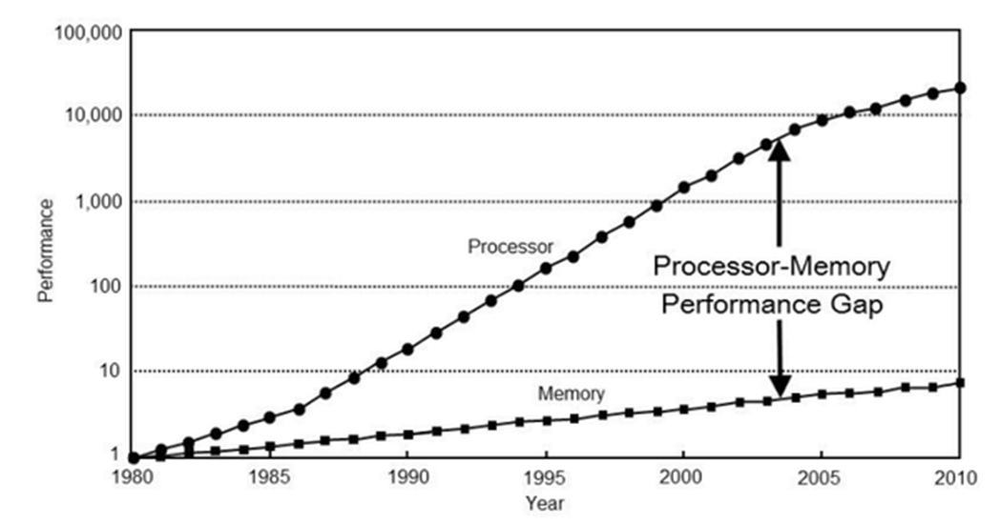
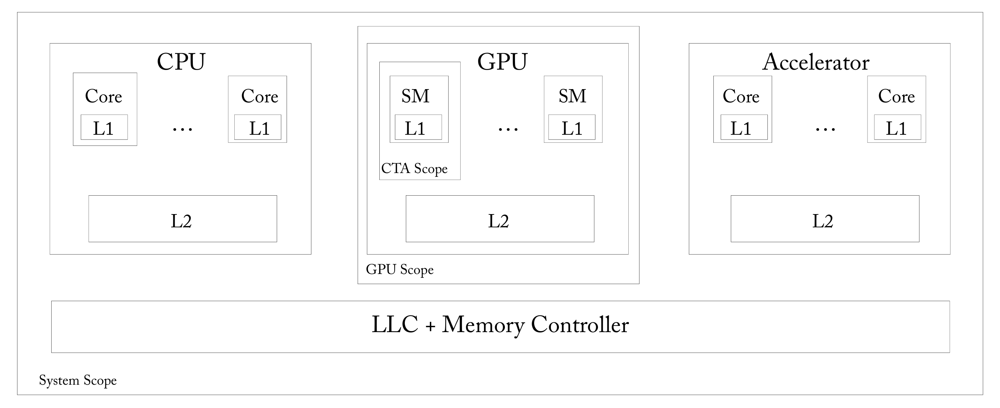
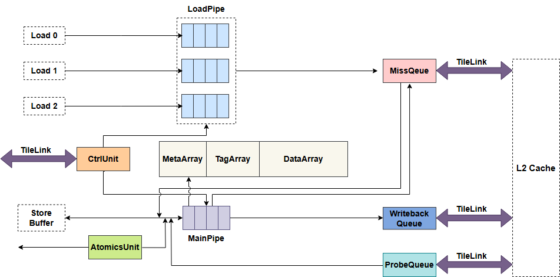

# 【2025 香山入门指南 · 我在 827 做访存】（三）更大更快更强的缓存

在“2025 香山入门指南”系列文章中，我们希望构建一个基于 2025 年 6 月昆明湖 V2 版本的香山（XiangShan，提交哈希为 6318236）上手指南，通过一系列引导性的入门指南，来引导新同学们学习、了解并最终掌握香山。

827 是昆明湖项目访存组的主要办公室，“我在 827 做访存”系列以此为题介绍香山访存部分的设计。本文是本专题的第三部分，主要介绍了缓存相关内容。缓存是位于 CPU 与内存之间的高速存储器，已成为现代处理器不可或缺的核心组件，其作用主要在于提升 CPU 的数据访问效率。本章主要阐述了缓存的基本原理，介绍了现代处理器中多核多级缓存所面临的缓存一致性问题，并简要分析了缓存性能的优化策略。

<!-- more -->

请注意，该文章仍然处于 WIP 状态，但这并不妨碍同学们的阅读学习，编者会持续更新新的内容。限于编者水平有限，势必会存在内容失真与笔误的情况，还请各位同学老师不吝指教，如有疑问可以直接联系编者，也可以在本篇下面评论。

## 更大更快更强的缓存
编者相信，对大部分读到本文的读者来说，起码是了解处理器中 Cache 的基本概念的。不过我们还是可以简单地讲述一下  Cache 是怎么一回事。

### Another layer solves everything?
现代计算机硬件往往由核心的中央处理器 CPU 与各种外设构成，其中，内存是最重要的外设之一，没有内存，大家的电脑大概率无法正常启动。

而 CPU 的运行速度往往比内存快得多，并且在过去的 40 年间这一差距仍在不断地提高。

而在 2025 年的今天，中央处理器与内存的速度差异大概在几百倍的数量级。造成这一差异的原因多种多样。既存在内存结构的限制和物理距离上的差异，也存在由于成本导致的妥协。

一般情况下，我们认为距离 CPU 越近的、越小的存储部件，响应 CPU 的访存请求越快，这是十分显然的。因此，人们可以自然想到：既然内存离 CPU 太远，那我们就想办法把数据放在离 CPU 更近的地方，以供 CPU 及时地使用数据；既然内存由于物理限制无法既要超高的速度又要超大容量，那我们就在容量和速度之间进行 Trade Off，可以只保存一小块最重要的数据以供 CPU 高速读写。

所以，Cache 的概念出现了。前面提到，现代处理器的内存操作往往并不直接与内存进行交互，而是与 Cache 进行交互。**如果要访问的数据存在 Cache 中，则可以直接从 Cache 中访问数据，而不必花费较大的代价去访问内存。而如果要访问的数据不在 Cache 中，我们还是需要向内存访问数据，不过当我们将数据从内存中读取到 Cache 后，下一次再访问该块数据就不需要再重复地访问内存了**。

在最开始，我们只在内存和 CPU 之间添加一块极小容量的高速存储部件并将这块存储部件称为 Cache，它可以以极快的速度响应 CPU 的请求，往往只需要个位数的时钟周期。但后来，人们发现，由于这块高速存储部件太小了，这块小容量高速存储部件很容易就被填满，依然会进行很多次的内存访问。于是，人们便在这块小容量的高速存储部件与内存之间又添加了一块稍大一点、略慢一点的存储部件 —— **我们将原来的速度最快的小容量存储部件称为 L1 Cache，将这块新的存储部件称为 L2 Cache**。

事实上，这是十分符合直觉的优化思路。在计算机领域流传着这样一句话：

**All problems in computer science can be solved by another level of indirection**

---

!!! info "到底是谁说的"
    虽然这句话广泛地流传在计算机世界中，但对于这句话出自何方大家并没有一个统一的定论。

    wiki 上是这么说的：
    
    _A famous aphorism of Butler Lampson that is attributed to David Wheeler goes: "All problems in computer science can be solved by another level of indirection" (the "fundamental theorem of software engineering").[1] This is often deliberately mis-quoted[by whom?] with "abstraction layer" substituted for "level of indirection". A corollary to this aphorism, and the original conclusion from Wheeler, is "...except for the problem of too many layers of indirection."_

    不过是谁说的显然没那么重要了，这句话能够被广泛流传，显然是有其道理存在的，但任何事情都不能离开特定的环境和条件，这句话其实在计算机领域的争议也比较大。

    在前面我们曾经论述过 "No Silver Bullet" ，这个观点认为计算机世界中不存在任何一种方法可以解决所有问题。显然，这两种理论在这里产生了一些冲突。但这其实也不重要，这些话或者说任何一件事到底谁正确谁错误其实没那么重要，重要的是阅读这些话的人是否能从中得到一些启发。同样的，编者的这些文字材料是否先进与详实其实也没那么重要，重要的是 —— 你能否从这些文字中得到一些东西，任何东西都可以。

这个观点认为在计算机科学领域的任何问题都可以通过添加一层中间层来解决。这其实很有趣，我们今天不在这里论述这句话的正确性，但是我们可以发现好像 CPU 中 Cache 的发展就是这样的。当我们发现直接访问内存太慢的时候，我们添加了一层 Cache，当我们发现这层 Cache 不够用的时候，我们又添加了 L2 Cache，由于可能上面提到的两层 Cache 都是每个核心私有的，而进行多核时代之后，我们发现可能需要一种提供给多个核心都可以高速访问的存储部件的时候，我们又发明了更大更广泛的 L3 Cache 与 System Level Cache。  

可能大家会觉得这样很草率，我们通过不停的添加新的存储层级就可以解决访存问题吗？这个问题的答案编者也不知道，或许叠叠乐的高度还远未到极限，也可能目前的 Cache 结构已经是最优的了。不过反正编者不知道，所以这个问题的答案就留给未来的读者去探索吧！

---

!!! info "经典体系结构的优化方式"
    一般来说，我们认为经典体系结构有着 4 种基本的优化方法：利用局部性、提高并行度、预测、采用特定领域的加速结构设计。

    我强烈建议没有做过一生一芯或者一生一芯没有看过这个文档的同学先去看一下下面的一生一芯文档“性能优化和简易缓存”，相信读者一定可以在濠神的文章中收获到一些知识。上面提到的经典体系结构的优化方式也是编者在这篇一生一芯的文档中学习到的，这篇文档还介绍了有关 Cache 的概念，如果你不了解 Cache 的话也建议你读一下。

---

**请阅读下面的一生一芯文档：**

**如果你了解 Cache 的基础概念，那这不是必做题，**

**但如果你还不是很了解 Cache 的基础概念，那这就是一道必做题。**

[B3 性能优化和简易缓存 | 官方文档](https://ysyx.oscc.cc/docs/2306/basic/1.9.html#%E7%BB%8F%E5%85%B8%E4%BD%93%E7%B3%BB%E7%BB%93%E6%9E%84%E7%9A%844%E7%B1%BB%E4%BC%98%E5%8C%96%E6%96%B9%E6%B3%95)

---

简单来说，Cache 就是一大块给定输入的地址，输出地址对应的数据的一块硬件上的存储结构。如果输入的地址对应的数据直接存在于 Cache 中，那就可以直接将数据返回给请求者，我们称之为 **Cache Hit 或者 Cache 命中**，反之，如果请求的数据不存在于请求的 Cache 中，则称为 **Cache Miss 或者 Cache 缺失**。

现代处理器一般采用多级分离的 Cache 层次结构，香山也不例外。

香山一共具有 L1、L2、L3 三级 Cache，而 L1 Cache 又分为独立的 DCache 与 ICache。

同时，由于 L1 ICache 不属于缓存一致性节点，也与 L1 DCache 相互独立，在访存侧不会涉及 L1 ICache 的相关逻辑，因此，L1 ICache 的相关内容由前端的同学负责开发维护。

因此，本文只会涉及到 L1 DCache 的相关内容，有关缓存一致性的相关问题也只会简单提及，具体的缓存一致性问题由于与总线和缓存一致性协议密切相关，我们后面还会有专门介绍缓存一致性的入门文章。

对于 L1 DCache，下面统一称为 DCache，其主要存储模块构成如下：

+ **bankedDataArray**
+ **metaArray**
+ **tagArray**

这些模块保证了 DCache 正常工作所需的权限、地址和数据。

**DCache 采用 4-Way 组相联，每组分为了 8 个 Bank，同时采用了 VIPT 的查询方式。**

---

!!! danger
    如果你不清楚上面这句话在说什么，请检索互联网并重新学习 Cache 的相关知识。

### 由缓存一致性说起
正如我刚才提到的，缓存一致性并不是这篇新手村的重点，但为了让整篇文章的逻辑更加完整，编者还是在这里简单地介绍一下缓存一致性。

现在根据前面的介绍我们知道了现代处理器中往往存在多层次的存储结构，大概是这样的：

我们可以发现，在一个如上图所示的现代处理器的缓存系统中会存在每个核心私有的多个缓存和多个核心/访存单元共享的缓存。我们知道，Cache 不只可以读出数据，也可以被写入新的数据，这就会带来一个问题：在这样多层的复杂系统中，如果核心 A 的私有缓存仅仅只是将内存的数据在自身进行备份，那么一般不会产生问题，因为核心 A 中的数据和内存的数据是一样的，不会影响到其他核心的读取。但如果核心 A 在将内存的数据取上来之后还进行了新的写入修改的话就会面临一个问题 —— 其他核心要怎么知道内存的数据不是最新的数据了？就算其他核心知道内存的数据不是最新的数据了，那又要怎么知道最新的数据在哪一个核心的哪一级 Cache 呢？这就是典型的缓存一致性（Cache Coherence）问题了。要尝试理解并解决这个问题，需要我们**将整个访存单元、缓存系统与内存作为一个完整的系统来进行思考**，这并不是一件容易的事情，我们在这里就不再展开了。

有一个不错的比喻可以和大家分享：

---

!!! warning "某位前一生一芯助教的读书笔记："
    我们来看一个直观的例子。一个学生检查了在线课程表，发现计算机结构课程在 152 教室（读取数据），并将此信息复制到手机中（缓存数据）。随后，教务处决定将课程移到 252 室，更新了在线课程表（写入数据），并通过短信通知学生。注意此时学生手机里的信息现在已经过时了，发生了缓存不一致的情况。如果这时学生按照手机里的信息前往 152 教室，就会发现走错教室了。

    对过时数据的访问是通过缓存一致性协议来避免的，缓存一致性协议在同步发生的时间和方式上存在差异，有两类主要的一致性协议。第一类方法中，一致性协议确保写入的内容同步传播到各个缓存中；第二类方法中，一致性协议将写入的内容异步传播到缓存中，且仍然保证一致性。

    _这是一位前一生一芯助教的读书笔记中对于缓存一致性的一段比较有意思描述，编者感觉还是比较贴切的，故而分享给大家。—— shili_ [_https://shili2017.github.io/posts/MCCC1/_](https://shili2017.github.io/posts/MCCC1/)

缓存一致性协议正是想尝试解决类似上面比喻中提到的问题。

简单来说，我们期望通过缓存一致性协议来解决类似如下的问题：**保证多核心间需要共享的数据是一致的。当然，我们还想尽可能地提高访问共享数据的速度。**

---

!!! info "不需要共享的自然不需要保证"
    所谓需要共享的数据需要保持一致，指的是这个数据的一致性需要被缓存一致性保证。

    例如，在 RISC-V 中，允许 Store Buffer 的存在脱离内存一致性，也就是说 Store Buffer 是每个核的私有存储结构，不需要将其中的数据与其他核共享，所以缓存一致性自然也管不到 Store Buffer 中的数据。如果某一个核将数据写入了 Store Buffer，那么另一个核到底是读到新数据还是旧数据完全无所谓，这和缓存一致性无关，而是取决于你的硬件设计是什么样的。你当然可以把 Store Buffer 变成共享内存的一致性节点，但这不就相当于是把 Store Buffer 变成 "L0 Cache" 了吗。

    与 Store Buffer 相似的还有 TLB，TLB 会存储页表信息也就是某些特定内存的数据。TLB 也不是共享内存的一致性节点，这意味着，如果核 A 已经在 TLB 中保存了地址 x 的数据，那么即使另一个核 B 修改了地址 x 的数据，核 A 的 TLB 也不需要感知到这次修改，依然可以继续读取到旧的页表值。

    如果一个 RISC-V 的多核系统要进行多核读写页表，那么大概会是下面这样的流程：

    核 B 先通过 Store 指令修改页表地址 x 的数据；之后核 B 执行 fence 来保证这次写入的数据已经被 Sbuffer 写入到了 DCache；然后核 A 执行 sfence 来保证 TLB 中不会再保存地址 x 的数据；最后再执行页表访问就可以读取到新的页表的值了。

    而如果一个核心 A 已经将数据写入了自己的 DCache 中，那么一般情况下另一个核再读取这个数据的时候是需要读取到核心 A 的 DCache 中的数据的。

    我们知道，内存一致性更关心数据可见性，而缓存一致性更关心数据一致性，但这也在一定程度上意味着，内存模型的正确实现，是需要缓存一致性正确的。

一般而言，缓存一致性协议包括 MESI、MOESI 等，目前昆明湖 V2 实现了 MESI 的缓存一致性协议。

---

**请阅读检索相关资料：**

**MESI 缓存一致性协议是指什么？是如何工作来保证缓存一致性的？**

---

同样的，缓存一致性协议只是一种协议，并不涉及到具体的微架构实现。而且一般情况下，由于现代处理器多级 Cache 的特性，我们需要 Cache 间与片上的总线协议来支持我们所需的缓存一致性协议。

常见的可以支持缓存一致性协议的总线协议有 TileLink、ACE、CHI 总线等，每一个总线协议往往都伴随着自身的一致性模型，而这些总线的一致性模型往往可以对应到所支持的缓存一致性协议上。

对于目前的昆明湖 V2 而言，我们在 DCache 与 L2 Cache 之间使用了 TileLink 作为总线协议，并将 TileLink 中规定的一致性树对应到了 MESI 协议上。

---

!!! info "不再适合香山的 TileLink？"
    TileLink 是由 SiFive 推出的芯片间总线互连协议，分为三种不同级别的协议标准：TL-UL、TL-UH、TL-C。其中，TL-C 支持兼容 MOESI 的缓存一致性协议。

    SiFive 自然不用多说，是 RISC-V 业内著名的芯片设计公司，并且主导推动了许多与 RISC-V 有关的协议草案、配套设施等。而 TileLink 更是 SiFive 推出的年轻的总线互联协议。

    在香山设计之初，由于 TileLink 与 RISC-V 的千丝万缕的联系以及其他种种原因，我们选择了 TileLink 作为支持实现缓存一致性协议的总线协议，并一直沿用至今。但随着香山的不断演进与越来越复杂多变的使用场景，我们发现 TileLink 不再适合作为香山的总线协议。

    我们在 2024 年进行了 L2 - L3 Cache 间的总线替换工作，我们实现了一个新的支持 CHI 协议的 L2 Cache 来替换之前的使用 TileLink 版本的 L2 Cache。而随着我们对 CHI 协议的研究越来越深入，我们发现，在 L1 使用 TileLink 总线而 L2 使用 CHI 总线的情况下，为了支持特殊的新需求与更好地适配 CHI 总线，我们不得不引入很多额外的自定义位。并且由于 TileLink 与 CHI 设计理念的不同，在使用上确实存在一些不协调的问题。

    因此，我们正在计划设计新的 L1 - L2 Cache 互联总线，这个新的互联总线将由香山团队自定义，以更好地适配香山微架构的演进。

在目前的设计中，对于 MESI 这些状态位的实现，我们在 DCache 的 metaArray 中利用 TileLink 的一致性状态来实现。

---

**请阅读检索相关资料：**

**TileLink 协议是如何保证缓存一致性的？**

**TileLink 协议的各个通道的作用是什么？**

**在香山的实现中，是如何将 TileLink 的一致性树与 MESI 状态对应的？**

---

---

**请带着问题阅读代码与文档：**

**DCache 的缓存块的一致性状态是如何转换的？**

**（这是一个比较难且综合的问题，如果你觉得困难，可以先往后看，但是这道题是必答题）**

---

---

**请检索阅读相关资料：**

**业界常用的支持缓存一致性的总线协议都有什么？这些协议大致都是怎么样的设计思路？**

---

### 局部性
前面我们提到了经典体系结构可以利用**局部性**来进行优化。Cache 正是 CPU 中利用局部性的集大成者。

在如何让 Cache 发挥最大的功能问题下，我们往往需要两条腿同时走路：

一方面，Cache 的容量总是有限的，在 Cache 常见的组相联结构中，当某一个组满了而又有新的数据需要写入这个组时，就需要在这个组内选择出一个块进行替换。而如何选择这个被替换走的块就十分值得考究了：如果下一次访问恰好访问到了被替换走的块，那我们还需要再花一次访问下级存储结构的代价来将刚替换走的数据取回来；如果无用的块一直不被替换走，那就相当于我们的 Cache 容量永远地变少了一些。正因如此，如何合理地选择被替换走的块就成为体系结构内的一个专门的方向，我们称为**替换算法**。

另一方面，选择合适的替换算法虽然可以提高 Cache 的利用率，但是却无法解决另一个问题 —— **如何更高效地提供新的数据**。我们知道，当 CPU 访问不在 Cache 中的数据时，Cache 会向下一级存储结构发起访存请求，如果下一级存储结构中也没有这块数据，那就会继续发到再下级存储结构，一直到从内存中取得数据。那么有没有什么办法可以加速访问不存在 Cache 中的数据呢？当然有 —— **让数据提前在 Cache 中**不就可以了！如果我们在访存指令真正请求数据之前就将数据放入 Cache，那么等到真正的访存请求到来时就不会发生 Cache Miss 了。这就是我们常说的** Cache 预取**了。

---

现在让我们再回到替换算法。Cache 替换算法是典型的利用时间局部性进行体系结构优化的例子。所谓时间局部性，指的是如果我们访问过了一段内存，那么大概率在一段时间内还会再次访问这段内存。在我们的普遍认知中，我们会尽可能地保证访问频率高的内存数据尽可能持久地停留在 Cache 中，就算不停留在 L1 Cache 中，最好也要停留在下级 Cache，反正我们肯定不希望最常被使用的数据频繁地发生 Cache Miss。那么现在，聪明的你会在两个使用频率不一样的块中间选择哪一块被替换掉呢？我想大概率是选择使用频率低的块。

不过如果进行这个使用频率的判断就很值得考量了：我们是统计一段时间内的使用频率呢？还是统计全局的使用频率呢？如果统计一段时间的使用频率，那么这个一段时间的范围又是多大呢？这些问题都需要我们去分析解决，而除了利用使用频率进行判断，我们还能利用什么进行比较判断呢？而在实际应用中，除了前面我们提到的这些问题，还有很多其他的问题是需要我们解决的。而这其中有的问题答案之间是相互冲突的，甚至有些问题的解决方案是无法落地到硬件上的，这也是我们在进行替换算法的研究时所必须考虑的。

前面我们提到利用使用频率进行替换块的取舍，但其实香山昆明湖 V2 L1 DCache 使用的替换算法并没有利用使用频率这个概念，而是更简单地使用了数据被使用的顺序作为选择被替换块的依据，也就是最经典的 **LRU (Least Recently Used) 最近最少使用算法**。LRU 算法会维护缓存块最近被使用的时间，当需要进行替换的时候，会从被记录的缓存块中选择最久没有被使用的缓存块进行替换。

在这里我们就不展开介绍 LRU 在硬件上的具体实现细节了。当然，完整的 LRU 在硬件上实现会非常困难，代价也非常大，所以大部分处理器在考虑实现 LRU 的时候都会选择 LRU 的近似实现 **P (Pseudo) LRU** 而不是真的去实现真正的 LRU。

---

**请阅读检索相关资料：**

**现代处理器当中最常用的替换算法是什么？**

**比较前沿/先进的替换算法有哪些？**

---

其实如果读者真的去完成了上面的这道问题，那么应该会发现一个现象：现代处理器往往都只采用几种比较经典简易的替换算法，而不是一些比较前沿的替换算法。这也是一个值得大家去思考的问题。不过由于这道题目太过于开放，在这里编者就不设置题目了，具体的思考就留给感兴趣的读者吧！

---

**请带着问题检索相关资料：**

**了解常见的替换算法的优劣。**

**香山昆明湖 V2 的几个存储部件（L1 Cache、L2 Cache、TLB）都使用了哪些替换算法并说明为什么这么选择。**

---

然后让我们再来看看预取吧！

前面说到，我们设计的 Cache 是想要更高效地为处理器的访存单元提供新的数据，既然 Cache 的存在是为了减少访问内存的次数，那么我们就要想办法尽可能地让访存单元访问 Cache 的时候可以直接获取到数据，而不是等待 Cache Miss 后再去访问内存。因此就像上面说的那样，我们只要**在数据实际被请求之前，将其从较慢的存储结构中提取到较快的存储结构中**，就可以提高执行的速度了，这也就是预取了。

现代处理器中的预取往往分为**软件预取**与**硬件预取**。

软件预取顾名思义，是使用指令集中规定的特殊的预取指令，来让处理器将数据提前加载到指定的 Cache 中。

例如，在 ARMv8 之后的平台，一般会使用 PRFM (Prefetch from memory) 指令来将指定的数据加载到指定的存储结构。

而在 RISC-V 中，我们有 Zicbop 指令来进行指定数据的预加载。

---

!!! info "真的存在指令集层面的差距吗？"
    ARM 在 v8 之后开始使用统一的多功能预取指令提供软件预取的指令，也就是上面提到过的 PRFM 指令。PRFM 指令存在多种多样的组合方式，可以自定义预取的目的地、生命周期与预取类型。

    例如，PRFM 指令通过 L{1/2/3}/SLC 标识将数据预取到 L1、L2 还是 L3 Cache，亦或者是 SLC；通过 P{LD/ST/LI} 来标识是 Load 预取还是 Store 预取还是预取到 ICache；通过 KEEP 标识预取的数据是需要长时间保持在 Cache 中的数据，通过 STRM 标识预取的数据是不需要长时间保存在 Cache 中。

    但遗憾的是，RISC-V 并没有这么丰富的预取指令。我们只有三种软件预取指令，用来标识是 Load 预取还是 Store 预取还是预取到 ICache，并没有指示数据生命周期与预取目的地的参数。

    如果将 ARM 的 PRFM 的所有指令变种列举出来，大概是这样的：

    PLDL1KEEP;PLDL1STRM;PLDL2KEEP;PLDL2STRM;PLDL3KEEP;PLDL3STRM;

    PLIL1KEEP;PLIL1STRM;PLIL2KEEP;PLIL2STRM;PLIL3KEEP;PLIL3STRM;

    PSTL1KEEP;PSTL1STRM;PSTL2KEEP;PSTL2STRM;PSTL3KEEP;PSTL3STRM;

    PLDSLCKEEP;PLDSLCSTRM;PLISLCKEEP;PLISLCSTRM;PSTSLCKEEP;PSTSLCSTRM

    而 RISC-V 的 Zicbop 指令一共有：

    PREFETCH.R; PREFETCH.W; PREFETCH.I

    我们还不好直接判断这两者到底是否存在技术层面上的优劣，也不好说清楚到底更多样的指令是否真的能在硬件实现和软件性能上得到一个均衡的结果。但最起码，ARM 的 PRFM 指令在理论上确实为使用者提供了更多的可能性，这是 RISC-V 的 Zicbop 指令还不具备的。

---

**请带着问题检索相关资料：**

**以 PRFM 为例，在什么情况下应该使用什么样的预取指令呢？**

---

说完了软件显式地使用插入预取指令的方式来指导 CPU 硬件进行数据预取，在现代处理器中还有更隐蔽的硬件预取。硬件预取与软件预取不同，硬件预取是由硬件自动进行的隐式预取。通常会发生在一定规律的访存指令之后。由于硬件预取自动进行的特殊性，硬件预取会比软件预取在硬件层面需要考虑的东西更多：

**什么时候向哪块 Cache 预取哪块数据？**

上面的这句话其实一次性指出了三个硬件预取的关键点，分别是：

**什么时候开始预取？**一般情况下，我们要做到及时地预取，不能早于数据被真正需要的节点，更不能晚于数据被需要的节点。早于数据被需要的节点的话，就可能被替换算法选择被踢出 Cache。晚于数据被需要的节点就更不用多说了，这就相当于没有预取。

**将预取的数据放在哪一级 Cache？**通常，CPU 内的 Cache 大小、速度、替换算法等等不尽相同，预取将数据存放在哪一块 Cache 也是十分值得考究的。我们可以提前一大段时间将数据预取到 L2 Cache，因为 L2 Cache 更大，更不容易把还没有被用到的数据踢出，我们也可以直接将数据预取到 L1 Cache，如果我们确认马上就需要使用到这块数据的话。

**预取哪块地址的数据？**显然，选择合适的地址进行预取是非常重要的，这非常好理解，如果我们总是预取不到后续被需要的数据，那我们预取的意义是什么？

而软件预取由于是人为从较高层次进行预取指令的插入，我们总是能在一个数组被第一次使用到之前进行软件预取的，毕竟代码是你写的，你肯定知道你什么时候为数组赋值，也知道什么时候将数组的数据取出来。而硬件预取要想做到精准地感知到我即将取出一块地址的数据是比较麻烦的，通常，我们的预取器需要经过一段时间的规律学习才能进行有效的预取。

一般情况下，我们可以将硬件预取分为**空间预取**和**时间预取**。常见的空间预取有 Stride、Stream、SMS (Spatial Memory Streaming) 等等；常见的时间预取有 TP 等。编者在这里简单地介绍一下 Stride 预取吧！

Stride，步长，顾名思义，我们假设软件此时正在**以一个固定步长的规律访问某块地址空间**。例如，软件要顺序地遍历一个 uint64 的数组，每次访问的地址都会按照 8 字节的幅度进行增加，可能类似这样：0x00, 0x08, 0x10, 0x18, 0x20 ······

不过显然，在真实场景中，软件进行内存访问不可能总是这么规律的，例如：软件很有可能是每个循环读取数组的一个元素，然后还有其他的访存操作。因此，Stride 预测器需要在繁杂的内存访问中提取出一定的规律，并按照当前访存的情况来灵活调整预取的请求。

当然，和分支预测一样，程序的访存行为是多种多样的，每种不一样的访存行为也会带来不一样的局部性特征，因此，现实世界的 CPU 的硬件预取往往兼具多种硬件预取器。例如，香山昆明湖 V2 就同时兼具：**BOP、TP、SMS、Stream、Stride **五种不同的硬件预取器。

受限于篇幅和本文的撰写理念，这里就不再继续深入地探讨更多的预取细节了，至于其他的预取算法和如何将这些预取算法实现在真实的硬件上，就留给读者们根据自己的情况自由地去探索吧！

---

**请带着问题检索相关资料：**

**了解常见的预取算法都有哪些，以及它们的原理。**

---

### 代码总览
DCache 整体上是由 MainPipe、LoadPipe、{Meta/Tag/Data}Array 以及其他的与总线直接交互的各个 Queue 组成。整体上，这些部件作用有三个：与上级访存流水线交互、维护缓存数据、与下级存储结构交互，这三点对于绝大部分和 Cache 作用相似的模块都是相同的。

不过就像我们最开始说的那样，本文的目的不是为大家讲解代码细节，因此这些模块并不会在这里展开介绍，感兴趣的读者可以自行探索有趣的缓存世界！但如果你是阅读本文的香山昆明湖的访存/缓存开发者，那这些代码细节就是你必须要去了解的了。

---

**请带着问题阅读代码与文档：**

**DCache 的各个模块功能是什么？**

[数据高速缓存 DCache - 香山开源处理器设计文档](https://docs.xiangshan.cc/projects/design/zh-cn/latest/memblock/DCache/)

---

### LoadPipe
DCache 最主要的功能是为 LoadUnit 高效地提供对于数据的读取服务。为此，我们至少需要提供与 LoadUnit 对应的 DCache 中的处理模块，在昆明湖 V2 中这个模块叫 —— LoadPipe。

LoadPipe 被例化在 DCache 中，一共有三个 LoadPipe，与 LoadUnit 一一对应，可以并行处理没有冲突的 Load 请求。

LoadPipe 与 LoadUnit 高度相关，如果可以的话，这两者在某种程度上是一体两面的。当我们在说：LoadUnit 访问 DCache 的时候，实际上就是在说 LoadUnit 访问 LoadPipe，LoadPipe 访问 Meta/Data Array。

当 LoadUnit 正在请求进行地址翻译、权限检查等的同时，LoadPipe 也在处理接收到的缓存查询、权限检查等请求。LoadPipe 高效地处理 LoadUnit 发起的对 DCache 的访问请求，并根据 DCache 的权限查询结果产生向下级 Cache 取值、将数据反馈给 LoadUnit 等不同的响应。

### MainPipe
MainPipe 主要负责处理与向下级 Cache 写相关的操作，包括 Store、Probe、Refill 等。事实上，我们可以理解为这是一个 StorePipe，但这并不是用来处理 Store 指令的 Pipeline，而是用来向下级 Cache 写入数据的 Pipeline。当然，向下级 Cache 写数据也会区分为多种不同的情况，多种情况所需的条件与一致性的要求也各不相同，因此在这里我们就不详细展开论述了。

---

**请带着问题阅读代码与文档：**

**MainPipe 要处理的写操作都有什么不同？**

[主流水线 MainPipe - 香山开源处理器设计文档](https://docs.xiangshan.cc/projects/design/zh-cn/latest/memblock/DCache/MainPipe/)

---

### 自由探索
DCache 这里主要就为大家简单介绍这些模块。这一大章的目的其实是为大家引入**缓存一致性**这个概念。不过缓存一致性并不适合在这里为大家详细地展开，我们需要用较长的篇幅去讲解缓存一致性及其相关的协议实现。因此这里就只是简单地为大家抛出这个概念，我们会在合适的时间和章节为大家详细地介绍缓存一致性的内容。

其实我们这里还有一些缓存有关的内容没有提出，例如如何分别在单核和多核系统上分析优化缓存的性能。不过这些问题涉及的比较繁杂，也不是单单一级 L1 DCache 就可以做到的，还需要整个处理器访存/内存子系统一起协作才能让处理器在不同场景下的访存性能达到一个合理的结果，不过这就不是我们这一节能覆盖完全的内容了。

现在让我们回顾一下这一节中我们都介绍了什么：首先，我们介绍 Cache 的基本原理与概念；然后，我们简单讨论了一下缓存一致性与现代处理器中常用的优化 Cache 性能的方法；最后，我们简要说明了一下香山昆明湖 V2 L1 DCache 的模块结构与关键部件，但是没有详细介绍代码实现的细节 —— 所以 DCache 中其他模块的细节就留给读者自己探索了。

---

**请带着问题阅读代码与文档：**

**自由探索这里没有提到的有关 DCache 的细节**

**（这是一个比较难且综合的问题，如果你觉得困难，可以先往后看，但是你就算这个时候逃避了这个问题，你以后的工作也会让你重新回来的。）**

---
