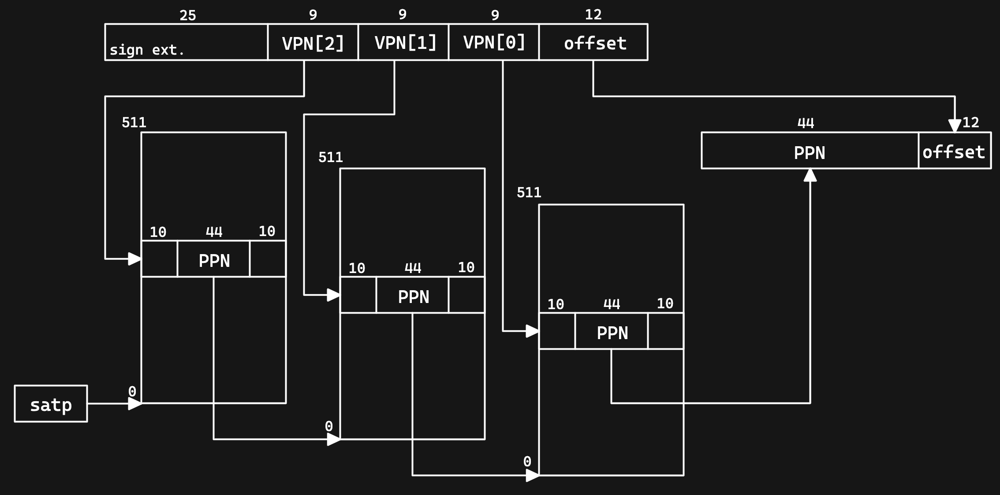
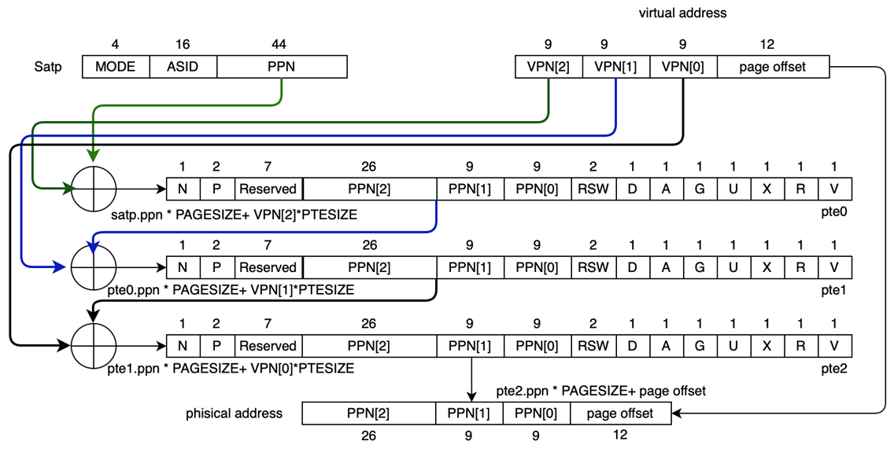
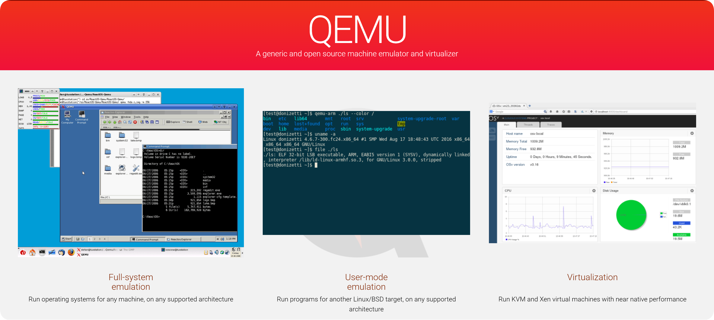
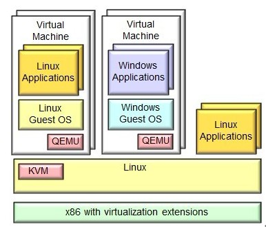
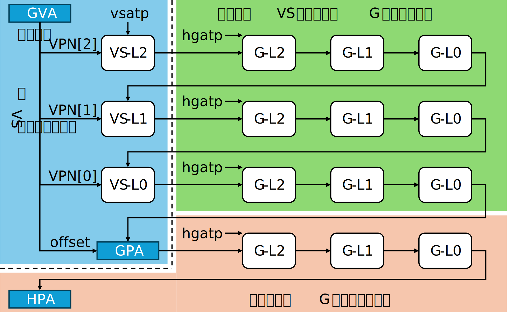
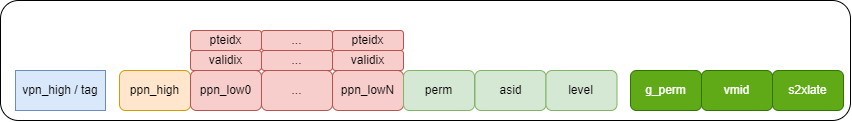
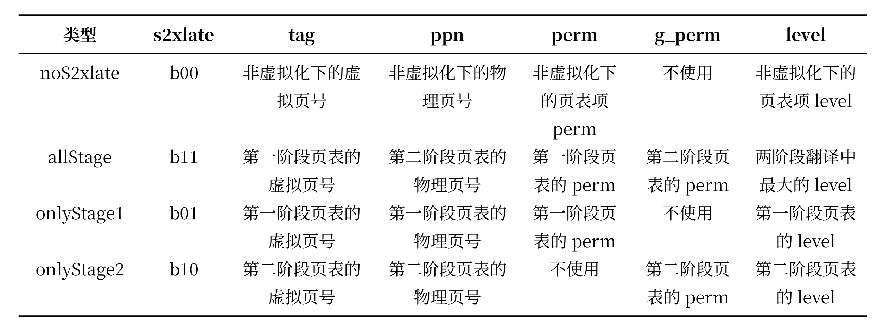
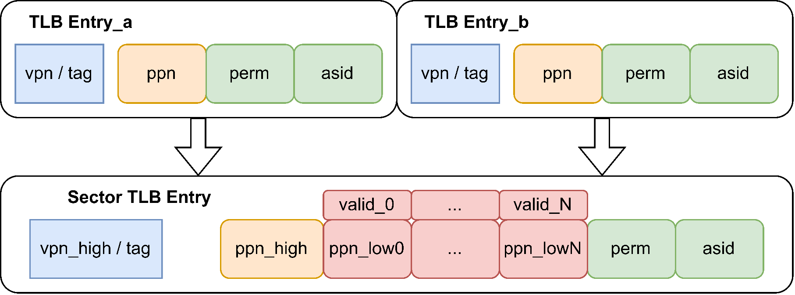
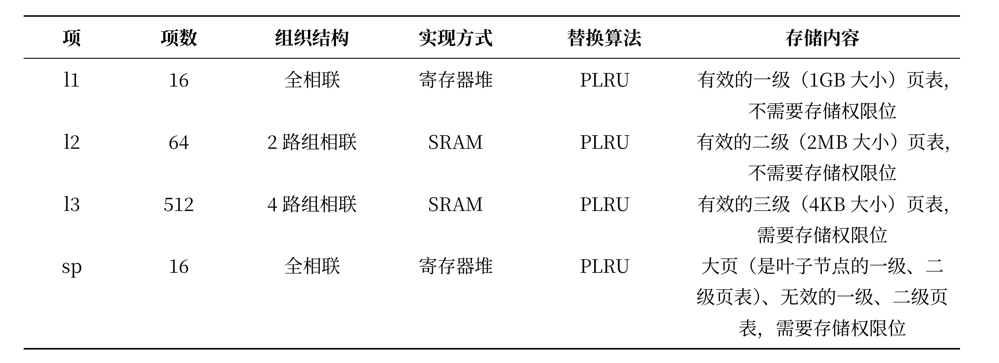

# 【2025 香山入门指南 · 我在 827 做访存】（四）超越容量的界限

在“2025 香山入门指南”系列文章中，我们希望构建一个基于 2025 年 6 月昆明湖 V2 版本的香山（XiangShan，提交哈希为 6318236）上手指南，通过一系列引导性的入门指南，来引导新同学们学习、了解并最终掌握香山。

827 是昆明湖项目访存组的主要办公室，“我在 827 做访存”系列以此为题介绍香山访存部分的设计。本文是本专题的第四部分，主要介绍了内存管理单元相关内容。本文将以现代计算机系统中的内存管理为起点，探讨操作系统如何利用虚拟内存与分页机制实现高效的内存管理，解析 RISC-V CPU 中的 MMU 如何通过页表遍历自动完成地址翻译。同时，针对地址翻译带来的性能挑战，文章将详细解读 TLB 的加速原理，并结合香山昆明湖架构的实例进行分析介绍。

<!-- more -->

请注意，该文章仍然处于 WIP 状态，但这并不妨碍同学们的阅读学习，编者会持续更新新的内容。限于编者水平有限，势必会存在内容失真与笔误的情况，还请各位同学老师不吝指教，如有疑问可以直接联系编者，也可以在本篇下面评论。

## 超越容量的界限

!!! info "借鉴，借鉴"
    如果你做过一生一芯，或者做过 PA，你会发现这是 PA4 其中一小节的标题。请原谅我卑鄙地直接搬了过来。

    这也是编者本人最喜欢的一章 PA（当然 PA 的其他章节编者也很喜欢）。在这一章里，我们跟随 PA 的脚步，不断完善了 nanos，并最终在自己的模拟器上面成功运行起来了分时多任务系统。

    而标题的这一小节，正是 PA 中指导大家学习虚拟内存与分页机制的部分。因此，本文的这一章节，就是要和大家简单介绍一下虚拟内存与 MMU。

* [程序和内存位置 | PA 4.2](https://ysyx.oscc.cc/docs/ics-pa/4.2.html#%E4%BD%8D%E7%BD%AE%E6%97%A0%E5%85%B3%E4%BB%A3%E7%A0%81)
* [超越容量的界限 | PA 4.3](https://ysyx.oscc.cc/docs/ics-pa/4.3.html)

在开始之前，我推荐大家去简单地看一下上面提到的 PA4 中的这一小节。jyy 在这一小节中为大家介绍了为什么需要虚拟内存，以及虚拟内存可以干什么，并且为大家讲解了分页机制的原理与历史。在这里，我简单引用一下 PA4 中的原文：

---

!!! warning "南京大学 PA4 超越容量的界限："
    我们知道程序会经历编译，链接，加载，运行这四个阶段，绝对代码经过编译链接之后，程序看到的内存地址就会确定下来了，加载运行的时候就会让程序使用这一内存地址，来保证程序可以正确运行。一种尝试是把程序看到的内存和它运行时候真正使用的内存解耦开来。这就是虚拟内存的思想。

    所谓虚拟内存，就是在真正的内存 (也叫物理内存) 之上的一层专门给进程使用的抽象。有了虚拟内存之后，进程只需要认为自己运行在虚拟地址上就可以了，真正运行的时候，才把虚拟地址映射到物理地址。这样，我们只要把程序链接到一个固定的虚拟地址，加载的时候把它们加载到不同的物理地址，并维护好虚拟地址到物理地址的映射关系，就可以一劳永逸地解决上述问题了！

    ......

    我们需要一种按需分配的虚存管理机制。之所以分段机制不好实现按需分配，就是因为段的粒度太大了，为了实现这一目标，我们需要反其道而行之：把连续的存储空间分割成小片段，以这些小片段为单位进行组织，分配和管理。这正是分页机制的核心思想。

    ...... 在虚拟地址空间和物理地址空间中也分别称为虚拟页和物理页。分页机制做的事情，就是把一个个的虚拟页分别映射到相应的物理页上。

    > [PA4 超越容量的界限](https://ysyx.oscc.cc/docs/ics-pa/4.3.html)

正如上面所说，我们为了将程序看到的内存与运行时使用的内存解耦开而设计出了虚拟内存。事实上，我们可以发现，虚拟内存也是一种**抽象层/中间层**。

在现代的多任务系统中，可以同时存在多个应用程序，这些应用程序都需要使用内存，显然我们不可能让这些应用程序无条件地使用全部的真实物理内存，每个应用程序在一般情况下只能使用部分自己需要使用的内存，不能使用其他应用程序的内存。

上面说的要求听上去很简单，但是真正实施起来却没有那么轻松。在应用程序执行时，我们要面临很多问题：应用程序要被加载到哪里？应用程序要使用的内存要怎么分配？显然，我们希望应用程序可以在任意时刻被使用，因此我们在编写与编译应用程序的时候并不知道运行时还有哪些真实的内存可以被使用，只有操作系统时时刻刻知道哪些内存是空闲的、可以被使用的。因此，我们可以认为**只有在真正执行应用程序的时候才知道应该要使用哪些内存空间**。那我们要如何为应用程序提供可以运行的内存呢？如何高效地为多个应用程序同时提供内存呢？为了解决这个问题，计算机的先驱们进行了很多尝试。正如 PA 中提到的，人们尝试了**加载时重定位、位置无关代码**等软件层面的技术，但始终无法从根本上解决这个问题，直到虚拟内存的概念被提出。

为了解决同时运行多个程序时存在的内存冲突问题，我们提出了虚拟内存的概念。虚拟内存通过添加一层抽象层来将应用程序与物理内存解耦，应用程序其实并不需要关心自己到底是运行在真正的物理内存之上还是操作系统为它提供的虚拟内存，应用程序只需要知道它有内存可以使用就够了！

---

为了本文内容的连贯性，在这里我们会简单地介绍一下虚拟内存的工作逻辑，但还是推荐大家去阅读上面提到的 PA 的内容，相信大家能在 PA 中得到更多更深刻的理解。

虚拟内存其实没有什么特殊的。简单地讲，虚拟内存操作就是操作系统利用 CPU 中特有的硬件模块进行物理内存的管理。操作系统会在应用程序运行时不断地分配和回收内存，**每块虚拟内存在被真正使用时需要有与之对应的物理内存，现代操作系统会按需为虚拟内存分配物理内存。**

现代常见的虚拟内存管理是依据分页机制运行的。分页机制的核心是将内存划分为连续的小片段，**我们称每个小片段为页面（页）**，**而若干个页面的基本信息则构成页表**。

在 RISC-V 中，我们一般认为最小的页是 4KB 大小。例如，虚拟地址 0xffff_ffff_8000_a116 可能对应的物理地址是 0x1000_a116，这其中，虚拟地址的高位 0xffff_ffff_8000_a 我们称为**虚拟页号**，而低 12 位则称为**页内偏移**。事实上，我们可以发现，这低 12 位正好对应 4KB 的地址范围。页内偏移用来索引一个页内的具体地址，因此**页内偏移在翻译成物理地址后是不会发生改变的**。

当然，页的大小并不是绝对的，事实上，现代操作系统为了高效地利用内存，也会在部分场景下使用更大的页来带来更高效的内存读写，不过这不是这里我们要讨论的重点，在这里我们姑且假设所有的页面都是以 4KB 为粒度的吧。

在正式开始更深入的话题之前，我们可以先说明一些基本的概念：

**物理内存与物理地址**：一般来说，物理地址就是真实的，是可以用来直接进行内存地址访问的物理内存地址。每一个物理地址都会对应内存中的一字节，如果我们使用这个物理地址通过某些方式直接访问内存，那么就应该直接获得内存中的对应数据。**这就是物理地址，真实的、可以直接用来对物理内存进行访问的地址**。  
**虚拟内存与虚拟地址**：对于每个运行在操作系统上的应用程序来说，应用程序总是认为它拥有所有的可用内存，这是由虚拟内存来保证的。事实上，我们知道应用程序不可能拥有全部的内存，只是操作系统通过虚拟内存这一概念为应用程序假装提供了所有的内存。那么既然有了虚拟内存，也就应该有虚拟内存地址。顾名思义，虚拟内存与虚拟内存地址都是虚拟的，在现实中并没有这么一块内存，直接用这个地址去访问物理内存也无法进行访问。那么我们要如何使用虚拟内存与虚拟内存地址呢？事实上，正如上面所说，现代操作系统往往会通过页表机制来将物理内存划分一块块的小的虚拟内存。**如下图所示，用户程序 1 的 stack 是一段虚拟内存，它被操作系统映射到了物理内存上的某一块真实的内存空间；用户程序 2 的 stack 也是一段虚拟内存，甚至可能和用户程序 1 的虚拟内存地址相同，但它却会被操作系统映射到另一块的物理内存空间。**

**页面与页表**：页面或者叫页，我们可以认为这只是一个划分内存的粒度大小，假设内存是 4MB，而我们设置页大小为 4KB，那么就可以划分出 1024 个页面来。而页表则是对页的记录索引，一个页表有 N 项页表项，每一个页表项都对应着一个页面。这就很像是看字典，字典假设有 1000 页，假设我们有 4 个目录，每个目录对应 250 页，那么每个目录就有 250 项条目，记录了每一页的简略信息和页码，这样我们只需要先查找目录，就可以很快地找到想看的页了。自然，将虚拟地址转换为物理地址也是这样的，我们会先查找目录（页表），目录下面可能还有子目录，一直到查找到想看的页。

那么现在我们就要面临这么一个问题了：如何把虚拟内存地址对应到物理内存地址呢？这个问题可以自然地转化成类似：**如何建立并查找由虚拟地址 0xffff_ffff_8000_a116 到物理地址 0x1000_a116 的映射呢**？

在一般情况下，由于内存非常大，因此页自然会非常多。这么多的页都需要将映射到物理地址的信息与权限控制信息保存在页表中，是一个非常大的数据量。因此一般情况下我们会将页表放置在内存当中，这就带来一个问题：虚拟地址无法直接访问内存，那我们该如何进行页表的查询呢？

其实直观地说，对虚拟地址的翻译过程就像是查字典一样。如果我们不知道一个字的读音，那我们可以通过部首来查询。我们先通过一个公用的部首找到一堆字，然后再按照某些规则进行定位。地址翻译也是类似，一般来说，在硬件中会有一个特殊的寄存器来存储第一级页表的**物理内存基地址**，对于 RISC-V 来说，这个寄存器可以是 **satp**。而对于 x86 来说，这个寄存器是 **cr3**。有了页表的物理内存地址，我们就可以根据这个地址来进行第一次的查询了。如果查询到的页表项发现下一级信息还是一个页表，那就继续按照某种规则进行查询，如果下一级已经是一个页了，那就直接将页的基地址与页内偏移组合并得到一个真实的物理地址，大概如下图所示：

---

**请带着问题阅读手册：**

**RISC-V 的地址翻译是怎样的？**

**请以 Sv39 地址翻译模式为例，无需掌握完整的权限检查的全部细节，了解整体翻译逻辑即可。**

---

此外，虚拟内存机制的正确工作是需要软件和硬件同时支持的。软件代码和硬件实现需要满足同一套虚拟内存机制，大概是这样的：

一方面，软件需要按照手册规范正确地建立虚拟地址和物理地址的映射，这主要是软件对页表的建立，也就是把页的信息写入到页表项中，也就是执行内存读写指令。

另一方面，硬件需要按照手册规范正确地完成虚拟地址到物理地址的翻译过程，也就是 Page Table Walk（PTW），对于软件来说，虚拟地址到物理地址的翻译映射是硬件隐式且自动完成的，硬件会自动地去内存中查找页表，而无需软件显式地指导。这主要是硬件 MMU 所要完成的任务。与此同时，为了加速地址翻译的过程，现代处理器往往会有额外的专为地址翻译使用的缓存模块 —— TLB。

---

!!! info "软件的 PTW"
    事实上，MMU/TLB 并不总是对软件透明。

    在 MIPS 中，软件需要手动显式地管理 MMU。当我们在 MIPS 平台中产生 TLB Miss 时，会产生一个 TLB Refill Exception，用来通知操作系统发生了 TLB Miss。此时，操作系统会在软件层面进行 PTW，而不是由硬件自动进行 PTW。当软件的 PTW 结束后，软件还会通过 Tlbwi (tlb write by index) 指令来将页表查询的结果写入到 TLB 中并建立虚拟地址与物理地址的映射。

    MIPS 采取这样的设计方式可能出于简化硬件和提供更灵活的页表配置的目的。由于不需要硬件 PTW，硬件只需要实现 TLB 保存页表映射关系就行了，而正是因为没有硬件 PTW，软件在页表的使用上不再需要受到硬件 PTW 的制约，软件在一定范围内可以较为自由地定义页表的结构。

    但话又说回来，尽管理论上 TLB Miss 的概率比较少，但是异常处理本身是非常慢的。每次异常处理都需要保存硬件状态，软件进行 PTW 也要比硬件更慢。在 TLB 容量充足的情况下可能不会对性能产生什么影响，但是一旦 TLB Miss 频发，那么软件 PTW 对性能的影响势必会比硬件 PTW 更大。可能也正是如此，在较为后期的 MIPS Release 版本中，MIPS 也提出了 Hardware Page Table Walker 作为可选特性。

### Page Table Walk
前面提到，硬件需要完成虚拟地址到物理地址的翻译过程并在硬件层面进行内存的管理，MMU(Memory Management Unit) 就是进行这一过程的。而 MMU 进行地址管理的主要方式就是通过执行 PTW(Page Table Walk) 来进行地址翻译。

所谓 PTW，其实就是使用硬件完成上面所述的多次内存访问。一般来说，我们认为 PTW 进行内存访问是和访存流水线不同的，PTW 单独地使用自己的访存通路进行访存，而不占用访存流水线的通路。

在昆明湖中，Page Table Walk 被实现成了 MMU 中的具体模块。按照正常的理解来看，Page Table Walk（下称 PTW）主要就是按照 RISC-V 手册中规定的各个地址翻译模式的翻译方法进行访问内存、权限检查，并最终生成一个合法的物理地址，或者产生异常。PTW 会直接连接到 L2 Cache 进行内存访问，PTW 向 L2 Cache 发出访存请求，L2 Cache 直接返回给 PTW 访存请求的结果。

---

聪明的读者应该可以发现，手册中描述的页表翻译的过程可以使用状态机轻松地实现，因此，昆明湖中的 PTW 就是类似状态机实现的，只是稍微可能复杂一些。一般来说，我们会串行地访问多级页表，先访问第一级页表，如果下一级页表具有访问权限，那就再访问下一级页表，直到拿到了最后的物理地址或者页表访问过程报错。

这就带来了一个问题：**每次地址翻译都查询 L2 Cache 实在是太慢了！**

我们为了加速访存，设计了 Cache，L1 DCache 会在几拍内返回访存流水线请求的数据，这很快。但是如果我们是使用虚拟地址进行访存，那我们就需要在访存之前先进行地址翻译！先将虚拟地址翻译成物理地址！而一次地址翻译需要访问三次 L2 Cache，即使每次访问都命中了，也会为访存指令带来巨大的延迟！

不过有了前面的几章的介绍，读者应该对常见体系结构的优化方法有了一些认识，比较敏锐的读者应该可以想到，既然地址翻译的过程是将虚拟地址映射到物理地址，而一个页最小也有 4K，4K 的地址范围可以进行很多次访存，**如果我们将一个虚拟地址到物理地址的映射保存下来，那么我们就不需要在每次访问同一个页的不同地址偏移的时候重新进行一遍 PTW 了！这就是 TLB 了。**

在昆明湖中，PTW 的结果会根据情况回填到 TLB 当中，以加速后续的页表的访问。

### TLB
---

!!! info "记不住的名字"
    TLB 是 **Translation Lookaside Buffer** 的首字母缩写。

    令人感慨的是，在今年的某次国际会议上，香山的某些师兄被问到：“**TLB 的全称是什么哇**？”，由于绝大部分情况下我们不会去使用 TLB 的英文全称，因此这位师兄当时尴尬表示他也忘了。

    但其实，可能绝大部分同学都记不住这个奇怪的英文全称，编者也十分地好奇，为什么会选择使用了 Lookaside 这个单词。

    与之对应的，这个单词的中文名就更少被大家提及了。一般情况下，我们会将 TLB 翻译为旁路转换缓冲，至于为什么叫这名字，那可能就是一些历史的原因啦。

经过上面的问题，大家应该认识到了，地址翻译是一个十分漫长的过程，漫长到一次地址翻译需要串行地访问 3 次内存，要知道，一条普通的 Load 指令也就只需要进行一次访存，而在支持了虚拟内存之后，我们在执行 Load 指令的真正访存之前还需要先进行地址翻译，这意味着一条普通的 Load 指令需要进行 4（3 + 1）次访存。**我们不可能为每一次地址翻译都支付完整的 3 次访存的代价，这代价过于昂贵了。**

因此，在现代处理器中，往往存在一个特殊的结构用来加速地址翻译的过程，正如上面所说，其加速的方法也十分地简单：**将已经转换过的页表通过特殊的结构保存下来以供下次地址翻译查询**。这和 Cache 类似，只不过我们一般习惯叫它 **TLB。**

和 Cache 一样，在大部分的一般情况下，软件不应该感知到 TLB 的存在。硬件会隐式地、自动地完成 TLB 的维护与使用。当然，在一些情况下，确实需要软件来使用特定的指令来进行 TLB 的维护，这一点也与 Cache 一致。

---

**请带着问题阅读手册：**

**RISC-V 中的 TLB 管理指令都有哪些？  
****这些 TLB 管理指令的区别是什么，为什么会有这些不同的情况。**

---

另外，需要向大家确认的是，地址翻译与 TLB 本身没有任何联系。TLB 只是加速地址翻译的一个硬件概念上的模块，处理器支持地址翻译不代表需要具备 TLB，一般情况下，我们认为 MMU 是完成地址翻译所需要的硬件模块，**而 TLB 只是 MMU 中为了加速地址翻译而设计的子模块**。

与 Cache 一样，对于 TLB，我们也采用了多级的、分离的组成形式。

目前，昆明湖 V2 一共有 L1 TLB、L2 TLB 两级 TLB，而 L1 TLB 又分为 DTLB 与 ITLB。

上图将 L1 TLB 分为了 DTLB 与 ITLB，事实上 DTLB 与 ITLB 并没有什么特别多的不同，其内部逻辑大多相同，只是两者对于页表属性与权限的要求有些不同。

整体来看，当 TLB 缺失时，多个 L1 TLB 会通过仲裁合并之后向下级 L2 TLB（Page Cache）发出请求，如果 L2 TLB 依然缺失，则会通过 PTW 来执行完整的 RISC-V 手册中规定的地址翻译流程。    

出于性能考虑，我们将 PTW 的过程根据地址翻译过程的不同要求分为了多个不同的 PTW 模块。PTW 最终一定会去访问 L2 Cache 来进行内存的访问。

**但请注意，无论是 L1 TLB 还是 L2 TLB，TLB 均不是缓存一致性节点。这意味着硬件不会自动去维护 TLB 与其他位于缓存一致性节点下的模块的内存数据。同时，TLB 也是 RVWMO 弱内存一致性模型中重要的一环，我们需要显式地通过特定 fence 指令来维护 TLB 的内存序。**

也就是说，当我们通过一条 Store 指令去改写了内存中地址 A 的数据后，如果地址 A 的数据本身早就存在于 TLB 中，那么 TLB 不会自动地去更新到最新的值，直到 TLB 中地址 A 被替换算法选中替换出去，或者执行了类似 sfence 的指令来将 TLB 中的数据刷新掉，TLB 才会在下一次需要访问页表 A 的时候产生 Miss，从而执行 PTW 的流程重新获取内存中的新的数据。

---

!!! info "MMU 与性能测试"
    根据昆明湖的测试结果，其实 Spec CPU 2006 的大部分子项都不存在 MMU 瓶颈。也就是说，大部分的访存都会 TLB Hit。这其实也是合理的，因为昆明湖的 TLB 足够大，是可以承担下一个中大型测试的几乎所有地址翻译请求的，而且我们还有 TLB 的预取，尽管可能并不是最优的 TLB 预取方案和最恰当的 RTL 实现，但也确实可以起到一定的作用。

    但在实际的服务器或者多核 CPU 常见的虚拟化使用场景下，这可能就不一样了。一方面，虚拟化引入的额外地址翻译要求会加大 MMU 和整个访存系统的压力，另一方面，虚拟化场景往往伴随着很多的进程切换，这就要求 TLB 需要更好地维护和提供有效的地址翻译查询结果。

    不过一般当 TLB 成为性能瓶颈时，往往也伴随着 Cache 瓶颈，所以具体情况可能还要具体分析啦。

---

**请带着问题阅读并完成下面的内容：**

**TLB/MMU 的概念和作用都是什么？**

**启用虚存的条件有哪些（satp，mstatus）？**

**阻塞式 TLB 与非阻塞式 TLB 都是什么？**

---

### Hypervisor
虚拟化，现代大数据云计算时代的技术基石。

对于大部分的面向用户的终端云服务来说，其运行的基础大部分都是服务器厂商基于虚拟化技术提供的各种虚拟资源。完善高效的虚拟服务，不仅可以提高资源的利用率，还可以在一定程度上降低用户的成本。

---

!!! info "也不一定会更便宜，对吧？"
    事实上，从来没有确定的理论表明，企业的成本更低，就一定会降低用户的成本。

    对企业来说，成本只是定价时不那么严格的底线而非准绳。

    我们相信，绝大部分企业的核心是在追求**利润最大化** (Profit Maximization) 的。当然，利润最大化这个概念是古典经济学的概念，在 2025 的今天，一家企业的行为势必要从多种维度来看待，直接的经济效益可能只是企业决策的一小部分。

    而企业在定价时，依据市场情况和用户群体不同，其决策的逻辑自然也是不同的。在垄断市场的定价决策势必和完全竞争市场的定价决策不同。高价值品牌定位的定价决策与低价值品牌定位的决策也肯定会不同。

    虽然这看上去和我们的问题没有关系，但是这却可以体现虚拟化技术产生的一个根本问题：到底是什么促进的虚拟化技术的产生？

    事实上，在现代社会，一项技术的产生大部分情况下不会自然地、突然地出现。往往是在具有充分的时代背景、技术背景和应用背景的前提下产生的。

    所以如果以后或者现在读者就在进行技术决策，不妨也从这些层面思考一下，说不定就会带来不一样的结论呢？🧐

计算机世界的虚拟化技术包含软件和硬件层面的技术，而虚拟的对象包含了上到操作系统、网络，下到存储、CPU 等等计算资源。

目前大家比较熟悉的可以提供虚拟化的软件应该有 QEMU、VMWare 等等，这里笔者就以笔者比较熟悉的 QEMU 为例来为大家简单介绍一下虚拟化的简略实现。

QEMU 为大家提供了两大类的虚拟化服务，**基于软件的虚拟化技术 (Emulation) 和基于硬件支持的虚拟化技术 (Virtualization)**。

**Full-system Emulation**  使用软件模拟的方式来完整地模拟出一套完整的计算机系统，包括了 CPU、内存、IO 等等设备，并在模拟出的计算机系统上面运行虚拟的操作系统。

QEMU 通过实现了一套高效的 **Tiny Code Generator(TCG)** 来将目标客户平台 (Guest) 的指令动态翻译成宿主机 (Host) 支持的指令来进行执行。该模式由于使用软件模拟的方式，因此在一般情况下对于 Host 平台没有特殊要求，因此可以在一个 X86 平台上完整地模拟一个 ARM 的平台，并运行 ARM 架构的操作系统与应用软件。但同时，这也会产生较大的性能开销。

**User-mode Emulation** 也是使用软件层面的技术来在 Host 系统上直接运行 Guest 的应用程序。也就是说，可以在 X86 的 Linux 中运行来自 ARM 的基于 Linux 系统运行的应用程序。

QEMU 通过拦截并转换应用程序的系统调用来保证 Guest 平台系统调用的正确执行，并使用 TCG 来进行普通的用户态指令翻译执行。因此，这也就对于 Guest 与 Host 操作系统提出了要求，我们需要使用兼容 Guest 软件的 Host 操作系统来进行 User-mode 的仿真。

前面主要是介绍了 QEMU 中基于软件的虚拟化仿真技术，下面终于要到了本篇的主线任务：基于**硬件支持的虚拟化技术**了。

**Virtualization**，QEMU 实现的基于 Host 平台软硬件支持的高效硬件虚拟化实现。在一般情况下，我们需要 Host 平台的 CPU 支持自身架构的虚拟化扩展。

Intel 的虚拟化扩展被称为 **VT-x**，而 AMD 的虚拟化扩展则被称为 **AMD-V**。

---

!!! info "不是那么熟悉的邻居"
    Intel 和 AMD 是 X86 世界的两大硬件提供商。但其实两者并不是那么和睦友善的好邻居。

    在过去的二三十年间，竞争绝大部分时候都是两家关系间的主旋律。两家最初的各大重要扩展技术均为自己独立开发，意在做到比对方更好的效果。这其中包含了多媒体指令扩展 (3DNow!、SSE)、虚拟化扩展 (AMD-V、VT-x) 等等，甚至在由 32 位计算机迈向 64 位计算机的世纪之交时，两家对于如何跨越到 64 位计算机时代产生了极大的分歧，当然最后故事的结局大家都知道了，Intel 不得不承认自己大跨步的 IA-64 是失败的设计，转而选择了 AMD 的 AMD64 / X86_64。

    和 64 位扩展的竞争与统一一样，在 2025 年的今天，两家的大部分重要扩展也慢慢趋于了统一，两家都互相支持了对方的大部分的扩展。但是正如上文所言，虚拟化扩展显然不在此列。也因此，Intel 与 AMD 的虚拟化实现是不同的，体现在系统实现层面也自然是需要相互单独实现的。

    大家可以分别在支持虚拟化的 Intel 与 AMD 平台的 Linux 系统中查看 /proc/cpuinfo，可以分别发现 vmx 与 svm 的 flag。

    至于这个具体 flag 代表了什么，就留给大家去探索了。

而硬件的虚拟化接口并不能直接暴露给用户软件进行交互，这会带来许多安全和实现上的问题。因此，为了实现在支持硬件虚拟化的硬件平台运行 QEMU 的硬件虚拟化实现，还需要系统层面的支持，对于 Linux 来说这就是 **KVM(****Kernel-based Virtual Machine****)**。

QEMU 通过 KVM 对外暴露的接口进行虚拟化的相关调用，来达到高效的虚拟化实现。但同时，这也带来了这套技术最大的问题：不灵活。所谓不灵活是由于上面提到的两种仿真模式相比，**基于硬件的虚拟化技术不仅需要硬件、操作系统、软件同时支持，Guest 与 Host 还只能运行相同的架构 (X86 - X86、RISC-V - RISC-V)**。但同时，这也是实现上最快的虚拟化方案，由于从硬件层面的支持，在大多数的负载下可以做到与真机相比几乎无感的性能损失。

前面说了这么多，主要是为了向大家介绍虚拟化技术，其实对于虚拟化技术的实现，各家的底层思路大都比较接近，只是在各自的平台上会有一些特定自己平台的设计变化。

对于 ARM 与 RISC-V 来说，其虚拟化的核心就是下面的两点：  

* **额外的权限检查**
* **额外的另一段地址翻译**

额外的权限检查自然不用多说，不同特权态的权限不同，这是为了系统层面的安全而必要的设计。而额外的地址翻译是为了实现虚拟化内存而带来的要求，这主要是为了使得 Hypervisor 可以管理虚拟机内存资源。

不过虽然额外的地址翻译看起来很直观：先经过一次完整的地址翻译，由 Guest Vaddr 得到 Guest Paddr，再经过一次完整的地址翻译，由 Guest Paddr 得到 Host Paddr。但实际上这里隐含了一个巨大的前提条件：在 Guest Vaddr 到 Guest Paddr 这个过程，每次读取页表前都需要对页表的地址进行一次 Guest Paddr 到 Host Paddr 的翻译，**这意味着虚拟化情况下的地址翻译会比普通的没有虚拟化的地址翻译带来非常多额外的内存访问请求！**下图是 RISC-V 在支持硬件虚拟化的情况下进行 Guest 虚拟地址翻译的过程，感兴趣的读者可以自己数一下，虚拟化情况下的地址翻译一共需要多少次内存访问才能得到一个可以用于访存指令访问内存的物理地址。

至于额外的权限检查就真的比较简单直观了。简单来讲，额外的权限检查就是在 CSR 与页表属性中添加了更多的寄存器与位域来进行。而额外的地址翻译也很直观，先经过一次完整的地址翻译，由 Guest Vaddr 得到 Guest Paddr，再经过一次完整的地址翻译，由 Guest Paddr 得到 Host  Paddr。

我们将上面这套虚拟化的地址翻译机制称为 Sv39x4。这里编者就不展开介绍 RISC-V 的虚拟化扩展的细节了，因为虚拟化大部分相关细节都在手册当中。

---

**请带着问题阅读手册与资料：**

**你需要了解基础地址翻译的过程，这在前面已经要求了。**

**你还需要了解 RISC-V 特权模式与地址翻译相关的 CSR。**

**你还需要了解页表这个概念在软硬件层面都是怎样的。**

---

---

**请带着问题阅读手册与资料：**

**如果你立志了解 MMU，并参与相关工作的话，那你需要完整的了解 RISC-V 特权手册的内容。**

**并且你还需要阅读 RISC-V Hypervisor 扩展手册，了解虚拟化带来的额外的内容。**

---

### 再探 TLB 
通过上面的介绍大家可以发现，为了实现虚拟化，我们又需要进行很多次额外的内存访问，因此，为了加速虚拟化的地址翻译，我们也需要将虚拟化的相关数据保存到 TLB 中进行地址翻译的加速。

那么在现在，我们的 L1 TLB 中保存的每一项大概就是这样了：  

我们直接使用虚拟地址的 vpn 部分作为 tag 进行 TLB 的查询，在一切匹配通过的情况下，TLB 会为我们返回物理地址和页的权限。

在之前的介绍中，大家可以发现，页是存在很多种不同类型的，我们大概将页表划分为了下面 4 种类型：

我们使用 s2xlate 来区分 TLB 中保存的页类型，并且还使用 level 来区分保存的页的大小。这为我们提供了多种多样丰富的地址翻译加速的可能，但这也可能会带来一些问题......

现在，我们已经简单的介绍完了虚拟内存与地址翻译的基础逻辑，现在该回过头来看看如何优化了。

我们已经有了基础的 PTW 模块和基础的 TLB，它们一起组成了 MMU。

现在，我们的 MMU 是这么工作的：当地址翻译请求到来时，会先进行 TLB 的查询，如果 TLB 查询成功，则进行权限检查并将物理地址和权限检查的结果返回给请求者。如果 TLB 查询失败，则进入 PTW 模块，进行硬件 Page Table Walk，一级一级的进行地址翻译内存访问，当 PTW 完成后将根据情况将新的页表信息回填进 TLB，以供下一次地址翻译请求使用。

和 Cache 一样，TLB 也是存储部件，对于这样的存储部件来说，容量显然是一个关键的影响性能的因素。更大的 TLB 容量就是会存储更大的页表映射，减少 TLB Miss 的次数。但显然，我们不能无限制的扩大 TLB 的容量，就像我们不可能无限制的扩大 DCache 的容量一样。

那要怎么办？

解决问题要从实际出发。我们发现，操作系统（Linux）在分配页时，往往可能会将连续的物理页分配给连续的虚拟页。在我们查阅资料后，我们发现，这是因为 Linux 存在一种称为伙伴系统的内存管理机制。

---

!!! warning "伙伴系统"
    在内核初始化完成后，内存管理的责任由伙伴系统（Buddy System）承担。它是基于一种相对简单效率的算法的高效的内存管理技术，一直到最新版本都还在使用。

    伙伴系统的基本思想是将内存或资源分成大小相等的块（称为伙伴），每个块可以被分配给一个进程或线程使用。当一个进程或线程请求内存或资源时，系统会搜索一个空闲的伙伴来满足请求，如果找到了一个空闲的伙伴，系统会将其分配给请求者，并更新伙伴的状态为已分配。如果没有找到空闲的伙伴，系统会将一个较大的伙伴分裂成两个较小的伙伴，直到找到一个空闲的伙伴来满足请求。当释放内存或资源时，系统会将其归还给伙伴池，并合并相邻的空闲伙伴以减少碎片化。

    _Symbol Who — _[_https://www.symh.org/posts/kernel-7-buddy/_](https://www.symh.org/posts/kernel-7-buddy/)

在这里我们就不深究伙伴系统到底是什么了，感兴趣的同学可以自行在互联网上查阅资料，有关 Linux 伙伴系统的资料还是非常丰富的。我们只需要知道，由于伙伴分配机制等原因，Linux 会更倾向于将连续的物理页分配给连续的虚拟页。虽然随着程序的不断运行，页分配会从有序逐渐趋向于无序，但这种页的相联性普遍存在。因此，我们可以直观地得出一个朴素的想法：**是否可以将多个连续的页表项在硬件中合并成一个 TLB 项，从而起到提高 TLB 容量的作用。**

因此我们在昆明湖 V2 中实现了 TLB 压缩机制：**对于虚拟页号高位相同的页表项，当这些页表项的物理页号高位和页表属性也相同时，可以将这些页表项压缩为一项保存，从而提升 TLB 的有效容量。压缩后的 TLB 项共用物理页号高位以及页表属性位，每个页表单独拥有物理页号低位，并通过 valid 表示该页表在压缩后的 TLB 项中有效。**

综上，我们通过分析实际场景中遇到的现象，从而发现可以利用 TLB 压缩来等效的扩大 TLB 的容量。

事实上，TLB 压缩只是一个例子，我们还可以使用多种多样的方法来优化 MMU 的性能：

我们可以采用非阻塞式的实现方式来让 TLB Miss 时不阻塞访存流水线，使得下一条地址翻译请求可以进入 TLB，说不定下一条地址翻译请求的地址映射就存在于 TLB 之中呢。

由于我们采用了非阻塞式的 MMU，那么可能会存在多个地址翻译请求 Miss 需要访问内存获取页表，如果我们只有一个 PTW 模块的话，那就需要串行地执行多个地址翻译请求，这在一定程度会加大地址翻译的延迟，也会浪费我们内存访问带宽。因此，我们将 PTW 的过程实现为了分离的多个不同功能的 PTW 模块 —— PTW、LLPTW (Last Level Page Table Walker) 以及 HPTW (Hypervisor Page Table Walker)。Last Level Page Table Walker 的作用是访问最后一级页表，同时可以提高 PageTableWalker 的访问并行度。PageTableWalker 同时只能够处理一个请求，而 LLPTW 可以同时处理多个请求，如果多个请求之间存在重复，LLPTW 并不会合并重复的请求，而是将这些请求记录下来，共享访存的结果，避免重复访问内存。

在前面我们总是说 TLB 和 Cache 很像，那么一些在 Cache 上使用的优化方式是不是 TLB 也能使用呢？我们在 Cache 的章节中提到了 Prefetch，内存访问既然存在一些局部性，那页表页可能存在一些局部性。因此我们也为 TLB 实现了 Prefetch。

同样的，Cache 可以使用多级的分离结构，TLB 也具有 L1 和 L2 TLB。不过与 Cache 不同的是，L1 TLB 与 L2 TLB 的存储内容并不相同，上面我们简单的介绍了 L1 TLB，下面编者再简单的介绍一下昆明湖的 L2 TLB。

L2 TLB 又称为 Page Cache。分开缓存了三级页表，可以一拍完成三级信息的查询。Page Cache 根据请求的地址判断是否命中，获得最靠近叶子节点的结果。由于访存宽度为 512bits，即 8 项页表，因此 Page Cache 一项含有 8 个页表。（1 个虚拟页号，对应 8 个物理页号、8 个权限位）

如上图所示，Page Cache 会根据页表的等级分别缓存不同的页表项，共分为 l1，l2，l3，sp 四项。l1、l2、l3 项中只存储有效的页表项，分别存储一级、二级、三级页表。l1 包含 16 项，为全相联结构；l2 包含 64 项 2 路组相联，l3 包含 512 项 4 路组相联。sp 为 16 项全相联结构，存储大页（是叶子节点的一级、二级页表），以及无效（页表中 V 位为 0，或页表中 W 位为 1、R 位为 0，或页表非对齐）的一级、二级页表。在存储时，l1 和 l2 项不需要存储权限位，l3 和 sp 项需要存储权限位。

---

!!! info "Beyond the limit"
    到这里，基本上我们就已经简单的分析完了整个虚拟内存系统与 MMU/TLB 的实现与优化逻辑，事实上，我们需要做的还有很多。在虚拟化的场景下，我们昆明湖的性能还不是那么的好，一些场景下可能会存在较大的性能退化；如果大家阅读过 PTW 的代码，那可能会发现 PTW 的代码逻辑较为混乱，代码质量可能无法保证，扩大整个 MMU 上可能也是如此；TLB 本身作为存储部件其面积不可能小，但在这些存储开销之外，我们对面积和功耗的控制也不是那么的完美，这也是我们需要解决的。

    当然，我们也没有介绍完虚拟内存相关的所有东西。虚拟内存作为现代计算机系统的重要组成部分，既要保证高效易用，又要确保安全可靠。在这样的要求下，软硬件安全相关的机制都要依靠虚拟内存与权限检查进行。

    编者总是希望每一章都可以完整地讲述一个故事，而故事总要有一个说得过去的结尾，不管是华丽的落幕还是狼狈的退场。现在，编者相信读者对于如何超越容量的界限都有了自己的想法，那这就让我们到此为止吧！

剩下的内容就交给大家自己去探索啦！
