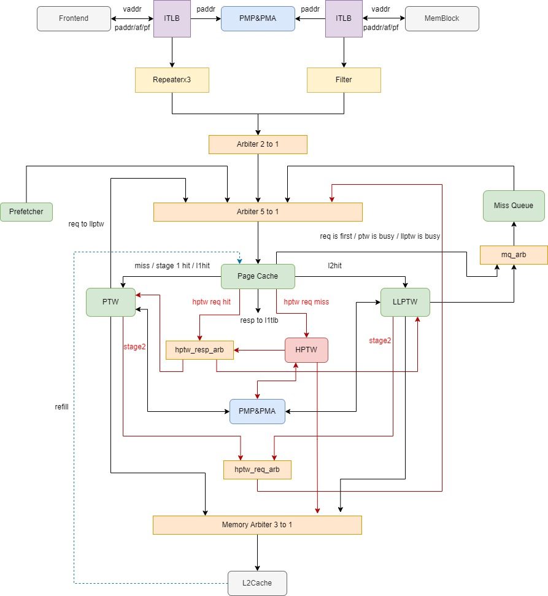

# 【2025 香山入门指南 · 我在 827 做访存】（四）超越容量的界限
---

!!! note "借鉴，借鉴"
    如果你做过一生一芯，或者做过 PA，你会发现这是濠神为 PA4 的其中一小节起的标题。请原谅我卑鄙的借鉴了一下（

    这也是编者本人最喜欢的一章 PA（当然 PA 的其他章节编者也很喜欢）。

    在这一章里，我们跟随 PA 的脚步，不断完善了 nanos，并最终在上面成功运行起来了多任务。

    而标题的这一小节，正是 PA 中指导大家学习虚拟内存与分页机制的部分。因此，本文的这一章节，就是要和大家简单介绍一下昆明湖 V2 的 TLB 与 MMU。

[程序和内存位置 | 官方文档](https://ysyx.oscc.cc/docs/ics-pa/4.2.html#%E4%BD%8D%E7%BD%AE%E6%97%A0%E5%85%B3%E4%BB%A3%E7%A0%81)

[超越容量的界限 | 官方文档](https://ysyx.oscc.cc/docs/ics-pa/4.3.html)

在开始之前，我推荐大家去简单的看一下上面提到的 PA4 中的这一小节。濠神在这一小节中为大家介绍了为什么需要虚拟内存，以及虚拟内存可以干什么，并且为大家讲解了分页机制的原理与历史。在这里，我简单引用一下 PA4 中的原文：

<!-- more -->

---

!!! warning "南京大学 PA4 超越容量的界限："
    我们知道程序会经历编译, 链接, 加载, 运行这四个阶段, 绝对代码经过编译链接之后, 程序看到的内存地址就会确定下来了, 加载运行的时候就会让程序使用这一内存地址, 来保证程序可以正确运行. 一种尝试是把程序看到的内存和它运行时候真正使用的内存解耦开来. 这就是虚拟内存的思想.

    所谓虚拟内存, 就是在真正的内存(也叫物理内存)之上的一层专门给进程使用的抽象. 有了虚拟内存之后, 进程只需要认为自己运行在虚拟地址上就可以了, 真正运行的时候, 才把虚拟地址映射到物理地址. 这样, 我们只要把程序链接到一个固定的虚拟地址, 加载的时候把它们加载到不同的物理地址, 并维护好虚拟地址到物理地址的映射关系, 就可以一劳永逸地解决上述问题了!

    ......

    我们需要一种按需分配的虚存管理机制. 之所以分段机制不好实现按需分配, 就是因为段的粒度太大了, 为了实现这一目标, 我们需要反其道而行之: 把连续的存储空间分割成小片段, 以这些小片段为单位进行组织, 分配和管理. 这正是分页机制的核心思想。

    ...... 在虚拟地址空间和物理地址空间中也分别称为虚拟页和物理页. 分页机制做的事情, 就是把一个个的虚拟页分别映射到相应的物理页上。

因此，页表就是整个虚拟内存的核心。在现代处理器的与操作系统的设计中，对于虚拟内存的管理与维护大都是以页表的形式进行的，所谓虚拟地址到物理地址的翻译过程，也就是按照特定规则对页表进行查找的过程。而这些，对于 RISC-V 来说也是如此。

一方面，软件需要按照手册规范正确的建立虚拟地址和物理地址的映射，这主要是软件对页表的建立。

---

**请带着问题阅读手册：**

**RISC-V 的地址翻译是怎样的？**

**请以 Sv39 地址翻译模式为例，无需掌握完整的权限检查的全部细节，了解整体翻译逻辑即可。**

---

另一方面，硬件需要按照手册规范正确的完成虚拟地址到物理地址的翻译过程，也就是 Page Table Walk（PTW），这主要是硬件 MMU 所要完成的任务。与此同时，为了加速地址翻译的过程，现代处理器往往会有额外的专为地址翻译使用的缓存模块 —— TLB。

## TLB
---

!!! note "记不住的名字"
    TLB 是 **Translation Lookaside Buffer** 的首字母缩写。

    令人感慨的是，在今年的某次国际会议上，香山的某些师兄被问到：“**TLB 的全称是什么哇**？”，由于绝大部分情况下我们不会去使用 TLB 的英文全称，因此这位师兄当时尷尬表示他也忘了。

    但其实，可能绝大部分同学都记不住这个奇怪的英文全称，编者也十分的好奇，为什么会选择使用了 Lookaside 这个单词。

    与之对应的，这个单词的中文名就更少被大家提及了。一般情况下，我们会将 TLB 翻译为旁路转换缓冲，至于为什么叫这名字，那可能就是一些历史的原因啦。

经过上面的问题，大家应该认识到了，地址翻译是一个十分漫长的过程，漫长到一次地址翻译需要访问 3 次内存，要知道，一条普通的 Load 指令也就只需要进行一次访存，而在地址翻译之后，我们需要进行 4（1 + 3）次访存。我们不可能为地址翻译支付完整的 3 次访存的代价，这代价过于昂贵了。

因此，在现代处理器中，往往存在 TLB 用来加速地址翻译的过程，其实加速的方法也十分的简单：只需要将已经转换过的页表通过特殊的结构保存下来即可。这和 Cache 是类似的，只不过我们一般习惯叫 TA **TLB。**

和 Cache 一样，在大部分情况下，对于软件而言，不应该感知到 TLB 的存在。硬件会隐式的、自动的完成 TLB 的维护与使用。当然，在一些情况下，确实需要软件来使用特定的指令来进行 TLB 的维护，这一点也与 Cache 一致的。

---

**请带着问题阅读手册：**

**RISC-V 中的 TLB 管理指令都有哪些？  
****这些 TLB 管理指令的区别是什么，为什么会有这些不同的情况。**

---

另外，需要向大家确认的是，地址翻译与 TLB 本身没有任何联系。TLB 只是加速地址翻译的一个硬件概念上的模块，处理器支持地址翻译不代表需要具备 TLB，一般情况情况下，我们认为 MMU 是完成地址翻译所需要的硬件模块，**而 TLB 只是 MMU 中为了加速地址翻译而设计的子模块**。

与 Cache 一样，对于 TLB，我们也采用了多级的、分离的组成形式。

目前，昆明湖 V2 一共有 L1 TLB、L2 TLB 两级 TLB，而 L1 TLB 又分为 DTLB 与 ITLB。

整体上来看，DTLB 与 ITLB 并没有什么特别多的不同，其内部逻辑大多相同，只是两者对于页表属性与权限的要求有些不同。

整体来看当 TLB 缺失时，会通过仲裁合并之后向下级 L2 TLB（Page Cache）发出请求，如果 L2 TLB 依然缺失，则会通过 PTW 来进行执行完整的 RISC-V 手册中规定的地址翻译流程。

出于性能考虑，我们将 PTW 的过程根据地址翻译过程的不同要求分为了多个不同的 PTW 模块。PTW 最终一定会去访问 L2 Cache 来进行内存的访问。

**但请注意，无论是 L1 TLB 还是 L2 TLB，TLB 均不是缓存一致性节点。这意味着硬件不会自动去维护 TLB 与其他位于缓存一致性节点下的模块的内存数据。同时，TLB 也是 RVWMO 弱内存一致性模型中重要的一环，我们需要显式的通过特定 fence 指令来维护 TLB 的内存序。**

也就是说，当我们通过一条 Store 指令去改写了内存中地址 A 的数据后，如果地址 A 的数据本身早就存在于 TLB 中，那么 TLB 不会自动的去更新到最新的值，直到 TLB 中地址 A 被替换算法选中替换出去，或者执行了类似 sfence 来将 TLB 中的数据刷新掉，TLB 才会在下一次访问 A 的时候产生 Miss，从而执行 PTW 的流程来重新访问 L2 Cache。

## Page Table Walk
前面提到，MMU 与 TLB 是不同的两个概念，而 MMU（Memory Management Unit）进行地址管理的主要方式就是 Page Table Walk。

在昆明湖中，Page Tablk Walk 被实现成了 MMU 中的具体的模块。按照正常的理解来看，Page Table Walk（下称 PTW）主要就是按照 RISC-V 手册中规定的各个地址翻译模式的翻译方法进行访问内存、权限检查，并最终生成一个合法的物理地址，或者产生异常。

而我们 PTW 的结果会根据情况回填到 TLB 当中，以加速后续的页表的访问。

---

!!! note "TLB 与性能测试"
    根据昆明湖的测试结果，其实 Spec CPU 2006 的大部分子项都不存在 TLB 瓶颈。也就是说，大部分的访存都会 TLB Hit。这其实也是合理的，因为昆明湖的 TLB 足够大，是可以承担下一个中大型测试的几乎所有地址翻译请求的，而且我们还有 TLB 的预取，尽管可能并不是最优的 TLB 预取方案和最恰当的 RTL 实现，但也确实可以起到一定的作用。

    但在实际的服务器或者多核 CPU 常见的虚拟化的使用常见下，这可能就不一样了。一方面，虚拟化引入的额外的地址翻译的要求会加大 TLB 的压力，另一方面，虚拟化场景往往伴随着很多的进程切换，这对 TLB 的替换算法与预取算法的要求也更高。

---

**请带着问题阅读并完成下面的内容：**

[MMU 理解要点](https://bosc.yuque.com/yny0gi/ngb8pp/getglg)

---

## Hypervisor
虚拟化，现代大数据云计算时代的技术基石。

对于大部分的面向用户的终端云服务来说，其运行的基础大部分都是服务器厂商基于虚拟化技术提供的各种虚拟资源。完善高效的虚拟服务，不仅可以提高资源的利用率，还可以在一定程度上降低用户的成本。

---

!!! note "也不一定会更便宜，对吧？"
    事实上，从来没有确定的理论表明，企业的成本更低，就一定会降低用户的成本。

    对企业来说，成本只是定价时不那么严格的底线而非准绳。

    我们相信，绝大部分企业的核心是在追求**利润最大化 (Profit Maximization)  **的。当然，利润最大化这个概念是古典经济学的概念，在 2025 的今天，一家企业的行为势必要从多种维度来看待，直接的经济效益可能只是企业决策的一小部分。

    而企业在定价时，依据市场情况和用户群体不同，其决策的逻辑自然也是不同的。在垄断市场的定价决策势必和完全竞争市场的定价决策不同。高价值品牌定位的定价决策与低价值品牌定位的决策也肯定会不同。

    虽然这看上去和我们的问题没有关系，但是这却可以体现虚拟化技术产生的一个根本问题：到底是什么促进的虚拟化技术的产生？

    事实上，在现代社会，一项技术的产生大部分情况下不会自然的、突然的出现。往往是在具有充分的时代背景、技术背景和应用背景的前提下产生的。

    所以如果以后或者现在读者就在进行技术决策，不妨也从这些层面思考一下，说不定就会带来不一样的结论呢？🧐

计算机世界的虚拟化技术包含软件和硬件层面的技术，而虚拟的对象包含了上到操作系统、网络，下到存储、CPU 的等等计算资源。

目前大家比较熟悉的可以提供虚拟化的软件应该有 QEMU、VMWare 等等，这里笔者就以笔者比较熟悉的 QEMU 为例来为大家简单介绍一下虚拟化的简略实现。

QEMU 为大家提供了两大类的虚拟化服务，**基于软件的虚拟化技术 (Emulation) 和基于硬件支持的虚拟化技术 (Virtualization)。**

**Full-system Emulation**  使用软件模拟的方式来完整的模拟出一套完整的计算机系统，包括了 CPU、内存、IO 等等设备，并在模拟出的系统计算机系统上面运行虚拟的操作系统。

QEMU 通过实现了一套高效的 **Tiny Code Generator(TCG)** 来将目标客户平台 (Guset) 的指令动态翻译成主机宿主机 (Host) 支持的指令来进行执行。该模式由于使用软件模拟的方式，因此在一般情况下对于 Host 平台没有特殊要求，因此可以在一个 X86 平台上完整的模拟一个 ARM 的平台，并运行 ARM 架构的操作系统与应用软件。但同时，这也会产生较大的性能开销。

**User-mode Emulation **也是使用软件层面的技术来在 Host 系统上直接运行 Guset 的应用程序。也就是说，可以在 X86 的 Linux 中运行来自 ARM 的基于 Linux 系统运行的应用程序。

QEMU 通过拦截并转换应用程序的系统调用来保证 Guest 平台系统调用的正确执行，并使用 TCG 来进行普通的用户态指令翻译执行。因此，这也就对于 Guset 与 Host 操作系统提出了要求，我们需要使用兼容 Guset 软件的 Host 操作系统来进行 User-mode 的仿真。

前面主要是介绍了 QEMU 中基于软件的虚拟化仿真技术，下面终于 要到了本篇的主线任务：基于**硬件支持的虚拟化技术**了。

**Virtualization**，QEMU 实现的基于 Host 平台软硬件支持的高效硬件虚拟化实现。在一般情况下，我们需要 Host 平台的 CPU 支持自身架构的虚拟化扩展。

Intel 的虚拟化扩展被称为 **VT-x**，而 AMD 的虚拟化扩展则被称为** AMD-V**。

---

!!! note "不是那么熟悉的邻居"
    Intel 和 AMD 是 X86 世界的两大硬件提供商。但其实两者互相都不和睦友善的好邻居。

    在过去的二三十年间，两者之间的关系总是由竞争来主导。两者最初的各大重要扩展技术均为自己独立开发，意在做到比对方更好的效果。这其中包含了多媒体指令扩展 (3DNow!、SSE)、虚拟化扩展 (AMD-V、VT-x) 等等，甚至在由 32 位计算机迈向 64 位计算机的世纪之交时，两家对于如何跨越到 64 位计算机时代产生了极大的分歧，当然最后故事的结局大家都知道了，Intel 不得不承认自己大跨步的 IA-64 是失败的设计，转而选择了 AMD 的 AMD64/X86_64。

    和 64 位扩展的竞争与统一一样，在 2025 年的今天，两家的大部分重要扩展也慢慢趋于了统一，两家都互相支持了对方的大部分的扩展。但是正如上文所言，虚拟化扩展显然不在此列。也因此，Intel 与 AMD 的虚拟化实现的不同的，体现在系统实现层面也自然是需要相互单独实现的。

    大家可以分别在支持虚拟化的 Intel 与 AMD 的 Linux 系统中查看 /proc/cpuinfo，可以分别发现 vmx 与 svm 的 flag。

    至于这个 flag 代表了什么，就留给大家去探索了。

而硬件的虚拟化接口并不能直接暴露给用户软件进行交互，这会带来许多安全和实现上的问题。因此，为了实现在支持硬件虚拟化的硬件平台运行 QEMU 的硬件虚拟化实现，还需要系统层面的支持，对于 Linux 来说这就是 **KVM(****Kernel-based Virtual Machine****)**。

QEMU 通过 KVM 对外暴露的接口进行虚拟化的相关调用，来达到高效的虚拟化实现。但同时，这也带来了这套技术最大的问题：不灵活。所谓不灵活是是于上面提到的两者仿真模式相比，**基于硬件的虚拟化技术不仅需要硬件、操作系统、软件同时支持，Guset 与 Host 还只能运行相同的架构 (X86 - X86、RISC-V - RISC-V)**。但同时，这也是实现上最快的虚拟化方案，由于从硬件层面的支持，在大多数的负载下可以做到与真机相比几乎无感的性能损失。

前面说了这么多，主要是为了像大家介绍虚拟化技术，其实对于虚拟化技术的实现，各家的底层思路大都比较接近，只是在各自的平台上会有一些特定自己平台的设计变化。

对于 ARM 与 RISC-V 来说，其虚拟化的核心就是下面的两点：  
**									额外的权限检查**

**      额外的另一段地址翻译**

额外的权限检查自然不用多说，这是为了系统层面的安全而必要的设计。而额外的地址翻译是为了实现虚拟化内存而带来的要求，这主要是为了使得 Hypervisor 可以管理虚拟机内存资源。

简单来讲，额外的权限检查就是在 CSR 与页表属性中添加了更多的寄存器与位域来进行。而额外的地址翻译也很直观，先经过一次完整的地址翻译，由 Guest Vaddr 得到 Guest Paddr，再经过一次完整的地址翻译，由 Guest Paddr 得到 Host  Paddr。

这里编者就不展开介绍细节了，因为虚拟化大部分相关细节都在手册当中。

---

**请带着问题阅读手册与资料：**

**你需要了解基础地址翻译的过程，这在前面已经要求了。**

**你还需要了解 RISC-V 特权模式与地址翻译相关的 CSR。**

**你还需要了解页表这个概念在软硬件层面都是怎样的。**

---

---

**请带着问题阅读手册与资料：**

**如果你立志了解 MMU，并参与相关工作的话，那你需要完整的了解 RISC-V 特权手册的内容。**

**并且你还需要阅读 RISC-V Hypervisor 扩展手册，了解虚拟化带来的额外的内容。**

---
