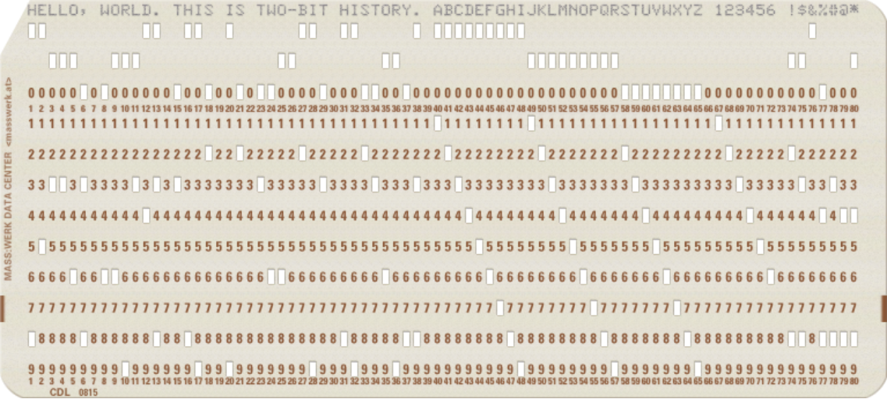
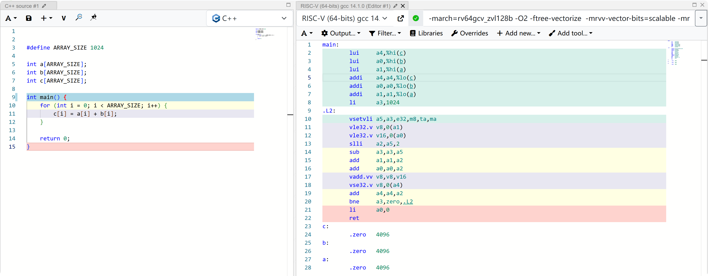
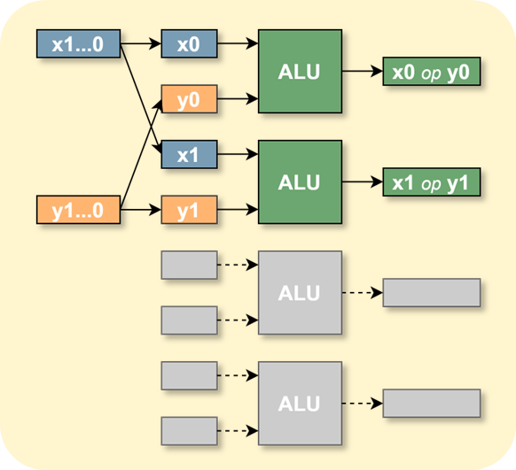
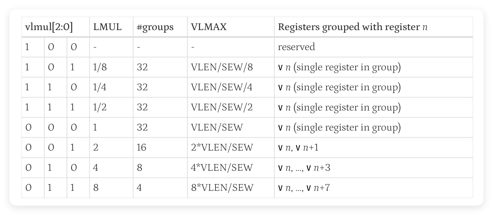
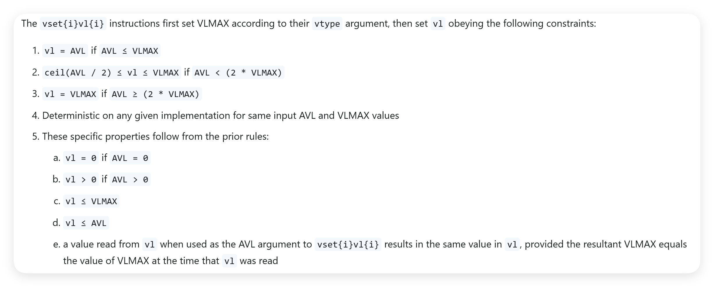
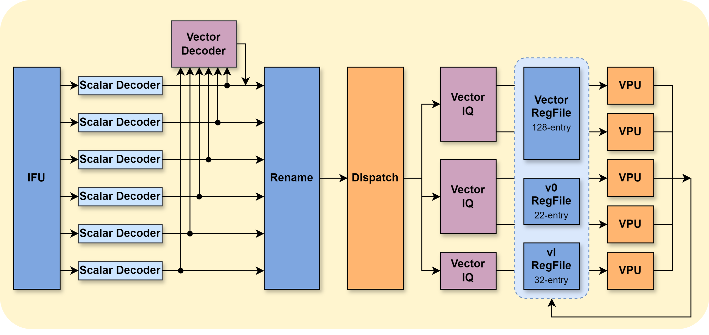
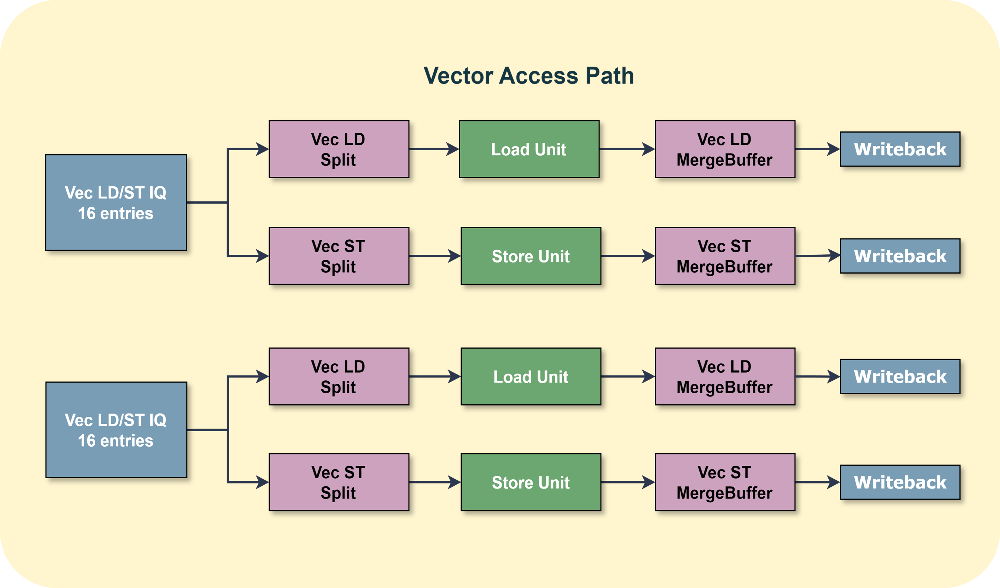
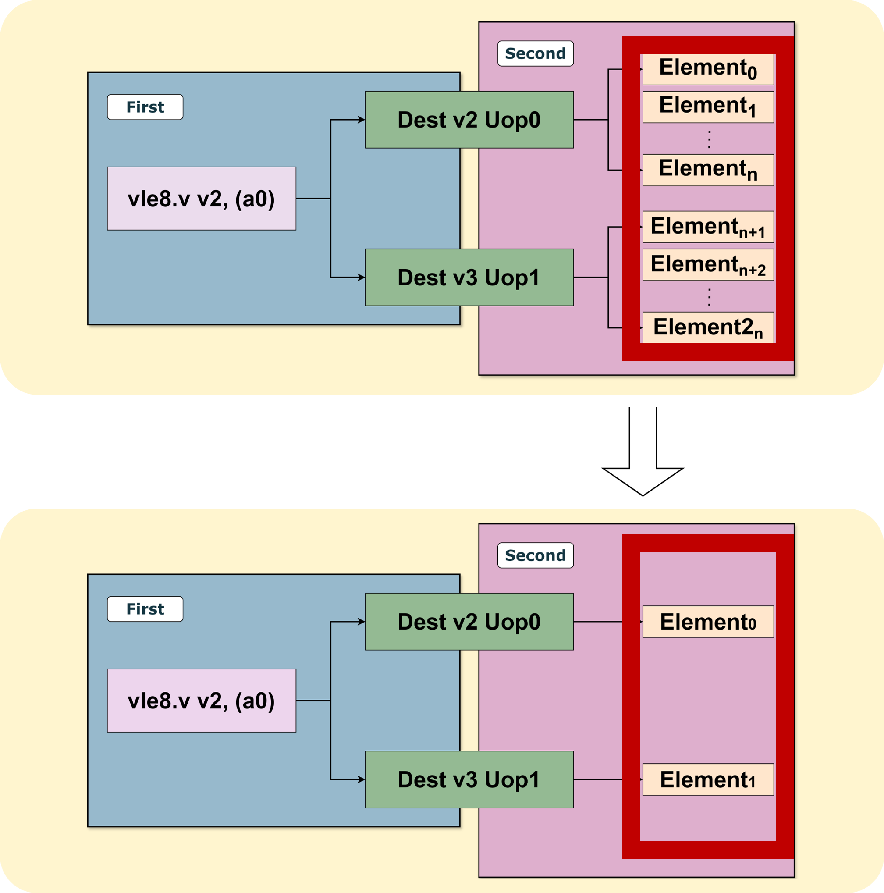
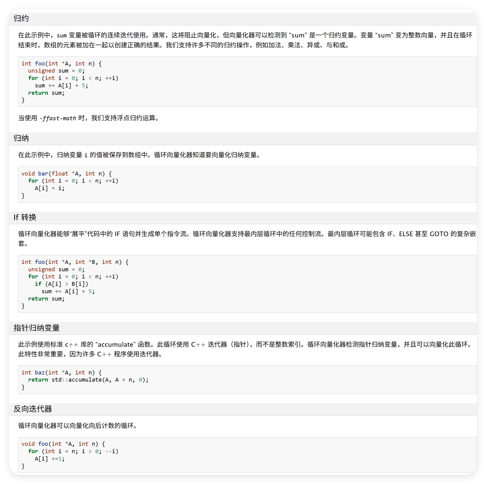

# 【2025 香山入门指南 · 我在 827 做访存】（六）并行计算的诱惑

在“2025 香山入门指南”系列文章中，我们希望构建一个基于 2025 年 6 月昆明湖 V2 版本的香山（XiangShan，提交哈希为 6318236）上手指南，通过一系列引导性的入门指南，来引导新同学们学习、了解并最终掌握香山。

827 是昆明湖项目访存组的主要办公室，“我在 827 做访存”系列以此为题介绍香山访存部分的设计。本文是本专题的第六部分，主要介绍向量访存。计算机硬件的发展史本质上是对运算速度的追求，随着传统串行计算在功耗与散热方面触及物理瓶颈，并行计算成为提升性能的必然路径。文中介绍了 SISD、SIMD、MISD 及 MIMD 四种体系结构，并重点阐述了现代处理器中关键的向量计算技术。不同于传统固定位宽的 SIMD 指令集，RISC-V Vector（RVV） 通过引入可变矢量长度的概念，允许硬件根据实际场景调整寄存器长度，实现了软件代码与硬件实现的解耦。文章还以香山昆明湖 V2 处理器为例，简要解析了其紧耦合向量单元的向量访存单元的实现机制，包括利用拆分与合并模块处理向量访存指令，以及针对不同访存模式的优化策略。

<!-- more -->

请注意，该文章仍然处于 WIP 状态，但这并不妨碍同学们的阅读学习，编者会持续更新新的内容。限于编者水平有限，势必会存在内容失真与笔误的情况，还请各位同学老师不吝指教，如有疑问可以直接联系编者，也可以在本篇下面评论。

## 并行计算的诱惑
回顾计算机的发展，计算机的先贤们总是在不断的探索计算机速度的极限。

计算机的演变史，本质上就是一部对速度的**永恒追逐史**。

我们渴望 CPU 算力的飞跃，内存吞吐的飙升，追求网络传输的极速。自然，这一切执念只为让计算机程序运行得更快，让我们的计算机体验更加行云流水。

**但在计算机已经高度发达的今天，<font style="color:#AD1A2B;">到底怎样才能让计算机更快呢？</font>**

### 发展的故事
让我们简单的回顾一下历史：

早期的计算机以打孔卡片的方式读取执行指令，计算机顺序串行地读取并执行指令，一代经典的 IBM System 360 也是这样的计算机。打孔卡计算机虽然在现在看来十分不方便，但在它诞生的十八世纪与发展壮大的十九世纪，打孔计算机却广泛地应用在了当时社会的商业与统计文书类行业，由于打孔卡计算机的广泛使用对社会产生了深远的影响，因此由打孔卡计算机带来的一些计算机传统也一直延续至今。

---

!!! warning "Punched Card 打孔卡片计算机"
    1725 年，法国纺织工人鲁修为便于转织图样，在织布机套上穿孔纸带，他的合作伙伴则在 1726 年着手改良设计，将纸带换成相互串连的穿孔卡片，以此达到仅需手工进料的半自动化生产。1801 年，法国人雅卡尔发明提花织布机，利用打孔卡控制织花图样，与前者不同的是，这部织布机变更连串的卡片时，无需更动机械设计，此乃可编程化机器的里程碑。

    美国宪法规定每十年必须进行一次人口普查，1880 年排山倒海的普查资料就花费了 8 年时间处理分析，因此美国统计学家赫尔曼·何乐礼在 1890 年开发出一种排序机，利用打孔卡储存资料，再由机器感测卡片，协助美国人口调查局对统计资料进行自动化制表，结果不出 3 年就完成户口普查工作。

    何乐礼在 1896 年成立制表机器公司，几经并购，后来成为国际商业机器有限公司（IBM）的一部分。到了 1950 年，IBM 的卡片已在业界与政府机构广泛使用，为了让卡片可作为证明文件重复使用，卡片上都印有“请勿折叠、卷曲或毁损”的警告字样，这行警语后来还成为后二次大战时期的流行标语。

    直到 1970 年代为止，不少电脑设备仍以卡片作为处理媒介，世界各地都有科学系或工程系的大学生拿着大叠卡片到当地的电脑中心递交作业程式，一张卡片代表一行程式，然后耐心排队等著自己的程式被电脑中心的大型电脑处理、编译并执行。一旦执行完毕，就会印出附有身份识别的报表，放在电脑中心外的文件盘里。如果最后印出一大串程式语法错误之类的讯息，学生就得修改后重新再跑一次执行程序。打孔卡直到今日仍未绝迹，其特殊的尺寸（80 行的长度）在世界各地仍使用在各式表格、记录和程式用途上。

    _维基百科 计算机硬件历史_ —— [https://zh.wikipedia.org/wiki/计算机硬件历史](https://zh.wikipedia.org/wiki/计算机硬件历史)

    

---

后来，我们知道，计算机的发展经历了一些黑暗的探索阶段，大家对计算机的未来发展形式进行了天马行空的探索，差分机和模拟计算机相继诞生，但却都没有成为计算机发展的主流方向。直到几位猛男从天而降 —— 1936 年图灵发表《可计算数》，做出了对停机问题的研究报告并提出了图灵机，1937 年香农发表了《继电器的开关电路的符号分析》的硕士毕业论文，将布尔代数的概念应用到了电子继电器中，从而产生了数字电路的实践基础，而后 1945 年埃尼阿克作为第一台现代电子数字计算机横空出世，同年，冯 · 诺依曼发表《EDVAC 报告书的第一份草案》并提出了大家耳熟能详的“冯 · 诺依曼结构”。那时的埃尼阿克还在使用脆弱不堪的真空管作为主要零件，但有趣的是，就在埃尼阿克诞生后的两年，1947 年双极晶体管被发明，而后材料学的进步催生了晶体管电脑的出现。世界上第一台晶体管电脑在 1953 年投入使用，它要比真空管电脑体积更小、功耗更低。而在 1958 年，伴随着集成电路被发明，离散的晶体管电脑又马上要被取代了。**而这一切之后，人们渐渐看到了计算机走向大众、走向未来、走向辉煌的道路，****现代计算机开始登上历史的舞台并一直发展完善到今天。**

---

**<font style="color:#ECAA04;">如果你感兴趣，可以阅读相关资料：</font>**

* [https://en.wikipedia.org/wiki/History_of_computing_hardware](https://en.wikipedia.org/wiki/History_of_computing_hardware)
* [https://www.britannica.com/technology/computer/History-of-computing](https://www.britannica.com/technology/computer/History-of-computing)
* [https://www.ibm.com/history/system-360](https://www.ibm.com/history/system-360)

---

在这之后，计算机体系结构作为一门专业的学科与工程开始出现在大家视线里，大家开始研究怎么能让计算机更快、更小、更便宜。

---

### 更多的轨道代表更多的运力？
在二十一世纪的今天，计算机已经可以分类为：个人移动计算终端（手机、笔记本）、个人桌面计算终端（台式电脑）、集群服务器、小型物联网嵌入式设备四类。这其中，前三类计算机设备都在较大的尺度上追求更好的性能，而小型物联网嵌入式设备则受限于成本和使用场景，往往对性能的要求并不高，但这不代表嵌入式设备不需要性能。**然而，面对这种跨越多种设备形态的算力饥渴，传统的单一处理器性能提升之路却遭遇了物理法则的阻击。随着摩尔定律的放缓，单纯通过提升主频来压榨串行处理能力的手段已经触碰到了功耗与散热的铜墙铁壁。**因此，人们在发现简单地串行执行计算机指令无法高效地实现任务之后，开始探索 **<font style="color:#AD1A2B;">并行地执行计算机任务。</font>**

事实上，这是一件十分显而易见的发展路线，自从人们有了群落的概念之后，人们便知道了一个人很难同时完成所有任务，但是多个人却可以同时进行不同的任务并最终整合在一起。而人们在有了文明之后，人们便发现，如果一条道路会让城门拥挤，那么最简单的方法就是再开辟一个新的城门或者新的道路来同时供行人出入。而在二十一世纪的今天：如果马路会堵车，那么或许扩宽街道也是一个很不错的方案？

---

!!! info "双向 24 车道的魅力"
    编者的大学生涯是在山东济南度过的，那是一段无忧无虑的快乐时光。而济南不仅有着编者的大学母校，还有着中国车道数最多的城市公路 —— 经十路。

    经十路几乎贯穿了济南，东起章丘西至长清共长 90 公里，最宽处 144 米，24 车道。

    在经十路至今 80 多年的生命中经历了多次扩宽与延长，但可惜的是，每次扩宽道路对经十路堵车情况的缓解都十分有限。

    在济南的几年，只要在晚上打车驶过经十路，必定会被堵在车潮当中。以至于网上有玩笑说到：“别看它（经十路）宽，但是它堵啊”、“经十路是世界最大停车场”。

    因此，好像一味地扩宽道路也不一定能解决堵车的问题？🤔？

    经十路很大，大到贯穿了笔者并不漫长的大学时光，现实生活在经十路，未来见证在经十路，网上有一段话讲述了经十路有多大：“你知道济南有多大吗？在法国，坐一小时的车，你就到德国了，再坐一小时，你到波兰了。在济南，你在经十路，坐一小时的车，你还在经十路，再坐一小时，还是在经十路！…… 这不算什么，你从纽约机场上飞机，六小时以后你已经在欧洲了。你从济南洪楼去济南泉城广场，三小时过去了你在山大路，六小时以后你还在和平路！艾玛，济南，老大老大的了……”但显然，大大的经十路困不住小小的笔者。笔者相信，经十路虽大，但远不及大家心中的浩瀚星海，经十路虽广，但仍不比大家胸中的鸿鹄远志。

    路虽远，行则将至；梦虽遥，追则能达。

    如果你好奇为什么编者要提到经十路的故事，那就带着疑问继续读下去吧！


现在，假设我们已经使用了一段时间的串行计算机（或者说我们已经写过了很多的串行程序），在使用串行计算机的过程中，大家应该能发现并总结出了一些性能优化相关的问题和规律：

**我们发现，一些计算机任务中的数据是可以同时进行操作的，我们可以连续操作 2 个 64 bit 的数据，自然也可以直接操作一次 128 bit 的数据，这就是****<font style="color:#AD1A2B;">数据级并行</font>****。**

**我们发现，一些计算机任务是可以分解成多个独立的小任务进行的，我们可以将这些小任务分散在多个工作负载上，最终收集组合成一个整体的结果，这就是****<font style="color:#AD1A2B;">任务级并行</font>****。**  
在发现问题之后，自然就需要针对问题去解决。既然我们发现了一些并行操作上的问题，自然可以考虑使用并行的方式解决问题。计算机世界的先贤们也是这样想的，先贤们为此还提出了**四种计算机指令与数据结构的分类方式**：

**<font style="color:#AD1A2B;">SISD、SIMD、MISD、MIMD</font>**

---

在开始介绍之前，先让我们做一些前期准备！

这是一段原始的 C 语言 add 代码，可能存在一些不合理的地方，但这不重要，重要的是，我们会利用它作为原型来进行之后的分析。

```c
#define ARRAY_SIZE 1024

int a[ARRAY_SIZE];
int b[ARRAY_SIZE];
int c[ARRAY_SIZE];

int main() {
    for (int i = 0; i < ARRAY_SIZE; i++) {
        c[i] = a[i] + b[i];
    }

    return 0;
}
```

在这里，向大家推荐一个代码编译测试的网站：

[Compiler Explorer](https://godbolt.org/)

godbolt 是一个开源的 web 在线编译测试网站，可以帮助我们快速进行代码编译测试，还可以帮助我们进行代码逻辑分析与优化调试，支持多种语言与不同平台架构编译器，大概是这样的：  


---

下面让我们开始吧！

1、**单指令流单数据流（ ****Single Instruction, Single Data ****）SISD **，这是最符合最初的计算机执行逻辑的概念，属于最典型的单处理器，单条指令操作单块数据，例如 RISC-V 中典型的 Load/Store 指令，一条指令最多只能访存 64 bit 的数据。

我们使用下面的命令编译上述代码（如果你使用 godbolt，则只需要在编译参数栏中填入编译参数，无需指定编译器的名称和代码源文件）：

```shell
riscv64-unknown-linux-gnu-gcc add.c -march=rv64gcv_zvl128b -O0
```

在反汇编之后我们会得到类似这样的汇编指令序列：

```plain
        lui     a5,%hi(a)
        addi    a4,a5,%lo(a)
        lw      a5,-20(s0)
        slli    a5,a5,2
        add     a5,a4,a5
        lw      a4,0(a5) // 加载数组 a 的值 （ 或者 b ）
        lui     a5,%hi(b)
        addi    a3,a5,%lo(b)
        lw      a5,-20(s0)
        slli    a5,a5,2
        add     a5,a3,a5
        lw      a5,0(a5) // 加载数组 b 的值 （ 或者 a ）
        addw    a5,a4,a5 // 将数组 a 和数组 b 的结果相加
        sext.w  a4,a5 // 符号扩展，如果使用 uint 则不需要
        lui     a5,%hi(c)
        addi    a3,a5,%lo(c)
        lw      a5,-20(s0)
        slli    a5,a5,2
        add     a5,a3,a5
        sw      a4,0(a5) // add 的结果写入数组 c
```

[Compiler Explorer - C++ (RISC-V (64-bits) gcc 14.1.0)](https://godbolt.org/z/jr3rnhe1P)

进行简单的分析可以发现，在最后的 sw 之前，我们通过两个 load 来获取两个源数组的值，再进行计算写入，这本身没什么问题，但上面的指令序列是**<font style="color:#AD1A2B;">循环内的语句</font>**！这意味着，我们需要执行 1024 次上述的指令序列，才能完成这一次两数组相加！这就是 SISD 单指令流单数据流的最直观体现 —— 一条指令操作一块数据！我们需要顺序地获取一条加法指令的两个操作数之后，才能执行加法指令。如果我们要进行 N 次加法，则要执行 2N 次源操作数的获取指令与 N 次的加法指令。

显然，聪明的你这个时候已经有了一些灵感，数组在内存中大概率是连续排列的，我们为什么不直接一口气获取更多的数据呢？那么我们就有了 —— 

2、**单指令流多数据流（Single Instruction,  Multiple Data）SIMD**，是一种在现代处理器中常见的加速运算的方式，我们通过尽可能同时操作多块数据，来提高数据处理的并行度，进而提高运算速度。

让我们试一下吧！使用下面的命令编译原始的 add.c 代码：

```shell
riscv64-unknown-linux-gnu-gcc add.c -march=rv64gcv_zvl128b -O2 -ftree-vectorize  -mrvv-vector-bits=scalable -mrvv-max-lmul=m8 -mstringop-strategy=vector --param=vsetvl-strategy=optim
```

---

!!! info "好长好奇怪的参数"
    在支持的编译器下使用这段编译参数会生成 RISC-V 的 Vector 扩展指令。但事实上对于支持 Vector 的 march 而言，我们其实只需要额外指定 -O2 就可以开启 GCC 的自动向量化，而且对于这段 add.c 代码来说，只需要 -O2 就可以带来不错的自动向量化结果，至于后面的那些奇怪的参数，其实是一些有趣的 GCC 向量特定优化参数。在香山昆明湖处理器上，使用这样的编译参数编译出的自动向量化代码在一般情况下会更好一些，感兴趣的读者可以自行去探索一下这些参数都什么意思，以及为什么这些参数会生成对香山昆明湖更友好的代码。

这是编译生成的全部的代码：

```plain
main:
        lui     a4,%hi(c)
        lui     a0,%hi(b)
        lui     a1,%hi(a)
        addi    a4,a4,%lo(c)
        addi    a0,a0,%lo(b)
        addi    a1,a1,%lo(a)
        li      a3,1024
.L2:
        vsetvli a5,a3,e32,m8,ta,ma
        vle32.v v8,0(a1)
        vle32.v v16,0(a0)
        slli    a2,a5,2
        sub     a3,a3,a5
        add     a1,a1,a2
        add     a0,a0,a2
        vadd.vv v8,v8,v16
        vse32.v v8,0(a4)
        add     a4,a4,a2
        bne     a3,zero,.L2
        li      a0,0
        ret
```

[Compiler Explorer - C++ (RISC-V (64-bits) gcc 14.1.0)](https://godbolt.org/z/jbbb6z7z9)

**<font style="color:#AD1A2B;">这就是这一节的主题了。</font>**

---

!!! info "好漫长的铺垫"
    大家在经过了前面的铺垫之后，终于涉及到了本节的主题 —— Vector。
    但其实，在 SIMD 中讲 Vector 可能是不太恰当的。目前，大家普遍认为 SIMD 和 Vector 是两种技术，例如，ARM 同时拥有 Neon 和 SVE 两种并行加速指令集。

    Neon 是标准的 SIMD 指令集实现，SVE 则是可伸缩向量扩展 ( Scalable Vector Extension )。这意味着，至少 ARM 的标准实现中，SIMD 和 Vector 是作为了两套并行方案来进行的。

    但事实上，就 Neon 和 SVE 而言，它们具有很多相似的地方，很多在 Neon 中被提出的概念依然在 SVE 中被继承发展。不过 SVE 为了实现 Scalable Vector 确实提出并引入了一个新的概念：**VLA**** —— ****可变矢量长度（Vector Length Agnostic） **不过编者也不知道为什么中文叫这个名字，好像网络上所有的资料都将 VLA 的中文称为这个，但这不那么重要了，下文为了避免歧义会统一使用 VLA 而不是中文名字**。**

    VLA 提出了一个关键的概念：使用 ISA 层面的抽象，来提供硬件设计上可变长度的向量寄存器，允许硬件设计者根据芯片的实际场景选择合适的向量寄存器长度，这就可以允许同一个软件在不同向量长度的硬件平台上无需重新修改/编译代码即可直接运行。

    在过去的 Neon 或者说传统的 SIMD 指令集中，数据寄存器的长度是固定。比如 Neon 的寄存器长度是固定的 128 bit，可能在 Neon 提出的 2011 年 128 bit 的寄存器长度是足够使用的。但随着计算机图形学与流媒体应用的不断发展，应用程序对高性能并行计算的需求不断提高；而进入新时代之后，处理器的应用场景开始变得越来越复杂多样，各行各业都具有特殊的应用场景，对于处理器的性能、功耗等技术指标的要求也不尽相同。因此，单一的 128 bit 寄存器宽度的 Neon 可能不再能很好的适应现代处理器并行计算的使用场景，所以 VLA 的概念就应运而生了。

    但话又说回来，从具体的标准上来看，Neon 或者说 SIMD 确实与 Vector 有很多差异。但如果我们真的去看 Vector 的加速原理，会发现其实 Vector 也是单指令多数据，不管 Vector 的长度再怎么可变，它也是为了在一条指令中尽可能多地处理数据，从这一点上来看的话，Vector 也确实可以认为是 SIMD。

    事实上，在一些讲述计算结构的现代教材或者资料中往往会列举出本文提到的四种计算结构，在这些资料中，往往也会将 Vector 列入在 SIMD 之内，而且这些资料还会将现实世界几乎不会存在的 MISD 也列举出来。编者其实十分认可这种写法，为了行文的结构与讲述的逻辑，进行一些调整和补充是十分合理的，尽管在现实的处理器中往往会将 Vector 与 SIMD 分开实现，但从底层的计算逻辑上，它们两者确实是类似的。


为了行文的完整，我们这里就先不详细地展开 Vector 的细节了，我们会在下面再详细地分析 RISC-V 的 Vector。在这里，我们只需要明白在香山昆明湖当中，在每次循环执行完指令 `vsetvli a5,a3,e32,m8,ta,ma` 后，每条类似 `v*` 的指令会一次操作 32 个 32 位元素，也就是**一条指令操作 1024 bit 的数据**，理论上我们只需要 32 次循环即可完成这个 add 的函数。

3、**多指令流单数据流（Multiple Instruction,  Single Data）MISD**，按照上面的说法，事实上现代处理器几乎并不会使用 MISD。这也很合理 —— 多条指令来操作一小块数据，这听上去太奇怪了！我为什么不使用多条指令来处理多块数据，或者单条指令来处理单块数据呢？不过可能或许随着时代的发展和计算机技术的进步，可能 MISD 也会找到属于它的阿里阿德涅之线吧！  
4、**多指令流多数据流（Multiple Instruction,  Multiple Data）MIMD**，如果是使用电脑观看的这篇文章，那么大家可以打开自己电脑的任务管理器（如果是 linux 可以使用 htop ^^），通常情况下，大家都会看到很多的 CPU 核心。这就是最典型的 MIMD 的现实例子：多个处理单元执行不同的多个指令来操作多个数据，执行单元可以是任意的概念。

---

!!! info "MIMD 的例子"
    说回上面的数据级并行与任务级并行。如果有读过《计算机体系结构：量化研究方法》（下称《量化》 ）的读者，应该能够发现这一章的部分内容和《量化》中第一章的部分内容有些相似，这是对的。这一章的一些概念性词语确实是从《量化》中来的。

    在《量化》中 MIMD 分为了两种并行方式，分别是线程级并行和请求级并行。

    所谓线程级并行，简单来说就是多线程处理器的每个线程分别同一个任务的不同执行逻辑。例如，我们将上面提到的 1024 次加法分成 8 个 128 次加法，由于这些加法之间本身不存在交叉的联系，所以理论上我们可以将这 8 个 128 次加法同时分派到 8 个线程，同时执行。

    至于请求级并行，就更宏观了。《量化》中将服务器集群称为典型的请求级并行的例子，这里就不展开了。


这里我们可以简单的给出一个多线程的例子，借助 OpenMP，我们只需要对上面的 add.c 代码稍加改造，就可以将其变成一个可以多线程运行的程序。

将源代码修改如下：

```c
#include <omp.h>

#define ARRAY_SIZE 1024

int a[ARRAY_SIZE];
int b[ARRAY_SIZE];
int c[ARRAY_SIZE];

int main() {
    omp_set_num_threads(8);

    #pragma omp parallel for
    for (int i = 0; i < ARRAY_SIZE; i++) {
        c[i] = a[i] + b[i];
    }

    return 0;
}
```

然后在命令行运行如下命令进行编译：

```shell
riscv64-unknown-linux-gnu-gcc add.c -march=rv64gcv_zvl128b -O0 -fopenmp
```

或者你也可以直接访问我设置好的 godbolt:

[Compiler Explorer - C++ (RISC-V (64-bits) gcc 14.1.0)](https://godbolt.org/z/fbbjKz59T)

---

!!! warning "关于 OpenMP"
    OpenMP 是一个跨平台的多线程实现，主线程 (顺序的执行指令) 生成一系列的子线程，并将任务划分给这些子线程进行执行。这些子线程并行的运行，由运行时环境将线程分配给不同的处理器。

    要进行并行执行的代码片段需要进行相应的标记，用预编译指令使得在代码片段被执行前生成线程，每个线程会分配一个 id，可以通过函数 (called omp_get_thread_num()) 来获得该值，该值是一个整数，主线程的 id 为 0。在并行化的代码运行结束后，子线程 join 到主线程中，并继续执行程序。

    默认情况下，各个线程独立地执行并行区域的代码。可以使用 Work-sharing constructs 来划分任务，使每个线程执行其分配部分的代码。通过这种方式，使用 OpenMP 可以实现任务并行和数据并行。

    运行时环境分配给每个处理器的线程数取决于使用方法、机器负载和其他因素。线程的数目可以通过环境变量或者代码中的函数来指定。在 C/C++ 中，OpenMP 的函数都声明在头文件 omp.h 中。

    _维基百科对于 OpenMP 的描述 —— _ [_https://zh.wikipedia.org/wiki/OpenMP_](https://zh.wikipedia.org/wiki/OpenMP)


OpenMP，Open Multi Processing，是一种开放的运行程序接口，通过简单的 pragma 来将现有的项目程序进行编译器自动的并行化。如果只是想尝试一下并行计算的话，那么 OpenMP 是一个不错的简单易上手的选择！

现在我们已经完整的介绍完了四种计算机指令与数据操作的方式，细心的读者应该已经发现了：**在现代处理器中，同时存在了 SISD、SIMD、MIMD 这三种结构**。是的，现代处理器往往同时具有多种指令与操作数据的方式，以供不同的用户需求与应用场景选择。

现在大家应该对现代处理器中常用的指令与数据处理结构有了一定的认知，在前置知识介绍完毕之后，我们终于可以开始今天的正题了 —— **<font style="color:#AD1A2B;">Vector！</font>**

### Vector
让我们再回到上面介绍 SIMD 的时候给出的 add.c 的代码，在这里，我们只需要关注主题循环 .L2 的部分即可：

```plain
.L2:
        vsetvli a5,a3,e32,m8,ta,ma
        vle32.v v8,0(a1)
        vle32.v v16,0(a0)
        slli    a2,a5,2
        sub     a3,a3,a5
        add     a1,a1,a2
        add     a0,a0,a2
        vadd.vv v8,v8,v16
        vse32.v v8,0(a4)
        add     a4,a4,a2
        bne     a3,zero,.L2
        li      a0,0
        ret
```

---

**<font style="color:#DF2A3F;">请完成任务：</font>**

**阅读 RISC-V 非特权手册的 Vector 扩展部分：**

**了解 RISC-V Vector（下称 RVV）的基本概念与名词。**

**了解上面的这些指令都是什么意思。**

---

虽然上面设置了必做题，但为了行文连贯与照顾暂时不方便完成必做题的读者，笔者这里还是完整地介绍一下 RVV 的基本概念与一些常用的基础术语。

**传统 SIMD (AVX/NEON)** 指令集**写死**了宽度。比如 AVX2 指令就是处理 256 位，这个位宽无法动态改变，虽然可以具备很高的运算位宽，但是却存在一些问题。



上面的 **SIMD 资源浪费**的图示表示了当软件使用的 SIMD 长度小于硬件支持的 SIMD 寄存器位宽时，就会存在寄存器等硬件资源浪费的情况；而** SIMD 并行度**降低的图示则表示了当软件使用 SIMD 长度大于硬件支持的 SIMD 寄存器位宽时，会导致程序的并行度降低。

而 **RISC-V RVV (VLA)** **不假设**硬件有多宽。落到实际使用上，软件只会设置总共需要处理多少个**元素，**而硬件会自动地判断一条向量指令可以处理多少元素。

RVV 一共有 32 个向量通用寄存器，每个寄存器宽度（VLEN）由硬件实现决定。一般情况下，我们使用 vl（Vectore Length）寄存器来指示一条向量指令需要处理的元素，使用 vtype 寄存器来保存如何解释与执行向量指令的基本信息，一般情况下 vl 和 vtype 都会由 vset 指令完成写入。

vtype 中保存了很多信息，我们主要关注两个信息：SEW（Selected Element Width）和 LMUL（Multiple vector registers）。 

SEW 指示了默认情况下向量寄存器的元素宽度，每个向量寄存器可以被分为 VLEN/SEW 个元素，一般情况下 SEW 也是向量运算指令的元素运算宽度。向量的一大特征就是长度可变，而长度可变最直观的体现就是**向量寄存器组（LMUL），**多个向量寄存器可以组合在一起，这样一条向量指令就可以对多个向量寄存器进行操作，提高操作效率。因此，一般情况下，一条向量指令最多能处理的元素数量是根据 SEW、LMUL、VL 来进行动态计算得到的，具体的 VL 会有一套设置公式，来设置真正有效的 **AVL** （application vector length），这一过程是硬件隐式完成的：



上面简单给出了一些 RVV 的基础介绍与术语，正如之前说的，这只是为了全文的结构与内容的完整性。事实上，RVV 有非常多的细节都没有在这里给出，笔者不能也不会在这里将 RVV 的细节全部介绍完，因为这会非常繁杂与冗长，具体对 RVV 感兴趣的读者可以自行阅读 RVV 手册。

---

 现在，让我们再来分析一下上面的 RVV 指令都干了什么。

首先，在循环开始我们使用 vsetvli 指令设**置了向量的基础信息**：

```plain
vsetvli a5,a3,e32,m8,ta,ma 
// 设置 SEW 为 32，一个元素为 32 bit；设置 LMUL 为 8，共使用 8 个向量寄存器。
// 硬件会根据自身 VLEN 的值，将 AVL 写入到 VL 寄存器中，以供后续向量指令使用。
```

随后，我们连续执行了两条向量 Load 指令来将加法所需要的**两组加数**取到向量寄存器中。

```plain
vle32.v v8,0(a1) // 连续进行 8*VLEN 位宽的 Load，并将数据保存到向量寄存器 v8-v15 中。
vle32.v v16,0(a0) // 连续进行 8*VLEN 位宽的 Load，并将数据保存到向量寄存器 v16-vv23 中。
```

在这里，大家可以发现 vle32.v 指令中存在一个**<font style="color:#AD1A2B;">数字 "32"</font>**，这其实是 RVV 访存指令的访存宽度，也叫 EEW（Effective Element Width），RVV 的向量访存指令的宽度不使用 SEW 设置的宽度，而是硬编码在指令码内。同样地，向量访存指令的寄存器组大小使用的也不是 LMUL，而是通过 **<font style="color:#AD1A2B;">EMUL = EEW * SEW/LMUL</font>** 来计算得到的 **EMUL****<font style="color:#AD1A2B;"> </font>****（Effective LMUL）。**

---

**<font style="color:#DF2A3F;">请思考：</font>**

**为什么 RVV 要将访存指令与运算指令的元素宽度和寄存器组拆分开来？**

相对来说这个题可能比较难，也不存在确定性的答案，读者可以从实际的应用程序角度出发进行思考：  

**如果你是软件/编译器开发者，你会怎么实现来让软件更快？**

---

然后就是连续的几条标量的中间处理逻辑：

```plain
// a5 是本次向量循环处理的元素数量。
slli    a2, a5, 2 计算本次处理的数据字节数，用来偏移数组地址指针。
sub     a3, a3, a5 // 更新剩余还未处理的元素数量。
add     a1, a1, a2 // a 数组指针后移。
add     a0, a0, a2 // b 数组指针后移。
```

在中间逻辑处理完之后，就开始执行真正的加法操作了：

```plain
vadd.vv v8, v8, v16 
// vadd.vv 指令将 v8-v15 寄存器与 v16-v23 寄存器一一对应地相加，并将结果写入 v8-v15 寄存器。
```

加法操作执行完毕后，会通过向量 Store 指令来讲这次向量循环计算的结果保存到结果数组中：

```plain
vse32.v v8, 0(a4)
// 与 Vector Load 一样，Vector Store 也是用 EEW 和 EMUL，连续进行 8*VLEN 位宽的 Store。
```

最后，我们执行本次循环的剩余尾指令，来为下次循环做准备，又或者执行完成退出循环：

```plain
add     a4, a4, a2    // c 结果数组指针后移。
bne     a3, zero, .L2 // a3 为还未处理的元素数量，如果不为 0，则进入下一次循环处理。
li      a0,0 // 设置返回值。
ret // ret 返回跳出该函数。
```

现在，我们假设读者已经对 RVV 有了初步的认知，请尝试完成下面的题目：

---

**<font style="color:#DF2A3F;">请完成任务：</font>**

**香山昆明湖 V2 的 VLEN 是 128，上述的 add.c 是要操作 1024 个 int 元素。**

**请问我们上面给出的自动向量化的反汇编一次循环会处理多少个元素？**

**与标量相比，自动向量化的代码节省了哪些操作来加速软件的执行？**

---

### 向量访存
前面我们花费了较大篇幅来介绍我们为什么需要向量以及 RISC-V 的向量是什么，事实上，本系列文章实际上是对香山昆明湖 V2 处理器访存部分的介绍。而笔者之所以要花费较多的笔墨来介绍与访存并不直接相关的上面的内容，主要是想为读者建立起一套计算机系统的认知与体系，这一点远比任何单纯的技术内容要重要，技术内容会过时，可能两年后 RISC-V 就抛弃了现在的向量方案，香山也迭代重构了如今的向量实现方案，因此单纯的代码介绍可能会过时，但读者所建立的一套知识体系与所掌握的分析问题的系统能力是不太会过时的。

下面我们来简单的介绍一下香山昆明湖 V2 的向量访存的实现部分吧！

昆明湖 V2 采用了紧耦合的向量实现。一般情况下，我们可以将一个现代处理器中的向量单元实现分为**<font style="color:#AD1A2B;">紧耦合流水线形式</font>**与**<font style="color:#AD1A2B;">协处理器形式。</font>**

紧耦合流水线形式是指向量处理的相关逻辑被直接集成到处理器的执行流水线内部，作为执行级的一个或多个功能单元存在。在这种架构下，向量指令与标量指令共享前端相关逻辑。

协处理器形式是指向量处理单元作为一个独立的硬件模块存在，通过特定的协处理器接口与标量主核连接。主核充当控制器，而协处理器专注于向量常见的计算加速。

目前，**香山选择了紧耦合流水线的硬件向量实现方式**。不过，虽然紧耦合在处理器流水线中，但是向量的相关逻辑还是与标量的逻辑有一些区别的。具体来说，我们使用单独的向量复杂译码器、单独的向量发射队列、单独的向量寄存器堆与具体的独立的向量执行单元。



**对于向量访存来说，我们会复用标量的访存流水线，但是会在向量访存指令进入标量访存流水线之前进行拆分处理，在离开标量流水线之后会进行合并处理。具体来说，在向量访存指令从 Issue Queue 中发射出来后，会先进入 V(Vector)Split 模块，VSplit 模块会将向量 Uop 进行二次拆分，我们将拆分之后的结果称为 Flow，Flow 本身没有什么特殊的，Flow 会和正常的标量访存 Uop 一样进入访存流水线，而当 Flow 退出访存流水线后，会进入 V(Vector)MergeBuffer 模块，VMergeBuffer 模块会收集齐每个向量 Uop 的所有 Flow，当所有的 Flow 收集完之后会将这个 Uop 写回给后端。**



对于 VSplit 而言，我们会根据指令类型进行不同的拆分并进行一些性能优化。

香山昆明湖 V2 的向量访存目前根据向量访存类型分为了 Unit-Stride 与其他类型。Unit-Stride 类型的访存之所以特殊，是因为 Unit-Stride 访存指令是连续访存，例如：vle8.v 是一个 EMUL = 2、EEW = 8 的向量 Unit-Stride 访存指令，它会从基地址开始连续加载 2 个 VLEN 长度的数据到向量寄存器中（如果 VL 允许的话）。因此我们可以很自然地想到最大化地利用我们的访存带宽，尽可能让一次访存操作获取更多的数据。

目前，香山昆明湖 V2 的 VLEN 是 128，昆明湖 V2 的一个 LoadUnit 可以一次访问 128 bit 数据，因此我们的 Unit-Stride 指令是按照向量寄存器为粒度来进行二次拆分的，大概是这样的：



上图的上半部分表示对于 Unit-Stride 指令依然按照元素为粒度进行拆分，而下半部分表示对于 Unit-Stride 指令按照向量寄存器为粒度进行拆分。可以发现拆分出来的访存操作（Flow）会显著变少，**<font style="color:#AD1A2B;">这可以有效地提高访存的数据利用率并减轻 LoadUnit 的负载压力。</font>**

除了上面提到的 Unit-Stride 外还有一些其他的向量访存指令：Stride、Index 以及复杂的 Segment 指令。

Stride 非常好理解，就是两个访存的元素之间是固定的步长，例如：对于 SEW 为 32、Stride 为 1024 的 Stride 指令，假设第一个元素的访存地址是 0x80000000，那么第二个访存的地址就是 0x80000400。

而 Index 顾名思义，就是通过一个指定的索引偏移量进行地址访问，例如：访存的基地址是 0x80000000，第一个元素的 Index 偏移是 0x300，第二个元素的 Index 偏移是 0x900，那么第一个访存的地址就是 0x80000300，第二个访存的元素地址就是 0x80000900。

对于上面提到的 Stride、Index 这两类向量访存指令，目前的昆明湖 V2 会选择按照元素进行拆分。事实上，这样做并不是性能更优的方案，在一些情况下，这仍然会浪费我们的访存带宽。不过值得高兴的是，在后续的昆明湖演进版本中，我们会大幅度优化向量，这其中就包含对非 Unit-Stride 的向量访存指令的优化。

而对于上面提到的复杂的 Segment 指令，昆明湖 V2 目前采取的方案是使用一个状态较多的状态机进行实现，但状态机的实现虽然简单，却无法算得上是高效的实现方式。Segment 指令本身是作为上述 Unit-Stride、Stride、Index 指令的变体产生的，这里就不为大家展开讲了，如果大家感兴趣，请自行阅读手册。

---

**<font style="color:#DF2A3F;">请完成任务：</font>**

**向量访存指令都有哪些？都是什么样的定义？**

---

### 编译器！你在哪！
按照惯例，我们应该来分析一下如何加速向量指令的运行。但其实这比较有趣，一方面，向量指令的产生是为了加速并行计算场景的，它本来就是为了加速而生的；另一方面，目前昆明湖 V2 的向量设计正处于历史的转折点当中，我们还正在对上一版向量设计进行总结并思考如何进行新一代的硬件向量设计。因此这里笔者可能还不太能给出一个明确的如何在硬件上加速向量指令的方案，不过我们可以把目光移到软件层面上来。

事实上，向量计算的推广使用离不开编译器的功劳。这主要是因为现有的大型引用软件已经编写完成，如果不使用编译器自动进行向量化，那就需要软件开发者修改软件源码手动插入向量指令，这是非常困难的事情！

不过幸运的是，现代编译器大都已经实现了 RVV 的自动向量化，软件开发者一般情况下不需要修改软件源代码，只需要调整编译选项就可以使得编译器自动地编译出向量指令来享受向量技术带来的软件执行速度的提升。

一般情况下，以 LLVM 为例，LLVM 会有两种方式进行自动向量化：**<font style="color:#AD1A2B;">SLP 向量化（Superword-level Parallelism Vectorizer）</font>**与**<font style="color:#AD1A2B;">循环向量化（Loop Vectorizer）。</font>**

根据 LLVM 文档的说明，SLP 向量化器会尝试将多个标量操作合并为一个向量操作，以减少代码尺寸与硬件寄存器压力，SLP 向量化器主要关注循环体内部的向量化机会。而循环向量化器会尝试展开对循环间进行展开，减少总循环迭代次数并提升单次循环所操作的数据量。

客观地讲，SLP 向量化往往更直观简单。而循环向量化往往比较复杂，其对性能的影响也是最大的。

一个循环是否能进行自动循环向量化需要具备一些客观前提，可变循环迭代上限的循环无法进行自动循环向量化展开，循环中保护 break 等控制语句与依赖调用也可能导致无法进行自动循环向量化展开。

不过现代编译器对于自动向量化已经进行了非常多的工作，很多五年前大家认为无法进行循环向量化的循环，在 2025 年的今天已经可以被编译器轻松进行自动向量化了。在 LLVM 的文档中，列出了很多可以进行循环向量化的场景，不过下图的这些场景并不全面，读者感兴趣可以自行阅读相关内容：



但客观来讲，尽管现代编译器已经可以利用自动向量化对程序进行很多优化了，但是却还存在一些问题：  
**同一编译器的不同目标平台的自动向量化能力并不相同；不同目标平台的不同编译器的自动向量化能力也有差异；即使是相同的编译器与相同的目标平台，但是一些编译参数或者简单的 #pragma 的差异却会带来完全不一样的自动向量化结果。**

大家可以自行使用一些常见自动向量化测试套件进行不同编译器、不同目标平台的编译测试，例如 TSVC、SPEC CPU 2017 x264 等等。如果可能，还可以使用每个平台各自最佳优化的编译器，例如 Intel X86 平台可以使用 ICC 进行编译测试。

受限于一些情况，笔者这里就不展开介绍了。事实上，目前 RISC-V 的自动向量化可能是所有平台中最差的，这可能是多方面的问题，一方面，RISC-V 欠缺一些高性能的标准硬件实现，这对于编译器/软件开发者来说可能不如 X86 平台一样方便；另一方面，X86、ARM 存在自己设计开发 ISA、硬件、软件的良性迭代反馈，但是对于 RISC-V 来说可能暂时还没有这样的条件；最后，客观来讲其实 RISC-V Vector 确实是要比其他指令集的高性能扩展更加年轻，留给它发育成长的空间可能还比较多。

但不管怎么说，笔者希望读者建立这样一个认知：对于需求 Vector 的高性能场景来说势必需要软硬件同时优化，共同迭代进步。**<font style="color:#AD1A2B;">优秀的编译器、软件可以指导硬件进行针对性设计，而高性能的硬件实现也可以支持编译器、软件进行更自由的优化。</font>**

**事实上这一章的题目比较少，这是因为向量本身就是一个比较复杂困难的研究，笔者这里也没深入的讲解向量化技术的深层次内容，能够用有限的篇幅让大部分读者建立对向量的基本认识就足够了！如果后续某些读者的工作需要接触到向量，那自然会进行更深入的研究！**

---

**<font style="color:#ECAA04;">如果你感兴趣，可以完成上面提到的编译测试：</font>**

**使用一些常见自动向量化测试套件进行不同编译器、不同目标平台的编译测试。**

---
