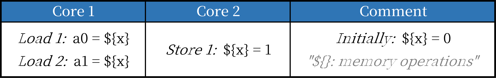
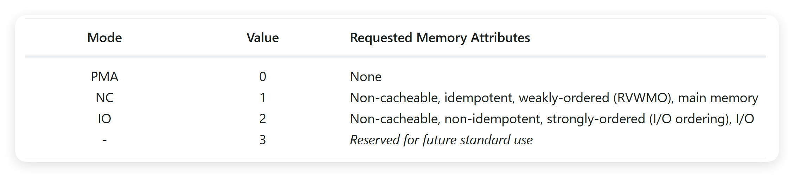

# 【2025 香山入门指南 · 我在 827 做访存】（七）关于访存队列你所需要知道的一切

在“2025 香山入门指南”系列文章中，我们希望构建一个基于 2025 年 6 月昆明湖 V2 版本的香山（XiangShan，提交哈希为 6318236）上手指南，通过一系列引导性的入门指南，来引导新同学们学习、了解并最终掌握香山。

827 是昆明湖项目访存组的主要办公室，“我在 827 做访存”系列以此为题介绍香山访存部分的设计。本文是本专题的第七部分，主要介绍访存队列。

<!-- more -->

请注意，该文章仍然处于 WIP 状态，但这并不妨碍同学们的阅读学习，编者会持续更新新的内容。限于编者水平有限，势必会存在内容失真与笔误的情况，还请各位同学老师不吝指教，如有疑问可以直接联系编者，也可以在本篇下面评论。

## 关于访存队列你所需要知道的一切
在前文，我们在乱序访存的章节中简单介绍了一下访存队列，当时我们表示访存队列与 MemBlock 中的其他模块比较耦合，还需要等其他模块介绍完之后再和大家介绍访存队列，现在就是时候了。

事实上，就像乱序处理器中的**重排序缓冲（Re-Order Buffer ROB）****在整个处理器当中的重要性一样，**对于现代处理器的访存单元来说，LSQ 是保证乱序访存高效可靠的核心模块。

一般来说，我们认为 LSQ 需要保证两件事：**乱序访存的正确性与高效的乱序访存。**

首先我们需要考虑的就是如何保证乱序访存指令的正确执行。目前，香山实现的乱序访存指令有标量的 Load、Store 指令与向量的 Load、Store 指令。所有这些会进行乱序调度的访存指令都需要 LSQ 来保证其正确性。具体来说，我们有这么一些先验的条件：我们认为 Store 的撤销是很难的。对于 Load 来说，如果我们做错了，我们可以重新执行一遍 Load 指令来获取新的数据，这很简单。但是对于 Store 指令来说，我们无法通过简单地重新执行 Store 指令来撤销 Store 指令的影响。

而对于整个访存系统来说，我们需要保证 Store 与 Load 的行为不能产生违反 RVWMO 的结果。具体来说，我们可以将 RVWMO 中规定的各种 Order 与 Axioms 进行整理并最终统计出四条约束：WAR、WAW、RAW、RAR：

**WAR 约束要求我们需要保证新的 Store 不能越过存在依赖的老的 Load。**

**WAW 约束要求我们需要保证新的 Store 不能越过同地址的老的 Store。**

**RAW 约束要求我们需要保证新的 Load 不能越过存在依赖的老的 Store。**

**RAR 约束要求我们需要保证，当程序序上存在先后两条同地址的 Load 时，不能让老的 Load 读取到新的数据而年轻的 Load 读取到旧数据。**

显然，WAR、WAW 是对于 Store 的约束。而对于 Load 指令来说，需要保证不能产生 RAW 与 RAR 违例。也就是说，我们的 Load 指令不能越过其依赖的 Store 指令，同时，在多核场景下，Load 还需要满足 RAR 的约束。

---

!!! danger
    **后面的内容可能稍微有一些难度了~**

### StoreQueue
如果我们将不该写入内存的数据写入了 Cache、Memory 中，那我们就需要在恢复的时候反向写入这个地址中旧的值；如果我们把错误的 Store 数据写入到了 Cache、Memory 中，我们就需要将正确的值更新到内存中。但无论是哪种情况，就算我们能纠正错误的 Store，但当数据被写入了内存系统中的时候，我们就很难再控制这个数据的流动，这块不该存在的数据可能在任何一个时候被被任何一个核心、外设读取到，从而产生无法预取的效果。

因此，对于 Store 指令来说，我们无法让它随意的写入到内存系统中去。Store 需要等到它不再可能产生错误的时候才将数据写入到内存系统中去，而这一条件就是指 **Store 到达 ROB 的队头**。当一条 Store 指令到达 ROB 队头的时候，由于 ROB 是一个先进先出的队列，所以这个时候这条 Store 指令之前一定不存在其他指令，因此，此时这条 Store 指令是处于一个非推测执行的状态，它一定不被其他指令取消冲刷掉，这个时候我们就可以放心的将这个 Store 的数据写入到内存系统当中去了。

但这就产生了一个问题：**还不能写入到内存系统当中去的 Store 要放在哪里呢？**我们显然不可能让所有的 Store 指令都停留在 StoreUnit 中等待。一方面，这会降低我们处理 Store 指令的性能，另一方面，我们只有两个 StoreUnit，能保存的 Store 指令也太少了！因此，现代乱序处理器中一个比较通用的方法是**使用专门的 StoreQueue 来进行 Store 结果的暂存。**

正如最开始的文章提到的那样，香山昆明湖 V2 具有一个 56 项的 StoreQueue，与 ROB 类似，StoreQueue 也是一个先进先出的队列，Store 指令会在 Issue 前进入 StoreQueue 并分配一个 StoreQueue Ptr Index 用来标记这条 Store 指令，从这里开始，这条 Store 指令的生命周期就开始了。

StoreQueue 中会保存每个 Store 指令的原信息、地址、数据等等。在香山昆明湖 V2 中，StoreQueue 直接决定了我们 Store 指令的乱序窗口。具体来说，因为我们 StoreQueue 的大小为固定的 56 项，因此我们最多允许存在 56 条还没有提交的 Store 指令同时存在，这是访存指令与运算指令最不同的一点。一般情况下，普通运算指令的乱序窗口是和 ROB 大小是类似的，假设我们的 ROB 是 240 项，那么理论上没有提交的运算指令是很接近 ROB 大小的，在没有其他依赖的情况下，运算指令可以不停地被执行直到 ROB 满。而 Store 指令除了受到 ROB 大小的限制，还会受到 StoreQueue 大小的限制，当 ROB 空但 StoreQueue 满的时候，Store 指令也无法被执行。

对于 Store 指令来说，由于我们会将 Store 指令拆分成 STD 与 STA，因此需要分别将 STD 与 STA 写回 ROB 与 StoreQueue，当 ROB 与 StoreQueue 都收到同一条 Store 指令的 STD 与 STA 并在 ROB 提交之后，这条 Store 指令才可以在 StoreQueue 中被出队提交写入到 Store Buffer 中。而在 Store 指令写入 StoreQueue 与从 StoreQueue 出队之间是可能会存在一些 Gap 的。Store 指令在 ROB 中可能被前面的各种指令阻挡住，尽管可能这条 Store 已经做完了，而昆明湖 V2 的 StoreQueue 一个周期只能进入 Store Buffer 两条，这也可能会让 Store 指令在 StoreQueue 中额外停留一段时间。

上面我们已经简单概述了 StoreQueue 的逻辑和功能，对于 Store 来说，使用一个先进先出的队列可以自然的保证**不会出现 WAW 违例**。

---

**请完成任务：**

**前面我们提到了 Store 指令在进入 IssueQueue 前会拆分成 STA 与 STD 并进入不同的 IssueQueue。**

**STA 是 Store Addr，STD 是 Store Data。**

**请问这样拆分有什么好处吗？**

---

现在，我们的 StoreQueue 中已经保存了数据，这个时候 Store 的数据还没写入到 Store Buffer 中，我们的 Load 无法从 Store Buffer 中获取数据，自然地，我们有两种处理方式：只要发现 Load 依赖的 Store 还位于 StoreQueue 中，就让 Load 等待数据写入到 Store Buffer；或者**我们从 StoreQueue 中将数据直接送给 Load，也就是 Forward 前递。**上面我们说到，一条 Store 指令在 StoreQueue 会停留多久是完全不可预知的，对于昆明湖 V2 这个级别的处理器来说，我们不能接受让 Load 等待 Store 进行 Store Buffer 才能执行，这太慢了！

如果我们不让 StoreQueue 前递数据的话，Store 指令的结果就需要等到它被 ROB 提交之后才能给其他 Load 指令使用，在这之前所有依赖这个 Store 结果的 Load 指令就无法正确地执行，而依赖 Load 的其他运算指令也无法被执行，这是无法接受的后果！因此，几乎所有使用 StoreQueue 来维护 Store 指令的架构都会支持 StoreQueue 前递数据。也就是说我们还需要保证**当数据存在于 StoreQueue 中时也可以给其他 Load 使用。**

对于昆明湖 V2 来说，Load 指令会查询距离它最近的依赖的 Store 的结果，如果这个 Store 的结果在 StoreQueue 中，则从 StoreQueue 取得数据。同时，昆明湖 V2 支持 StoreQueue 中的多条 Store 按 Byte 进行合并数据并前递，也就是说，如果一个 Load 的数据来自多个 Store，并且这些 Store 同时存在于 StoreQueue 中的话，我们可以直接多个 Store 的数据结果合并并前递给 LoadUnit。

---

!!! info "Gul'dan,must we give it return?"
    上面提到了我们的 StoreQueue 可以按照 Byte 将多条 Store 进行合并数据并前递，这看上去很美好，对性能也有一定的帮助，但是古尔丹，代价是什么？

    为了实现按 Byte 进行前递，我们需要将 StoreQueue 所有项的所有 Byte 进行地址匹配并比较指令顺序。这会生成一块非常大的查找逻辑电路，其实硬件代价是不小的。

    一个 LD 指令需要加载 64 bit 也就是 8 Byte 数据，极端情况下这 8 块数据确实有可能来自 8 条 SB 指令，但在绝大部分的 Workload 中一般都不会出现这种情况，又或者说，这种情况是软件开发者应该尽量避免的。

    上面说的还只是面积功耗时序的代价，除了硬件代价之外，这样的前递方式还会影响我们的其他功能逻辑，这里就不展开了。所以其实任何东西都是有代价的，无非就是在代价与收益之间进行权衡。

    所以在昆明湖 V3 中我们会对这种前递方式进行一些调整，具体的情况就等很久之后再说吧。

---

**请完成任务：**

**Load 指令是如何 Forward 数据的？**

**Load Forward 的数据共有几个来源？**

---

前面我们介绍了如何利用 StoreQueue 来解决 WAW，事实上，通过控制 StoreQueue 的 Forward，我们还可以很轻松的**避免产生 WAR 违例**。

---

**请完成任务：**

**为什么 StoreQueue 通过控制 Forward 就可以避免产生 WAR 违例？**

---

对于 StoreQueue 来说，维护 Store 的状态与前递数据只是 StoreQueue 最基本的功能，事实上，StoreQueue 还有一些其他功能，我们在这里列举出来 StoreQueue 所有的功能：

+ 跟踪 Store 指令的执行状态 
+ 存储 Store 的数据，为 Load 提供查询接口，让 Load 可以 Forward 相同地址的 Store 
+ 负责 MMIO Store 和 Non-Cacheable Store 的执行 
+ 将被 ROB 提交的 store 写到 Store Buffer 中 
+ 维护地址和数据就绪指针，用于 LoadQueueRAW 的释放和 LoadQueueReplay 的唤醒 

有一些功能与其他模块耦合的比较重，在这里我们先不展开讲，在后面的介绍中这些内容会穿插交替进行。

### Load 违例检查
前面我们讲了一下 StoreQueue 与如何避免 WAW 与 WAR 违例，事实上 WAW 与 WAR 违例是非常简单也非常符合直觉的违例，我们不需要付出太多额外的代价就可以解决，但是 RAW 与 RAR 违例相对来说就要麻烦一些了。

让我们先来看一下 RAW 吧。一方面，在乱序访存的情况下，Load 在执行的时候是无法得知是否可能与一个更老的 Store 存在地址依赖的；另一方面，即使我们可以知道一部分 Load 与 Store 之间存在依赖，蛋为了更大的乱序窗口，我们也不太能够接受让 Load 指令停留在 Load IssueQueue 中，因为这会堵住后面其他的 Load 指令。

基于这两点考虑，我们一般都会选择让 Load 指令在源操作数准备就绪之后就直接发射出来，由 LoadQueue 通过一系列较为复杂的控制逻辑来解决 RAW 违例的问题。

如果一条 Load 指令在执行时处于**可能产生 RAW 违例的状态**，那我们就需要将这条 Load 指令给额外使用一个专门的结构保存起来，这个结构就是 **LoadQueueRAW**。所谓**可能产生 RAW 违例的状态**是指一条 Load 指令前面存在一条未完成的 Store 指令，由于这条 Store 指令未完成，所以需要我们将 Load 的访存地址等数据保存到 LoadQueueRAW 中，等这条 Store 被真正执行的时候会去查询 LoadQueueRAW，如果发现了 LoadQueueRAW 中存在一条在程序序上存在地址依赖的更年轻的 Load 越过了 Store 执行，就会产生一次**流水线冲刷，从更年轻的 Load 指令开始，将之后的指令全部冲刷掉。**

事实上，在乱序访存的情况下，由于 Load 和 Store 在流水线中都是乱序执行的，会经常出现 Load 越过了更老的相同地址的 Store，并且可能有多个 Load 都发生了违例，这时我们就需要找到离 Store 最近的 Load，也就是最老的违例的 Load，然后向流水线后端部件发送重定向请求，冲刷最老的违例的 Load 及之后的所有指令。

这就是 RAW 违例与香山的解决方法，下面让我们再来介绍一下 RAR 违例。

RAR 违例比较不直观，在上面，我们对 RAR 的定义是：**”当程序序上存在先后两条同地址的 Load 时，不能让老的 Load 读取到新的数据而年轻的 Load 读取到旧数据。“**

事实上，这种约束主要是为了多核情况考虑的，在之前的章节的介绍中，我们了解了一些基础的多核行为。我们来看这样一种情况：

在这种情况下，由于多核并发的执行指令，我们无法保证 Core 2 的这条 Store 1 会在何时被执行，如果 Core 2 的 Store 1 在 Core 1 的指令执行之后或者之前执行，那么不会有任何的问题，但如果 Core 2 的 Store 1 在 Core 1 的两条间执行，那么在 Core 1 的乱序访存调度下就可能出现一些问题，我们看这么一种情况：

由于乱序访存的调度，Core 1 的两条 Load 指令本身并不存在依赖关系，所以在某些情况下，可能会出现 Load 2 先于 Load 1 执行，Load 2 执行时获取到的地址 x 中的数据是原始的 0，而后 Core 2 执行了 Store 1 并将数据同步到了缓存系统中，然后当 Load 1 执行时，Load 1 就会获取到数据 1！

从程序序来看这是十分奇怪的：**更年轻的 Load 获取到了更旧的值，而更老的 Load 获取到了更新的值。****这就出现了 RAR 违例。**

---

**请完成任务：**

**上述多核指令序列在不加约束的情况下一共有几种可能的执行结果？  
****哪些结果是满足 RVWMO 约束的？**

---

为了解决这个问题，昆明湖 V2 实现了** LoadQueueRAR。**在上述描述的情况下，一定会存在这样一个特征： **当更年轻的 Load 执行完之后，DCache 一定会收到 L2 Cache 发来的 Probe 请求，使得 DCache 主动释放掉这个数据的副本。**基于此特征，我们可以在年轻的 Load 指令执行时为其分配一项 LoadQueueRAR 表项，之后如果 DCache 收到了一个同地址的 Probe，则会在 LoadQueueRAR 中将这条 Load 标记为 Release，表示有一个其他的核心更新了这块数据，这样，当更老的 Load 执行时，我们就可以检查到 LoadQueueRAR 中存在一个更年轻的 Load 获取到了更旧的数据，从而发生一次流水线冲刷，使得两条 Load 都获取到相同的数据。

不知道大家还记不记得在前面的《乱序访存》章节中，我们提到了一个 Litmus 违例的问题。这个问题就是 RAR 违例，但是这个 Bug 不是因为我们的 LoadQueueRAR 实现错了，而是 DCache 对于 RAR 处理有一些问题，具体来说，是 DCache 的 Probe 处理时机存在一些问题。

---

**请完成任务：**

**还有哪些 RAR 的情况需要在 DCache 处理？**

---

到这里，我们就将香山昆明湖 V2 是如何处理 WAR、WAW、RAW、RAR 违例的方法都简单介绍了一遍，但显然还有很多的细节没有展开，不过就不在这里继续深入了，感兴趣的同学可以顺着问答题一路深入下去。

### Uncache
本系列之前的章节主要聚焦于 **Main** **Memory **的操作与行为。Main Memory 指的是大家电脑上插的 DDR 内存条或者集成在 SoC 中的内存，为了避免歧义，后面对 Main Memory 的中文称呼为**主存**，或者直接使用英文的 Main Memory。**在后面，当我们使用****内存****一词时，不一定指的是****主存****。**但在实际的芯片或 SoC 中，具备数据存储能力的部件远不止主存，还包括 **Flash 和 ROM 等**。更进一步说，访存指令也不仅作用于存储部件，它通常还被设计用来访问 GPU、网卡等各种外设，而访存指令访问 GPU、网卡等外设的功能我们一般称之为 MMIO（Memory-Mapped I/O），这是一种**将外围硬件设备的控制与数据寄存器映射到处理器地址空间的技术。**

通常来讲，从物理属性上我们会将访存指令可以访问的地址空间划分为 Memory 与 I/O 空间，Memory 就是可访问的主存空间，一般是具有**可缓存的（Cacheable）的内存属性**，而 I/O 一般指的是各种具有**不可缓存的（Non-Cacheable）的内存属性**的外设地址空间了。

---

**请完成任务：**

**阅读 RISC-V 手册，在 RVWMO 的定义下，I/O 空间具有怎样的属性？**

---

I/O 空间的内存属性与主存区域的内存属性有极大的差别，一般而言，我们认为 I/O 需要具备一定的强序要求，对于 I/O 空间的访问一般会使用 MMIO 的方式进行。一般而言，由于 MMIO 的特殊性，我们**不会允许 MMIO 访存在推测执行的状态执行**，但是在访存指令进入访存流水线之前我们是**无法得知**这个访存指令的访存地址是主存空间还是 MMIO 空间的。为了解决这个问题，昆明湖 V2 选择在访存流水线中识别到 MMIO 访存之后让其进入特殊的模块，等待这条 MMIO 访存指令到达 ROB 队头也就是到达一个非推测执行的状态。

对于 Store 指令而言，MMIO Store 和普通的 Main Memory Store 一样，都需要进入 StoreQueue 并等待 ROB 通知可以提交，两者的区别在于 **MMIO Store 会直接通过总线接口写到核外**，而 Main Memory Store 会写入 Store Buffer。

而对于 Load 指令来说，MMIO Load 会进入 LoadQueueUncahce，在 LoadQueueUncache 中等待这条 MMIO Load 到达 ROB 队头。

事实上，MMIO 的访存实现比较简单，不需要做什么特别多的额外逻辑，我们只需要让它在 ROB 队头的时候再执行即可。不过大家应该能够注意到，本小节的标题是 Uncache 而不是 MMIO，这就是我们接下来要说的了。

前面我们提到了两种物理内存属性：**Cacheable** 与 **Non-Cacheable**。一般而言，物理内存属性被配置在 PMA(Physical Memory Attributes) 中，一般在芯片真正运行用户负载时其 PMA 内存属性已经被确定了。

---

!!! warning "PMAs are inherent properties"
    The physical memory map for a complete system includes various address ranges, some corresponding to memory regions and some to memory-mapped control registers, portions of which might not be accessible. Some memory regions might not support reads, writes, or execution; some might not support subword or subblock accesses; some might not support atomic operations; and some might not support cache coherence or might have different memory models. Similarly, memory-mapped control registers vary in their supported access widths, support for atomic operations, and whether read and write accesses have associated side effects. In RISC-V systems, these properties and capabilities of each region of the machine’s physical address space are termed physical memory attributes (PMAs). This section describes RISC-V PMA terminology and how RISC-V systems implement and check PMAs.

    PMAs are inherent properties of the underlying hardware and rarely change during system operation. Unlike physical memory protection values described in Physical Memory Protection, PMAs do not vary by execution context. The PMAs of some memory regions are fixed at chip design time—for example, for an on-chip ROM. Others are fixed at board design time, depending, for example, on which other chips are connected to off-chip buses. Off-chip buses might also support devices that could be changed on every power cycle (cold pluggable) or dynamically while the system is running (hot pluggable). Some devices might be configurable at run time to support different uses that imply different PMAs—for example, an on-chip scratchpad RAM might be cached privately by one core in one end-application, or accessed as a shared non-cached memory in another end-application.

    _RISC-V Privileged ISA Specification Physical Memory Attributes —— _[_https://docs.riscv.org/reference/isa/priv/machine.html#pma_](https://docs.riscv.org/reference/isa/priv/machine.html#pma)

上文是 RISC-V 手册中对 PMA 的基本定义，一般来说，PMA 不会也不能由操作系统或用户软件进行更改，这就比较麻烦了。在现代的实际应用场景中，操作系统会有各种各样不同的需求，一整块主存地址可能需要被分为多个不同的区域；CPU 与外设的通信也不能总是依靠 MMIO，这太慢了；有些外设还支持在运行时热插拔，如果只有在上电时设置 PMA，那我们可能很难支持所有的热插拔设备。

因此，我们需要一种更细粒度、更自由一些的内存属性配置方法，在 RISC-V 当中，我们通过 **Svpbmt** 扩展引入了**基于页面的内存属性配置。**

---

**请完成任务：**

**阅读 RISC-V Svpbmt 手册，了解一些基础概念。**

[**https://docs.riscv.org/reference/isa/priv/supervisor.html#svpbmt**](https://docs.riscv.org/reference/isa/priv/supervisor.html#svpbmt)

---

Svpbmt 为我们引入了更方便的内存属性管理方式，同时引入了一个新的物理内存类型：**NC**。

---

!!! info "NC 到底是不是 Non-Cacheable"
    现在我们有了两个名词：NC 和 Non-Cacheable。NC 是一个内存类型或者叫一个访存模式，而 Non-Cacheable 是一个内存属性。虽然 NC 看上去很像是 Non-Cacheable 的缩写，但是他俩在不同的场景使用的时候代表的意思是不一样的。

    我们可以说 NC 具有 Non-Cacheable 的内存属性，但我们不能说 Non-Cacheable 就是 NC，因为 I/O 也具备 Non-Cacheable 的内存属性。

如上图所示，Svpbmt 扩展为在页表中额外添加了 2 bit 的 PBMT 标记位用来指示这一页的地址属性。PBMT 通过配置覆盖 PMA 的属性，当配置 PBMT 位为非 0 时，我们 PMA 对于该物理地址属性的设置不再有效，转而由 PBMT 进行物理地址属性的配置。

因此，在实现了 Svpbmt 之后，昆明湖 V2 事实上拥有三种不同访存模式：Main Memory、NC、I/O。其中，Main Memory 只能由 PMA 配置；NC 只能由 PBMT 配置；I/O 可以由 PMA 配置也可以由 PBMT 配置。

在上表中提到了一些名词概念，其中大部分概念大家应该都了解，唯一可能存在困惑的应该是 **Idempotent 与 non-Idempotent。**

**Idempotent，幂等性是一个数学与计算机科学的概念。**笔者对数学中幂等的概念不是很了解，这里就不班门弄斧了，在计算机科学中，幂等表示了某个操作、函数、行为在被**多次执行时所造成的影响与只执行一次的影响相同**，多次运行不会产生额外的影响、副作用。具体到 PBMT 中的幂等，指的是多次进行完全相同的 NC 的访存，得到的结果是相同的。一个简单的例子：在 NC 的地址 0x80000100 中保存着数据 3，只要我在两次 NC Load 之间没有其他的 Store 来修改这个地址，那么两次 NC Load 的值一定相同，NC 地址中的数据不会因为我的 Load 行为而被改变。而如果一个 UART 的某个寄存器中有字符数据 'A'，我连续两次 I/O 的 Load 可能读到两次完全不同的结果，这是因为有可能 UART 的寄存器在发生了一次读行为后就自行清空了自己。

现在让我们再说回 NC。在上面的表格中描述的已经非常清楚了，NC 与 I/O 一样是不可缓存的，这意味着我们需要将数据直接写入 Main Memory 当中，但与 I/O 不同的是，I/O 要求使用 I/O 强内存一致性，而 NC 只需要保存 RVWMO 弱内存一致性即可，这就为 NC 带来了一些性能上的便利。

---

**请思考：**

**NC 使用 RVWMO 内存一致性模型，但是直接写入到 Main Merory 有什么好处？目的是什么？**

**我们/操作系统 在什么时候 可以/会 使用 NC？**

---

在昆明湖 V2 中，我们的 NC 与 MMIO 一起复用相同的模块，对于 NC 的 Store 来说，我们使用 StoreQueue 来控制 NC 的写入，依然是需要保证 NC Store 位于 ROB 队头才可以执行。对于 NC 的 Load 来说，我们使用 LoadQueueUncache 控制 NC 的读取，但是不需要等到 NC Load 到达 ROB 队头，只要数据与地址准备好，我们就可以从 NC 空间加载数据。

由于 PBMT 是页表属性，所以理论上 PBMT 可以对任何一段地址进行操作并覆盖掉这块地址的 PMA 属性。但可能这会存在一些问题：如果我们为一个依赖 I/O 强内存序的设备地址空间通过 PBMT 配置为 NC，则可能会导致严重的一致性问题。这一点在手册中有明确的提醒，不过手册中还说，尽管这样的行为存在一定风险，但这样做仍然有很高的实际价值。

---

!!! warning "PBMT = NC 的诱惑"
    A device driver written to rely on I/O strong ordering rules will not operate correctly if the address range is mapped with PBMT=NC. As such, this configuration is discouraged.

    It will often still be useful to map physical I/O regions using PBMT=NC so that write combining and speculative accesses can be performed. Such optimizations will likely improve performance when applied with adequate care.

    _RISC-V Privileged ISA Specification Svpbmt —— _[_https://docs.riscv.org/reference/isa/priv/supervisor.html#svnapot_](https://docs.riscv.org/reference/isa/priv/supervisor.html#svnapot)

不过目前昆明湖 V2 还没有实现 NC Store 的写合并，因此这样做的收益具体有多少还犹未可知。

### Replay
前面我们介绍了关于 Load 的非常多的 Queue，包括了 LoadQueueRAR、LoadQueueRAW、LoadQueueUncache。这些 Queue 的大小不一，在目前的昆明湖 V2 配置中分别是 72、32、4。在昆明湖 V2 中，我们会用一个名叫 VirtualLoadQueue 的先进先出队列来记录 Load 的顺序的，这个 Queue 非常的简单，只是用来维护 Load 指令的顺序，不像 StoreQueue 一样具备多种功能，这里就不展开介绍了。因此，我们能容纳进行乱序调度的 Load 有 72 条，这意味着在部分情况下 LoadQueueRAW、LoadQueueUncache 是无法容纳下所有需要的 Load 的。我称这种情况为 **Nack。**

以 LoadQueueRAW 为例，在 Nack 的情况下，我们需要让进不去 LoadQueueRAW 的指令进入一个 LoadQueueReplay，等到 LoadQueueRAW 可以接收 Load 指令时，再让这条 Load 指令从 LoadQueueReplay 中发射出来重新执行。

事实上，这就是 LoadQueueReplay 的作用：**保存因为各种各样原因无法从 LoadUnit 执行完毕的指令，等到合适的时候重新发射出来执行。**

**这里的原因就非常多了，大概有下面这些：**

+ C_MA (位 0): Store-Load 预测违例
+ C_TM (位 1): Tlb Miss
+ C_FF (位 2): Store-to-Load-Forwarding，Store 还没有准备好导致前递失败
+ C_DR (位 3): 出现 DCache Miss，但是无法分配 MSHR
+ C_DM (位 4): 出现 DCache Miss
+ C_WF (位 5)：路预测器预测错误
+ C_BC (位 6): DCache Bank 冲突
+ C_RAR (位 7)：LoadQueueRAR 没有空间接受指令
+ C_RAR (位 8): LoadQueueRAW 没有空间接受指令
+ C_NK (位 9): LoadUnit 监测到 Store-to-Load-Forwarding 违例
+ C_MF (位 10)：LoadMisalignBuffer 没用空间接受指令

---

!!! info "复杂的 LoadQueueReplay"
    在昆明湖 V2 中，由于 Load 需要 Replay 的原因与次数较多，因此对 Replay 有一些复杂的要求。具体的，我们需要 Replay 可以根据不同原因进行不同优先级的 Replay，我们还希望在相同优先级的 Replay 指令中选出对性能影响最大的指令优先发出，上面这些原因一起构成了 LoadQueueReplay 中较为复杂的 Replay 仲裁选择逻辑。整个 Replay 一共有 3 种仲裁选择逻辑，在这里笔者就不展开了。

---

**请完成任务：**

**LoadQueueReplay 在选择 Replay 的指令的时候的仲裁选择逻辑是怎样的？**

---

而对于 Store 来说，由于其重发情况较少，因此我们没有专门的 Store Reply Queue，我们复用 Store IssueQueue。具体来说，Store 指令被发射之后并不会从 IssueQueue 中释放，而是要等待 StoreUnit 执行后反馈信号告知 IssueQueue 是否可以释放这个 Store 指令，如果不能释放，则需要重新将这条 Store 指令发射出来。而对于 Load IssueQueue 来说，由于我们具有可以容纳 72 项 Load 的 LoadQueueReplay，因此不需要 Load IssueQueue 重发，自然也不需要在发射之后依然保存这条 Load 指令。

