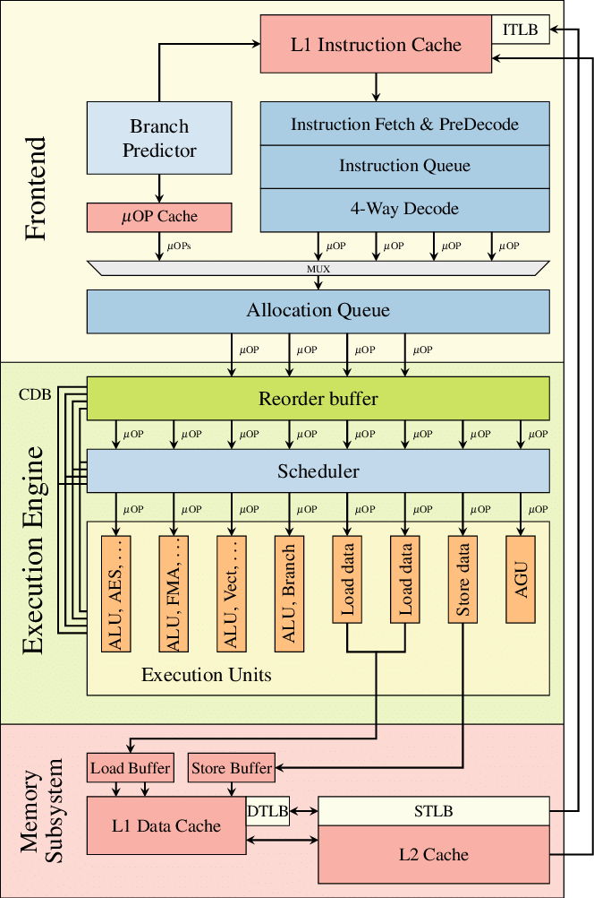
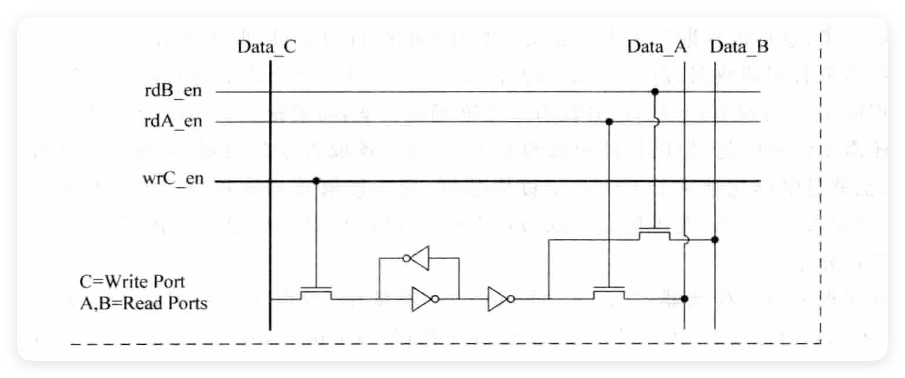
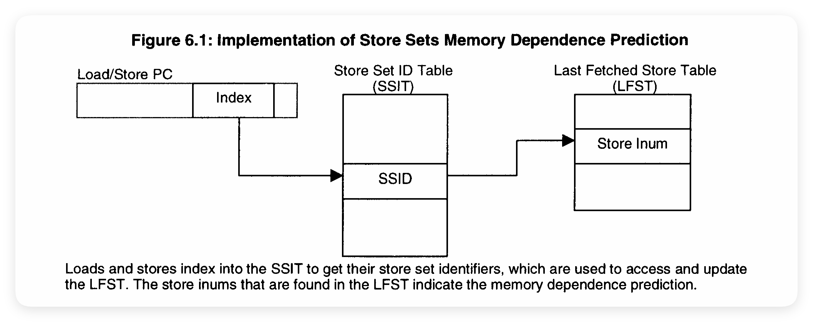
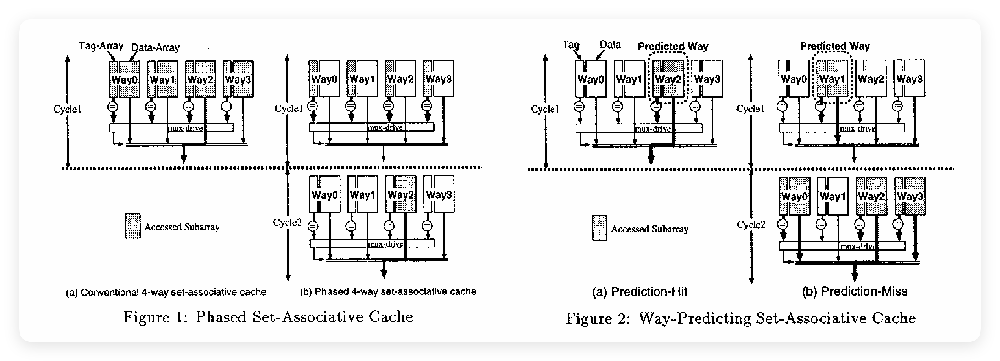
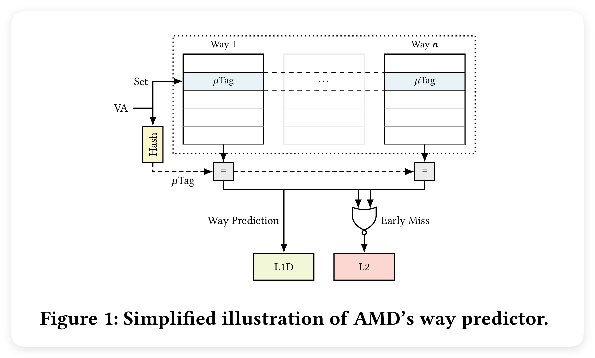
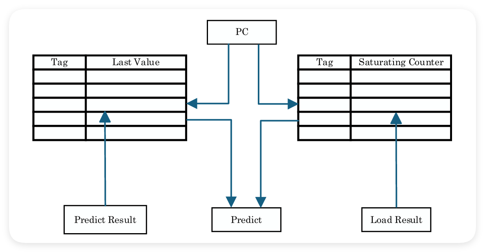
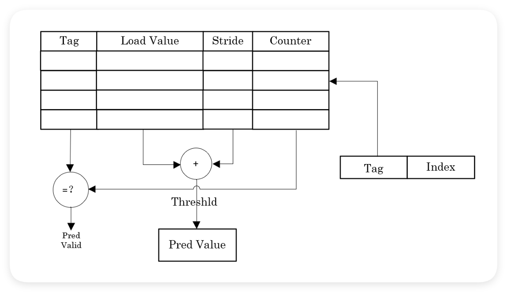
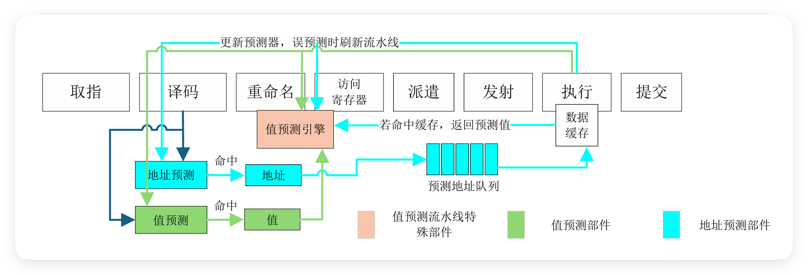

# 【2025 香山入门指南 · 我在 827 做访存】（八）再探内存访问

在“2025 香山入门指南”系列文章中，我们希望构建一个基于 2025 年 6 月昆明湖 V2 版本的香山（XiangShan，提交哈希为 6318236）上手指南，通过一系列引导性的入门指南，来引导新同学们学习、了解并最终掌握香山。

827 是昆明湖项目访存组的主要办公室，“我在 827 做访存”系列以此为题介绍香山访存部分的设计。本文是本专题的第八部分，主要……

<!-- more -->

请注意，该文章仍然处于 WIP 状态，但这并不妨碍同学们的阅读学习，编者会持续更新新的内容。限于编者水平有限，势必会存在内容失真与笔误的情况，还请各位同学老师不吝指教，如有疑问可以直接联系编者，也可以在本篇下面评论。

## 再探内存访问

前面我们已经探索过了丰富的访存世界，访存的世界里充满了未知与挑战，同时也充满着鲜花与赞美，虽然前面的内容难度不一，笔者写作的风格与质量也没有做到一致，但**笔者相信读到这里的大家或多或少地都已经通过前面的内容得到了一些收获。**

**<font style="color:#AD1A2B;">现在，是时候让我们收尾了。</font>前面我们列举了非常多的内容，但是大部分内容都没有深入探究，现在就是再深入探究一部分内容的时候了；前面我们介绍了许多的处理器体系结构方面的优化方式，但是还有很多香山昆明湖 V2 已经实现了的具体优化方法，现在也是分析这些具体优化方法的时候了；前面我们还讲述了很多的 RISC-V 扩展指令，但还有很多与访存相关的扩展没有提到，现在也是介绍这些细小但重要的扩展的时候了。**


### 深入访存流水线
让我们先看看之前没有涉及到的一些设计细节吧。

在前面，我们提到香山昆明湖 V2 使用了分离的 Load/Store 流水线，我们具有 3 条 Load 流水线、2 条 Store 流水线，由于 Store 需要两个操作数：**数据**和**地址**，因此我们选择将一条 Store 指令的数据和地址拆分成两条不同的 **uop（微操作）**。在这里我们提出了 uop，但事实上 uop 的概念并不是香山独特提出的。

uop 准确来讲应该是叫做 μop，μ 是 micro，op 是 operation，连起来也就是 micro-operation。μ 读 miu，考虑到打字方便，一般大家使用 uop 来代指 μop。 

一般而言，我们认为在 X86 架构中，一条复杂的 CISC 指令会被芯片电路拆分成许多 uop，每一个 uop 可能执行不同的逻辑，也可能执行同一个逻辑的不同数据部分，这些全部的 uop 合并起来构成一条正常的指令，因此，我们认为一条指令在电路中的执行并不是完整、连续的。X86 指令之所以使用这样的方式进行实现是有很多原因的：一方面，CISC 指令长度不一，一条指令往往会非常复杂，其执行周期也不同，与每种指令之间要做的事情和能干的事情的多少也差距较大。这种不规则性使得**超标量与流水线执行变得困难**；另一方面，由于一条 CISC 指令可以做很多事情，如果它是一个复合的指令，那么**指令间的依赖就会非常复杂**。

让我们举一个简单的例子，我们改造一下之前提到的 add.c 代码，让它变成 mul.c：

```c
#define ARRAY_SIZE 1024

long a[ARRAY_SIZE];
long b[ARRAY_SIZE];
long c[ARRAY_SIZE];

__attribute__((noinline))
void update_data(volatile long *ptr, long a, long b) {
    long slow_val = a * b; 
    *ptr += slow_val;
}

int main() {
    for (int i = 0; i < ARRAY_SIZE; i++) {
        update_data(&c[i], a[i], b[i]);
    }

    return 0;
}
```

然后我们在 X86 平台上使用 -O3 编译一下：

```plain
update_data(long volatile*, long, long):
        imul    rsi, rdx // -> long slow_val = a * b;
        add     qword ptr [rdi], rsi // -> *ptr += slow_val;
        ret

main:
        push    r15
        push    r14
        push    r12
        push    rbx
        push    rax
        xor     ebx, ebx
        lea     r14, [rip + c]
        lea     r15, [rip + a]
        lea     r12, [rip + b]
.LBB1_1:
        lea     rdi, [r14 + rbx]
        mov     rsi, qword ptr [rbx + r15]
        mov     rdx, qword ptr [rbx + r12]
        call    update_data(long volatile*, long, long)
        add     rbx, 8
        cmp     rbx, 8192
        jne     .LBB1_1
        xor     eax, eax
        add     rsp, 8
        pop     rbx
        pop     r12
        pop     r14
        pop     r15
        ret
```

[Compiler Explorer - C++ (x86-64 clang (trunk))](https://godbolt.org/z/srG7e7bWv)

在这里，我们为了防止编译器优化使用了一些特殊一点的语句，我们就不展开了。在这样的条件下，我们可以保证我们的 C 语言语句与 X86 汇编语句产生这样的对应关系：

```
long slow_val = a * b;    --->    imul    rsi, rdx

*ptr += slow_val;         --->    add     qword ptr [rdi], rsi
```

对于 `imul rsi, rdx` 来说，其含义就是简单的两数相乘，`rsi = rsi * rdx`，这没问题，但是 `add qword ptr [rdi], rsi` 则要相对复杂一些了，我们需要从内存中获取 `rdi` 的值，并将获取出来的值与 `rsi` 相加，然后再将相加的结果写回内存 `rdi`，也就是说，这条 X86 的 add 指令存在 Load、Add、Store 三种 RISC-V 风格的操作。

我们可以将它们拆分成 3 个 uop：

* `Load tmp, rsi`
* `Add tmp tmp, rdx`
* `Store rsi, tmp`

这会带来明显的好处，如果我们将这条 add 指令当作一条指令来进行处理的话，那么 add 指令的三个操作需要**完全依赖 imul 指令完成才能执行**，但实际上，如果按照上面的 uop 拆分方法，我们可以发现 Load 操作是不需要依赖 imul 指令完成的，Load 操作与乘法操作显然不可能共用同一个执行单元，而且 Load 与乘法操作都相对较慢，因此在 imul 执行的同时去执行 Load 操作是十分合理的，我们可以在一定程度上掩盖 Load 操作的延迟：**如果 imul 执行完成时 Load 操作也执行完了，那么我们可以直接开始后面的 add 操作，而不是像拆分之前一样，等 imul 执行完成后，才能执行这条完整的 add 指令来执行上面提到的三个操作。**

事实上，对 X86 而言，进行复杂指令的拆分不只是缓解指令间依赖提高并行度这么简单，对于 X86 来说，由于其指令功能繁杂且数量较多，一条指令可能要做多种完全不同的操作，为一条复杂的指令进行调度的难度显然要大于为多条简单操作进行调度，不过这就涉及到具体的设计哲学了，在 X86 最开始诞生的年代，指令还没有现在这么多，或许那时候还没有拆分 uop 的概念呢。



---

!!! warning "Intel-Skylake-microarchitecture"
    这里有一张更清晰的 Intel Skylake 的微结构示意图，出于版权原因，笔者无法在文章中直接贴出，感兴趣的同学可以点击链接查看。

    _WikiChip_ —— [File:skylake block diagram.svg - WikiChip](https://en.wikichip.org/wiki/File:skylake_block_diagram.svg)


---

说完了 uop 这个乱入的支线，现在再让我们回到 RISC-V 的 Store 指令上面来。上面提到，RISC-V 也可以对复杂的指令进行 uop 的拆分，比如 Vector，但可能有同学会提问：“Store 指令就是一个很普通的指令哇，为什么我们还需要将 Store 指令进行拆分呢？”这其实是基于一个很直观的感受 —— Store 指令的两个操作数往往并不相同，地址与数据的依赖关系往往也不相同，并且，数据与地址要做的事情也不一致。**Store 指令的数据要做的事情非常少，一般情况下只需要进行一些位操作即可，而地址则要进行<font style="color:#AD1A2B;">地址翻译、权限检查、违例检测</font>等等事务**，这就带来了一些行为与时序上的 Gap。

在香山昆明湖 V2 中，Store 的数据操作可以在一个时钟周期内完成，但我们不可能让 Store 的地址操作在一个周期内完成包括：进行 TLB 查询完成地址翻译、PMP、PMA 权限检查、RAW 违例检查在内的诸多事务。因此，不管是让数据跟着地址一起在流水线上执行，还是让地址在一个时钟周期内完成所有事情都是不合理的。一般情况下，由于 Store 指令的数据和地址来自不同的源寄存器，它们两个就绪的时间往往也是不一样的，如果让其中一个等待另外就绪再一起执行，势必会在一定程度上降低执行单元的利用率。

综上，香山昆明湖 V2 选择了将 Store 指令的数据与地址拆开执行。

但这不都是好处。**一方面，将 Store 指令进行拆分意味着原本设计容纳 16 条 Store 指令的 IssueQueue 需要<font style="color:#AD1A2B;">翻倍</font>才能容纳下 16 条 Store 指令的 32 条 uop；**另一方面，由于我们将数据与地址拆分执行，那么我们在执行地址操作的时候是无法得到数据的，如果这个时候**检测到了与自己这条 Store 之后的 Load 指令存在依赖关系的话也<font style="color:#AD1A2B;">无法</font>将数据前递给 Load 指令。**

---

!!! info "Nuke！"
    在香山昆明湖 V2 中，我们会在 LoadUnit 进行访存检测，如果检测出现违例，我们会称为 Nuke，这可能是一个业内的习惯称呼？Nuke 意味着核弹。

    在一款经典的网络游戏 Counter-Strike 中有一张经典的地图：Nuke 中文名叫核子危机。

    在香山昆明湖 V2 的乱序访存中，Nuke 指的是产生了非常严重的流水线违例问题而不得不从前端取指开始重新执行，就像是被核弹攻击了一样。

    在这里，我们的 RAW 违例分为两部分检测，一部分使用 LoadQueueRAW 进行，这是对已经执行完的 Load 进行检测，如果检测到一条已经执行完的 Load 越过了依赖的 Store，则需要重新从 Load 指令开始执行；另一部分是在 LoadUnit 流水线上进行的，会对其他正在 StoreUnit 中的 Store 地址操作进行违例检测，如果检测出来存在一条更老的、地址匹配的 Store 地址操作，则让这条 Load 指令进行**快速重发**。

    至于什么是快速重发，这就是我们下面要讲的内容了。


---

在之前的章节中，我们介绍了 Load 指令的 Replay，这是基于 LoadReplayQueue 的重发机制，但事实上，香山昆明湖 V2 中并不只有基于 LoadReplayQueue 的重发，还有基于**抢占流水线入口**的 **<font style="color:#AD1A2B;">Fast Replay</font>**，也就是上面提到的**<font style="color:#AD1A2B;">快速重发</font>**。

香山昆明湖 V2 为 Load 指令实现了基于抢占 Load 流水线入口的快速重发机制，用来调度本次 Load 无法完成的 Load 指令重新快速地再次进入 Load 流水线执行。**Fast Replay 会在 LoadUnit 的 S3 生成，并直接连接到相同 LoadUnit 的 S0 阶段，作为最高优先级的请求再次进入 LoadUnit 流水线执行。**目前，香山昆明湖 V2 一共有 3 种允许快速重发的情况，分别是：**<font style="color:#AD1A2B;">DCache MissQueue 满、DCache Bank Conflict、流水线 St-Ld 违例。</font>**

我们来简单分析一下这三种情况。

DCache MissQueue 也叫 MSHR(Miss Status Holding Register)，负责处理 Miss 的 Load、Store 和原子请求，包含 16 项 MissEntry，每一项负责一个请求，通过一组状态寄存器控制其处理流程。

对于 Miss 的 Load 请求来说，MissQueue 为它分配一项空的 MissEntry，并且可以在一定条件下合并请求或拒绝请求，分配后在 MissEntry 中记录相关信息。进入 MissQueue 的请求会在允许时向 L2 发送 Acquire 请求。等到 L2 返回数据后，MissQueue 会请求 DCache MainPipe 进行数据回填。基于此，我们同时允许 Miss 的不同 CacheLine 的访存请求**<font style="color:#AD1A2B;">最多只有 16 个</font>**，如果所有的 MissEntry 均被使用，且请求的 Load Miss 请求不能被合并到某一项 MissEntry 中，那我们就需要让这个 Load 请求进行重发，默认情况下，我们会先使用 Fast Replay 进行重发。

昆明湖的 DCache 采用 64 KB 总容量、4 路组相连的设计，每个组划分 8 个 Bank。多 Bank 的 DCache 是为了可以为多条访存流水线同时提供多个读取端口用以提高并行度，如果不使用分 Bank 的设计，那我们就需要**使用多套真实的读口，这会带来多个地址解码器、多路选择器等等部件，同时 SRAM 还需要采用多端口的 SRAM 实现，这会带来较大的电路压力**；如果也不使用多套真实的读口，那我们还可以采用**复制一份 Cache 的方式实现并行的 Load 读取，但是显然这会带来更多的电路压力，而且也得不偿失。**因此，现代处理器中一般会选择分 Bank 的方式为这种大型存储结构进行多端口读的电路实现。

---

!!! warning "多端口的 Cache"
    具体的多端口 Cache 的不同方案的实现细节可以阅读姚永斌老师的《超标量处理器设计》




---

但是分 Bank 的 DCache 设计也会带来一些问题，如果多条 Load 流水线需要同时访问同一个 Bank 内的数据怎么办？显然，由于我们一个 Bank 只有一个读口，我们不可能让多条 Load 都获取到数据，只能选择一个“比较幸运”的 Load 进行这个 Bank 的访问，我们将这种多条请求同时访问同一个 Bank 的问题称为 Bank Conflict，而无法访问的 Load 就需要进行重发。**对于 Bank Conflict 的这种情况，如果两条 Load 同时访问同一个 Bank，那么选择其中一个完成访问，另一个在下一拍理论上就可以继续访问这个 Bank 了（除非又有新 Load 和它访问同一个 Bank）。**因此，我们让 Bank Conflict 进行一次 Fast Replay 大概率可以解决。

最后就是流水线 St-Ld 违例了。事实上，这是非常直观的 Fast Replay，当 Load 指令与 Store 地址在流水线的同一拍时，如果 Store 是更老的，那么当 St-Ld 要操作的地址相同时，Load 指令是无法拿到 Store 的数据的，这是因为我们将 Store 的数据和地址分开执行，我们虽然可以获取到 Store 的地址，但是此时无法获取到 Store 的数据，因此，我们选择让 Load 指令进行一次 Fast Replay，当快速重发过后，这条 Store 指令要么执行失败也被重发了，要么已经执行完成写入了 StoreQueue，这样我们就可以让这条 Load 指令推测执行完成并进入 LoadQueueRAW 中进行后续的违例检测了。

### 永无止境的优化之路
在前面，我们多次提到了访存违例，也就是 RAW 的情况，也强调了 RAW 违例的严重性 —— Nuke。由于产生 RAW 违例后需要从 Load 开始重新执行，因此这会带来非常严重的资源浪费与流水线冲刷代价。为了解决这个问题，业界和学界的前辈们提出了非常多的解决方案，其中最典型的就是**<font style="color:#AD1A2B;">访存违例预测，也就是 MDP(Memory Dependence Predictor) 了。</font>**

访存违例预测的基础思路非常简单。在乱序执行访存的过程中，Load 指令往往会由于等待其之前的 Store 指令完成而面临延迟。若提前执行 Load，可能会因 RAW 冒险而读取到过期的旧数据；反之，若保守地等待所有先序 Store 指令提交后再执行 Load，则会严重限制指令级并行，导致性能瓶颈。

因此，我们可以通过预测技术为处理器引入访存依赖预测器。该机制旨在动态预测 Load 指令与前序 Store 指令之间是否存在地址重叠。若预测存在依赖，Load 将被挂起直至相关 Store 完成；若预测无依赖，Load 则被允许投机地推测执行。为确保程序的正确性，当 Store 指令最终执行时，硬件会检查是否发生了 RAW 违例。

综上所述，MDP 的核心目标是在确保数据一致性的前提下，尽可能将 Load 指令调度至最早的时间点执行，以掩盖访存延迟，同时最小化因为 RAW 而导致的**流水线冲刷开销。**

通常，我们认为 MDP 具有一种比较经典的实现方式：**<font style="color:#AD1A2B;">Store Set。</font>**

Store Set 的思路非常直观，我们只需要找到一条 Load 依赖的所有 Store，称为 Store Set，只要这条 Load 所依赖的 Store Set 为空，我们就认为这条 Load 前面没有还未完成的依赖的 Store 指令，那就可以执行这条 Load；反之，我们则认为这条 Load 前面还有依赖的 Store 指令没有做完，我们可以选择让这条 Load 指令再等等。Store Set 基于一个核心假设：软件程序中的内存依赖关系通常是确定的，如果这条 Load A 曾经依赖过 Store B，那么大概率这条 Load A 再次执行的时候还是会再依赖 Store B，因此我们可以通过建立：

**<font style="color:#AD1A2B;">Load <-> Store Set</font>**

的映射关系来预测内存依赖。

虽然 Store Set 的基础思路非常直观，但是落到硬件上就不那么容易完美地实现了。我们需要找到一个合适的 Store Set 与追踪的 Load 的深度，同时还要找到具体的存储实现方式来尽可能地减少硬件开销。

具体地，常见的 Store Set 实现方式为实现并维护两张表项： **<font style="color:#AD1A2B;">Store Set Identifier Table (SSIT)</font>** 与 **<font style="color:#AD1A2B;">Last Fetched Store Table (LFST)。</font>**

SSIT 使用 PC 进行索引，每个 Load/Store 都有一个不一定唯一的 SSID 用来标记该条指令属于哪个“Set”。而 LFST 会用 SSID 来进行索引，并获取到一条 Store 指令的信息。

**具体地，在 Load 指令执行前，可以通过查询 SSIT 来获得自己属于哪个 Set 的信息也就是 SSID，当得到 SSID 之后，我们需要查询 LFST，得到一条该 Set 中最新的 Store 的信息，表示 Load 需要等待的 Store。**



香山昆明湖 V2 实现了这种预测器，不过我们进行了一些小的调整，具体的 Store Sets 的原始方法与香山的实现方式就留给大家去探索了。

---

!!! warning "Store Sets 的原始论文"
    对于有着原始论文文献的技术，非常推荐大家直接去阅读原文。原文包含的信息要更全面真实，远比通过任何人消化转述的消息要更丰富。

    _Memory Dependence Prediction using Store Sets —— _[https://dl.acm.org/doi/pdf/10.1145/279361.279378](https://dl.acm.org/doi/pdf/10.1145/279361.279378)


---

事实上，现代处理器往往采用一些更简单的 Store Set 变种，或者使用更简单、更粗暴的违例预测方式，这主要是基于硬件实现的考虑。复杂的 MDP 确实能带来很大的访存违例预测的收益，但是为了最后边界的一点点收效，我们往往要在硬件电路上花费更多的代价。边际效用递减规律在处理器硬件中往往也是生效的。

---

!!! warning "边际效用递减法则"
    边际效用递减法则 (The law of diminishing marginal utility），也称“边际效益递减法则”、“边际贡献递减”，边际效用递减是经济学的一个基本概念，是指在一个以资源作为投入的企业，单位资源投入对产品产出的效用是不断递减的，换句话，就是虽然其产出总量是递增的，但是其二阶导数为负，使得其增长速度不断变慢，使得其最终趋于峰值，并有可能衰退，即可变要素的边际产量会递减。当消费者消费某一物品的总数量越来越多时，其新增加的最后一单位物品的消费所获得的效用 (即边际效用) 通常会呈现越来越少的现象 (递减)，称之边际效用递减法则。也叫作戈森第一法则。

    _百度百科对于边际效应递减规律的描述_ —— [边际效益递减规律](https://baike.baidu.com/item/%E8%BE%B9%E9%99%85%E6%95%88%E7%9B%8A%E9%80%92%E5%87%8F%E8%A7%84%E5%BE%8B/1159168)


---

处理器中某一种优化方式对整体的提升是有限度的，在香山昆明湖 V2 当中，我们的 StoreQueue 为 56 项，直接将 StoreQueue 开大到 128 项并不会带来质的提升（甚至还有可能会下降？），任何优化措施都需要结合整个系统去看。

---

上面我们介绍了将预测的体系结构优化方法融入到访存当中的例子 MDP，事实上，可以应用在访存当中的预测技术远不止 MDP。

常见的访存预测技术还包括**<font style="color:#AD1A2B;">路预测</font>**、**<font style="color:#AD1A2B;">Load 值预测</font>**、**<font style="color:#AD1A2B;">Load 地址预测</font>**以及**<font style="color:#AD1A2B;">与 MDP 结合的 Memory Rename。</font>**

**不过事实上，在昆明湖 V2 当中我们完全没有使用上面提到的包括 MDP 在内的这些访存预测技术。**这其中，MDP 与路预测已经被实现了，但是由于各种各样的原因并没有被正式地启用。而其他的技术还在前期探索、初期实现当中。不过我们仍然可以简单介绍一下这些技术。

在现代高性能处理器的设计中，Cache 通常采用组相连的组织形式。这种结构在降低冲突缺失与维持硬件复杂度之间取得了平衡。然而，随着相连度的增加，每次访存操作所需的能耗与时序要求也随之上升。路预测技术的提出，正是为了解决高相连度缓存带来的问题，同时尽可能不损失访问延迟。

让我们首先回顾一下标准的 N 路组相连缓存的访问过程。在没有任何预测机制的基准设计中，当流水线发起一个 Load 请求时，缓存控制器需要利用地址索引（Index）定位到特定的组。由于数据可能存在于该组内的任意一路，硬件必须同时激活该组内所有 N 路的 Tag 进行读取和比对。

这种并行访问机制虽然保证了低延迟，但在能效上却是极大的浪费。在 N 次 Tag 读取和 Data 读取中，最终只有 1 路是有效的，其余路的读取操作所消耗的动态功耗皆为无效功耗。在现代高性能处理器中，DCache 的访问频率极高，这种无效功耗的累积会带来一定程度的功耗压力。

因此，路预测会采用一种预测器来预测这次对 DCache 的访问可能会激活哪一路，通过定向激活预测的指定路来避免同时激活所有路带来的额外功耗。具体地，经典的路预测器会通过维护一个路预测表来预测这次 Load 可能会访问哪一路，同时，既然是预测就有可能失败，为了尽可能不影响性能，需要在**路预测的下一拍进行 Tag 检查**，如果**<font style="color:#AD1A2B;">检查失败则重新同时激活所有的路再进行读取。</font>**



---

!!! info "AMD's Cache Way Prediction"
    现代处理器往往使用 VIPT 的 DCache 查询方式，这要求我们需要提供 TLB 翻译之后的物理地址进行 Tag 查询，更具体的，这相当于我们需要等待 TLB 的结果才能真正的进行 DCache 的访问，**这其中可能存在优化空间，AMD 尝试使用虚拟地址进行确定性的路预测。**

    与常规的通过通过 PC 等特征来预测 Load 指令倾向于访问哪一路不同，AMD 的 L1 DCache 路预测器直接利用了 Load 指令的虚拟地址作为预测依据。其核心逻辑是建立在一个通过哈希函数构建的映射关系之上。硬件逻辑会提取 Load/Store 涉及的虚拟地址的特定位，经过一个非线性的哈希函数运算，直接生成一个预测的 Way ID。这一预测机制的假设前提是：在特定的虚拟地址空间映射下，数据的虚拟地址与其最终落入的物理缓存路之间存在某种确定性的、可计算的关联，或者硬件试图强行建立这种关联以加速访问。

    有经验的读者应该能够发现一些端倪，上面提到的假设其实就和 TLB 所做的假设一样。

    不过读者并不能很确定 AMD 的 L1 DCache 所用的路预测到底是什么样的机制，上面这些内容是一篇安全相关的论文所描述的，感兴趣的读者可以去看一下：[https://mlq.me/download/takeaway.pdf](https://mlq.me/download/takeaway.pdf)




---

现在让我们将目光从上面这些比较直观的访存预测机制转到一些较为激进的访存预测技术。

在前面关于 MDP 的讨论中，我们致力于解决 Store 与 Load 之间的顺序依赖问题，即确保 Load 指令能够读取到正确的、由前序 Store 写入的数据。然而，无论 MDP 如何优化，它本质上仍然受到数据流的约束：Load 指令必须等待其地址操作数就绪后才能计算地址，且必须等待数据从存储子系统（Cache/Memory）返回后，依赖该数据的后继指令才能开始执行。

为了突破这一瓶颈，学界提出了两项更为激进的技术：Load 值预测（Load Value Prediction, LVP）和 Load 地址预测（Load Address Prediction, LAP）。这两项技术试图在操作数或地址尚未就绪时，提前推测出结果，从而打破原本的数据依赖链条。





我们先来看一下 LVP。LVP 的核心思想在于利用程序运行时的**<font style="color:#AD1A2B;">值局部性（Value Locality）</font>**。在日常的大量计算机应用程序中，Load 指令加载的数据往往表现出高度的可预测局部性。例如，程序中可能频繁加载相同的常量、循环控制变量、或者在稀疏矩阵运算中频繁出现的零值。与其他预测机制一样，LVP 也分为**预测阶段、推测执行阶段、验证阶段与验证失败后的恢复阶段。**简单来说，Load 在处理器主流水线的较前期阶段，例如 Decode、Dispatch 去索引查询预测表，预测表会保存预测的目标数据，这样 Load 指令可以直接推测唤醒依赖它的指令，而 Load 指令会继续在主流水线中执行，等到到达 Load 流水线时会真正地执行并与预测的结果进行检查，如果不匹配，则从这条 Load 指令开始冲刷流水线重新执行。

LVP 的预测算法与机制比较多变，理论上，由于程序的内存值存在多种多样的规律，所以我们可以为每种内存值局部性特征实现不同的 LVP 预测器，例如：

**如果同一个地址多次重复出现同一个值，我们可以预测认为下一次 Load 同地址时还是使用这个值，一般称之为最后一次值预测器；**

**我们也可以实现一个 Stride 值预测器，用来预测循环索引、数组变量的增量；**

**我们还可以使用一些复杂的算法与结构，来为一些规律性变化的数据序列进行预测。**



香山昆明湖 V2 在之前初步实现了**最后一次值 LVP 预测器**，具体流程如上图所示。

介绍完了 LVP，让我们再来看看 LAP。

LVP 关心 Load 的数据是多少，而 LAP 主要关心 Load 的源地址是多少。LAP 旨在 Load 源操作数就绪前给出预测的地址，从而尝试进行 Load 延迟的部分消除。事实上，对于 Load 来说，即使正确预测出来源操作数，也还是需要进行 Load 的流水线访问才能得到数据结果。**因此，单纯的预测 Load 的地址可能带来的收益并不会特别大，这相当于我们可以让 Load 指令提前进入乱序调度**，但是提前进入乱序调度这件事本身到底能不能带来收益还是要结合整个处理器系统来整体看待的。

香山昆明湖 V2 在之前也初步实现了一版**步幅地址预测器。**

大家可能会发现，我前面多次提到，香山已经初步实现了 LVP 与 LAP，但事实上我们还没有正式启用这两个预测器，其中的原因也比较直接：**收益与代价还没有达到我们的预期。**

事实上，我们在实践中发现：**<font style="color:#AD1A2B;">对于任何一个值预测器来说，由于其激进的值预测原理，只有其准确率达到极高的水平，才有可能带来性能的收益，而这个收益可能暂时与付出的代价还不成正比。</font>**不过笔者相信随着我们对值预测的调研更加深入，我们可以调试好值预测器，为其建立一套相关的性能优化逻辑并真正落地在香山当中。

---

!!! warning "致谢 yjj"
    有关 Load 值预测与 Load 地址预测的全部图片与部分内容来自香山团队 yjj 的本科毕业设计，感谢他为香山中 Load 值预测做出的探索，没有他也不会有这章值预测的内容。同样也感谢他绘制的精美图片。


---

现在我们还剩下 Memory  Rename 没有讨论了。事实上，Memory Rename 技术更加直观了。既然我们已经可以通过 MDP 预测出我的 Load 指令依赖哪条 Store，那我是不是可以直接**<font style="color:#AD1A2B;">将这条 Store 的数据直接送给 Load </font>**呢？这样我的 Load 指令就不需要再上一次流水线进行内存访问了。

对于这一点，常见的方式是直接将 Load 的目的寄存器重命名成 Store 的数据源寄存器，这样就将 Load 操作转变了一次 Move 操作，这一实现机制非常直观且合理，并且准确率与收益也较为可观。

除了这之外，我们还可以尝试更激进的优化方式，我们可以尝试将 MDP、LVP 结合起来。MDP 主要是预测乱序窗口内的 Store 与 Load 依赖情况，我们可以基于 MDP 的原理，将 MDP 的预测窗口放大，乱序窗口之外的 Store 肯定已经执行完毕，因此理论上我们可以直接将数据通过某种方式传递给 Load 指令。由于寄存器需要为所有的指令使用，所以可能会有其他指令将 Store 指令的数据源寄存器挤占的情况。为此，我们可以考虑使用一个专门的结构来保存**<font style="color:#AD1A2B;">可能有后续 Load 依赖的 Store 的结果。</font>**这样在后续的 Load 被预测为依赖前序的某条 Store 时，我们可以直接在这个结构中获取数据，事实上，如果我们采用这样的方式，也可以算是一种依赖 MDP 的 LVP 了。

### 扩展！
前面我们深入探讨了一下访存流水线与硬件访存优化，现在还有最后一点没有讨论 —— RISC-V 中访存相关的扩展。事实上，在前面的章节中，我们已经断断续续地介绍过很多 RISC-V 的扩展了，但依然有一些细小的扩展由于和前面的内容相对独立而没有被提及到，现在我们来简单地介绍几个扩展。

**<font style="color:#AD1A2B;">Zicclsm</font>, RISC-V Misaligned Loads And Stores.**

在 RVA23 Profile 中提出了**非对齐扩展**，要求我们实现对于 Main Memory 区域的非对齐访存，但不要求实现 AMO 的非对齐访存。同时，RVA23 中特别指出了 **Zicclsm 扩展并不保证性能，而只需要保证正确性。**出于简化实现复杂度与阶段性开发考虑，香山昆明湖 V2 使用了一种简单硬件非对齐实现，我们只支持**<font style="color:#AD1A2B;"> Cacheable 的非原子的非对齐内存</font>**访问。

我们使用专门的 Load/Store MisalignBuffer 进行非对齐访存的拆分，拆分后分成两次重新进入访存流水线进行执行并由 MisalignBuffer 收集执行结果写回。由于 MisalignBuffer 各只有一项，因此实际上非对齐访存的执行是很慢的，**我们拟计划在昆明湖 V3 中对硬件非对齐进行性能优化。**

**<font style="color:#AD1A2B;">CMO</font>, RISC-V Base Cache Management Operation.**

CMO 扩展为 RISC-V 引入了 Cache 管理指令，这大大强化了 RISC-V 作为成熟客户端、数据中心平台的可实践性。CMO 指令通过引入一组 Cache 的 Inval、Clean、Flush 指令来实现对于 CPU 内 Cache 的管理，这对于现代异构平台系统与 SoC 具有重要意义。事实上，在没有标准的 CMO 扩展之前，各大硬件提供商往往都会选择使用自定义相关 Cache 管理指令来实现软件管理 Cache。

**<font style="color:#AD1A2B;">Svnapot</font>, RISC-V NAPOT Translation Contiguity.**

naturally aligned power-of-2 (NAPOT) 为 RISC-V 引入了连续的页表管理机制。该扩展允许软件（操作系统）通过页表项将多个连续基准页合并一个更大的逻辑页进行映射，从而提供更灵活页表管理方式。标准的 RISC-V 虚拟地址模式例如 sv 39 只有三种大小的页面：4KB、2MB、1GB，事实上这并不是很方便。操作系统在某些应用场景下可能期望得到一个相对中间态的页表大小，使用过多的 4KB 的小页面可能加剧 TLB 的负担，而直接使用 2MB 或者 1GB 的大页面又可能带来内存浪费或者由于内存不足无法分配的问题。

事实上，还有一些扩展我们没有介绍，不过或许故事的最后留下一点空白会更合适。

### Together for a shared future
行文至此，终于到了要和大家说再见的时候。

笔者本来在开始这一章之前还想着最后一定要写一个惊天动地、感人肺腑的结尾，但等到真写到这里的时候好像又有些提笔无言的感觉了。

感谢各位的阅读与支持，这篇文档最初只是计划作为香山新手入门的一部分，笔者最初计划是为香山团队新手入门使用，由于笔者对访存单元最为熟悉，所以笔者就亲手编写了访存单元的入门文档也就是这篇文档。后来随着文章内容的完善，笔者发现了写作的乐趣与文字的力量，最初笔者没有期望这篇文档能够有什么反馈，但是随着文档的编写笔者也收到了很多同学同事同好的反馈与意见，这让笔者受宠若惊。

这篇文档的编写离不开整个香山团队与所有读者的支持。事实上，在这篇新手文档的编写中，笔者借鉴学习了很多香山团队的文档内容，也使用了很多团队成员绘制的精美图片，感谢香山团队的支持与帮助；同时，笔者切实收到了很多读者的反馈与意见，这些声音使得笔者可以在编写中不断完善内容。

**感谢大家的意见与反馈，这篇文章是所有人一起的结果。**

其实文章还远远没有介绍完整个访存系统，不过正如上面刚说过的，或许故事的最后留下一点空白会更合适。既然如此，考虑到整体篇幅与内容情况，就让我们到这里吧。

这一小段的标题是**<font style="color:#AD1A2B;">“Together for a shared future”</font>**，中文意思是**<font style="color:#AD1A2B;">一起向未来。</font>**这句话被贴在笔者工作的办公区域的走廊上，每次笔者上下班与去沙发摸鱼的时候都能看到这句话。这句话很有意思，但是笔者突然不知道应该怎么向大家解读这句话了。

所以，就用这句话留在结尾和大家一起努力吧！


