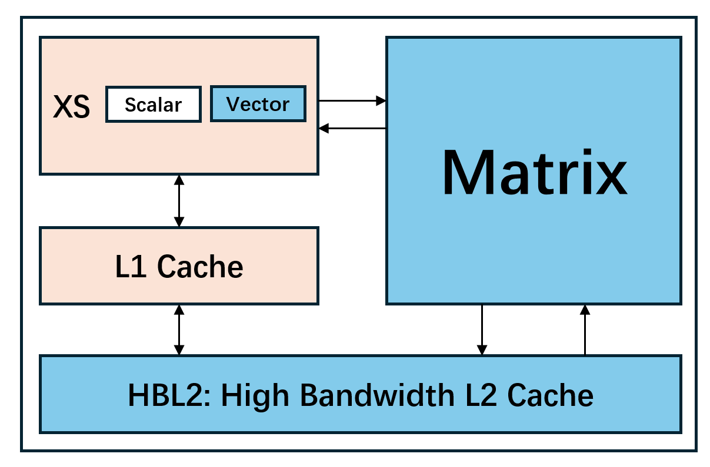
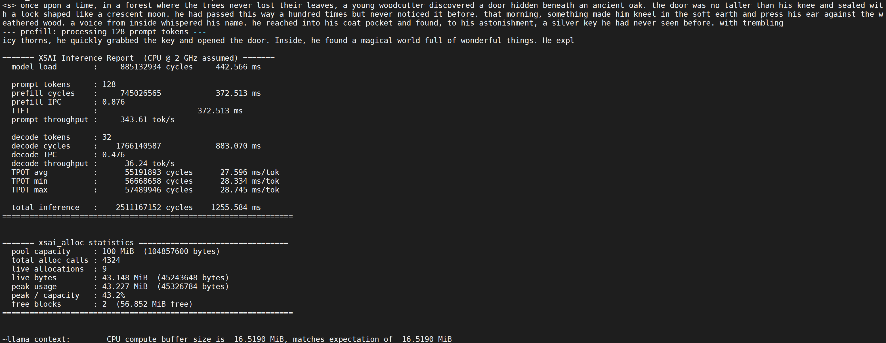

# 【香山双周报 101】20260427 期

欢迎来到香山双周报专栏，我们将通过这一专栏定期介绍香山的开发进展。本次是第 101 期双周报。

不知不觉间，香山双周报已经来到了第 100 期！在这个特殊的时刻，香山项目也迎来了一位重要的新成员：香山AI（XSAI），一个基于香山开源高性能 RISC-V 处理器实现的“通推一体”AI 处理器。从本期开始，双周报将包含 XSAI 的开发进展。

XSAI 是香山团队基于已有 RISC-V CPU 生态积累基础上，对于“通推一体” AI 芯片的探索，也是对香山敏捷开发方法学的实践。北京开源芯片研究院与中国科学院计算技术研究所微处理器研究中心、先进计算机系统研究中心共同参与了 XSAI 的开发。和香山一样，XSAI 也是一个完全开源的项目，其仓库地址为 <https://github.com/OpenXiangShan/XSAI>。我们将在 2026 年逐步发布指令扩展手册、架构文档、用户手册，并且开源我们的开发工具链。

另外，我们向大家提前预告，在 6 月底于美国罗利举办的 ISCA 2026 的香山 tutorial 中，也将首次包含 XSAI“通推一体”处理器的内容，欢迎大家来玩！

关于香山核近期开发进展，前端优化了分支预测器的时序，后端和访存继续修复了一些 bug，并继续推进模块的重构与测试。

<!-- more -->

## XSAI

如果大家还记得，我们在 2025 年 RISC-V 中国峰会上有过 XSAI 的专题介绍（[《XSAI：以 CPU 的编程范式支持现代 LLM 核函数》](https://github.com/OpenXiangShan/Talks-and-Publications/blob/master/slides/20250716%260718-RVSC-XSAI%EF%BC%9A%E4%BB%A5CPU%E7%9A%84%E7%BC%96%E7%A8%8B%E8%8C%83%E5%BC%8F%E6%94%AF%E6%8C%81%E7%8E%B0%E4%BB%A3LLM%E6%A0%B8%E5%87%BD%E6%95%B0.pdf)），现在的 XSAI 正是这一报告持续演进的结果。

目前 XSAI 基于昆明湖 V2R2 开发，型号名称是昆明湖 V2R2A。相比昆明湖 V2R2，昆明湖 V2R2A 将会在以下几个方面新增特性：

- 向量：XSAI 的向量单元将积极支持 AI 常用的低精度数据类型以及特殊函数。V2R2A 计划支持 bf16 以及 fp8 数据类型，并且支持 exp2 运算以加速大模型中的 softmax。
- 矩阵：XSAI 的矩阵模块受昆明湖核的控制，直接与 L2 缓存交互，存取矩阵数据。V2R2A 的矩阵模块仍在迭代中，最终将会支持 bf16/fp8/int8 矩阵乘加运算。未来的 XSAI 还会支持 mxfp8/mxfp4 等数据类型。矩阵模块的指令大多属于异步指令，能够与昆明湖核内的向量运算同时执行，从而达到更高的算力利用率。
- 缓存：XSAI 面向矩阵计算与高性能 CPU 协同场景，引入了高带宽 L2 缓存（HBL2）设计。HBL2 的目标参数为 1-2MB 的容量以及 256-512 Bytes/cycle 的带宽。针对 coherent cache 与 GEMM 并行运行时的一致性开销，XSAI 进一步采用更贴合矩阵数据流的访问语义与权限策略，从而提高带宽的利用率。

XSAI 组近期进行了一些初步测试，这些测试意在验证 XSAI 的通算、智算功能。

我们使用 SPEC CPU 2006 测试 XSAI 的通算功能。本次测试使用的 checkpoint、处理器参数以及 SoC 参数与香山双周报 91 一致。

| SPECint 2006 @ 3GHz. | V2R2A  |  V2R2  | SPECfp 2006 @ 3GHz | V2R2A | V2R2  |
| :------------------- | :----: | :----: | :----------------- | :---: | :---: |
| 400.perlbench        | 36.03  | 36.18  | 410.bwaves         | 67.35 | 66.73 |
| 401.bzip2            | 25.75  | 25.46  | 416.gamess         | 40.61 | 40.99 |
| 403.gcc              | 48.15  | 48.00  | 433.milc           | 44.38 | 45.12 |
| 429.mcf              | 63.26  | 60.63  | 434.zeusmp         | 51.65 | 51.61 |
| 445.gobmk            | 30.30  | 30.32  | 435.gromacs        | 33.50 | 33.60 |
| 456.hmmer            | 41.35  | 41.62  | 436.cactusADM      | 46.06 | 46.19 |
| 458.sjeng            | 30.25  | 30.24  | 437.leslie3d       | 48.31 | 47.97 |
| 462.libquantum       | 126.54 | 122.43 | 444.namd           | 28.82 | 28.86 |
| 464.h264ref          | 56.49  | 56.58  | 447.dealII         | 73.37 | 73.55 |
| 471.omnetpp          | 42.32  | 41.77  | 450.soplex         | 52.85 | 52.50 |
| 473.astar            | 29.23  | 29.19  | 453.povray         | 53.05 | 53.46 |
| 483.xalancbmk        | 71.39  | 72.84  | 454.Calculix       | 16.35 | 16.37 |
| GEOMEAN              | 44.92  | 44.66  | 459.GemsFDTD       | 38.31 | 38.60 |
|                      |        |        | 465.tonto          | 36.65 | 36.66 |
|                      |        |        | 470.lbm            | 91.30 | 91.94 |
|                      |        |        | 481.wrf            | 40.25 | 40.70 |
|                      |        |        | 482.sphinx3        | 48.88 | 49.13 |
|                      |        |        | GEOMEAN            | 44.72 | 44.85 |

> 解读：V2R2A 频率 3GHz 仅代表仿真设置，该设置与 V2R2 的仿真对齐，以确认 XSAI 的修改没有导致性能显著倒退。我们预期的 XSAI 频率低于 3GHz。在通算场景下，导致性能差异的因素是高带宽 L2 的架构设计以及缓存替换算法的改变。上述测试结果表明，XSAI 对香山的修改没有显著影响香山原有的通算功能与性能。

在智算测试方面，我们在 XCVU19p FPGA 上，使用经过裁剪的 V2R2A 运行了 Llama-2 15M 模型的推理。XSAI 频率 50MHz，矩阵 int8 算力 4Tops/GHz，内存 DDR4-2400。测试得到的 Prefill/Decode 阶段性能分别是 343.61 toks/s 与 36.24 toks/s，输出符合预期。

> 解读：测试使用的内存频率为 2400MT/s，而 XSAI 的频率为 50MHz，利用 50MHz 的数据推算 2GHz 下的数据，会存在等效内存频率偏高的问题。从这方面来讲，本次测试的结果偏乐观。但是 V2R2A 为了部署在 XCVU19p 上做了不少裁剪，对性能不利，从这方面来讲，本次测试的结果又是偏悲观的。因此，本次测试仅作为功能方面的原型测试，证明 XSAI 在功能上支持大模型推理。

## 近期进展

### 前端

- RTL 新特性
  - 启用 SC Backward 表（[#5796](https://github.com/OpenXiangShan/XiangShan/pull/5796)）
- Bug 修复
  - 修复 S1 级 RAS 在 S3 override 时栈顶地址用错的问题（[#5680](https://github.com/OpenXiangShan/XiangShan/pull/5680)）
- PPA 优化
  - 去除存储在 FTQ 的 SC 训练元数据，改为更新时读，节省面积（[#5819](https://github.com/OpenXiangShan/XiangShan/pull/5819)）
  - 解耦 TAGE 跳转计数器和 useful 计数器的写入，节省功耗（[#5782](https://github.com/OpenXiangShan/XiangShan/pull/5782)）
  - 修复 BPU S3 多条时序路径（[#5797](https://github.com/OpenXiangShan/XiangShan/pull/5797)）
  - 修复 SC 预测时序路径（[#5843](https://github.com/OpenXiangShan/XiangShan/pull/5843)）
  - 修复 FTQ 重定向及分支 resolve 时序路径（[#5835](https://github.com/OpenXiangShan/XiangShan/pull/5835)）
- 代码质量
  - 删除未使用的 V2 工具类（[#5821](https://github.com/OpenXiangShan/XiangShan/pull/5821)）

### 后端

- RTL 新特性
  - 将整型 RegCache 的大小增加到 24 以支持 6 alu 的配置（[#5613](https://github.com/OpenXiangShan/XiangShan/pull/5613)）
  - 修改 vsetvl x0, x0 使得 reserved 情况表现与 Spike 一致（[#5744](https://github.com/OpenXiangShan/XiangShan/pull/5744)）
- Bug 修复
  - 在 critical-error 的 debug 重入口维持 dpc（[#5730](https://github.com/OpenXiangShan/XiangShan/pull/5730)）
  - 同步修复 V2 的 debug 相关 bug（[#5754](https://github.com/OpenXiangShan/XiangShan/pull/5754)）
  - 修复 Mcontrol6/Tdata1 相关问题（[#5722](https://github.com/OpenXiangShan/XiangShan/pull/5722)）
  - 修复 TopDown 当中的 mis_pred 和 total_flush（[#5762](https://github.com/OpenXiangShan/XiangShan/pull/5762)）
  - 修复 Bypass 中 psrcVl 的驱动为 pdestVl（[#5743](https://github.com/OpenXiangShan/XiangShan/pull/5743)）
- 时序优化
  - 优化 Rename 的时序（[#5685](https://github.com/OpenXiangShan/XiangShan/pull/5685)）
- 代码质量
  - 重命名 halt 为 wfi（[#4512](https://github.com/OpenXiangShan/XiangShan/pull/4512)）

### 访存与缓存

- RTL 新特性
  - MMU、L2 等模块重构与测试持续推进中
  - 优化了 Stream 预取器，启用了 decr 模式并优化了训练策略（[#5691](https://github.com/OpenXiangShan/XiangShan/pull/5691)）
  - 修改了 TL2CHICoupledL2 顶层模块的接口，将 io_cpu_halt 改为 io_cpu_wfi（[CoupledL2 #482](https://github.com/OpenXiangShan/CoupledL2/pull/482)）
  - 新增了 NextLine 预取器（[CoupledL2 #477](https://github.com/OpenXiangShan/CoupledL2/pull/477)）
- Bug 修复
  - 修复了 StoreQueue 中 deqPtr 过早移动的问题（[#5748](https://github.com/OpenXiangShan/XiangShan/pull/5748)）
  - 修复了 pbmt 与 hypervisor 访问设备区域时的一些问题（[#5751](https://github.com/OpenXiangShan/XiangShan/pull/5751)）
  - 修复了 unalignedHead 重发时卡死的问题（[#5783](https://github.com/OpenXiangShan/XiangShan/pull/5783)）
- 代码质量
  - 重构了 storeEvent 的相关 Bundle（[#5763](https://github.com/OpenXiangShan/XiangShan/pull/5763)）
  - 重构 CoupledL2，OpenLLC，HuanCun 仓库之间的依赖关系。进行中
- 时序修复
  - 修复了 StoreQueue 的时序问题（[#5698](https://github.com/OpenXiangShan/XiangShan/pull/5698)）

### XSAI

- RTL 新特性
  - 正在测试矩阵模块的 FP8 精度支持
  - 正在评估矩阵模块的 8 通道访存
  - 正在与后端组配合实现 BF16 标量与向量
- 代码质量
  - 优化了 XSAI 的参数系统（[XSAI #59](https://github.com/OpenXiangShan/XSAI/pull/59)）
- 调试工具
  - NEMU 新增 BF16 扩展支持（[NEMU #995](https://github.com/OpenXiangShan/NEMU/pull/995)）
  - HBL2 测试兼容多核环境

## 性能评估

处理器及 SoC 参数如下所示：

| 参数      | 选项       |
| --------- | ---------- |
| commit    | 5623d8c51  |
| 日期      | 2026/04/10 |
| L1 ICache | 64KB       |
| L1 DCache | 64KB       |
| L2 Cache  | 1MB        |
| L3 Cache  | 16MB       |
| 访存单元  | 3ld2st     |
| 总线协议  | CHI        |
| 内存配置  | DDR4-3200  |

性能数据如下所示：

| SPECint 2006 @ 3GHz | GCC15  |  XSCC  | SPECfp 2006 @ 3GHz | GCC15  |  XSCC  |
| :------------------ | :----: | :----: | :----------------- | :----: | :----: |
| 400.perlbench       | 48.46  | 47.52  | 410.bwaves         | 85.07  | 89.73  |
| 401.bzip2           | 27.54  | 28.34  | 416.gamess         | 57.00  | 53.07  |
| 403.gcc             | 55.36  | 38.89  | 433.milc           | 64.79  | 63.91  |
| 429.mcf             | 60.93  | 56.03  | 434.zeusmp         | 70.40  | 64.16  |
| 445.gobmk           | 39.33  | 40.54  | 435.gromacs        | 36.44  | 34.31  |
| 456.hmmer           | 53.78  | 64.07  | 436.cactusADM      | 75.68  | 86.41  |
| 458.sjeng           | 39.51  | 39.83  | 437.leslie3d       | 56.40  | 56.59  |
| 462.libquantum      | 135.75 | 294.37 | 444.namd           | 42.72  | 44.81  |
| 464.h264ref         | 62.95  | 71.43  | 447.dealII         | 64.62  | 69.22  |
| 471.omnetpp         | 41.12  | 39.44  | 450.soplex         | 51.90  | 62.70  |
| 473.astar           | 31.07  | 30.13  | 453.povray         | 73.10  | 67.30  |
| 483.xalancbmk       | 74.63  | 84.42  | 454.Calculix       | 43.80  | 39.64  |
| GEOMEAN             | 50.96  | 54.19  | 459.GemsFDTD       | 63.12  | 63.56  |
|                     |        |        | 465.tonto          | 52.39  | 34.99  |
|                     |        |        | 470.lbm            | 126.14 | 131.79 |
|                     |        |        | 481.wrf            | 55.03  | 41.57  |
|                     |        |        | 482.sphinx3        | 58.52  | 61.07  |
|                     |        |        | GEOMEAN            | 60.80  | 58.98  |

编译参数如下所示：

| 参数             | GCC15       | XSCC                |
| ---------------- | ----------- | ------------------- |
| 编译器           | gcc15       | xscc                |
| 编译优化         | O3          | O3                  |
| 内存库           | jemalloc    | jemalloc            |
| -march           | RV64GCB     | RV64GCB             |
| -ffp-contraction | fast        | fast                |
| 链接优化         | -flto       | -flto               |
| 浮点优化         | -ffast-math | -ffast-math         |
| -mcpu            | -           | xiangshan-kunminghu |

注：我们使用 SimPoint 对程序进行采样，基于我们自定义的 checkpoint 格式制作检查点镜像，Simpoint 聚类的覆盖率为 100%。上述分数为基于程序片段的分数估计，非完整 SPEC CPU2006 评估，和真实芯片实际性能可能存在偏差。

## 相关链接

- 香山技术讨论 QQ 群：879550595
- 香山技术讨论网站：<https://github.com/OpenXiangShan/XiangShan/discussions>
- 香山文档：<https://xiangshan-doc.readthedocs.io/>
- 香山用户手册：<https://docs.xiangshan.cc/projects/user-guide/>
- 香山设计文档：<https://docs.xiangshan.cc/projects/design/>

编辑：徐之皓、吉骏雄、陈卓、余俊杰、孙际儒、李衍君
