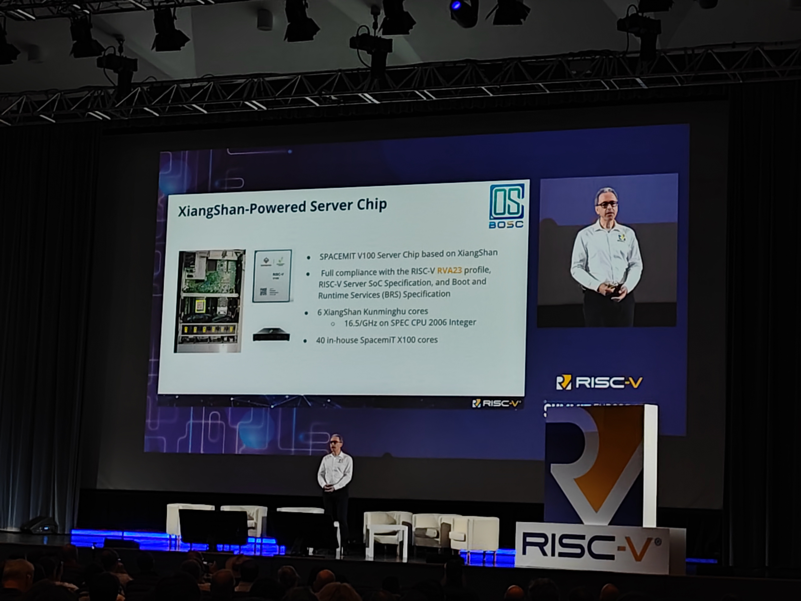
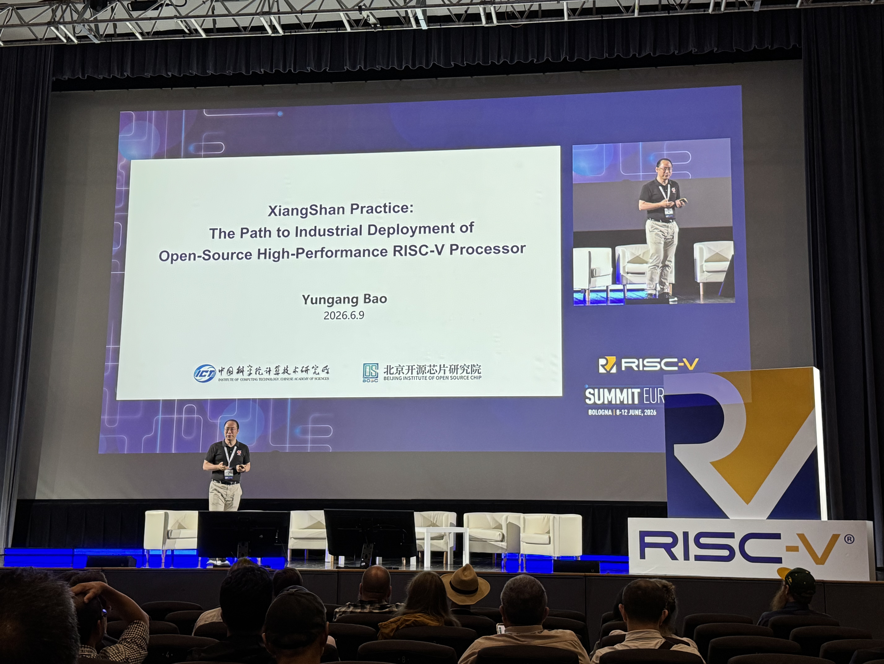
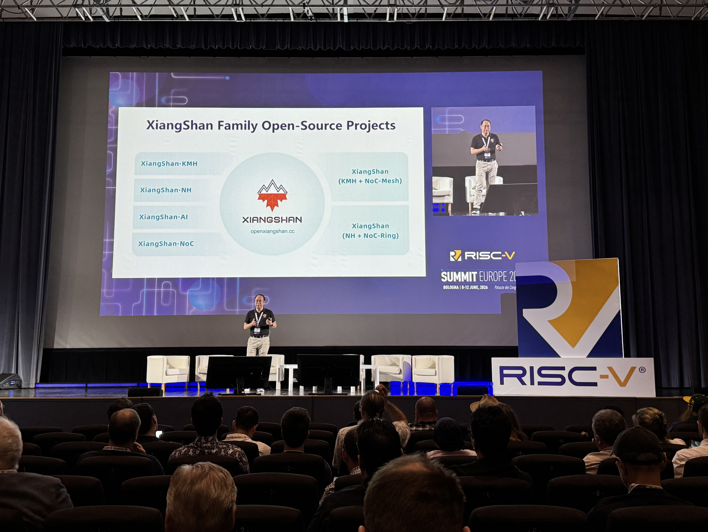
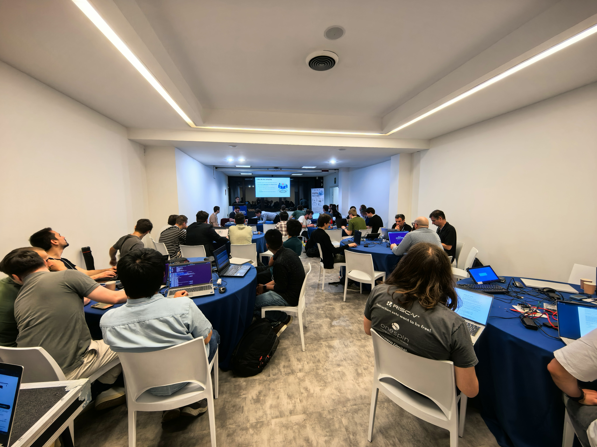

# [XiangShan Biweekly 105] 20260623

Welcome to XiangShan biweekly column! Through this column, we will regularly share the latest development progress of XiangShan. This is the 105th issue of the biweekly report.

We are very excited to share with you an important component in the "XiangShan" + "Ruyi" ecosystem: RuyiSDK! This is a one-stop development resource management platform for RISC-V architecture, which integrates toolchains, simulators, runtime environments, and debugging tools based on the ruyi package manager and IDE plugin system, providing full-process development support. The platform has built a comprehensive matrix of RISC-V development boards and operating system support, providing developers with a more convenient operating experience and serving as an important infrastructure for promoting RISC-V development and ecosystem construction.

You can get more information through the following links:

- RuyiSDK official website: <https://ruyisdk.org/>
- RuyiSDK developer community: <https://ruyisdk.cn/>

RISC-V European Summit is ongoing! The XiangShan team has multiple talks and posters at the summit, and the detailed schedule can be found [here](https://mp.weixin.qq.com/s/gNpOxypE4UKLWLr2H103Yg).

In the opening report of the RISC-V International, CEO Andrea Gallo introduced the application of XiangShan in high-performance server scenarios.

Deputy Director of the Institute of Computing Technology, Chinese Academy of Sciences, and Chief Scientist of Beijing Open Source Chip Research Institute, Researcher Bao Yungang gave a report titled "XiangShan Practice: The Path to Industrial Deployment of Open-Source High-Performance RISC-V Processor", introducing the industrial deployment path of XiangShan.

We also held the workshop of Unity Chip for the first time, sharing with everyone the exploration and practice of software-native open-source chip intelligent crowdsourcing verification.

Regarding the recent development progress of XiangShan, the frontend continues to optimize timing while reducing redirect latency; the backend implements some new features and instruction set extensions; the memory subsystem fixes some bugs while optimizing L2 timing; XSAI optimizes code structure while advancing HBL2 support for CHI.

<!-- more -->

## Recent Developments

### Frontend

- RTL features
  - Read the corresponding FTQ entry of a redirect request in advance, optimizing timing and reducing redirect latency ([#5990](https://github.com/OpenXiangShan/XiangShan/pull/5990))
- Bug fixes
  - Fix the issue introduced by UBTB timing optimization, which treats overwritten entries as hits and causes incorrect predictions ([#6009](https://github.com/OpenXiangShan/XiangShan/pull/6009))
- PPA optimizations
  - Optimize the timing of IBuffer enqueue logic ([#5946](https://github.com/OpenXiangShan/XiangShan/pull/5946))

### Backend

- RTL features
  - Use sparse vector (SparseVec) for the structure of exception vector ([#5738](https://github.com/OpenXiangShan/XiangShan/pull/5738))
  - Sdtrig extension support tdata3 ([#5983](https://github.com/OpenXiangShan/XiangShan/pull/5983))

### MemBlock and Cache

- Bug fixes
  - Fix bug of fullOverlap when store is cross16B ([#6003](https://github.com/OpenXiangShan/XiangShan/pull/6003))
- PPA optimizations
  - Split L2 prefetch request queue by slices, reducing blocking between different slices ([XSCache #13](https://github.com/OpenXiangShan/XSCache/pull/13))
- Code refactoring
  - Move prefetch from loadUnit to mainPipe ([#5997](https://github.com/OpenXiangShan/XiangShan/pull/5997))

### XSAI

- RTL features
  - Add an option to disable data types with scaling factors, such as mxfp8. When these data types are disabled, modules that handle scaling factors will not be instantiated ([CUTE #13](https://github.com/OpenXiangShan/CUTE/pull/13))
  - Add a set of matrix performance events for CUTE ([CUTE #18](https://github.com/OpenXiangShan/CUTE/pull/18))
  - Continue advancing HBL2 support for the CHI bus protocol
- Bug fixes
  - Fix the performance event numbers of XSAI V2R2A and align them with the event numbers of Kunminghu V2R2 ([XSAI #70](https://github.com/OpenXiangShan/XSAI/pull/70))
  - Fix the issue where matrix functional unit exceptions were not handled by ROB ([XSAI #71](https://github.com/OpenXiangShan/XSAI/pull/71))
- Code refactoring
  - Refactor CUTE scheduling ([CUTE #14](https://github.com/OpenXiangShan/CUTE/pull/14))

## Performance Evaluation

Processor and SoC parameters are as follows:

| Parameters           | Options    |
| -------------------- | ---------- |
| Commit               | 9443d04bd  |
| Date                 | 2026/06/05 |
| L1 ICache            | 64KB       |
| L1 DCache            | 64KB       |
| L2 Cache             | 2MB        |
| L3 Cache             | 16MB       |
| LSU                  | 3ld2st     |
| Bus protocol         | CHI        |
| Memory configuration | DDR4-3200  |

The SPEC CPU2006 scores are as follows:

| SPECint 2006 @ 3GHz | GCC15  |  XSCC  | SPECfp 2006 @ 3GHz | GCC15  |  XSCC  |
| :------------------ | :----: | :----: | :----------------- | :----: | :----: |
| 400.perlbench       | 48.42  | 47.53  | 410.bwaves         | 85.27  | 89.88  |
| 401.bzip2           | 27.43  | 28.28  | 416.gamess         | 57.05  | 53.23  |
| 403.gcc             | 55.26  | 38.88  | 433.milc           | 64.93  | 64.04  |
| 429.mcf             | 61.00  | 55.47  | 434.zeusmp         | 71.27  | 64.66  |
| 445.gobmk           | 38.94  | 40.10  | 435.gromacs        | 37.20  | 34.38  |
| 456.hmmer           | 54.38  | 64.72  | 436.cactusADM      | 76.13  | 87.68  |
| 458.sjeng           | 38.87  | 39.48  | 437.leslie3d       | 56.26  | 56.36  |
| 462.libquantum      | 136.67 | 294.84 | 444.namd           | 43.23  | 45.23  |
| 464.h264ref         | 63.46  | 71.99  | 447.dealII         | 64.25  | 68.39  |
| 471.omnetpp         | 41.07  | 39.47  | 450.soplex         | 52.12  | 63.93  |
| 473.astar           | 30.42  | 29.63  | 453.povray         | 73.34  | 65.77  |
| 483.xalancbmk       | 75.83  | 84.61  | 454.Calculix       | 43.74  | 39.61  |
| GEOMEAN             | 50.90  | 54.07  | 459.GemsFDTD       | 63.50  | 63.95  |
|                     |        |        | 465.tonto          | 52.59  | 35.01  |
|                     |        |        | 470.lbm            | 125.82 | 133.04 |
|                     |        |        | 481.wrf            | 54.96  | 41.58  |
|                     |        |        | 482.sphinx3        | 59.39  | 62.42  |
|                     |        |        | GEOMEAN            | 61.07  | 59.18  |

Compilation parameters are as follows:

| Parameters                  | GCC15       | XSCC                |
| --------------------------- | ----------- | ------------------- |
| Compiler                    | gcc15       | xscc                |
| Optimization level          | O3          | O3                  |
| Memory library              | jemalloc    | jemalloc            |
| -march                      | RV64GCB     | RV64GCB             |
| -ffp-contraction            | fast        | fast                |
| Linker optimization         | -flto       | -flto               |
| Floating-point optimization | -ffast-math | -ffast-math         |
| -mcpu                       | -           | xiangshan-kunminghu |

Note: We use SimPoint to sample the programs and create checkpoint images based on our custom checkpoint format, with a SimPoint clustering coverage of 100%. The above scores are estimates based on program segments, not full SPEC CPU2006 evaluations, and may differ from actual chip performance.

## Related links

- XiangShan technical discussion QQ group: 879550595
- XiangShan technical discussion website: <https://github.com/OpenXiangShan/XiangShan/discussions>
- XiangShan Documentation: <https://docs.xiangshan.cc/>
- XiangShan User Guide: <https://docs.xiangshan.cc/projects/user-guide/>
- XiangShan Design Doc: <https://docs.xiangshan.cc/projects/design/>

Editors: Zhihao Xu, Junxiong Ji, Zhuo Chen, Jiru Sun, Yanjun Li
