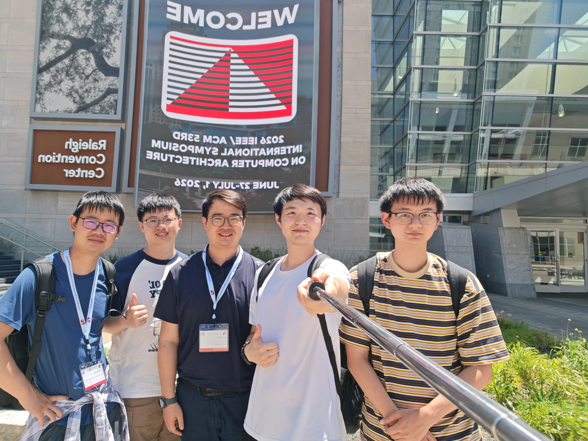
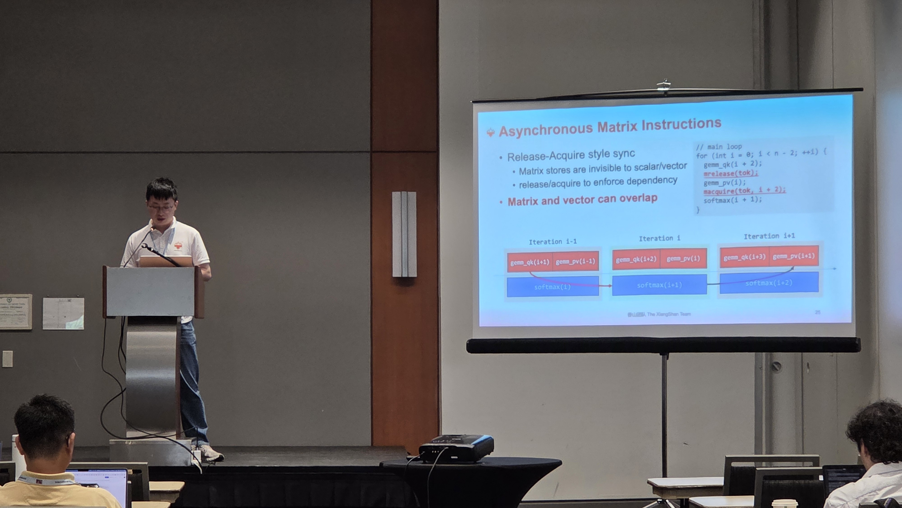
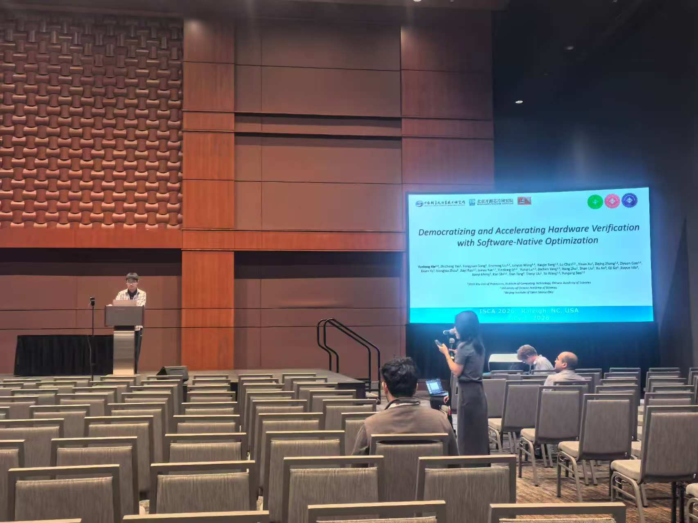

# 【香山双周报 107】20260720 期

欢迎来到香山双周报专栏，我们将通过这一专栏定期介绍香山的开发进展。本次是第 107 期双周报。

ISCA 2026 香山 tutorial ~~不那么~~顺利举办！虽然一些同学因为签证原因没能现场报告，但我们紧急召集了替补，最终保证了 tutorial 高质量完成。特别感谢每一位关注香山发展的伙伴们！

关于香山近期开发进展，访存与缓存方面修复了 LoadPipe、Sbuffer、MissQueue 和 StoreQueue 的多个问题，新增了预分配 StoreQueue 和快速唤醒支持；XSCache 更新了 L1-L2 总线接口。

<!-- more -->

## Tutorial 与会议花絮

- 合影镇楼。只有左一的幸运儿在会议开始前 2 天及时拿到了签证，其他老师与同学用的都是已有的签证
  
- XSAI 首次在 tutorial 中亮相，吸引了广泛关注
  
  
- 万众一芯论文报告
  

## 近期进展

### 前端

- Bug 修复
  - 修复 ITTAGE 预测器在备选预测无效时使用备选预测目标，导致计数器更新错误的问题（[#6167](https://github.com/OpenXiangShan/XiangShan/pull/6167)）
  - 修复 FTQ 清理 V2 遗留代码时未正确处理 backendExceptionPtr，导致跳转到违反 Sv39/48 规范的虚拟地址时，未正确报告异常的问题（[#6235](https://github.com/OpenXiangShan/XiangShan/pull/6235)）
  - 修复 IFU 处理 MMIO 区域内单条跨过页边界的 RVI 指令时，offset 及重定向目标计算有误，导致 xtval/xepc 计算错误、取指跳过部分指令数据的问题（[#6213](https://github.com/OpenXiangShan/XiangShan/pull/6213)）
- PPA 优化
  - 解耦 FTQ resolveQueue 入队逻辑和 redirect 冲刷逻辑，避免两者串联导致的时序路径过长（[#6239](https://github.com/OpenXiangShan/XiangShan/pull/6239)）
  - 移除 ICache wayLookup bypass 逻辑，避免 metaArray 到 dataArray 的 SRAM2SRAM 时序路径（[#6044](https://github.com/OpenXiangShan/XiangShan/pull/6044)）
  - 后移 ICache parity 校验逻辑，避免 dataArray SRAM 直出后立刻做校验导致的时序路径过长（[#5733](https://github.com/OpenXiangShan/XiangShan/pull/5733)）
- 调试工具
  - 新增一些 rolling 计数器，用于分析性能指标随时间变化（[#6193](https://github.com/OpenXiangShan/XiangShan/pull/6193)）

### 后端

- Bug 修复
  - （V2）修复 `mstatus.MDT` 与 `mnstatus.NMIE` 复位值、`mnstatus.NMIE` 写 0 行为，以及 `m/siprios` 掩码逻辑（[#6100](https://github.com/OpenXiangShan/XiangShan/pull/6100)）
  - （V3）同步 `mstatus.MDT` 与 `mnstatus.NMIE` 相关修复（[#6223](https://github.com/OpenXiangShan/XiangShan/pull/6223)）
  - （V2）修复 RISC-V Debug Spec 1.0 相关 CSR 行为，包括 trigger 版本、`dcsr.NMIP` 更新与 `dcsr.CAUSE` 优先级（[#6104](https://github.com/OpenXiangShan/XiangShan/pull/6104)）
  - （V2）修复 `vstopi` 中 VSEI 优先级索引映射错误的问题（[#6131](https://github.com/OpenXiangShan/XiangShan/pull/6131)）
- 调试工具
  - （V2）新增 `cpu_cycle` 与 `ref_cpu_cycle` 性能计数事件，并为系统计数器路径加入异步桥接（[#6180](https://github.com/OpenXiangShan/XiangShan/pull/6180)）
  - （V2）修复 `frontend_stall_cycle` 性能事件统计条件，并补充 `backend_stall_cycle` 统计（[#6121](https://github.com/OpenXiangShan/XiangShan/pull/6121)）
- 代码同步
  - （V3）将近期 V2 后端修复同步到 V3，包括 CSR、中断、PMP/PMA、调试模式和性能事件相关修复（[#6243](https://github.com/OpenXiangShan/XiangShan/pull/6243)）

### 访存与缓存

- RTL 新特性
  - 支持预分配 StoreQueue，便于提前建立存储请求（[#5834](https://github.com/OpenXiangShan/XiangShan/pull/5834)）
  - 为 C_MA 与 C_FF 增加 LoadQueueReplay 快速唤醒支持（[#6092](https://github.com/OpenXiangShan/XiangShan/pull/6092)）
  - 将 L1-L2 TileLink 总线改为双端口，减少两级缓存之间的访问阻塞（[XSCache #16](https://github.com/OpenXiangShan/XSCache/pull/16)）
- Bug 修复
  - 修复 LoadPipe 在 s2 被 kill 时错误更新 s3 命中 meta 的问题（[#6185](https://github.com/OpenXiangShan/XiangShan/pull/6185)）
  - 修复 Sbuffer CMO drain 的空检查逻辑（[#6183](https://github.com/OpenXiangShan/XiangShan/pull/6183)）
  - 修复 MissQueue 的 `nMaxPrefetchEntry` 逻辑（[#6197](https://github.com/OpenXiangShan/XiangShan/pull/6197)）
  - 修复 `cbo.zero` 写入 Sbuffer 的问题（[#6228](https://github.com/OpenXiangShan/XiangShan/pull/6228)）
  - 移除 MissQueue 中错误的 XSError（[#6241](https://github.com/OpenXiangShan/XiangShan/pull/6241)）

### XSAI

- Bug 修复
  - 修复了 load/store whole C 指令的控制信号（[XSAI #86](https://github.com/OpenXiangShan/XSAI/pull/86)）
- RTL 新特性
  - 可配置的 CUTE 多通道访存（[XSAI #83](https://github.com/OpenXiangShan/XSAI/pull/83)）
  - 缓存系统使用 XSAICache 仓库替代原有的 coupledL2/huancun/openLLC（[XSAI #85](https://github.com/OpenXiangShan/XSAI/pull/85)）
- 代码质量
  - 对近期 CUTE 新增的调试输出添加控制开关（[CUTE #24](https://github.com/OpenXiangShan/CUTE/pull/24)、[CUTE #27](https://github.com/OpenXiangShan/CUTE/pull/27)）
- 调试工具
  - uop 的生命周期 trace 分析（[XSAI #84](https://github.com/OpenXiangShan/XSAI/pull/84)）

## 性能评估

处理器及 SoC 参数如下所示：

| 参数      | 选项       |
| --------- | ---------- |
| commit    | 59ef4ea7d  |
| 日期      | 2026/07/03 |
| L1 ICache | 64KB       |
| L1 DCache | 64KB       |
| L2 Cache  | 2MB        |
| L3 Cache  | 16MB       |
| 访存单元  | 3ld2st     |
| 总线协议  | CHI        |
| 内存配置  | DDR4-3200  |

性能数据如下所示：

| SPECint 2006 @ 3GHz | GCC15  |  XSCC  | SPECfp 2006 @ 3GHz | GCC15  |  XSCC  |
| :------------------ | :----: | :----: | :----------------- | :----: | :----: |
| 400.perlbench       | 51.19  | 50.90  | 410.bwaves         | 116.08 | 104.81 |
| 401.bzip2           | 29.85  | 30.51  | 416.gamess         | 58.05  | 55.30  |
| 403.gcc             | 56.10  | 40.67  | 433.milc           | 70.32  | 69.31  |
| 429.mcf             | 70.05  | 62.69  | 434.zeusmp         | 77.83  | 67.38  |
| 445.gobmk           | 40.11  | 41.89  | 435.gromacs        | 38.20  | 34.94  |
| 456.hmmer           | 55.33  | 67.72  | 436.cactusADM      | 80.45  | 92.49  |
| 458.sjeng           | 40.66  | 41.54  | 437.leslie3d       | 60.27  | 60.78  |
| 462.libquantum      | 138.14 | 307.82 | 444.namd           | 43.31  | 45.56  |
| 464.h264ref         | 70.11  | 75.34  | 447.dealII         | 74.19  | 74.80  |
| 471.omnetpp         | 43.74  | 43.17  | 450.soplex         | 59.17  | 71.65  |
| 473.astar           | 33.73  | 33.05  | 453.povray         | 76.48  | 69.48  |
| 483.xalancbmk       | 83.35  | 92.95  | 454.Calculix       | 42.84  | 40.82  |
| GEOMEAN             | 54.22  | 57.95  | 459.GemsFDTD       | 68.28  | 65.83  |
|                     |        |        | 465.tonto          | 53.95  | 37.31  |
|                     |        |        | 470.lbm            | 128.22 | 146.35 |
|                     |        |        | 481.wrf            | 61.43  | 44.92  |
|                     |        |        | 482.sphinx3        | 61.15  | 63.82  |
|                     |        |        | GEOMEAN            | 65.52  | 62.92  |

编译参数如下所示：

| 参数             | GCC15       | XSCC                |
| ---------------- | ----------- | ------------------- |
| 编译器           | gcc15       | xscc                |
| 编译优化         | O3          | O3                  |
| 内存库           | jemalloc    | jemalloc            |
| -march           | RV64GCB     | RV64GCB             |
| -ffp-contraction | fast        | fast                |
| 链接优化         | -flto       | -flto               |
| 浮点优化         | -ffast-math | -ffast-math         |
| -mcpu            | -           | xiangshan-kunminghu |

注：我们使用 SimPoint 对程序进行采样，基于我们自定义的 checkpoint 格式制作检查点镜像，Simpoint 聚类的覆盖率为 100%。上述分数为基于程序片段的分数估计，非完整 SPEC CPU2006 评估，和真实芯片实际性能可能存在偏差。

## 相关链接

- 香山技术讨论 QQ 群：879550595
- 香山技术讨论网站：<https://github.com/OpenXiangShan/XiangShan/discussions>
- 香山文档：<https://docs.xiangshan.cc/>
- 香山用户手册：<https://docs.xiangshan.cc/projects/user-guide/>
- 香山设计文档：<https://docs.xiangshan.cc/projects/design/>

编辑：徐之皓、吉骏雄、陈卓、孙际儒、李衍君
