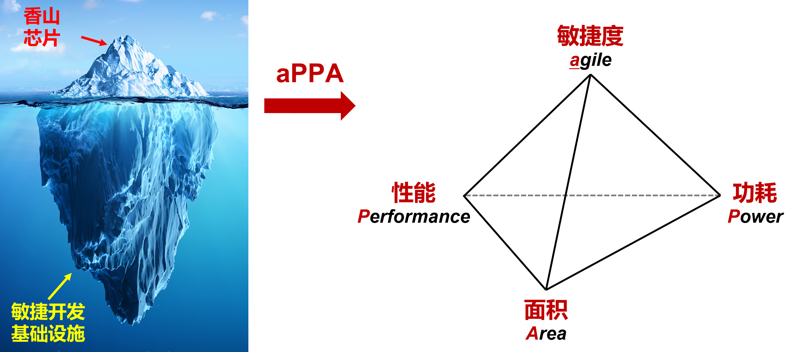

# 【香山双周报 109】基础设施专题：敏捷芯片开发平台

欢迎来到香山双周报专栏，我们将通过这一专栏定期介绍香山的开发进展。本次是第 109 期双周报。

本期双周报特别推出基础设施专题，重点介绍香山团队围绕电路描述语言、功能验证和性能探索建设的敏捷芯片开发平台。同时从本期开始，双周报将包含基础设施方面的工作进展。

关于香山近期开发进展：前端持续修复问题并优化关键路径时序；后端新增指针掩码扩展等特性，并扩展了 TopDown 分析；访存与缓存集成了 L2 CDP 预取器，同时修复了若干 bug；XSAI 支持多精度转置 load，并完善多通道 DiffTest 与 MMA 调试能力。

<!-- more -->

## 基础设施：敏捷芯片开发平台

香山团队提出开源芯片研发的“冰山模型”理念，改变传统以性能表现（PPA：频率、功耗、面积）为核心导向的芯片设计方法，发展形成一套兼顾性能与敏捷度（agile：时间、成本、复杂度）的设计新方法，既关注水面之上的芯片研发成果，也重视水面以下的芯片开发基础设施。团队围绕电路描述语言、功能验证、性能探索三个方面建设敏捷开发平台，缩短从设计实现、负载运行到问题定位的周期。

电路描述语言方面，香山团队采用 Chisel 硬件构建语言描述处理器芯片设计。针对多核设计中重复构建、编译耗时较长和中间信号难以保留等问题，团队从 Chisel 编译链路入手，探索多核 RTL 复用、编译流程加速和中间信号保留等能力，提升电路构建的速度、易用性和可靠性。

功能验证方面，香山团队建立待测设计（XiangShan）与参考模型（NEMU）对比的差分测试框架（DiffTest），通过逐指令的体系结构状态对比，快速发现并定位处理器功能缺陷。近期工作包含：

- FPGA 验证加速：基于 FPGA 加速待测设计电路仿真，并与软件侧参考模型进行差分测试。已形成支持昆明湖 v2 系统级验证的 FPGA DiffTest 方案，支持 Linux、SPECCPU 等复杂测试负载。支持捕获出错指令前数百万周期波形，当前运行速度 5~10 MHz，相较软件仿真实现 1000 倍以上的速度提升。
- 多核验证算法：针对既有多核 DiffTest 出现的部分假阳性问题，完善多核访存事件的检查算法，支持基于 RVWMO 内存模型的细粒度检查。当前已适配雁栖湖，正在推进昆明湖 v3 主线适配。

性能探索方面，香山团队基于 SPECCPU 等负载进行性能评测。此类负载周期长，且通常需要经历较长的系统启动和预热过程，从头仿真的成本较高。团队围绕切片采样和仿真工具开展优化：

- NEMU 指令模拟器：RVA23 指令集手册的软件参考实现，支持负载运行、采样切片、仿真验证，围绕虚拟化、向量和 AIA 等场景，持续开展功能对齐与性能优化。
- XS-GEM5 架构模拟器：开源工业级架构模拟器，完整支持 RVA23，SPEC 06/17 实测与香山性能误差小于 5%，支持架构探索及优化策略评估。
- 采样及切片：支持保存 SimPoint 采样点处的体系结构状态，使仿真能够快速进入目标阶段。当前已建立覆盖单核和多核的 Checkpoint 生成、状态恢复与结果验证流程，支持 SPEC CPU2006/2017/2026、RVA23、向量及虚拟化等场景。
- GSIM 仿真器：基于 FIRRTL 的 RTL 仿真器，完整支持香山包含 DiffTest 在内的各种验证工具。单线程 GSIM 相比单线程 Verilator 显著加速，与多线程 Verilator 性能相近的同时显著减少服务器资源占用，可通过进程并行实现基于切片的性能快速评估。

相关代码均已开源：

- MinJie 开发平台：<https://github.com/OpenXiangShan/minjie-playground>
- DiffTest 仿真框架：<https://github.com/OpenXiangShan/difftest>
- FPGA 平台脚本：<https://github.com/OpenXiangShan/env-scripts>
- NEMU 指令模拟器：<https://github.com/OpenXiangShan/NEMU>
- XS-GEM5 架构模拟器：<https://github.com/OpenXiangShan/GEM5>
- 负载编译框架：<https://github.com/OpenXiangShan/workload-builder>
- GSIM 仿真器：<https://github.com/OpenXiangShan/gsim>

## 近期进展

### 前端

- Bug 修复
  - 修复异常发生时 IFU 计算指令数出错的问题（[#6301](https://github.com/OpenXiangShan/XiangShan/pull/6301)）
  - 修复 write buffer 中读写冲突优先级的问题（[#6315](https://github.com/OpenXiangShan/XiangShan/pull/6315)）
  - 使用没有 taken 的分支训练相关计数器（[#6305](https://github.com/OpenXiangShan/XiangShan/pull/6305)）
- PPA 优化
  - 在 main BTB 中使用 `attribute` 替代 `valid`（[#6350](https://github.com/OpenXiangShan/XiangShan/pull/6350)）
  - 优化 FTQ 和 ICache 在 2-fetch 接口处的时序（[#6281](https://github.com/OpenXiangShan/XiangShan/pull/6281)）
  - 修复 PHR S1 和 S3 流水的更新时序（[#6263](https://github.com/OpenXiangShan/XiangShan/pull/6263)）
  - 优化 ABTB 的更新时序（[#6326](https://github.com/OpenXiangShan/XiangShan/pull/6326)）
  - 优化 BPU S3 计算最终 taken 分支的时序（[#6324](https://github.com/OpenXiangShan/XiangShan/pull/6324)）

### 后端

- RTL 新特性
  - （V2）支持写入 `mseccfg`、`xenvcfg` 和 `hstatus` 中的 `PMM` 字段，并允许配置 `xenvcfg.CBIE`，以支持 Smmpm、Smnpm、Ssnpm 指针掩码扩展及 `cbo.inval` 行为（[#6269](https://github.com/OpenXiangShan/XiangShan/pull/6269)）
- Bug 修复
  - （V3）修复 `vl` 重命名空闲列表泄漏：重定向后仍在飞行的写 `vl` 指令可能耗尽物理寄存器，使 Rename 永久停顿（[#6246](https://github.com/OpenXiangShan/XiangShan/pull/6246)）
- 调试工具
  - （V3）扩展 TopDown 分析：以 ROB 头部最老的在飞行指令为观察点，对乱序窗口中的执行未就绪、发射延迟/取消、未发射、访存和资源瓶颈进行归因（[#6173](https://github.com/OpenXiangShan/XiangShan/pull/6173)）

### 访存与缓存

- RTL 新特性
  - （V3）实现并集成 L2 CDP 预取器（[XSCache #15](https://github.com/OpenXiangShan/XSCache/pull/15)、[#6341](https://github.com/OpenXiangShan/XiangShan/pull/6341)）
- Bug 修复
  - （V3）修复 DCache latency flag 的索引计算（[#6339](https://github.com/OpenXiangShan/XiangShan/pull/6339)）
  - （V3）修复跨页非对齐 store 的 TLB miss 处理（[#6332](https://github.com/OpenXiangShan/XiangShan/pull/6332)）
  - （V3）修复非对齐 store 的发射重放问题（[#6322](https://github.com/OpenXiangShan/XiangShan/pull/6322)）
  - （V2）修复 StoreQueue 读指针乱序更新（[#6353](https://github.com/OpenXiangShan/XiangShan/pull/6353)）
  - （V2）修复 coupledL2 的请求丢弃和 Directory MultiHit 错误上报（[CoupledL2 #523](https://github.com/OpenXiangShan/CoupledL2/pull/523)、[#6345](https://github.com/OpenXiangShan/XiangShan/pull/6345)）
  - （V2）补充 vector load 的非叶 PTE 元数据传递（[#6344](https://github.com/OpenXiangShan/XiangShan/pull/6344)）
  - （V2）修复预取过滤器无效状态导致的 X 传播（[#6342](https://github.com/OpenXiangShan/XiangShan/pull/6342)）
  - （V2）修复 vector store replay 元数据丢失（[#6338](https://github.com/OpenXiangShan/XiangShan/pull/6338)）
  - （V2）修复跨页非对齐 vector store 卡死（[#6337](https://github.com/OpenXiangShan/XiangShan/pull/6337)）
  - （V2）修复 TLB miss 时 StoreQueue 地址状态误更新（[#6334](https://github.com/OpenXiangShan/XiangShan/pull/6334)）
  - （V2）修复同一 uop 内非对齐 vector element 的执行顺序（[#6323](https://github.com/OpenXiangShan/XiangShan/pull/6323)）
  - （V2）将 CHI 异步桥队列深度从 4 调整为 8（[#6306](https://github.com/OpenXiangShan/XiangShan/pull/6306)）

### XSAI

- RTL 新特性
  - 支持 tile register 的 e8/e16/e32 多精度转置 load（[CUTE #35](https://github.com/OpenXiangShan/CUTE/pull/35)）
- Bug 修复
  - 修复多通道 CUTE 的 DiffTest 支持并优化面积（[XSAI #93](https://github.com/OpenXiangShan/XSAI/pull/93)、[CUTE #33](https://github.com/OpenXiangShan/CUTE/pull/33)）
- 调试工具
  - 在 DiffTest 中实现 MMA batching，减少 kernel launch 次数（[difftest #920](https://github.com/OpenXiangShan/difftest/pull/920)）
  - 实现反压，避免 MMA backend 吞吐不足时队列无限增长（[difftest #923](https://github.com/OpenXiangShan/difftest/pull/923)）

### 基础设施

- Chisel 描述语言
  - 缓存 XSTile 的 CDE 参数查询，将 Chisel -> Verilog 编译时间缩短 33%（[#6336](https://github.com/OpenXiangShan/XiangShan/pull/6336)）
- FPGA DiffTest
  - 支持特定型号 FPGA 平台，适配划片、ILA 等流程（[env-scripts #150](https://github.com/OpenXiangShan/env-scripts/pull/150)）
  - 支持 FPGA 在出错时刻自动通过 ILA 抓取并上传波形（[difftest #932](https://github.com/OpenXiangShan/difftest/pull/932)）
  - 支持 FPGA 跨机器串口控制（[env-scripts #153](https://github.com/OpenXiangShan/env-scripts/pull/153)、[difftest #933](https://github.com/OpenXiangShan/difftest/pull/933)）
- NEMU 参考模型
  - 修复 CLINT mtime 写入判定（[NEMU #1141](https://github.com/OpenXiangShan/NEMU/pull/1141)）
  - 修复连续写入 mtime 的时间修正（[NEMU #1143](https://github.com/OpenXiangShan/NEMU/pull/1143)）
  - 修复 mstatus.MPRV 地址计算（[NEMU #1144](https://github.com/OpenXiangShan/NEMU/pull/1144)）
  - 增加 RVH CI 性能回归测试（[NEMU #1148](https://github.com/OpenXiangShan/NEMU/pull/1148)）
  - 修复 REF 模式下外部中断处理（[NEMU #1148](https://github.com/OpenXiangShan/NEMU/pull/1148)）
  - 完善 Spike DiffTest 配置（[NEMU #1152](https://github.com/OpenXiangShan/NEMU/pull/1152)）
- 多核切片
  - 增强多核 Checkpoint 主流程（[minjie-playground #23](https://github.com/OpenXiangShan/minjie-playground/pull/23)）
  - 补全多核 ISA 配置（[workload-builder #45](https://github.com/OpenXiangShan/workload-builder/pull/45)）
  - 支持双核 SPEC2017 内存配置（[workload-builder #46](https://github.com/OpenXiangShan/workload-builder/pull/46)）
  - 对齐 NEMU/OpenSBI 配置（[workload-builder #49](https://github.com/OpenXiangShan/workload-builder/pull/49)）
- GSIM 仿真器
  - 修复同一 extmodule 定义多实例时的节点命名冲突（[gsim #112](https://github.com/OpenXiangShan/gsim/pull/112)）
  - 修复 extmodule 异步复位输出的调度与传播顺序（[gsim #113](https://github.com/OpenXiangShan/gsim/pull/113)）
  - 修复 OP_ADD 操作数切片越界问题（[gsim #114](https://github.com/OpenXiangShan/gsim/pull/114)）
  - 升级 NixOS 至 26.05，并改用默认 LLVM 版本（[gsim #115](https://github.com/OpenXiangShan/gsim/pull/115)）
  - 自动探测并链接 jemalloc 等内存分配器，支持通过 MALLOC 手动选择（[gsim #116](https://github.com/OpenXiangShan/gsim/pull/116)）
  - 新增 GSIM 本身的 PGO 支持（[gsim #117](https://github.com/OpenXiangShan/gsim/pull/117)）
  - 新增 gsim-static 可移植静态构建目标（[gsim #118](https://github.com/OpenXiangShan/gsim/pull/118)）

## 性能评估

处理器及 SoC 参数如下所示：

| 参数      | 选项       |
| --------- | ---------- |
| commit    | ff4720da4  |
| 日期      | 2026/08/17 |
| L1 ICache | 64KB       |
| L1 DCache | 64KB       |
| L2 Cache  | 2MB        |
| L3 Cache  | 16MB       |
| 访存单元  | 3ld2st     |
| 总线协议  | CHI        |
| 内存配置  | DDR4-3200  |

性能数据如下所示：

| SPECint 2006 @ 3GHz | GCC15  | XSCC  | SPECfp 2006 @ 3GHz | GCC15  | XSCC  |
| :------------------ | :----: | :---: | :----------------- | :----: | :---: |
| 400.perlbench       | 52.73  | 53.14  | 410.bwaves         | 120.79 | 106.04 |
| 401.bzip2           | 30.01  | 30.58  | 416.gamess         | 58.36  | 55.82  |
| 403.gcc             | 57.23  | 41.40  | 433.milc           | 71.04  | 68.89  |
| 429.mcf             | 73.02  | 62.64  | 434.zeusmp         | 78.12  | 68.21  |
| 445.gobmk           | 39.94  | 40.43  | 435.gromacs        | 38.27  | 35.15  |
| 456.hmmer           | 55.34  | 67.13  | 436.cactusADM      | 80.63  | 93.32  |
| 458.sjeng           | 39.49  | 40.78  | 437.leslie3d       | 60.95  | 61.11  |
| 462.libquantum      | 138.67 | 305.56 | 444.namd           | 42.98  | 45.25  |
| 464.h264ref         | 70.17  | 75.21  | 447.dealII         | 74.57  | 74.85  |
| 471.omnetpp         | 48.87  | 47.57  | 450.soplex         | 60.27  | 72.04  |
| 473.astar           | 32.78  | 32.44  | 453.povray         | 76.58  | 69.26  |
| 483.xalancbmk       | 83.08  | 101.98 | 454.Calculix       | 42.77  | 40.73  |
| GEOMEAN             | 54.89  | 58.74  | 459.GemsFDTD       | 71.73  | 73.38  |
|                     |        |        | 465.tonto          | 54.23  | 37.83  |
|                     |        |        | 470.lbm            | 128.82 | 146.69 |
|                     |        |        | 481.wrf            | 61.79  | 45.04  |
|                     |        |        | 482.sphinx3        | 61.20  | 63.66  |
|                     |        |        | GEOMEAN            | 66.12  | 63.53  |

编译参数如下所示：

| 参数             | GCC15       | XSCC                |
| ---------------- | ----------- | ------------------- |
| 编译器           | gcc15       | xscc                |
| 编译优化         | O3          | O3                  |
| 内存库           | jemalloc    | jemalloc            |
| -march           | RV64GCB     | RV64GCB             |
| -ffp-contraction | fast        | fast                |
| 链接优化         | -flto       | -flto               |
| 浮点优化         | -ffast-math | -ffast-math         |
| -mcpu            | -           | xiangshan-kunminghu |

注：我们使用 SimPoint 对程序进行采样，基于我们自定义的 checkpoint 格式制作检查点镜像，Simpoint 聚类的覆盖率为 100%。上述分数为基于程序片段的分数估计，非完整 SPEC CPU2006 评估，和真实芯片实际性能可能存在偏差。

## 相关链接

- 香山技术讨论 QQ 群：879550595
- 香山技术讨论网站：<https://github.com/OpenXiangShan/XiangShan/discussions>
- 香山文档：<https://docs.xiangshan.cc/>
- 香山用户手册：<https://docs.xiangshan.cc/projects/user-guide/>
- 香山设计文档：<https://docs.xiangshan.cc/projects/design/>

编辑：李衍君、曾锦鸿、杨泽辰、张韩乐、游昆霖、燕翼鸣
