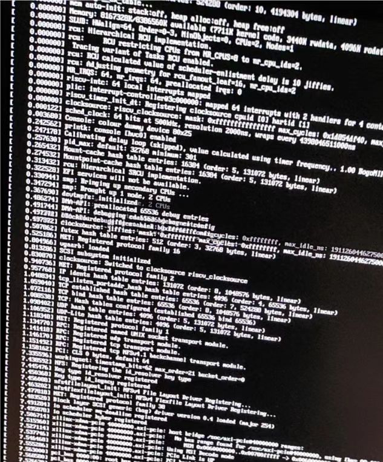
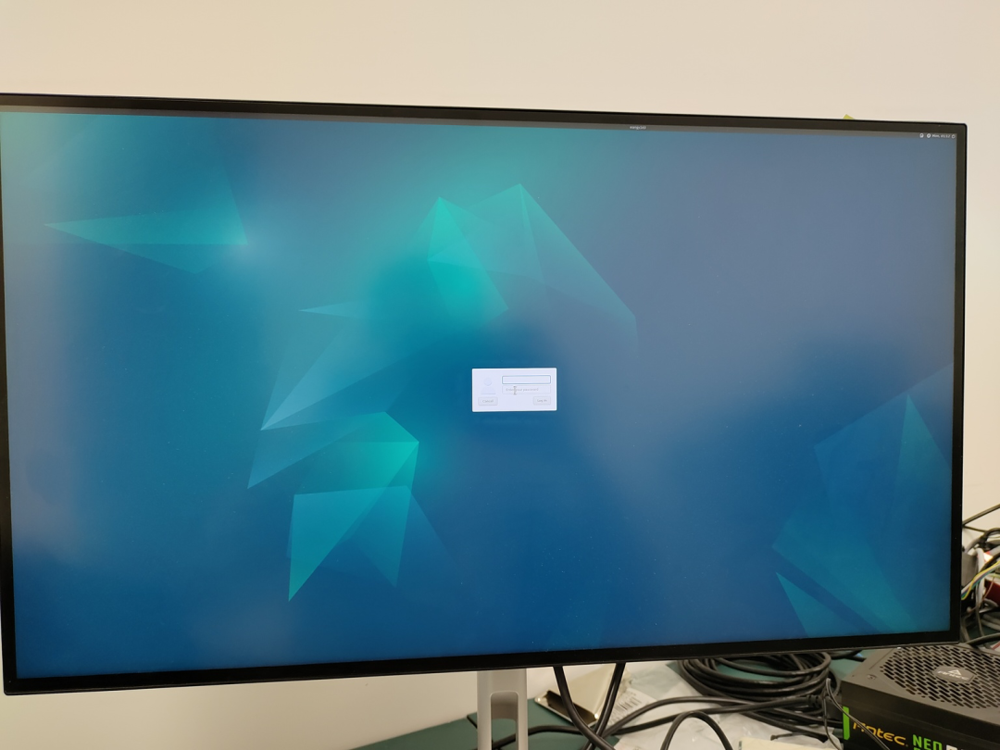
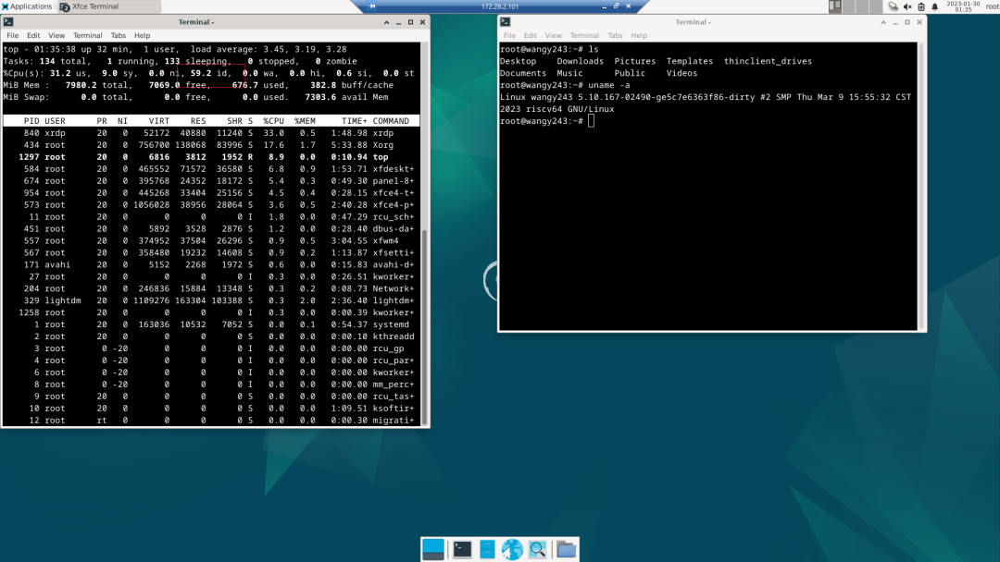

# 【香山双周报 25】20230313 期

欢迎来到我们的双周报专栏。本次是香山双周报专栏的第 25 期，我们将通过这一专栏，定期介绍香山的开源进展，希望与大家共同学习，一起进步。近期，昆明湖开发在稳步推进，前端实现了指令缓存上限评估工具；后端实现了更多向量指令，优化了 ROB 冲刷效率；访存单元持续推进 LQ 拆分性能优化，完善 hint 通路及性能评估数据；缓存系统实现了新替换算法，为新设计做性能分析；外设支持也取得较大进展，特别感谢中科院软件所团队在 GPU 适配工作上的大力支持，南湖架构已在 FPGA 平台成功驱动显卡并启动 Xfce 桌面环境。欢迎大家通过公众号后台留言的方式与我们交流！

<!-- more -->
## 近期进展

### 前端

* 修复 ICache ECC 检查机制 bug
* 实现理想 ICache，可用于评估 ICache 性能上限

### 后端流水线

* 支持 vmv.s.x 和 vslide1up 指令，可以不经过向量访存指令初始化向量寄存器
* 实现 Rename Buffer，减少 ROB 用于记录 (lreg, oldpreg, preg) 的物理空间，在冲刷时加速 ROB 的 walk 过程

### 访存单元

* LQ 拆分性能优化中
* 完成 L1TLB 容量对性能影响的分析
* 继续完善自定义的 l2 - l1 hint 通路，以降低 l1 miss l2 refill 的延迟
* 评估 STA 流水线访问 dcache，在缺失时产生预取的效果
* 替换算法更新时机问题修复

### 缓存系统

* 实现了 DRRIP 替换算法并移植到 CPL2
* 对比分析 CPL2 和 Inclusive HuanCun 的性能
* 继续进行性能优化，实现 early Release 策略中

### 杂项

* **外设支持**

    * 南湖架构在 FPGA 平台上成功驱动显卡，可正常启动 Xfce 桌面环境并通过远程桌面访问

通过显示器打印启动日志

启动 Xfce 桌面环境

远程访问桌面

## 后记

香山开源处理器正在火热地开发中，新的功能与新的优化在持续添加中，我们将通过香山双周报专栏定期地同步我们的开源进展。感谢您的关注，欢迎在后台留言与我们交流！

编辑：王华强、陈熙、李昕、胡轩、陈国凯
