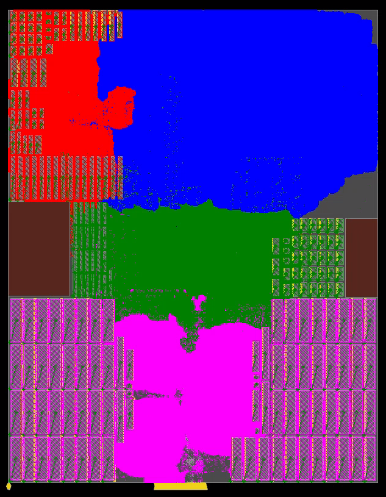

# 【香山双周报 42】20231225 期

欢迎来到我们的双周报专栏。本次是香山双周报专栏的第 42 期，我们将通过这一专栏，定期介绍香山的开源进展，希望与大家共同学习，一起进步。欢迎大家通过公众号后台留言的方式与我们交流！

近期，昆明湖研发接近尾声，各组持续推进面积和时序的优化及验证文档，前端测试了理想 L1/L2 Cache 性能收益上限，后端实现多个性能优化，HybridUnit 合入新后端，访存继续推进向量扩展测试和预取优化，缓存继续推进多核测试和斜相联 LLC。本期还更新了昆明湖架构近期性能与物理布局。

<!-- more -->
## 近期进展

### 前端

* IBuffer 添加 bypass buffer 结构，优化时序问题。（[#2568](https://github.com/OpenXiangShan/XiangShan/pull/2568)）
* FTQ 与后端的连接端口打拍，优化时序问题。（[#2576](https://github.com/OpenXiangShan/XiangShan/pull/2576)）
* 测试得到理想 L1/L2 Cache 性能数据，确认性能收益上限
* 完成 ICache 的面积优化
* 完成 IFU、BPU、FTQ 相关部分文档

### 后端流水线

* HybridUnit 性能优化完成，合入新版后端（[#2556](https://github.com/OpenXiangShan/XiangShan/pull/2556)）
* 实现 LoadUnit 推测唤醒，初步性能评估显示十轮 Coremark 性能提升约 1.5%（[#2569](https://github.com/OpenXiangShan/XiangShan/pull/2569)）
* 重构 IssueQueue 中的 Entry 代码，提升代码复用度（[#2566](https://github.com/OpenXiangShan/XiangShan/pull/2566)）
* 实现 VTypeBuffer，将 vtype 与 ROB 项解耦
* 在 IssueQueue 中实现 fast entry 和 slow entry，优化时序

### 访存单元

* 改进 Store 预取（SPB），相比于原版 SPB 取得一定收益
* 通过抓取 SMS trace 并和模拟器对比，定位 RTL 与模拟器的 SMS 性能差距
* 实现 MMIO 空间上向量 Store 指令的处理
* V 扩展在默认配置下跑通 riscv-vector-tests；rvv-bench 跑通 4/10 个测试用例；推进在 NEMU 和 RTL 上的向量访存例外测试
* 推进验证文档

### 缓存系统

* 优化时序，基本完成内部以及与访存模块接口的时序调优
* 解决若干个多核一致性相关错误（[#89](https://github.com/OpenXiangShan/XiangShan/pull/89)，[#91](https://github.com/OpenXiangShan/XiangShan/pull/91)）
* 实现 skew cache 缓存压缩方法，正在 debug
* 搭建 UVM 的 Demo 以验证 TL-CHI 转接桥
* 推进验证文档

## 评估

我们采用 SimPoint 对程序进行采样，基于我们自定义的 Checkpoint 格式制作检查点镜像，Simpoint 聚类的覆盖率 100%。SPEC 使用 gcc 12 进行编译，优化选项为 O3，指令集是 RV64GCB，内存库采用了 jemalloc 库。**我们使用 12 月 11 日 67a03ae 版本的香山处理器（缓存大小配置为 64KB L1 ICache + 64KB L1 DCache + 1MB L2 + 16MB L3），在仿真环境下运行了 SPEC06 片段，使用 DRAMsim3 模拟 CPU 在 3GHz 情况下 DDR4-3200 内存的延迟**。本次所有测试均采用了 jemalloc 内存库，性能相比于上月有较大差异。以下为 SPECCPU 2006 的分数估计情况：

| SPECint 2006 | @ 3GHz | SPECfp 2006 | @ 3GHz |
| :-- | --: | :-- | --: |
| 400.perlbench | 35.50 | 410.bwaves | 44.27 |
| 401.bzip2 | 23.94 | 416.gamess | 42.90 |
| 403.gcc | 47.07 | 433.milc | 31.88 |
| 429.mcf | 54.54 | 434.zeusmp | 43.05 |
| 445.gobmk | 31.37 | 435.gromacs | 30.25 |
| 456.hmmer | 32.56 | 436.cactusADM | 37.66 |
| 458.sjeng | 31.50 | 437.leslie3d | 38.30 |
| 462.libquantum | 125.81 | 444.namd | 36.77 |
| 464.h264ref | 51.69 | 447.dealII | 69.10 |
| 471.omnetpp | 41.26 | 450.soplex | 53.65 |
| 473.astar | 30.26 | 453.povray | 51.90 |
| 483.xalancbmk | 71.97 | 454.Calculix | 16.44 |
| **GEOMEAN** | **43.10** | 459.GemsFDTD | 34.07 |
|  |  | 465.tonto | 33.35 |
|  |  | 470.lbm | 86.09 |
|  |  | 481.wrf | 38.20 |
|  |  | 482.sphinx3 | 55.41 |
|  |  | **GEOMEAN** | **41.11** |

**上述分数为基于程序片段的分数估计，非完整 SPEC CPU 2006 评估，和真实芯片实际性能可能存在偏差！**

香山处理器昆明湖架构近期物理布局图如下，红、蓝、绿、粉四色分别对应昆明湖 Frontend、Backend、Memblock、L2Cache 四个模块。

## 后记

香山开源处理器正在火热地开发中，新的功能与新的优化在持续添加中，我们将通过香山双周报专栏定期地同步我们的开源进展。感谢您的关注，欢迎在后台留言与我们交流！

香山昆明湖架构研发接近尾声，性能会每月底公布一次，敬请期待。

## 相关链接

* 香山技术讨论 QQ 群：879550595
* 香山技术讨论网站：https://github.com/OpenXiangShan/XiangShan/discussions
* 香山文档：https://xiangshan-doc.readthedocs.io/

编辑：高泽宇、唐浩晋、李燕琴、蔡洛姗

审校：香山宣传工作组
