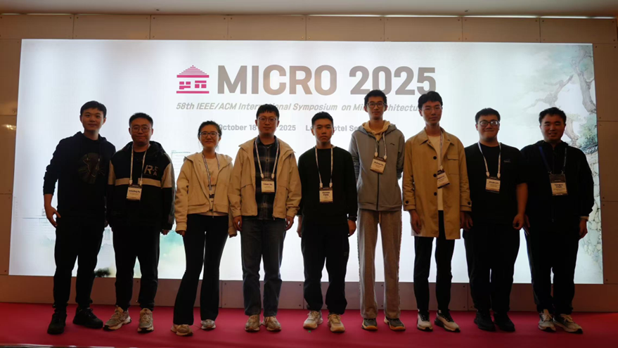
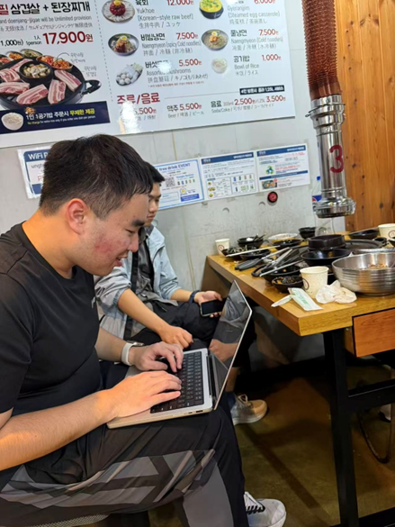
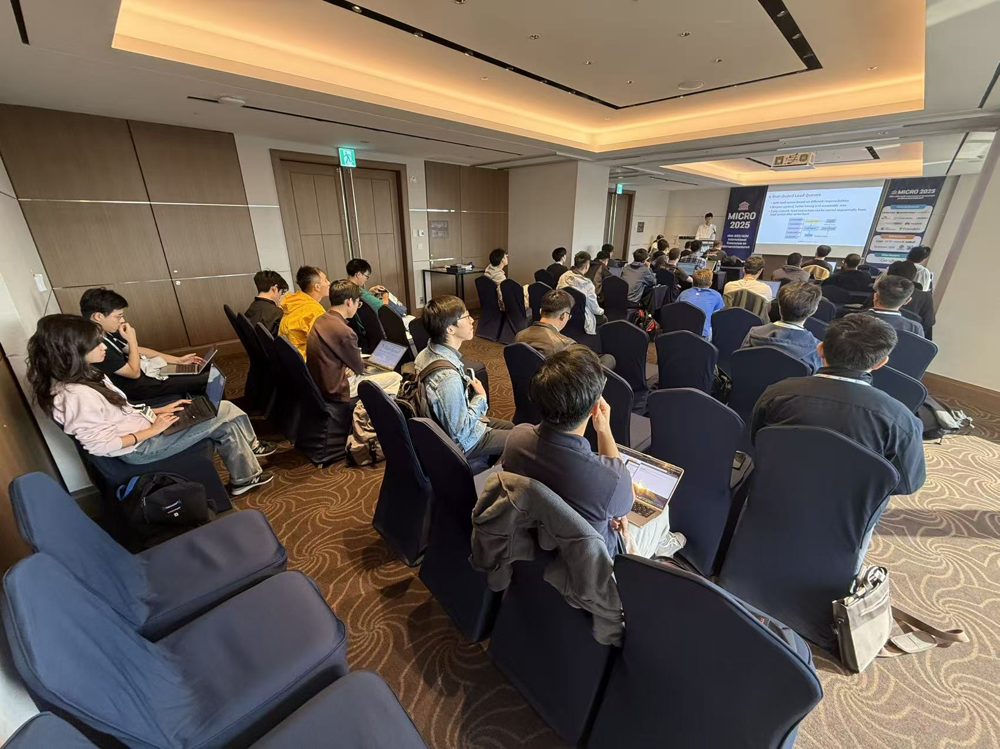

# [XiangShan Biweekly 88] 20251027

Welcome to XiangShan biweekly column! Through this column, we will regularly share the latest development progress of XiangShan. We look forward to your contribution.

This is the 88th issue of the biweekly report.

XiangShan has successfully held the MICRO 2025 tutorial! We are very excited to see everyone in Seoul, and we would like to thank every participant and partner who cares about the development of XiangShan! If you were unable to attend in person, we welcome you to visit <https://tutorial.xiangshan.cc/micro25/> to review the content of this tutorial. The next XiangShan tutorial will be held at the HPCA 2026 conference in Australia early next year, and we look forward to seeing you again!

In this tutorial, we carried out a large-scale refactoring, mainly including:

- A completely restructured getting-started section. The new getting-started section is organized using Jupyter Notebook, further lowering the barrier to understanding XiangShan. All content has been open-sourced to <https://github.com/OpenXiangShan/bootcamp>, and we welcome everyone to try it out.
- A completely restructured microarchitecture introduction. Instead of flatly introducing the current state of XiangShan's microarchitecture, the new microarchitecture section focuses on XiangShan's design philosophy, helping everyone better understand XiangShan's design ideas.
- We are very honored to invite Nisa Bostanci as a representative of Onur Mutlu's team to share Ramulator! XiangShan's GEM5 simulator has now integrated Ramulator.

In terms of XiangShan development, the frontend has fixed several performance bugs caused by the V3 BPU refactoring, while also advancing support for 2-fetch on the instruction fetch side. The backend continues with V3 development and refactoring. The memory subsystem has improved some topdown PMU and CHIron tools.

<!-- more -->

## Bonus: Tutorial Highlights
- Group photo to kick off
  
  
- On the early morning of October 17th at 5:28 AM, Professor Mutlu replied to our invitation, confirming his attendance and introduction of Ramulator

  
- On the evening of October 18th, members of the XiangShan team modified the GEM5 getting-started code at a barbecue restaurant.
  
  
- On October 19th, the tutorial started promptly at 8:00 AM. Due to the early time, the number of participants was not very high at the beginning~~early morning classes are still too much, it seems that everyone can't get up~~. As the tutorial progressed, the number of attendees gradually increased, eventually filling the entire room.

  
- 

## Recent Developments

### Frontend

- RTL feature
  - Enable override mechanism of s3 accurate predictor group in V3 BPU (only BaseTable is enabled for TAGE, RAS is not enabled) ([#5057](https://github.com/OpenXiangShan/XiangShan/pull/5057))
  - Add 2-fetch interface support for IBuffer ([#5098](https://github.com/OpenXiangShan/XiangShan/pull/5098))
  - Rewrite ABTB fast training interface ([#5070](https://github.com/OpenXiangShan/XiangShan/pull/5070))
- Bug Fix
  - Fix the issue of MBTB misfiltering branches at the beginning of the fetch block ([#5113](https://github.com/OpenXiangShan/XiangShan/pull/5113))
  - Fix SC training logic related issues ([#5118](https://github.com/OpenXiangShan/XiangShan/pull/5118))
  - Fix RAS stack size parameter calculation related issues ([#5132](https://github.com/OpenXiangShan/XiangShan/pull/5132))
  - Fix WriteBuffer write index typo ([#5134](https://github.com/OpenXiangShan/XiangShan/pull/5134))
  - Fix the issue where invalid entries in the FTQ resolve queue are marked as flushed, causing BPU training loss ([#5107](https://github.com/OpenXiangShan/XiangShan/pull/5107))
  - Fix assertion condition error in IFU ([#5122](https://github.com/OpenXiangShan/XiangShan/pull/5122))
- Timing optimization
  - (V2) Replace the dual-port SRAM of TageBTable and SCTable with single-port SRAM ([#5094](https://github.com/OpenXiangShan/XiangShan/pull/5094))
  - Modify instruction boundary calculation logic, changing from calculating after IFU fetches instruction data to pre-calculating during ICache refill; shorten IFU pipeline stage ([#5108](https://github.com/OpenXiangShan/XiangShan/pull/5108))
- Area optimization
  - Support IBuffer to only store the first exception encountered after power-on/redirection ([#5095](https://github.com/OpenXiangShan/XiangShan/pull/5095))
- Code quality improvements
  - Remove V2 brType type, unify to use V3 BranchAttribute ([#5076](https://github.com/OpenXiangShan/XiangShan/pull/5076))
- Debugging tools
  - Add some BPU performance counters ([#5112](https://github.com/OpenXiangShan/XiangShan/pull/5112))

### Backend

- Bug Fix
  - Fix the issue of out-of-order reading of XIP registers in CSR under specific circumstances ([#5131](https://github.com/OpenXiangShan/XiangShan/pull/5131))
- RTL new features
  - Implement the scheme for splitting uops of direct jump instructions at the IQ exit ([#5128](https://github.com/OpenXiangShan/XiangShan/pull/5128))
  - Increase the number of floating-point physical registers to 256, and increase robSize and rabSize to 352
  - Add Vmove functional unit, modify the uops split from instructions that need to move data to use Vmove unit ([#5126](https://github.com/OpenXiangShan/XiangShan/pull/5126))
- Timing optimization
  - Improve the timing of vfcvt to support the fast wake-up of vector units ([YunSuan #189](https://github.com/OpenXiangShan/YunSuan/pull/189))
  - Finish the refactoring of vialu to support the fast wake-up of vector units ([#5136](https://github.com/OpenXiangShan/XiangShan/pull/5136))
- Code quality improvements
  - Modify recent code legacy issues to improve code quality ([#5135](https://github.com/OpenXiangShan/XiangShan/pull/5135))

### MemBlock and Cache

- RTL new features
  - (V2) Add topdown interface for late prefetch in CoupledL2 ([CoupledL2 #411](https://github.com/OpenXiangShan/CoupledL2/pull/411))
  - (V2) Add csr control of delay latency for training L2 prefetch in CoupledL2 ([CoupledL2 #434](https://github.com/OpenXiangShan/CoupledL2/pull/434))
  - (V2) Add Berti prefetch and refactored prefetch related TopDownMonitor([CoupledL2 #435](https://github.com/OpenXiangShan/CoupledL2/pull/435))
  - (V2) Add api for checking L2 prefetch and Berti prefetch ([Utility #128](https://github.com/OpenXiangShan/Utility/pull/128))
  - The refactoring of MMU, LoadUnit, StoreQueue, L2, etc. is ongoing
- Tools
  - Complete the functions of CHIron

## Performance Evaluation

| SPECint 2006 est. | @ 3GHz | SPECfp 2006 est. | @ 3GHz |
| :---------------- | :----: | :--------------- | :----: |
| 400.perlbench     | 35.82  | 410.bwaves       | 67.23  |
| 401.bzip2         | 25.40  | 416.gamess       | 40.96  |
| 403.gcc           | 47.81  | 433.milc         | 45.06  |
| 429.mcf           | 60.26  | 434.zeusmp       | 51.80  |
| 445.gobmk         | 30.24  | 435.gromacs      | 33.58  |
| 456.hmmer         | 41.60  | 436.cactusADM    | 46.20  |
| 458.sjeng         | 30.35  | 437.leslie3d     | 47.88  |
| 462.libquantum    | 122.66 | 444.namd         | 28.86  |
| 464.h264ref       | 56.55  | 447.dealII       | 73.57  |
| 471.omnetpp       | 41.43  | 450.soplex       | 52.49  |
| 473.astar         | 29.12  | 453.povray       | 53.44  |
| 483.xalancbmk     | 72.71  | 454.Calculix     | 16.37  |
| GEOMEAN           | 44.54  | 459.GemsFDTD     | 39.73  |
|                   |        | 465.tonto        | 36.65  |
|                   |        | 470.lbm          | 91.98  |
|                   |        | 481.wrf          | 40.65  |
|                   |        | 482.sphinx3      | 49.09  |
|                   |        | GEOMEAN          | 44.94  |

We use SimPoint to sample programs and create checkpoints images based on our custom format. The coverage of SimPoint clustering reaches 100%. Note that the above scores are estimated based on program segments rather than a complete SPEC CPU2006 evaluation, which may deviate from the actual performance of real chips.

Compilation parameters are as follows:

|                    |          |
| ------------------ | -------- |
| Compiler           | gcc12    |
| Optimization level | O3       |
| Memory library     | jemalloc |
| -march             | RV64GCB  |
| -ffp-contraction   | fast     |

Processor and SoC parameters are as follows:

|                |            |
| -------------- | ---------- |
| Commit         | 0fb84f8    |
| Date           | 10/23/2025 |
| L1 ICache      | 64KB       |
| L1 DCache      | 64KB       |
| L2 Cache       | 1MB        |
| L3 Cache       | 16MB       |
| LSU            | 3ld2st     |
| Bus protocol   | TileLink   |
| Memory latency | DDR4-3200  |

## Related links

- XiangShan technical discussion QQ group: 879550595
- XiangShan technical discussion website: <https://github.com/OpenXiangShan/XiangShan/discussions>
- XiangShan Documentation: <https://xiangshan-doc.readthedocs.io/>
- XiangShan User Guide: <https://docs.xiangshan.cc/projects/user-guide/>
- XiangShan Design Doc: <https://docs.xiangshan.cc/projects/design/>

Editors: Zhihao Xu, Junxiong Ji, Zhuo Chen, Junjie Yu, Yanjun Li
