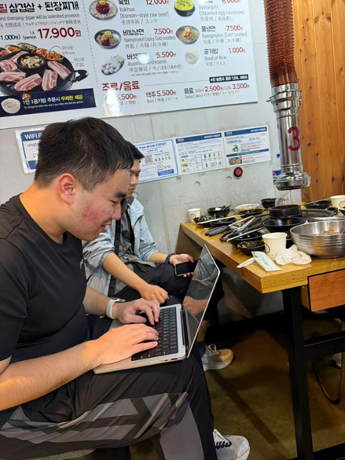

# 【香山双周报 88】20251027 期

欢迎来到香山双周报专栏，我们将通过这一专栏定期介绍香山的开发进展。我们期待您的贡献。

本次是第 88 期双周报。

香山成功举办了 MICRO 2025 tutorial！我们非常高兴能与大家在首尔相见，感谢每一位参会的朋友和关心香山发展的伙伴们！如果未能现场参与，欢迎大家访问 <https://tutorial.xiangshan.cc/micro25/> 回顾本次 tutorial 的内容。香山的下一场 tutorial 将于明年初在澳大利亚举办的 HPCA 2026 会议上进行，期待与大家再次相见！

在此次 tutorial 中，我们进行了大规模的重构，主要包括：

- 完全重构的上手环节。新的上手环节使用 Jupyter Notebook 组织，进一步降低了解香山的门槛。所有内容都已开源到 <https://github.com/OpenXiangShan/bootcamp>，欢迎大家尝试
- 完全重构的微架构介绍。相比于扁平化地介绍香山微架构现状，新的微架构部分着重介绍香山的设计哲学，帮助大家更好地理解香山的设计思路
- 非常荣幸地邀请到 Nisa Bostanci 代表 Onur Mutlu 的团队分享 Ramulator！香山的 GEM5 模拟器现已集成 Ramulator

在过去的两周，前端继续修复 V3 BPU 重构后带来的性能 bug。后端整理现有代码，继续推进 V3 开发。访存缓存部分修复了数个 V2 的 bug，同时进行代码重构工作，为 V3 开发做准备。

<!-- more -->

## Tutorial 花絮
- 合影镇楼

  
- 10 月 17 日清晨 5:28，Onur 教授回复了我们的邀请，确认将出席并介绍 Ramulator。在上飞机前，我们紧急摇人，重新安排了 GEM5 部分的介绍内容，为这部分预留了 15 分钟
- 10 月 18 日晚，香山团队的同学在烤肉店修改 GEM5 部分的上手代码

  
- 10 月 19 日，tutorial 于上午 8:00 准时开始。由于时间较早，一开始参加的人数并不多~~早八还是太超模了，看来大家都起不来~~。随着 tutorial 的进行，现场人数逐渐增多，最终坐满了整个屋子
- 

## 近期进展

### 前端

- RTL 新特性
  - 启用 V3 BPU 的高级预测器 override 机制（TAGE 仅启用 BaseTable，RAS 未启用）（[#5057](https://github.com/OpenXiangShan/XiangShan/pull/5057)）
  - 新增 IBuffer 对 2-fetch 的接口支持（[#5098](https://github.com/OpenXiangShan/XiangShan/pull/5098)）
  - 重写 ABTB 快速训练接口（[#5070](https://github.com/OpenXiangShan/XiangShan/pull/5070)）
- Bug 修复
  - 修复 MBTB 错误过滤取指块开头位置上的分支的问题（[#5113](https://github.com/OpenXiangShan/XiangShan/pull/5113)）
  - 修复 SC 训练逻辑相关问题（[#5118](https://github.com/OpenXiangShan/XiangShan/pull/5118)）
  - 修复 RAS 栈大小参数计算相关问题（[#5132](https://github.com/OpenXiangShan/XiangShan/pull/5132)）
  - 修复 WriteBuffer 写入索引相关笔误（[#5134](https://github.com/OpenXiangShan/XiangShan/pull/5134)）
  - 修复 FTQ resolve queue 中无效项被标记为 flushed 导致的 Bpu 训练丢失问题（[#5107](https://github.com/OpenXiangShan/XiangShan/pull/5107)）
  - 修复 IFU 内断言条件错误的问题（[#5122](https://github.com/OpenXiangShan/XiangShan/pull/5122)）
- 时序优化
  - （V2）更换 TageBTable 和 SCTable 的双端口 SRAM 为单端口（[#5094](https://github.com/OpenXiangShan/XiangShan/pull/5094)）
  - 修改指令定界逻辑，由 IFU 取出指令数据后计算改为由 ICache 在重填时预先计算；IFU 流水级缩短（[#5108](https://github.com/OpenXiangShan/XiangShan/pull/5108)）
- 面积优化
  - 支持 IBuffer 仅存储上电/重定向后遇到的第一条 exception（[#5095](https://github.com/OpenXiangShan/XiangShan/pull/5095)）
- 代码质量
  - 移除 V2 的 brType 类型，统一使用 V3 BranchAttribute（[#5076](https://github.com/OpenXiangShan/XiangShan/pull/5076)）
- 调试工具
  - 新增一些 BPU 性能计数器（[#5112](https://github.com/OpenXiangShan/XiangShan/pull/5112)）

### 后端

- Bug 修复
  - 修复了当 ROB 压缩关闭时，跨两个 FTQ 的融合指令不可压缩的问题（[#5079](https://github.com/OpenXiangShan/XiangShan/pull/5079)）
- RTL 新特性
  - 在 ALU 中添加 jalr/jal/auipc 的新 uop 拆分实现
- 代码质量
  - 优化 NewMgu 中 vialuf 的时序（[#5078](https://github.com/OpenXiangShan/XiangShan/pull/5078)）

### 访存与缓存

- RTL 新特性
  - （V2）在 CoupledL2 中为 late prefetch 添加 topdown 接口（[CoupledL2 #411](https://github.com/OpenXiangShan/CoupledL2/pull/411)）
  - （V2）在 CoupledL2 中添加控制延迟时延的 csr 用于训练 L2 预取（[CoupledL2 #434](https://github.com/OpenXiangShan/CoupledL2/pull/434)）
  - （V2）添加 Berti 预取，重构了 prefetch 相关的 TopDownMonitor（[CoupledL2 #435](https://github.com/OpenXiangShan/CoupledL2/pull/435)）
  - （V2）添加用于检查 L2 预取和 Berti 预取的 api（[Utility #128](https://github.com/OpenXiangShan/Utility/pull/128)）
  - MMU、LoadUnit、StoreQueue、L2 等模块重构持续推进中
- 工具
  - 完善 CHIron 的功能

## 性能评估

| SPECint 2006 est. | @ 3GHz | SPECfp 2006 est. | @ 3GHz |
| :---------------- | :----: | :--------------- | :----: |
| 400.perlbench     | 35.82  | 410.bwaves       | 67.23  |
| 401.bzip2         | 25.40  | 416.gamess       | 40.96  |
| 403.gcc           | 47.81  | 433.milc         | 45.06  |
| 429.mcf           | 60.26  | 434.zeusmp       | 51.80  |
| 445.gobmk         | 30.24  | 435.gromacs      | 33.58  |
| 456.hmmer         | 41.60  | 436.cactusADM    | 46.20  |
| 458.sjeng         | 30.35  | 437.leslie3d     | 47.88  |
| 462.libquantum    | 122.66 | 444.namd         | 28.86  |
| 464.h264ref       | 56.55  | 447.dealII       | 73.57  |
| 471.omnetpp       | 41.43  | 450.soplex       | 52.49  |
| 473.astar         | 29.12  | 453.povray       | 53.44  |
| 483.xalancbmk     | 72.71  | 454.Calculix     | 16.37  |
| GEOMEAN           | 44.54  | 459.GemsFDTD     | 39.73  |
|                   |        | 465.tonto        | 36.65  |
|                   |        | 470.lbm          | 91.98  |
|                   |        | 481.wrf          | 40.65  |
|                   |        | 482.sphinx3      | 49.09  |
|                   |        | GEOMEAN          | 44.94  |

我们使用 SimPoint 对程序进行采样，基于我们自定义的 checkpoint 格式制作检查点镜像，Simpoint 聚类的覆盖率为 100%。上述分数为基于程序片段的分数估计，非完整 SPEC CPU2006 评估，和真实芯片实际性能可能存在偏差。

编译参数如下所示：

|                  |          |
| ---------------- | -------- |
| 编译器           | gcc12    |
| 编译优化         | O3       |
| 内存库           | jemalloc |
| -march           | RV64GCB  |
| -ffp-contraction | fast     |

处理器及 SoC 参数如下所示：

|           |            |
| --------- | ---------- |
| commit    | 0fb84f8    |
| 日期      | 2025/10/23 |
| L1 ICache | 64KB       |
| L1 DCache | 64KB       |
| L2 Cache  | 1MB        |
| L3 Cache  | 16MB       |
| 访存单元  | 3ld2st     |
| 总线协议  | TileLink   |
| 内存延迟  | DDR4-3200  |

## 相关链接

- 香山技术讨论 QQ 群：879550595
- 香山技术讨论网站：<https://github.com/OpenXiangShan/XiangShan/discussions>
- 香山文档：<https://xiangshan-doc.readthedocs.io/>
- 香山用户手册：<https://docs.xiangshan.cc/projects/user-guide/>
- 香山设计文档：<https://docs.xiangshan.cc/projects/design/>

编辑：徐之皓、吉骏雄、陈卓、余俊杰、李衍君
