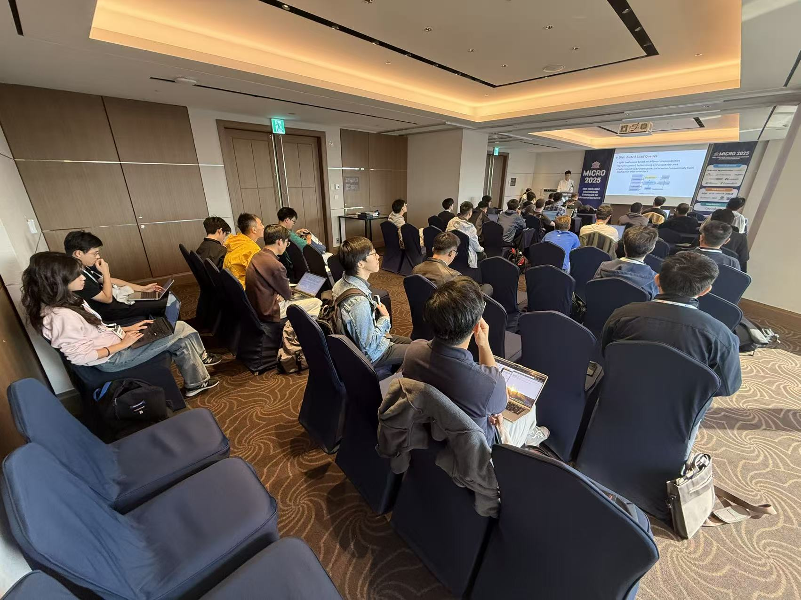

# [XiangShan Biweekly 89] 20251110

Welcome to XiangShan biweekly column! Through this column, we will regularly share the latest development progress of XiangShan. We look forward to your contribution.

This is the 89th issue of the biweekly report.

XiangShan has successfully held the MICRO 2025 tutorial! We are very excited to see everyone in Seoul, and we would like to thank every participant and partner who cares about the development of XiangShan! If you were unable to attend in person, we welcome you to visit <https://tutorial.xiangshan.cc/micro25/> to review the content of this tutorial. The next XiangShan tutorial will be held at the HPCA 2026 conference in Australia early next year, and we look forward to seeing you again!

In this tutorial, we carried out a large-scale refactoring, mainly including:

- A completely restructured getting-started section. The new getting-started section is organized using Jupyter Notebook, further lowering the barrier to understanding XiangShan. All content has been open-sourced to <https://github.com/OpenXiangShan/bootcamp>, and we welcome everyone to try it out.
- A completely restructured microarchitecture introduction. Instead of flatly introducing the current state of XiangShan's microarchitecture, the new microarchitecture section focuses on XiangShan's design philosophy, helping everyone better understand XiangShan's design ideas.
- We are very honored to invite Nisa Bostanci as a representative of Onur Mutlu's team to share Ramulator! XiangShan's GEM5 simulator has now integrated Ramulator.

In terms of XiangShan development, the frontend has fixed several performance bugs caused by the V3 BPU refactoring, while also advancing support for 2-fetch on the instruction fetch side. The backend continues with V3 development and refactoring. The memory subsystem has improved some topdown PMU and CHIron tools.

<!-- more -->

## Bonus: Tutorial Highlights
- Group photo to kick off
  
  
- On the early morning of October 17th at 5:28 AM, Professor Mutlu replied to our invitation, confirming his attendance and introduction of Ramulator

  
- On the evening of October 18th, members of the XiangShan team modified the GEM5 getting-started code at a barbecue restaurant.
  
  
- On October 19th, the tutorial started promptly at 8:00 AM. Due to the early time, the number of participants was not very high at the beginning~~early morning classes are still too much, it seems that everyone can't get up~~. As the tutorial progressed, the number of attendees gradually increased, eventually filling the entire room.

  
- 

## Recent Developments

### Frontend

- RTL feature
  - Support Hardware Error exception introduced in RISC-V Privileged Spec v1.13 ([#4770](https://github.com/OpenXiangShan/XiangShan/pull/4770))
  - Enable UBTB fast training ([#5145](https://github.com/OpenXiangShan/XiangShan/pull/5145))
  - Remove takenCnt and valid fields of UBTB ([#5157](https://github.com/OpenXiangShan/XiangShan/pull/5157))
  - Implement globalTable for SC predictor ([#5150](https://github.com/OpenXiangShan/XiangShan/pull/5150))
  - Support PHR tracking branch target ([#5169](https://github.com/OpenXiangShan/XiangShan/pull/5169))
  - ABTB override fast predict, MicroTAGE and other new performance features are being explored
  - Decoupled BPU train and commit path refactoring are in progress
- Bug Fix
  - Fix the X-state propagation issue caused by ABTB and MBTB SRAM read data not being latched ([#5153](https://github.com/OpenXiangShan/XiangShan/pull/5153))
  - Fix the issue related to ABTB training conditions ([#5160](https://github.com/OpenXiangShan/XiangShan/pull/5160))
  - Fix the issue of non-one-hot waymask in MBTB multi-hit flush logic ([#5181](https://github.com/OpenXiangShan/XiangShan/pull/5181))
  - Fix the issue of incorrect set index calculation for TAGE BaseTable and MBTB ([#5155](https://github.com/OpenXiangShan/XiangShan/pull/5155))
  - Fix the issue related to mismatch of PHR pointer metadata ([#5139](https://github.com/OpenXiangShan/XiangShan/pull/5139))
  - Fix the issue related to WriteBuffer write port wiring ([#5143](https://github.com/OpenXiangShan/XiangShan/pull/5143))
  - Fix the issue where IBuffer still records exceptions when the number of enqueued entries is 0 ([#5147](https://github.com/OpenXiangShan/XiangShan/pull/5147))
- Timing optimization
  - (V2) Replace the dual-port SRAM of FTQ with registers ([#5142](https://github.com/OpenXiangShan/XiangShan/pull/5142))
- Area optimization
  - Support ICache WayLookup to only store the first exception encountered after power-on/redirection ([#4959](https://github.com/OpenXiangShan/XiangShan/pull/4959), [#5165](https://github.com/OpenXiangShan/XiangShan/pull/5165))
- Code quality improvements
  - Refactor the fast training interface of s1 predictors ([#5144](https://github.com/OpenXiangShan/XiangShan/pull/5144))
  - Refactor MBTB alignBank and fix the issue of incorrect bank index calculation ([#5159](https://github.com/OpenXiangShan/XiangShan/pull/5159))

### Backend

- RTL New Features
  - V3 vector unit new design implementation is in progress
  - Support OpenSBI PMU extension ([#5172](https://github.com/OpenXiangShan/XiangShan/pull/5172))
  - Parameterize PMP and PMA ([#5177](https://github.com/OpenXiangShan/XiangShan/pull/5177))
- Timing
  - Continue to optimize the timing of V2 vector arithmetic units

### MemBlock and Cache

- RTL new features
  - The refactoring and testing of MMU, LoadUnit, StoreQueue, L2, etc. is ongoing
- Bug fix
  - Fix the issue with the TLB refresh logic. When hfence.vvma, sfence.vma have v=1, or mbmc.BME = 1 and CMODE = 0, address matching is ignored, and all TLB entries are refreshed directly ([#5114](https://github.com/OpenXiangShan/XiangShan/pull/5114))
  - Fix the issue of splitting unaligned elements in VsegmentUnit without locking Paddr. This will cause incorrect access requests to be initiated ([#5164](https://github.com/OpenXiangShan/XiangShan/pull/5164))
  - Fix the issue that gpaddr and vaddr are different when TLB is in onlyS2 phase ([#5189](https://github.com/OpenXiangShan/XiangShan/pull/5189))
- Timing
  - Fix the timing issue of PTW ([#5170](https://github.com/OpenXiangShan/XiangShan/pull/5170))
  - Fixing the timing issue of LoadReplayQueue and DCache ([#5185](https://github.com/OpenXiangShan/XiangShan/pull/5185))
- Code quality improvements
  - Move IntBuffer for beu into L2Top for partition ([#5110](https://github.com/OpenXiangShan/XiangShan/pull/5110))
  - Remove all combinational logic in XSCore top module, only retain connection logic ([#5120](https://github.com/OpenXiangShan/XiangShan/pull/5120))
  - Parameterize PMP and PMA ([#5177](https://github.com/OpenXiangShan/XiangShan/pull/5177))
- Debugging tools
  - Add some hardware performance counters in DCache and LDU ([#5166](https://github.com/OpenXiangShan/XiangShan/pull/5166))
  - Continue to improve the functionality of CHI related infrastructure CHIron ([CHIron](https://github.com/RISMicroDevices/CHIron))

## Performance Evaluation

| SPECint 2006 est. | @ 3GHz | SPECfp 2006 est. | @ 3GHz |
| :---------------- | :----: | :--------------- | :----: |
| 400.perlbench     | 35.82  | 410.bwaves       | 67.23  |
| 401.bzip2         | 25.40  | 416.gamess       | 40.96  |
| 403.gcc           | 47.81  | 433.milc         | 45.06  |
| 429.mcf           | 60.26  | 434.zeusmp       | 51.80  |
| 445.gobmk         | 30.24  | 435.gromacs      | 33.58  |
| 456.hmmer         | 41.60  | 436.cactusADM    | 46.20  |
| 458.sjeng         | 30.35  | 437.leslie3d     | 47.88  |
| 462.libquantum    | 122.66 | 444.namd         | 28.86  |
| 464.h264ref       | 56.55  | 447.dealII       | 73.57  |
| 471.omnetpp       | 41.43  | 450.soplex       | 52.49  |
| 473.astar         | 29.12  | 453.povray       | 53.44  |
| 483.xalancbmk     | 72.71  | 454.Calculix     | 16.37  |
| GEOMEAN           | 44.54  | 459.GemsFDTD     | 39.73  |
|                   |        | 465.tonto        | 36.65  |
|                   |        | 470.lbm          | 91.98  |
|                   |        | 481.wrf          | 40.65  |
|                   |        | 482.sphinx3      | 49.09  |
|                   |        | GEOMEAN          | 44.94  |

We use SimPoint to sample programs and create checkpoints images based on our custom format. The coverage of SimPoint clustering reaches 100%. Note that the above scores are estimated based on program segments rather than a complete SPEC CPU2006 evaluation, which may deviate from the actual performance of real chips.

Compilation parameters are as follows:

|                    |          |
| ------------------ | -------- |
| Compiler           | gcc12    |
| Optimization level | O3       |
| Memory library     | jemalloc |
| -march             | RV64GCB  |
| -ffp-contraction   | fast     |

Processor and SoC parameters are as follows:

|                |            |
| -------------- | ---------- |
| Commit         | 0fb84f8    |
| Date           | 10/23/2025 |
| L1 ICache      | 64KB       |
| L1 DCache      | 64KB       |
| L2 Cache       | 1MB        |
| L3 Cache       | 16MB       |
| LSU            | 3ld2st     |
| Bus protocol   | TileLink   |
| Memory latency | DDR4-3200  |

## Related links

- XiangShan technical discussion QQ group: 879550595
- XiangShan technical discussion website: <https://github.com/OpenXiangShan/XiangShan/discussions>
- XiangShan Documentation: <https://xiangshan-doc.readthedocs.io/>
- XiangShan User Guide: <https://docs.xiangshan.cc/projects/user-guide/>
- XiangShan Design Doc: <https://docs.xiangshan.cc/projects/design/>

Editors: Zhihao Xu, Junxiong Ji, Zhuo Chen, Junjie Yu, Yanjun Li
