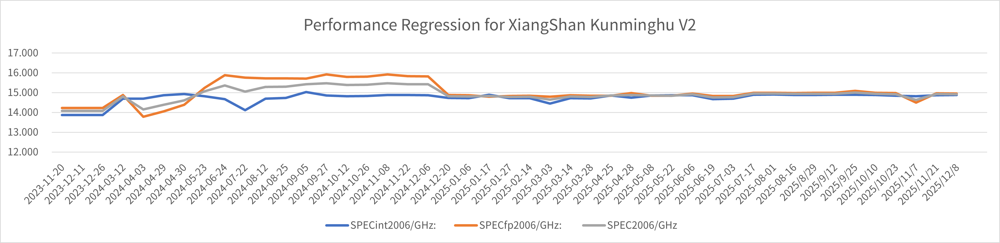

# 【香山双周报 91】20251208 期

欢迎来到香山双周报专栏，我们将通过这一专栏定期介绍香山的开发进展。

本次是第 91 期双周报。

昆明湖 V2 最后一次性能回归顺利完成！不知不觉间，我们已经累计完成了 46 次双周性能回归测试。这 46 次回归不仅记录了昆明湖 V2 的性能演进，也是香山处理器蓬勃发展和持续进步的有力见证。

在过去四年里，香山处理器从一个校园课程项目逐步发展为工业级处理器。从一切开始的起点“雁栖湖”，到首次实现工业交付并已在多项目中投入使用的“南湖”，再到成为当前性能最高的开源处理器核“昆明湖 V2”——这三代香山的演进，不仅凝聚着每一位团队成员的努力，也离不开社区伙伴们的持续关注与大力支持。在此，向大家表示由衷的感谢！

现在，我们即将告别昆明湖 V2，迎接昆明湖 V3 的到来！V3 将具备比 V2 更强大的性能，这同时也意味着更大的挑战。在香山团队面前的是一片未知的领域，我们的每一步都在书写新的历史。但是，我们坚信，通过“开源”这一新理念、新方法，我们能够与整个社区共同前进，进一步提升开源处理器的性能标杆。

感谢大家对香山的陪伴与支持，也期待您继续关注昆明湖 V3 的后续进展！

香山开发方面，前端修复了~~无数~~ BPU 相关的性能 bug~~性能终于接近重构前的水平~~，同时添加了性能计数器，以便更好地进行性能分析。后端和访存修复了 V2 的数个 bug，并且进一步优化了时序。在 V3 方面，后端继续推进新向量单元的设计，访存进行了模块重构与测试，同时进行了预取性能探索。

<!-- more -->

## 近期进展

### 前端

- RTL 新特性
  - 新增 UTAGE 预测器，作为 S1 预测器组的方向预测器，提供比 UBTB 和 ABTB 更精准的方向预测（[#5194](https://github.com/OpenXiangShan/XiangShan/pull/5194)）
  - 支持 UBTB 和 ABTB 预测分支位置比较，选择靠前的预测结果（[#5243](https://github.com/OpenXiangShan/XiangShan/pull/5243)）
  - 支持 MBTB 不训练 fallThrough 类型分支，减少容量浪费（[#5245](https://github.com/OpenXiangShan/XiangShan/pull/5245)）
  - 支持 MBTB 纠正 indirect 类型分支目标（[#5226](https://github.com/OpenXiangShan/XiangShan/pull/5226)）
  - 修改 MBTB replacer setIdx 选取位置（[#5260](https://github.com/OpenXiangShan/XiangShan/pull/5260)）
  - 对齐 TAGE 参数与 GEM5 一致（[#5261](https://github.com/OpenXiangShan/XiangShan/pull/5261)）
  - 修改 TAGE setIdx 和 bankIdx 选取位置（[#5294](https://github.com/OpenXiangShan/XiangShan/pull/5294)）
  - 修改 PHR Shamt 参数（[#5315](https://github.com/OpenXiangShan/XiangShan/pull/5315)）
  - 支持 commit 通路更新 RAS（[#5196](https://github.com/OpenXiangShan/XiangShan/pull/5196)）
- Bug 修复
  - 修复 ABTB 计数器更新逻辑（[#5266](https://github.com/OpenXiangShan/XiangShan/pull/5266)）
  - 修复 MBTB internalBank 写/写冲突的问题（[#5255](https://github.com/OpenXiangShan/XiangShan/pull/5255)）
  - 修复 MBTB replacer 更新逻辑错误的问题（[#5302](https://github.com/OpenXiangShan/XiangShan/pull/5302)）
  - 修复 TAGE 计数器初值（[#5252](https://github.com/OpenXiangShan/XiangShan/pull/5252)）
  - 修复 TAGE 分配逻辑（[#5254](https://github.com/OpenXiangShan/XiangShan/pull/5254)）
  - 修复 ITTAGE 训练数据错拍的问题（[#5244](https://github.com/OpenXiangShan/XiangShan/pull/5244)）
  - 修复 FTQ ResolveQueue 来自 BPU 和来自 Redirect 的冲刷互相冲突的问题（[#5273](https://github.com/OpenXiangShan/XiangShan/pull/5273)）
  - 修复 SRAMTemplate 编译期 warning（[#5276](https://github.com/OpenXiangShan/XiangShan/pull/5276)）
- 时序/面积优化
  - （V2）寄存 iPMP 读结果以修复 PMP 项数增大后的时序问题（[#5242](https://github.com/OpenXiangShan/XiangShan/pull/5242)）
- 代码质量
  - 移除 UBTB 冗余参数（[#5262](https://github.com/OpenXiangShan/XiangShan/pull/5262)）
  - 重构 ICache Meta/DataArray，修复参数化支持不完整的问题（[#5232](https://github.com/OpenXiangShan/XiangShan/pull/5232)）
  - 新增 AddrField 工具简化地址相关的索引计算逻辑，增加编译期日志便于调试，同时修复了 TAGE 一些 typo（[#5274](https://github.com/OpenXiangShan/XiangShan/pull/5274)，[#5295](https://github.com/OpenXiangShan/XiangShan/pull/5295)，[#5306](https://github.com/OpenXiangShan/XiangShan/pull/5306)）
- 调试工具
  - 修复 TAGE condTrace 工具参数使用错误的问题（[#5251](https://github.com/OpenXiangShan/XiangShan/pull/5251)）
  - 减少 TAGE condTrace 工具的冗余输出（[#5247](https://github.com/OpenXiangShan/XiangShan/pull/5247)）
  - 新增 TAGE bank 冲突相关性能计数器（[#5303](https://github.com/OpenXiangShan/XiangShan/pull/5303)）
  - 新增 WriteBuffer nameSuffix 参数，提高调试信息可读性（[#5277](https://github.com/OpenXiangShan/XiangShan/pull/5277)，[#5310](https://github.com/OpenXiangShan/XiangShan/pull/5310)）
  - 修复 predictionSource 性能计数器寄存器使能信号 typo（[#5271](https://github.com/OpenXiangShan/XiangShan/pull/5271)）
  - 新增 FTQ PerfQueue 用于分支预测性能分析（[#5304](https://github.com/OpenXiangShan/XiangShan/pull/5304)）

### 后端

- RTL 新特性
  - 正在推进 V3 向量单元的新设计实现
- Bug 修复
  - 修复 CSR 唤醒的相关问题（[#5259](https://github.com/OpenXiangShan/XiangShan/pull/5259)）
  - 修复浮点除法、开方在流水线冲刷时非确定唤醒的相关问题（[YunSuan #5131](https://github.com/OpenXiangShan/YunSuan/pull/192)）
  - 进行寄存器堆读仲裁、唤醒性能 bug 等的修复
- 时序优化
  - 去除一处 BypassNetwork 内的门控（[#5291](https://github.com/OpenXiangShan/XiangShan/pull/5291/files)）

### 访存与缓存

- RTL 新特性
  - （V2）禁用了 LoadUnit ecc 生成的硬件错误（[#5285](https://github.com/OpenXiangShan/XiangShan/pull/5285)）
  - 将用于 beu 的 IntBuffer 移动到 L2Top 以进行分区（[#5110](https://github.com/OpenXiangShan/XiangShan/pull/5110)）
  - MMU、LoadUnit、StoreQueue、L2 等模块重构与测试持续推进中
- Bug 修复
  - （V2）修复了非对齐 store 的边界情况（[#5233](https://github.com/OpenXiangShan/XiangShan/pull/5233)）
  - （V2）修复了 MemBlock 中生成 tilelink 错误异常的逻辑（[#5269](https://github.com/OpenXiangShan/XiangShan/pull/5269)）
  - （V2）修复了 MemBlock 中 misailgn 异常的优先级（[#5270](https://github.com/OpenXiangShan/XiangShan/pull/5270)）
  - 修复了 TLB 发生异常时错误的重填级别（[#5087](https://github.com/OpenXiangShan/XiangShan/pull/5087)）
  - 修复了 Bitmap 检查结果唤醒 l0BitmapReg 的逻辑（[#5073](https://github.com/OpenXiangShan/XiangShan/pull/5073)）
  - 在 hfence.vvma 或 sfence.vma 且 v = 1 时禁用地址匹配（[#5114](https://github.com/OpenXiangShan/XiangShan/pull/5114)）
  - 修复了 LoadMissalighBuffer 中 writeback 的端口连线
- 性能优化
  - 只向 L1DCache 发送一次 stream 预取请求（[#5224](https://github.com/OpenXiangShan/XiangShan/pull/5224)）
- 时序
  - （V2）移除了 TLBStorage 中的一些 RegEnable 以避免门控 （[#5229](https://github.com/OpenXiangShan/XiangShan/pull/5229)）
  - （V2）调整了 StoreUnit 中非对齐重发的逻辑（[#5207](https://github.com/OpenXiangShan/XiangShan/pull/5207)）
  - （V2）将 VSplit 中 vsta 与 vstd 的 valid 信号解耦（[#5208](https://github.com/OpenXiangShan/XiangShan/pull/5208)）
  - （V2）移除了 TLB 中由 need_gpa 引发的 ICG（[#5230](https://github.com/OpenXiangShan/XiangShan/pull/5230)）
  - （V2）优化了 StoreQueueData、MainPipe 与 MissQueue 的时序
  - （V2）修复了 CoupledL2 中从 Dir error 到 GrantBuffer 的关键路径（[CoupledL2 #448](https://github.com/OpenXiangShan/CoupledL2/pull/448)）
  - 优化了 pmp 检查、bitmap 与 PTW 的时序
- 代码质量
  - （V2）重命名了 MainPipe 中中间变量以提升可读性
- 构建工具
  - 禁用了 chisel7 将 assertion 文件放在不同层级文件夹的行为（[OpenLLC #71](https://github.com/OpenXiangShan/OpenLLC/pull/71)）
- 调试工具
  - 在 tl-test-new 中支持了 L2ToL1Hint 检测（[tl-test-new #82](https://github.com/OpenXiangShan/tl-test-new/pull/82)）

## 性能评估

| SPECint 2006 est. | @ 3GHz | SPECfp 2006 est. | @ 3GHz |
| :---------------- | :----: | :--------------- | :----: |
| 400.perlbench     | 36.18  | 410.bwaves       | 66.73  |
| 401.bzip2         | 25.46  | 416.gamess       | 40.99  |
| 403.gcc           | 48.00  | 433.milc         | 45.12  |
| 429.mcf           | 60.63  | 434.zeusmp       | 51.61  |
| 445.gobmk         | 30.32  | 435.gromacs      | 33.60  |
| 456.hmmer         | 41.62  | 436.cactusADM    | 46.19  |
| 458.sjeng         | 30.24  | 437.leslie3d     | 47.97  |
| 462.libquantum    | 122.43 | 444.namd         | 28.86  |
| 464.h264ref       | 56.58  | 447.dealII       | 73.55  |
| 471.omnetpp       | 41.77  | 450.soplex       | 52.50  |
| 473.astar         | 29.19  | 453.povray       | 53.46  |
| 483.xalancbmk     | 72.84  | 454.Calculix     | 16.37  |
| GEOMEAN           | 44.66  | 459.GemsFDTD     | 38.60  |
|                   |        | 465.tonto        | 36.66  |
|                   |        | 470.lbm          | 91.94  |
|                   |        | 481.wrf          | 40.70  |
|                   |        | 482.sphinx3      | 49.13  |
|                   |        | GEOMEAN          | 44.85  |

我们使用 SimPoint 对程序进行采样，基于我们自定义的 checkpoint 格式制作检查点镜像，Simpoint 聚类的覆盖率为 100%。上述分数为基于程序片段的分数估计，非完整 SPEC CPU2006 评估，和真实芯片实际性能可能存在偏差。

编译参数如下所示：

|                  |          |
| ---------------- | -------- |
| 编译器           | gcc12    |
| 编译优化         | O3       |
| 内存库           | jemalloc |
| -march           | RV64GCB  |
| -ffp-contraction | fast     |

处理器及 SoC 参数如下所示：

|           |            |
| --------- | ---------- |
| commit    | f9daf7c15  |
| 日期      | 2025/12/08 |
| L1 ICache | 64KB       |
| L1 DCache | 64KB       |
| L2 Cache  | 1MB        |
| L3 Cache  | 16MB       |
| 访存单元  | 3ld2st     |
| 总线协议  | TileLink   |
| 内存延迟  | DDR4-3200  |

## 相关链接

- 香山技术讨论 QQ 群：879550595
- 香山技术讨论网站：<https://github.com/OpenXiangShan/XiangShan/discussions>
- 香山文档：<https://xiangshan-doc.readthedocs.io/>
- 香山用户手册：<https://docs.xiangshan.cc/projects/user-guide/>
- 香山设计文档：<https://docs.xiangshan.cc/projects/design/>

编辑：徐之皓、吉骏雄、陈卓、余俊杰、李衍君
