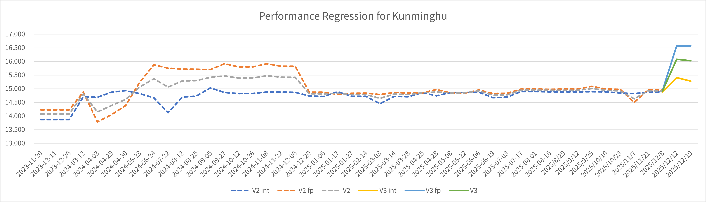

# [XiangShan Biweekly 93] 20260105

Welcome to XiangShan biweekly column! Through this column, we will regularly share the latest development progress of XiangShan.

This is the 93rd issue of the biweekly report.

In the last issue of the biweekly report in 2025, we are excited to announce the performance evaluation results of the current Kunminghu V3 architecture on SPEC CPU2006 for the first time! Since the performance regression of Kunminghu V3 started in August this year, a total of 11 performance regressions have been completed. These 11 performance regressions witness the process of the XiangShan team working together to rapidly develop and iterate on the design. The initial version of Kunminghu V3 scored only 3.717 points/GHz in the SPEC 2006 test. Now, in the latest performance regression, V3 has reached 16.081 points/GHz, surpassing the score of V2. V3 has also replaced V2 as the new mainline of the XiangShan repository!

During this process, ~~the frontend undoubtedly took the biggest blame~~ the most significant change is the brand-new frontend of V3. The new frontend has greatly improved instruction bandwidth, now capable of predicting up to 8 branches and providing 32 instructions per cycle. Meanwhile, the backend and memory subsystem have also increased their throughput capabilities, including increasing from 6 to 8 issue ports and adjusting the sizes of various queues.

It is worth noting that the performance data curve of V3 vividly reflects the agile development philosophy of the XiangShan team. Unlike traditional waterfall development processes, the development of V3 is not a one-time delivery of all code, but rather a result of rapid iteration and continuous evolution based on the initial code. We believe that this new philosophy will bring a new development paradigm to the industry and will certainly help Kunminghu V3 reach new heights, further enhancing the performance benchmark of open-source processors.

We appreciate your companionship and support for XiangShan, and we look forward to your continued attention to the subsequent progress of Kunminghu V3!

In terms of XiangShan development, the frontend has fixed some BPU-related performance bugs and added numerous performance counters for better performance analysis. The backend continues to advance the design of the new vector unit. The memory subsystem has fixed several bugs in V2 and is continuing with V3 module refactoring and infrastructure construction.

<!-- more -->

## Recent Developments

### Frontend

- RTL feature
  - Reduce SRAM write requests when TAGE counters are saturated, thereby reducing stall caused by SRAM port conflicts ([#5309](https://github.com/OpenXiangShan/XiangShan/pull/5309))
  - Align TAGE prediction selection logic with GEM5 ([#5377](https://github.com/OpenXiangShan/XiangShan/pull/5377))
  - Implement SC bias table ([#5234](https://github.com/OpenXiangShan/XiangShan/pull/5234))
  - Implement ITTAGE prediction for call-type branches ([#5311](https://github.com/OpenXiangShan/XiangShan/pull/5311))
- Bug Fix
  - Fix the misuse issue caused by unclear naming between branch address (cfiPc) and prediction block address (startPc) in BPU training ([#5317](https://github.com/OpenXiangShan/XiangShan/pull/5317))
  - Fix UBTB training pipeline hit condition to avoid incorrect replacer updates ([#5326](https://github.com/OpenXiangShan/XiangShan/pull/5326))
  - Fix TAGE folded history signal width typo ([#5325](https://github.com/OpenXiangShan/XiangShan/pull/5325))
  - Fix TAGE cfiPc typo ([#5345](https://github.com/OpenXiangShan/XiangShan/pull/5345))
  - Fix some RAS typos and enable RAS ([#5321](https://github.com/OpenXiangShan/XiangShan/pull/5321))
  - Fix FTQ resolveQueue bpu enqueue flush logic error issue ([#5344](https://github.com/OpenXiangShan/XiangShan/pull/5344))
- Timing/Area optimization
  - Move TAGE BaseTable into MBTB to synchronize counter allocation with MBTB entries, reducing redundant storage ([#5349](https://github.com/OpenXiangShan/XiangShan/pull/5349))
- Code quality improvements
  - Unify the naming of pc-related signals within BPU ([#5318](https://github.com/OpenXiangShan/XiangShan/pull/5318))
  - Add some utility methods to batch generate performance counters with similar prefixes ([#5298](https://github.com/OpenXiangShan/XiangShan/pull/5298))
- Debugging tools
  - Add and fix a large number of performance counters in various modules ([#5320](https://github.com/OpenXiangShan/XiangShan/pull/5320), [#5265](https://github.com/OpenXiangShan/XiangShan/pull/5265), [#5319](https://github.com/OpenXiangShan/XiangShan/pull/5319), [#5332](https://github.com/OpenXiangShan/XiangShan/pull/5332), [#5339](https://github.com/OpenXiangShan/XiangShan/pull/5339), [#5347](https://github.com/OpenXiangShan/XiangShan/pull/5347), [#5353](https://github.com/OpenXiangShan/XiangShan/pull/5353), [#5370](https://github.com/OpenXiangShan/XiangShan/pull/5370), [#5383](https://github.com/OpenXiangShan/XiangShan/pull/5383), [#5372](https://github.com/OpenXiangShan/XiangShan/pull/5372))
  - Optimize the branch real address calculation logic of TAGE Trace, considering compressed instructions ([#5355](https://github.com/OpenXiangShan/XiangShan/pull/5355))

### Backend

- RTL new features
  - implementating the new design of V3 vector unit
- Bug fixes
  - Fix backend TopDown interface connection issues ([#5340](https://github.com/OpenXiangShan/XiangShan/pull/5340))
  - Modify the value of mvendorid ([#5367](https://github.com/OpenXiangShan/XiangShan/pull/5367))
  - Fix Dispatch pipeline stall cycle counting issue ([#5398](https://github.com/OpenXiangShan/XiangShan/pull/5398))
- Code optimizations
  - Make the connection of srcLoadDependencyUpdate more readable ([#5404](https://
- Others
  - Update the list of backend code owners ([#5342](https://github.com/OpenXiangShan/XiangShan/pull/5342))

- RTL new features
  - Advancing the new design implementation of the V3 vector unit
  - (V3) Modify the value of mvendorid ([#5427](https://github.com/OpenXiangShan/XiangShan/pull/5427))
  - (V3) Refactor the vimac64b module, implement the vimac gold model, and add corresponding interfaces to VecSimTop ([YunSuan #193](https://github.com/OpenXiangShan/YunSuan/pull/193))
- Bug fixes
  - (V3) Fix RAS action issue during commit ([#5421](https://github.com/OpenXiangShan/XiangShan/pull/5421))
  - (V2/V3) Fix priority issue causing illegal instruction exception when reading vl/vlenb in CSR read instructions ([#5420](https://github.com/OpenXiangShan/XiangShan/pull/5420), [#5422](https://github.com/OpenXiangShan/XiangShan/pull/5422))
  - (V3) Use basicDebugEn signal in diffVl debug interface ([#5465](https://github.com/OpenXiangShan/XiangShan/pull/5465))
  - (V2) Upgrade NEMU config to fix vfredusum issue ([#5434](https://github.com/OpenXiangShan/XiangShan/pull/5434))
- Timing
  - (V3) Reduce one-cycle delay in redirect ([#5378](https://github.com/OpenXiangShan/XiangShan/pull/5378))
  - (V3) Move the selection of oldestExuRedirect from ctrlblock to intRegion ([#5462](https://github.com/OpenXiangShan/XiangShan/pull/5462))
  - (V3) Separate targetPc into trap and xret paths to optimize timing, handling exceptions and CSR FunctionUnit writebacks respectively ([#5475](https://github.com/OpenXiangShan/XiangShan/pull/5475))
- Code optimizations
  - (V3) Remove some dead code ([#5405](https://github.com/OpenXiangShan/XiangShan/pull/5405), [#5324](https://github.com/OpenXiangShan/XiangShan/pull/5324))
  - (V3) Remove some code connecting with 0.U width ([#5413](https://github.com/OpenXiangShan/XiangShan/pull/5413))
  - (V3) Switch to using CSRs.scala file to keep track of CSR addresses ([#5440](https://github.com/OpenXiangShan/XiangShan/pull/5440))
  - (V3) Configure vl src separately in each parameter class in backend for easier maintenance ([#5368](https://github.com/OpenXiangShan/XiangShan/pull/5368))
- Others

### MemBlock and Cache

- RTL new features
  - The refactoring and testing of MMU, LoadUnit, StoreQueue, L2, etc. is ongoing
- Bug fix
  - Modify the pipe parameter of Pipeline to true in PerfetcgWrapper ([#5275](https://github.com/OpenXiangShan/XiangShan/pull/5275/files))
  - Fix the error of multi-writeback when storeMisalignBuffer is full ([#5415](https://github.com/OpenXiangShan/XiangShan/pull/5415))
  - Remove redundant BEU range exclusion in L2 ([CoupledL2 #457](https://github.com/OpenXiangShan/CoupledL2/pull/457))
  - Sync the pr in V2 to V3
- Code refactoring
  - Remove fdpMonitor and fix some statistics bugs ([#5272](https://github.com/OpenXiangShan/XiangShan/pull/5272))
- Debugging tools
  - Continuous improvement of CHI infrastructure CHIron
  - Develop a verification tool CHI Test for the new version of L2 Cache. Continuous progressing

## Performance Evaluation

| SPECint 2006 est. | @ 3GHz | SPECfp 2006 est. | @ 3GHz |
| :---------------- | :----: | :--------------- | :----: |
| 400.perlbench     | 36.71  | 410.bwaves       | 73.92  |
| 401.bzip2         | 27.45  | 416.gamess       | 54.70  |
| 403.gcc           | 42.71  | 433.milc         | 45.12  |
| 429.mcf           | 59.65  | 434.zeusmp       | 60.17  |
| 445.gobmk         | 35.10  | 435.gromacs      | 38.47  |
| 456.hmmer         | 44.18  | 436.cactusADM    | 54.20  |
| 458.sjeng         | 32.30  | 437.leslie3d     | 52.85  |
| 462.libquantum    | 107.84 | 444.namd         | 37.91  |
| 464.h264ref       | 61.89  | 447.dealII       | 61.38  |
| 471.omnetpp       | 43.56  | 450.soplex       | 54.62  |
| 473.astar         | 30.43  | 453.povray       | 56.90  |
| 483.xalancbmk     | 75.89  | 454.Calculix     | 19.18  |
| GEOMEAN           | 45.85  | 459.GemsFDTD     | 44.14  |
|                   |        | 465.tonto        | 36.35  |
|                   |        | 470.lbm          | 93.88  |
|                   |        | 481.wrf          | 48.77  |
|                   |        | 482.sphinx3      | 56.20  |
|                   |        | GEOMEAN          | 49.72  |

We use SimPoint to sample programs and create checkpoints images based on our custom format. The coverage of SimPoint clustering reaches 100%. Note that the above scores are estimated based on program segments rather than a complete SPEC CPU2006 evaluation, which may deviate from the actual performance of real chips.

Compilation parameters are as follows:

|                    |          |
| ------------------ | -------- |
| Compiler           | gcc12    |
| Optimization level | O3       |
| Memory library     | jemalloc |
| -march             | RV64GCB  |
| -ffp-contraction   | fast     |

Processor and SoC parameters are as follows:

|                |            |
| -------------- | ---------- |
| Commit         | 64e7bff7f  |
| Date           | 12/19/2025 |
| L1 ICache      | 64KB       |
| L1 DCache      | 64KB       |
| L2 Cache       | 1MB        |
| L3 Cache       | 16MB       |
| LSU            | 3ld2st     |
| Bus protocol   | TileLink   |
| Memory latency | DDR4-3200  |

## Related links

- XiangShan technical discussion QQ group: 879550595
- XiangShan technical discussion website: <https://github.com/OpenXiangShan/XiangShan/discussions>
- XiangShan Documentation: <https://xiangshan-doc.readthedocs.io/>
- XiangShan User Guide: <https://docs.xiangshan.cc/projects/user-guide/>
- XiangShan Design Doc: <https://docs.xiangshan.cc/projects/design/>

Editors: Zhihao Xu, Junxiong Ji, Zhuo Chen, Junjie Yu, Yanjun Li
