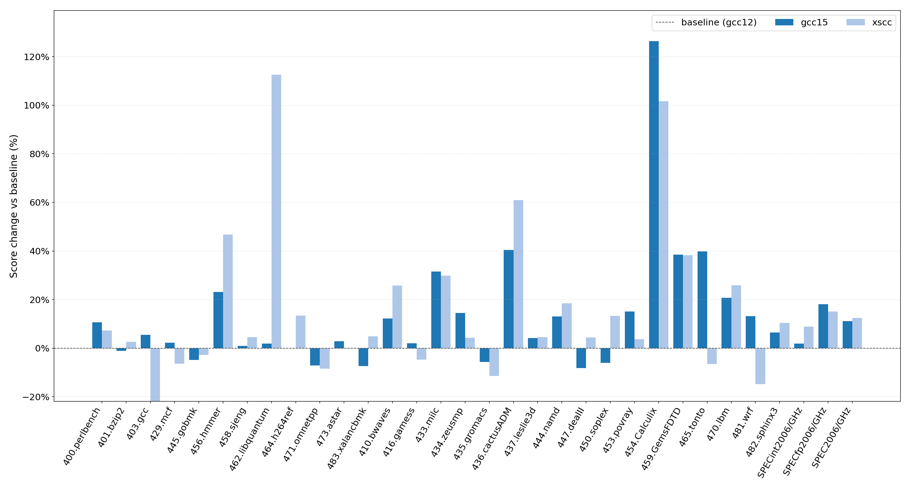

# [XiangShan Biweekly 96] 20260216

Welcome to XiangShan biweekly column! Through this column, we will regularly share the latest development progress of XiangShan. This is the 96th issue of the biweekly report.

The high-performance DDR4 memory controller IP, Baiyang, developed by the XiangShan team has been officially released! If you haven't read it yet, please check out our [Baiyang release article](https://mp.weixin.qq.com/s/ovHD6oHDHgMaVwybmnk_lw/) for more details. Here, we would like to share an exclusive story with you. On January 31st, XiangShan presented a tutorial at HPCA 2026, which included an introduction to Baiyang. The night before the presentation, Baiyang was still being prepared for open source, and the repository was made public just before the tutorial started the next day. ~~Deadlines are indeed the best productivity boosters~~.

Last week, we introduced new GCC15 and XSCC compilers. These two compilers offer more than 10% performance improvement compared to the existing GCC12. Now, XiangShan's SPEC CPU2006 performance has reached 18.5 points/GHz. In this issue of the biweekly report, we provide a comparative analysis of different compilers. In future development, we will gradually switch to GCC15 and XSCC compilers, while focusing more on compiler and hardware co-optimization. The specific scores for different compilers are still in the performance evaluation section, so stay tuned!

In terms of recent development progress, on the frontend side, MBTB has introduced the LRU replacement algorithm and uses accurate prediction results from TAGE-SC for updates to improve branch prediction accuracy. On the backend side, an I2F functional unit has been added to support i2f type instructions of FMV and FCVT, and og1Payload has been added to the integer IQ to optimize selection timing. In terms of memory access and cache, the timeout judgment logic in Sbuffer has been fixed, and the timeout threshold is configured through SMBLOCKCTL in CSR. For more details, please refer to the recent progress section.

<!-- more -->

## Compiler Optimization

In the past, the performance evaluation in the biweekly report has always used the ancestral slices compiled with GCC12. These slices were sufficient for the relatively low-performance Kunming Lake V2 era, but as the performance of Kunming Lake V3 continues to iterate and compiler technology develops, the original slices can no longer fully demonstrate XiangShan's performance potential. Last week, we recompiled SPEC CPU2006 using GCC15 and XSCC compilers and compared the performance under different compilers and optimization options. The results are shown in the figure below:

It can be seen that simply switching compilers can improve the overall score by about 12%. Among them, GCC15, when the -ffast-math optimization option is enabled, can achieve nearly 20% improvement for floating-point test programs. For the libquantum sub-item, XSCC can achieve an astonishing improvement of about 110%, ~~truly a score-boosting sub-item~~.

There is also an interesting phenomenon: XSCC shows about a 20% performance regression in the GCC sub-item. XSCC is based on LLVM, ~~it sounds surprisingly reasonable that LLVM is not good at optimizing GCC~~.

## Tutorial @ HPCA 2026

XiangShan successfully held a tutorial at HPCA 2026! We are very happy to meet everyone in Sydney, and we thank every participant and friend who cares about XiangShan's development! Please visit <https://tutorial.xiangshan.cc/hpca26/> to review the content of this tutorial and get the slides.

We continuously optimize the tutorial content based on the hosting effect and everyone's feedback, hoping to provide new friends with a clearer, more comprehensive, and in-depth introduction while also bringing new gains to old friends. The highlights in this tutorial include:

- The latest in-development KMH-V3 microarchitecture design philosophy, insights and design details.
- A new, independent introduction to our MinJie (agile) development toolchain.
- Invited talks from our partners, on:
  - XSCC, a high-performance compiler optimized for RISC-V and XiangShan, and

    
  - Baiyang, a high-performance open-source DDR controller IP.

    Unfortunately, the original speaker could not attend the event due to visa issues, so a member of the XiangShan team introduced it instead. We will continue to communicate with Baiyang team and look forward to inviting their member for a more in-depth introduction at the next tutorial!
- A more thorough and easy-to-use hands-on part based on code-server and jupyter notebook. We encourage everyone to use the docker environment and precompiled assets provided in <https://github.com/OpenXiangShan/bootcamp>.

During the coffee break, we had in-depth communication with excellent scholars from all over the world. We cherish the opportunity to communicate with everyone face-to-face, which can help everyone better understand the design of XiangShan microarchitecture and the use of agile toolchain, and make XiangShan a better infrastructure for academic research and industrial applications; on the other hand, it can also help us better understand everyone's feedback and innovative ideas, and continuously improve our design and toolchain. Thanks to every friend who participated in the communication! For those who could not attend, please feel free to communicate with us through <all@xiangshan.cc> mailing list, Github Issues, technical discussion QQ group, etc.

By the way, XiangShan's next tutorial will be held at the [ISCA 2026](https://iscaconf.org/isca2026/) conference in the United States in late June, looking forward to seeing everyone again!

## Recent Developments

### Frontend

In the past two weeks, due to several team members attending HPCA 2026 and the Spring Festival holiday, there are no new PRs merged into the mainline. The ongoing/awaiting review progress includes:

- Bug fixes
  - Fix the training condition of SC which does not check whether MBTB is hit, and leads to training with invalid data ([#5601](https://github.com/OpenXiangShan/XiangShan/pull/5601))
  - Fix the issue that saturate counters in MBTB baseTable are not updated when the branch is correctly predicted ([#5602](https://github.com/OpenXiangShan/XiangShan/pull/5602))
- Timing/Area optimization
  - In the early development of the V3 frontend, the main focus was on the functional implementation and performance tuning of the BPU rewrite to the region-BTB structure. As the functionality gradually stabilized in the recent month, intensive timing evaluation work was conducted. ~~As expected, it was a huge failure, with logic levels reaching three digits.~~ The issues were mainly concentrated on insufficient consideration of pipeline stage division and the use of inappropriate Scala magic for quick implementation, etc.. We have conducted multiple rounds of analysis and fixes for these issues. Some of the fixes for modules such as MBTB, TAGE, ICache were introduced in the previous two biweekly reports. The ongoing work in the past two weeks includes:
    - Adjusting BPU s2 pipeline stage, with some information from MBTB given to TAGE earlier ([#5614](https://github.com/OpenXiangShan/XiangShan/pull/5614))
    - Adjusting the pipeline stage of MBTB position comparison logic ([#5603](https://github.com/OpenXiangShan/XiangShan/pull/5603))
    - Adjusting the pipeline stage of UTAGE history information ([#5517](https://github.com/OpenXiangShan/XiangShan/pull/5517))
    - Fixing some serial logic inside SC (no PR for the moment)
    - Adjusting the pipeline stage of ICache parity check logic (no PR for the moment)
    - Further evaluation and fixes are ongoing

### Backend

- RTL new features
  - Add I2F FU to support i2f types of FMV and FCVT ([#5557](https://github.com/OpenXiangShan/XiangShan/pull/5557), [#5577](https://github.com/OpenXiangShan/XiangShan/pull/5577))
  - Support Smcntrpmf extension ([#4286](https://github.com/OpenXiangShan/XiangShan/pull/4286))
- Timing/Area optimization
  - Add one cycle between csrToDecode and Decode ([#5542](https://github.com/OpenXiangShan/XiangShan/pull/5542))
  - Transfer ALU data processing from Bypass to ALU ([#5562](https://github.com/OpenXiangShan/XiangShan/pull/5562))
  - Add og1Payload to integer IQ, selecting signals only used in OG1 to optimize IQ selection timing ([#5570](https://github.com/OpenXiangShan/XiangShan/pull/5570))
- Bug Fix
  - Fix the redirect.valid signal from functional unit writeback, and the mis_pred and total flush issues in TopDown ([#5538](https://github.com/OpenXiangShan/XiangShan/pull/5538))
  - Fix the repeated use of RegNext in NewCSR ([#5441](https://github.com/OpenXiangShan/XiangShan/pull/5441))
  - Fix the incorrect assumption of flushpipe on redirect.interrupt in ROB ([#5583](https://github.com/OpenXiangShan/XiangShan/pull/5583))
- Code Quality
  - Refactor all resps signals to simplify code logic ([#5537](https://github.com/OpenXiangShan/XiangShan/pull/5537))
  - Optimize code quality of resps signals ([#5550](http://github.com/OpenXiangShan/XiangShan/pull/5550))
  - Remove some redundant code in IsssueQueue, adjust wakeup pdest width, add ROB bankNum parameter ([#5051](https://github.com/OpenXiangShan/XiangShan/pull/5051))
  - Refactor vialuf to support fast wakeup ([#5136](https://github.com/OpenXiangShan/XiangShan/pull/5136))
  - Remove unused code in Datapath ([#5567](https://github.com/OpenXiangShan/XiangShan/pull/5567))
  - Refactor Bundle for writeback to ROB and Regfile ([#5535](https://github.com/OpenXiangShan/XiangShan/pull/5535))
  - Integrate signals, use EnqRObUop instead of DynInst to reduce redundant signals ([#5560](http://github.com/OpenXiangShan/XiangShan/pull/5560))
  - Remove unused IntToFP functional unit ([#5586](https://github.com/OpenXiangShan/XiangShan/pull/5586))
- Structural Adjustment
  - Remove fudian submodule, Kunming Lake V3 will no longer use fudian repository content as a submodule ([#5585](https://github.com/OpenXiangShan/XiangShan/pull/5585))

### MemBlock and Cache

- RTL new features
  - The refactoring and testing of MMU, LoadUnit, StoreQueue, L2, etc. is ongoing
  - Support MDP of StoreSet and fix some bugs ([#5576](https://github.com/OpenXiangShan/XiangShan/pull/5576))
- Bug fix
  - Fix bug that ICG is invalid when disable mbist in CoupledL2 ([CoupledL2 #470](https://github.com/OpenXiangShan/CoupledL2/pull/470))
- Debugging tools
  - Develop a verification tool CHI Test for the new version of L2 Cache. Continuous progressing

## Performance Evaluation

Processor and SoC parameters are as follows:

| Parameters     | Options    |
| -------------- | ---------- |
| Commit         | fd1e37f95  |
| Date           | 01/16/2026 |
| L1 ICache      | 64KB       |
| L1 DCache      | 64KB       |
| L2 Cache       | 1MB        |
| L3 Cache       | 16MB       |
| LSU            | 3ld2st     |
| Bus protocol   | CHI        |
| Memory latency | DDR4-3200  |

The SPEC CPU2006 scores are as follows:

| SPECint 2006   | GCC12 @3GHz | GCC15 @3GHz | XSCC @3GHz | SPECfp 2006   | GCC12 @3GHz | GCC15 @3GHz | XSCC @3GHz |
| :------------- | :---------: | :---------: | :--------: | :------------ | :---------: | :---------: | :--------: |
| 400.perlbench  |    38.87    |    43.00    |   41.70    | 410.bwaves    |    72.14    |    80.98    |   90.75    |
| 401.bzip2      |    27.05    |    26.74    |   27.75    | 416.gamess    |    54.49    |    55.54    |   51.90    |
| 403.gcc        |    47.55    |    50.17    |   37.16    | 433.milc      |    49.10    |    64.58    |   63.76    |
| 429.mcf        |    58.23    |    59.55    |   54.50    | 434.zeusmp    |    60.60    |    69.41    |   63.22    |
| 445.gobmk      |    37.34    |    35.51    |   36.30    | 435.gromacs   |    38.34    |    36.19    |   34.00    |
| 456.hmmer      |    43.11    |    53.10    |   63.26    | 436.cactusADM |    53.57    |    75.24    |   86.24    |
| 458.sjeng      |    34.47    |    34.80    |   36.03    | 437.leslie3d  |    54.20    |    56.48    |   56.64    |
| 462.libquantum |   132.83    |   135.28    |   282.43   | 444.namd      |    37.28    |    42.16    |   44.17    |
| 464.h264ref    |    62.00    |    61.95    |   70.30    | 447.dealII    |    64.13    |    58.88    |   66.92    |
| 471.omnetpp    |    42.63    |    39.60    |   39.03    | 450.soplex    |    52.43    |    49.25    |   59.39    |
| 473.astar      |    30.37    |    31.22    |   30.31    | 453.povray    |    61.43    |    70.66    |   63.65    |
| 483.xalancbmk  |    80.42    |    74.48    |   84.38    | 454.Calculix  |    19.37    |    43.84    |   39.05    |
| GEOMEAN        |    47.69    |    48.61    |   51.93    | 459.GemsFDTD  |    46.59    |    64.51    |   64.40    |
|                |             |             |            | 465.tonto     |    36.20    |    50.61    |   33.84    |
|                |             |             |            | 470.lbm       |   104.99    |   126.71    |   132.13   |
|                |             |             |            | 481.wrf       |    48.68    |    55.06    |   41.45    |
|                |             |             |            | 482.sphinx3   |    55.06    |    58.58    |   60.80    |
|                |             |             |            | GEOMEAN       |    50.56    |    59.73    |   58.16    |

Compilation parameters are as follows:

| Parameters                  | GCC12    | GCC15       | XSCC                |
| --------------------------- | -------- | ----------- | ------------------- |
| Compiler                    | gcc12    | gcc15       | xscc                |
| Optimization level          | O3       | O3          | O3                  |
| Memory library              | jemalloc | jemalloc    | jemalloc            |
| -march                      | RV64GCB  | RV64GCB     | RV64GCB             |
| -ffp-contraction            | fast     | fast        | fast                |
| Linker optimization         | -        | -flto       | -flto               |
| Floating-point optimization | -        | -ffast-math | -ffast-math         |
| -mcpu                       | -        | -           | xiangshan-kunminghu |

Note: We use SimPoint to sample the programs and create checkpoint images based on our custom checkpoint format, with a SimPoint clustering coverage of 100%. The above scores are estimates based on program segments, not full SPEC CPU2006 evaluations, and may differ from actual chip performance.

## Related links

- XiangShan technical discussion QQ group: 879550595
- XiangShan technical discussion website: <https://github.com/OpenXiangShan/XiangShan/discussions>
- XiangShan Documentation: <https://xiangshan-doc.readthedocs.io/>
- XiangShan User Guide: <https://docs.xiangshan.cc/projects/user-guide/>
- XiangShan Design Doc: <https://docs.xiangshan.cc/projects/design/>

Editors: Zhihao Xu, Junxiong Ji, Zhuo Chen, Junjie Yu, Yanjun Li
