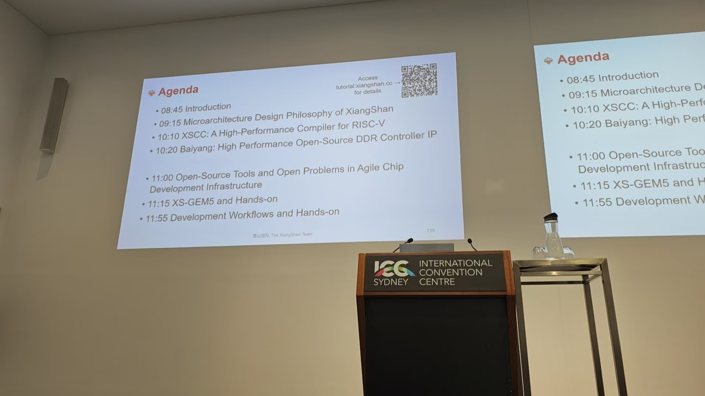
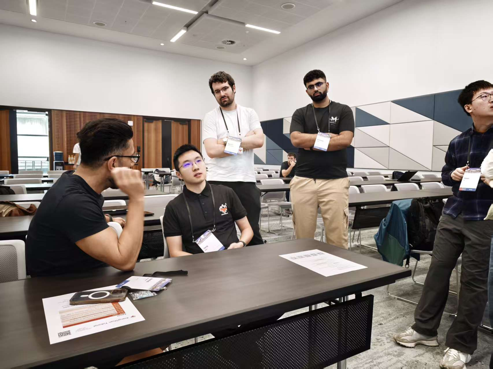

# 【香山双周报 97】20260302 期

欢迎来到香山双周报专栏，我们将通过这一专栏定期介绍香山的开发进展。本次是第 97 期双周报。

祝大家新春快乐！欢迎在新春佳节来到我们的双周报专栏，祝您在新的一年：

- 前端拥有天马行空般的精准预测，事业机遇从不误判；
- 流水线奔腾如万马千军，万事顺遂并行不悖；
- 存储子系统如龙马精神永葆活力，快乐数据取之不尽；
- 访存通路如辽阔草原，幸福地址永远映射在心间；
- 缓存层次温暖如春，每一份珍贵回忆都触手可及；
- 总线带宽如千里骏马，好运信号即刻抵达身边！

我们还为大家分享了香山团队在 HPCA 2026 上举办 tutorial 的精彩回顾，欢迎大家访问 <https://tutorial.xiangshan.cc/hpca26/> 回顾本次 tutorial 的内容、获取 slides。下一场 tutorial 将于 6 月下旬在美国北卡罗莱纳州罗利市举办的 [ISCA 2026](https://iscaconf.org/isca2026/) 会议上进行，非常期待与大家再次相见！

关于香山近期开发进展，~~香山的同学们也在度过快乐的春节。~~不多的细节请见近期进展一节。

<!-- more -->

## Tutorial @ HPCA 2026

香山在 HPCA 2026 上成功举办 Tutorial！我们非常高兴能与大家在悉尼相见，感谢每一位参会的朋友和关心香山发展的伙伴们！

我们持续根据举办效果和大家的反馈对 tutorial 内容进行优化，希望在给新朋友们提供更清晰、全面和深度的介绍的同时，也能给老朋友们带来新的收获。本次 tutorial 的主要改进在于：

- 分享了最新的正在开发中的昆明湖-V3 微架构的设计哲学、观察和实现细节。
- 增加了对敏捷开发工具链的系统介绍和理念分享。
- 很荣幸地邀请到了我们的合作伙伴关于 XSCC 和白杨内存控制器的介绍：
  - XSCC：针对 RISC-V 优化的高性能编译器；

    
  - 白杨内存控制器：高性能开源内存控制器 IP。

    很遗憾的是，原定主讲人因签证问题没能来到现场，转而由香山团队成员代替介绍。我们会持续沟通，期待在下次 tutorial 上邀请到白杨团队的同学来进行更深入的介绍！
- 持续对 bootcamp 上手环节进行更新，欢迎大家使用 <https://github.com/OpenXiangShan/bootcamp> 仓库提供的 docker 环境和预编译 assets 进行本地体验！

在现场的茶歇时间中，我们与来自世界各地的优秀学者进行了深入的交流。我们非常珍惜与大家面对面交流的机会，这一方面能让大家更好地了解香山微架构的设计和敏捷工具链的使用，让香山更好地成为学术研究和工业应用的基石；另一方面也能让我们更好地了解大家的反馈和创新想法，持续改进我们的设计和工具链。感谢每一位参与交流的朋友们！也欢迎未能到场的朋友们通过 <all@xiangshan.cc> 邮件列表、Github Issues、文末所列的技术讨论 QQ 群等渠道与我们交流。

## 近期进展

### 前端

前端组近两周由于多位组员参加 HPCA 2026 及春节放假，暂无新合入主线的 PR，正在进行/等待 review 的进展包括：

- Bug 修复
  - 修复 SC 训练条件未判断 MBTB 是否命中，导致用无效数据训练的问题（[#5601](https://github.com/OpenXiangShan/XiangShan/pull/5601)）
  - 修复 MBTB 中 baseTable 在正确预测时饱和计数器未更新的问题（[#5602](https://github.com/OpenXiangShan/XiangShan/pull/5602)）
- 时序/面积优化
  - 在 V3 前端的前期开发中，主要以 BPU 重写为 region-BTB 结构的功能实现和性能调优为主。近一个月功能逐渐稳定，故进行了密集的时序评估工作。~~不出意料地大暴死了，什么叫逻辑级数直奔3位数。~~问题主要集中在流水级划分未仔细考虑、使用不合适的 Scala 魔法进行快速实现等。针对这些，我们进行了多轮分析和修复。前两次双周报已经介绍过一些 MBTB、TAGE、ICache 等模块的修复。近两周仍在继续的工作有：
    - 调整 BPU s2 流水级，MBTB 部分信息提前给到 TAGE（[#5614](https://github.com/OpenXiangShan/XiangShan/pull/5614)）
    - 调整 MBTB 位置比较逻辑流水级（[#5603](https://github.com/OpenXiangShan/XiangShan/pull/5603)）
    - 调整 UTAGE 历史信息流水级（[#5517](https://github.com/OpenXiangShan/XiangShan/pull/5517)）
    - 修复 SC 内部部分串行逻辑（暂未 PR）
    - 调整 ICache parity 校验逻辑流水级（暂未 PR）
    - 进一步评估和修复持续进行中

### 后端

- 暂无进展

### 访存与缓存

- RTL 新特性
  - MMU、LoadUnit、StoreQueue、L2 等模块重构与测试持续推进中
  - 新版 StoreSet MDP 合入主线并修复若干错误（[#5576](https://github.com/OpenXiangShan/XiangShan/pull/5576)）
- Bug 修复
  - 修复了 CoupledL2 中禁用mbist时ICG无效的错误（[CoupledL2 #470](https://github.com/OpenXiangShan/CoupledL2/pull/470)）
- 调试工具
  - 开发用于新版 L2 Cache 的验证工具 CHI Test。持续推进中

## 性能评估

处理器及 SoC 参数如下所示：

| 参数      | 选项       |
| --------- | ---------- |
| commit    | 316946d28  |
| 日期      | 2026/02/11 |
| L1 ICache | 64KB       |
| L1 DCache | 64KB       |
| L2 Cache  | 1MB        |
| L3 Cache  | 16MB       |
| 访存单元  | 3ld2st     |
| 总线协议  | CHI        |
| 内存延迟  | DDR4-3200  |

性能数据如下所示：

| SPECint 2006 @ 3GHz | GCC15  |  XSCC  | GCC12  | SPECfp 2006 @ 3GHz | GCC15  |  XSCC  | GCC12  |
| :------------------ | :----: | :----: | :----: | :----------------- | :----: | :----: | :----: |
| 400.perlbench       | 47.31  | 46.45  | 43.61  | 410.bwaves         | 85.75  | 90.56  | 73.28  |
| 401.bzip2           | 27.00  | 27.83  | 27.51  | 416.gamess         | 56.09  | 52.50  | 54.94  |
| 403.gcc             | 50.77  | 37.33  | 51.30  | 433.milc           | 64.70  | 63.73  | 49.28  |
| 429.mcf             | 59.77  | 54.36  | 60.69  | 434.zeusmp         | 69.45  | 63.50  | 60.37  |
| 445.gobmk           | 35.62  | 36.59  | 37.44  | 435.gromacs        | 36.43  | 34.17  | 38.56  |
| 456.hmmer           | 53.68  | 63.60  | 43.52  | 436.cactusADM      | 75.62  | 86.54  | 53.69  |
| 458.sjeng           | 35.34  | 36.40  | 34.82  | 437.leslie3d       | 56.57  | 56.81  | 54.45  |
| 462.libquantum      | 135.53 | 285.26 | 133.21 | 444.namd           | 42.06  | 44.19  | 37.42  |
| 464.h264ref         | 62.41  | 71.27  | 63.01  | 447.dealII         | 63.32  | 67.16  | 64.28  |
| 471.omnetpp         | 40.88  | 39.25  | 43.04  | 450.soplex         | 49.19  | 57.92  | 53.33  |
| 473.astar           | 31.19  | 30.28  | 30.34  | 453.povray         | 72.39  | 66.59  | 61.60  |
| 483.xalancbmk       | 74.54  | 84.92  | 80.96  | 454.Calculix       | 44.18  | 39.20  | 19.43  |
| GEOMEAN             | 49.39  | 52.67  | 48.92  | 459.GemsFDTD       | 64.84  | 64.68  | 46.68  |
|                     |        |        |        | 465.tonto          | 51.71  | 34.73  | 36.69  |
|                     |        |        |        | 470.lbm            | 126.78 | 132.83 | 104.98 |
|                     |        |        |        | 481.wrf            | 55.25  | 41.58  | 48.68  |
|                     |        |        |        | 482.sphinx3        | 58.51  | 61.17  | 55.05  |
|                     |        |        |        | GEOMEAN            | 60.48  | 58.50  | 50.80  |

编译参数如下所示：

| 参数             | GCC12    | GCC15       | XSCC                |
| ---------------- | -------- | ----------- | ------------------- |
| 编译器           | gcc12    | gcc15       | xscc                |
| 编译优化         | O3       | O3          | O3                  |
| 内存库           | jemalloc | jemalloc    | jemalloc            |
| -march           | RV64GCB  | RV64GCB     | RV64GCB             |
| -ffp-contraction | fast     | fast        | fast                |
| 链接优化         | -        | -flto       | -flto               |
| 浮点优化         | -        | -ffast-math | -ffast-math         |
| -mcpu            | -        | -           | xiangshan-kunminghu |

注：我们使用 SimPoint 对程序进行采样，基于我们自定义的 checkpoint 格式制作检查点镜像，Simpoint 聚类的覆盖率为 100%。上述分数为基于程序片段的分数估计，非完整 SPEC CPU2006 评估，和真实芯片实际性能可能存在偏差。

## 相关链接

- 香山技术讨论 QQ 群：879550595
- 香山技术讨论网站：<https://github.com/OpenXiangShan/XiangShan/discussions>
- 香山文档：<https://xiangshan-doc.readthedocs.io/>
- 香山用户手册：<https://docs.xiangshan.cc/projects/user-guide/>
- 香山设计文档：<https://docs.xiangshan.cc/projects/design/>

编辑：徐之皓、吉骏雄、陈卓、余俊杰、李衍君
