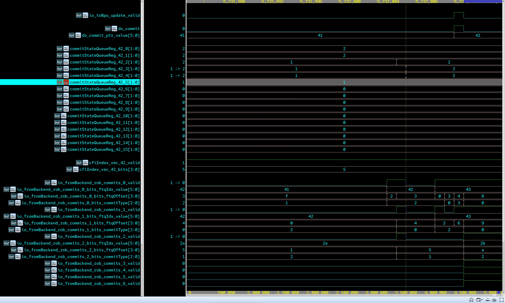
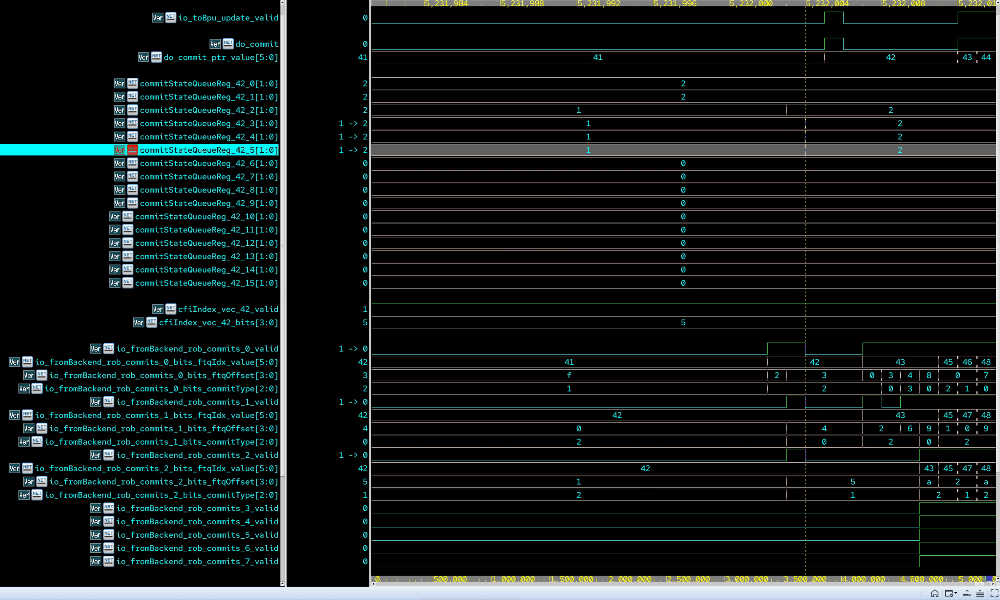
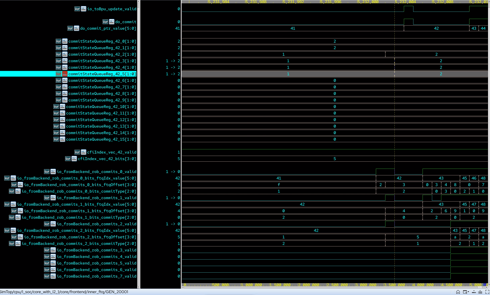

# [XiangShan Biweekly 98] 20260316

Welcome to XiangShan biweekly column! Through this column, we will regularly share the latest development progress of XiangShan. This is the 98th issue of the biweekly report.

Regarding the recent development progress of XiangShan, ~~the XiangShan team had a happy Chinese New Year holiday~~. For more details, please refer to the Recent Developments section. ~~But it's not all for nothing~~, we also prepared a little fun fact about the development of XiangShan for everyone.

<!-- more -->

## A week of fighting with verilator

In the development of XiangShan, simulators are very important infrastructure. To implement the open-source philosophy, we have been using the open-source simulator verilator in the development and part of the verification work of XiangShan. Even now that we have our own simulator gsim, verilator still plays an irreplaceable role in functional verification, ~~because gsim does not support waveform dumping yet~~. In addition, during the development of gsim, verilator has always been an important reference platform to help us verify the correctness and performance of gsim.

On an ordinary day, L was suddenly asked to take the blame for an assertion triggered in the frontend FTQ module. This would not be a big deal, ~~if this assert was not triggered on the master branch that has already been frozen for delivery~~. L happily opened the error waveform and after looking at it for a while, he felt something was wrong because the signal `commitStateQueueReg_42_5` miraculously did not change, which caused FTQ to make wrong judgment on commit state.

L thought it must be the hallucination caused by taking too much blame. He pulled X to manually execute the verilog code together with him. However, unfortunately, X had the same hallucination as him, and it seemed that according to the logic of the verilog code, `commitStateQueueReg_42_5` should change from `1` to `2` after the dashed line.

At this time, L and X judged that it must be a bug in verilator, but another X insisted that even if it is a bug in verilator, we should confirm it again, ~~otherwise how can we believe the verification so far is correct~~.

Since XiangShan is set with the `--trace` option, verilator will not print signals that start with an underscore, such as `_GEN_350234`, in the waveform. L decided to first replace all signals like `_GEN_350234` in the FTQ module with `GEN_350234`, so that they can be seen in the waveform. After he generated the waveform again, he found that `commitStateQueueReg_42_5` miraculously changed again, from `1` to `2` at the dashed line.

L was a bit frustrated. He replaced the `--trace` option with `--trace-underscore`, and without changing the code, printed all the underscore signals in the waveform, and found that `commitStateQueueReg_42_5` also changed correctly.

L was completely frustrated. He did not want to look at the C++ code generated by verilator, and felt that this pot should not continue to be taken by him. He threw this problem to the verilator community and updated the verilator version. This problem did disappear, but whether it really disappeared or quietly hid deeper, let's wait until the next time we encounter it. L just felt that staring at the waveform for a week made his eyes almost blind.

## Recent Developments

### Frontend

- RTL features
  - Support branch-level prediction in UTAGE ([#5513](https://github.com/OpenXiangShan/XiangShan/pull/5513))
  - Support configurable threshold range ([#5632](https://github.com/OpenXiangShan/XiangShan/pull/5632))
  - Implement SC IMLI table ([#5671](https://github.com/OpenXiangShan/XiangShan/pull/5671))
- Bug fixes
  - Fix the issue that saturate counters in MBTB baseTable are not updated when the branch is correctly predicted ([#5602](https://github.com/OpenXiangShan/XiangShan/pull/5602))
  - Fix history restore logic on s3 override ([#5625](https://github.com/OpenXiangShan/XiangShan/pull/5625))
  - Fix the bug in TAGE entry allocation logic, which causes the allocation failure rate to soar after running for a while ([#5677](https://github.com/OpenXiangShan/XiangShan/pull/5677))
- Timing/Area optimization
  - Fix the timing of SC training logic ([#5648](https://github.com/OpenXiangShan/XiangShan/pull/5648))
- Code quality
  - Fix the issue of incorrect bit width display of cfiPosition in MBTB compile-time logs, which does not affect the actual RTL functionality ([#5638](https://github.com/OpenXiangShan/XiangShan/pull/5638))
  - Fix MBTB compile-time warning ([#5543](https://github.com/OpenXiangShan/XiangShan/pull/5543))
- Debugging tools
  - Refactor the performance counters for prediction sources ([#5639](https://github.com/OpenXiangShan/XiangShan/pull/5639))

### Backend

- RTL new features
  - (V2) Add hartIDDmodeWidth to select readable mhartid bits under debug mode ([#5627](https://github.com/OpenXiangShan/XiangShan/pull/5627))
- Bug fixes
  - Fix the data output of v0 in vldMergeUnit ([#5675](https://github.com/OpenXiangShan/XiangShan/pull/5675))
- Timing optimization
  - Reduce bju IssueQueue's size, fix IssueQueue's ready timing, fix timing of interrupt selection ([#5636](https://github.com/OpenXiangShan/XiangShan/pull/5636))
  - Move RatWrapper to Rename to check Rename timing ([#5637](https://github.com/OpenXiangShan/XiangShan/pull/5637))
- Code quality
  - Improve multiple code quality issues including the Issue section ([#5652](https://github.com/OpenXiangShan/XiangShan/pull/5652))

### MemBlock and Cache

- RTL new features
  - The refactoring and testing of MMU, LoadUnit, StoreQueue, L2, etc. is ongoing
  - Increase mmioBridgeSize to 16 for better NC perf ([CoupledL2 #475](https://github.com/OpenXiangShan/CoupledL2/pull/475))
- Bug fixes
  - Sync V2 changes to V3
  - Hold LikelyShared on retried writes in CoupledL2 ([CoupledL2 #474](https://github.com/OpenXiangShan/CoupledL2/pull/474))
- Timing fixes
  - Generate gpaddr by bitwise-Or instead of adder ([#5644](https://github.com/OpenXiangShan/XiangShan/pull/5644))
- Performance fixes refactoring
  - Restore performance considering async depth is 4 ([CoupledL2 #472](https://github.com/OpenXiangShan/CoupledL2/pull/472))

## Performance Evaluation

Processor and SoC parameters are as follows:

| Parameters     | Options    |
| -------------- | ---------- |
| Commit         | 316946d28  |
| Date           | 02/11/2026 |
| L1 ICache      | 64KB       |
| L1 DCache      | 64KB       |
| L2 Cache       | 1MB        |
| L3 Cache       | 16MB       |
| LSU            | 3ld2st     |
| Bus protocol   | CHI        |
| Memory latency | DDR4-3200  |

The SPEC CPU2006 scores are as follows:

| SPECint 2006 @ 3GHz | GCC15  |  XSCC  | GCC12  | SPECfp 2006 @ 3GHz | GCC15  |  XSCC  | GCC12  |
| :------------------ | :----: | :----: | :----: | :----------------- | :----: | :----: | :----: |
| 400.perlbench       | 47.47  | 46.45  | 43.61  | 410.bwaves         | 85.75  | 90.56  | 73.28  |
| 401.bzip2           | 27.12  | 27.83  | 27.51  | 416.gamess         | 56.30  | 52.50  | 54.94  |
| 403.gcc             | 50.86  | 37.33  | 51.30  | 433.milc           | 64.92  | 63.73  | 49.28  |
| 429.mcf             | 59.70  | 54.36  | 60.69  | 434.zeusmp         | 69.45  | 63.50  | 60.37  |
| 445.gobmk           | 35.66  | 36.59  | 37.44  | 435.gromacs        | 36.47  | 34.17  | 38.56  |
| 456.hmmer           | 53.69  | 63.60  | 43.52  | 436.cactusADM      | 75.62  | 86.54  | 53.69  |
| 458.sjeng           | 35.56  | 36.40  | 34.82  | 437.leslie3d       | 56.60  | 56.81  | 54.45  |
| 462.libquantum      | 135.55 | 285.26 | 133.21 | 444.namd           | 42.30  | 44.19  | 37.42  |
| 464.h264ref         | 62.47  | 71.27  | 63.01  | 447.dealII         | 63.89  | 67.16  | 64.28  |
| 471.omnetpp         | 40.89  | 39.25  | 43.04  | 450.soplex         | 49.21  | 57.92  | 53.33  |
| 473.astar           | 31.75  | 30.28  | 30.34  | 453.povray         | 72.35  | 66.59  | 61.60  |
| 483.xalancbmk       | 74.63  | 84.92  | 80.96  | 454.Calculix       | 44.24  | 39.20  | 19.43  |
| GEOMEAN             | 49.54  | 52.67  | 48.92  | 459.GemsFDTD       | 64.85  | 64.68  | 46.68  |
|                     |        |        |        | 465.tonto          | 51.73  | 34.73  | 36.69  |
|                     |        |        |        | 470.lbm            | 126.78 | 132.83 | 104.98 |
|                     |        |        |        | 481.wrf            | 55.26  | 41.58  | 48.68  |
|                     |        |        |        | 482.sphinx3        | 58.58  | 61.17  | 55.05  |
|                     |        |        |        | GEOMEAN            | 60.58  | 58.50  | 50.80  |

Compilation parameters are as follows:

| Parameters                  | GCC12    | GCC15       | XSCC                |
| --------------------------- | -------- | ----------- | ------------------- |
| Compiler                    | gcc12    | gcc15       | xscc                |
| Optimization level          | O3       | O3          | O3                  |
| Memory library              | jemalloc | jemalloc    | jemalloc            |
| -march                      | RV64GCB  | RV64GCB     | RV64GCB             |
| -ffp-contraction            | fast     | fast        | fast                |
| Linker optimization         | -        | -flto       | -flto               |
| Floating-point optimization | -        | -ffast-math | -ffast-math         |
| -mcpu                       | -        | -           | xiangshan-kunminghu |

Note: We use SimPoint to sample the programs and create checkpoint images based on our custom checkpoint format, with a SimPoint clustering coverage of 100%. The above scores are estimates based on program segments, not full SPEC CPU2006 evaluations, and may differ from actual chip performance.

## Related links

- XiangShan technical discussion QQ group: 879550595
- XiangShan technical discussion website: <https://github.com/OpenXiangShan/XiangShan/discussions>
- XiangShan Documentation: <https://xiangshan-doc.readthedocs.io/>
- XiangShan User Guide: <https://docs.xiangshan.cc/projects/user-guide/>
- XiangShan Design Doc: <https://docs.xiangshan.cc/projects/design/>

Editors: Zhihao Xu, Junxiong Ji, Zhuo Chen, Junjie Yu, Yanjun Li
