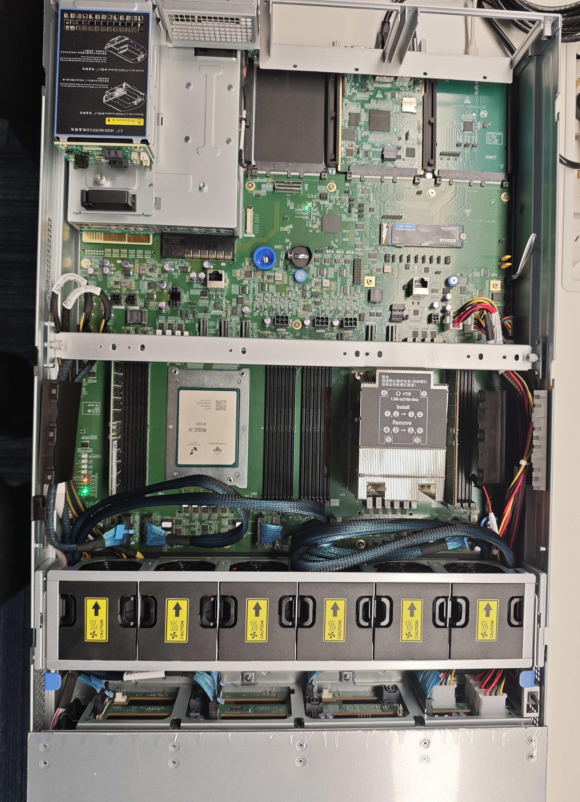

# [XiangShan Biweekly 99] 20260330

Welcome to XiangShan biweekly column! Through this column, we will regularly share the latest development progress of XiangShan. This is the 99th issue of the biweekly report.

On March 26th, "XiangShan" + "Ruyi" were officially released at the ZGC Forum Annual Conference! Readers of the biweekly report are probably already familiar with XiangShan, so we won't go into details here. Ruyi (openRuyi) is a RISC-V native operating system jointly developed by the Institute of Software, Chinese Academy of Sciences and the Ruyi community. During the development process, it closely collaborates with the XiangShan team to achieve deep adaptation and optimization for XiangShan's open-source high-performance RISC-V processors. This kind of software-hardware co-design is a key step in building the RISC-V ecosystem and is one of the core competitive advantages of the "XiangShan + Ruyi" open-source community. We hope to work together with the entire community to promote software-hardware co-innovation and build an open, inclusive, and prosperous RISC-V ecosystem.

In terms of XiangShan, this release includes the "KunMingHu" processor core, the world's first open-source on-chip interconnect network for data centers "WenYuHe", and the first terminal open-source on-chip interconnect IP "ZhuJiang". The V100 server chip based on the "KunMingHu" processor core, which was exhibited at the conference, was designed and taped out by our partner SpacemiT. The measured single-core performance reaches a score of 16.5/GHz in SPEC2006, making it the world's first open-source processor core that fully supports the RVA23 profile and has the highest single-core performance.

In addition, the next-generation "KunMingHu" joint development plan was officially launched at the conference. We will work together with the Institute of Computing Technology, Institute of Software, Institute of Information Engineering, CAS, as well as industry and research units such as SpacemiT, ESWIN Computing, Tencent, Lirui Microelectronics, China Mobile, China Telecom, Alibaba DAMO Academy, Moore Threads, SOPHGO, and Lanxin Computing to promote the industrialization of XiangShan's core technologies and further enhance the competitiveness of the XiangShan series in the high-performance computing field. We strive to build an innovative base for high-performance RISC-V chips to support enterprises in developing more competitive products.

We also prepared an exclusive benefit for readers of the biweekly report, showing the V100 installed in a server~

Regarding the recent development progress of XiangShan, the frontend has fixed some performance bugs in BPU, the backend has optimized the timing of some modules, and the memory subsystem continues to refactor and test modules.

<!-- more -->

## Recent Developments

### Frontend

- RTL features
  - Implemented SC Backward table ([#5528](https://github.com/OpenXiangShan/XiangShan/pull/5528))
- Bug fixes
  - (V2) Fixed a bug in IFU MMIO fetch, which would send all-zero instruction data to the backend when the fetch address +32B crosses a page boundary and only the latter page has an exception ([#5687](https://github.com/OpenXiangShan/XiangShan/pull/5687))
- Code quality
  - Refactored branch history registers ([#5528](https://github.com/OpenXiangShan/XiangShan/pull/5528))
- Debugging tools
  - Fixed a compilation issue with performance counters in Utility ([#5740](https://github.com/OpenXiangShan/XiangShan/pull/5740))

### Backend

- Bug fixes
  - Fix commitInstrBranch and add branch_jump performance counter（[#5705](https://github.com/OpenXiangShan/XiangShan/pull/#5705)）
- Timing optimization
  - Remove dataSource signal from commonOutBundle toRremove redundant dependencies（[#5704](https://github.com/OpenXiangShan/XiangShan/pull/#5704)）
- Code quality
  - Remove useless registers inside CSR（[#5681](https://github.com/OpenXiangShan/XiangShan/pull/#5681)）

### MemBlock and Cache

- RTL new features
  - Refactoring and testing of MMU, L2, and other modules are continuously progressing
  - Merge the new LoadUnit and StoreQueue into mainline and fix several related issues ([#5548](https://github.com/OpenXiangShan/XiangShan/pull/5548))
- Bug fixes
  - (V2) Fix the issue where Store MMIO does not mark ROB ([#5640](https://github.com/OpenXiangShan/XiangShan/pull/5640))
  - (V2) Fix the revoke logic of MisalignBuffer ([#5674](https://github.com/OpenXiangShan/XiangShan/pull/5674))
  - (V2) Fix the forward order hazard in Uncache module when mem_acquire is not fired ([#5630](https://github.com/OpenXiangShan/XiangShan/pull/5630))
  - (V2) Use a separate signal in L1Prefetcher to RegEnable PC ([#5720](https://github.com/OpenXiangShan/XiangShan/pull/5720))
  - Fix the exception type raised for misaligned accesses to MMIO regions ([#5700](https://github.com/OpenXiangShan/XiangShan/pull/5700))
- Timing fixes
  - Fix several MemBlock timing issues ([#5697](https://github.com/OpenXiangShan/XiangShan/pull/5697))

## Performance Evaluation

Processor and SoC parameters are as follows:

| Parameters     | Options    |
| -------------- | ---------- |
| Commit         | 87d03b2cc  |
| Date           | 2026/03/24 |
| L1 ICache      | 64KB       |
| L1 DCache      | 64KB       |
| L2 Cache       | 1MB        |
| L3 Cache       | 16MB       |
| LSU            | 3ld2st     |
| Bus protocol   | CHI        |
| Memory latency | DDR4-3200  |

The SPEC CPU2006 scores are as follows:

| SPECint 2006 @ 3GHz | GCC15  |  XSCC  | SPECfp 2006 @ 3GHz | GCC15  |  XSCC  |
| :------------------ | :----: | :----: | :----------------- | :----: | :----: |
| 400.perlbench       | 48.54  | 47.50  | 410.bwaves         | 85.76  | 90.75  |
| 401.bzip2           | 27.41  | 28.22  | 416.gamess         | 56.92  | 53.01  |
| 403.gcc             | 55.42  | 38.93  | 433.milc           | 64.88  | 63.62  |
| 429.mcf             | 59.81  | 54.32  | 434.zeusmp         | 70.31  | 64.42  |
| 445.gobmk           | 39.25  | 40.59  | 435.gromacs        | 36.39  | 34.26  |
| 456.hmmer           | 53.63  | 63.65  | 436.cactusADM      | 75.77  | 86.49  |
| 458.sjeng           | 39.50  | 39.74  | 437.leslie3d       | 56.50  | 52.29  |
| 462.libquantum      | 135.53 | 294.09 | 444.namd           | 42.58  | 44.54  |
| 464.h264ref         | 62.93  | 71.26  | 447.dealII         | 64.88  | 69.53  |
| 471.omnetpp         | 41.18  | 39.38  | 450.soplex         | 49.79  | 60.47  |
| 473.astar           | 31.04  | 30.22  | 453.povray         | 73.02  | 66.48  |
| 483.xalancbmk       | 74.59  | 84.30  | 454.Calculix       | 43.93  | 39.70  |
| GEOMEAN             | 50.84  | 53.98  | 459.GemsFDTD       | 64.37  | 64.29  |
|                     |        |        | 465.tonto          | 52.49  | 34.91  |
|                     |        |        | 470.lbm            | 126.77 | 132.75 |
|                     |        |        | 481.wrf            | 55.04  | 41.52  |
|                     |        |        | 482.sphinx3        | 58.62  | 61.20  |
|                     |        |        | GEOMEAN            | 60.79  | 58.63  |

Compilation parameters are as follows:

| Parameters                  | GCC15       | XSCC                |
| --------------------------- | ----------- | ------------------- |
| Compiler                    | gcc15       | xscc                |
| Optimization level          | O3          | O3                  |
| Memory library              | jemalloc    | jemalloc            |
| -march                      | RV64GCB     | RV64GCB             |
| -ffp-contraction            | fast        | fast                |
| Linker optimization         | -flto       | -flto               |
| Floating-point optimization | -ffast-math | -ffast-math         |
| -mcpu                       | -           | xiangshan-kunminghu |

Note: We use SimPoint to sample the programs and create checkpoint images based on our custom checkpoint format, with a SimPoint clustering coverage of 100%. The above scores are estimates based on program segments, not full SPEC CPU2006 evaluations, and may differ from actual chip performance.

## Related links

- XiangShan technical discussion QQ group: 879550595
- XiangShan technical discussion website: <https://github.com/OpenXiangShan/XiangShan/discussions>
- XiangShan Documentation: <https://xiangshan-doc.readthedocs.io/>
- XiangShan User Guide: <https://docs.xiangshan.cc/projects/user-guide/>
- XiangShan Design Doc: <https://docs.xiangshan.cc/projects/design/>

Editors: Zhihao Xu, Junxiong Ji, Zhuo Chen, Junjie Yu, Yanjun Li
