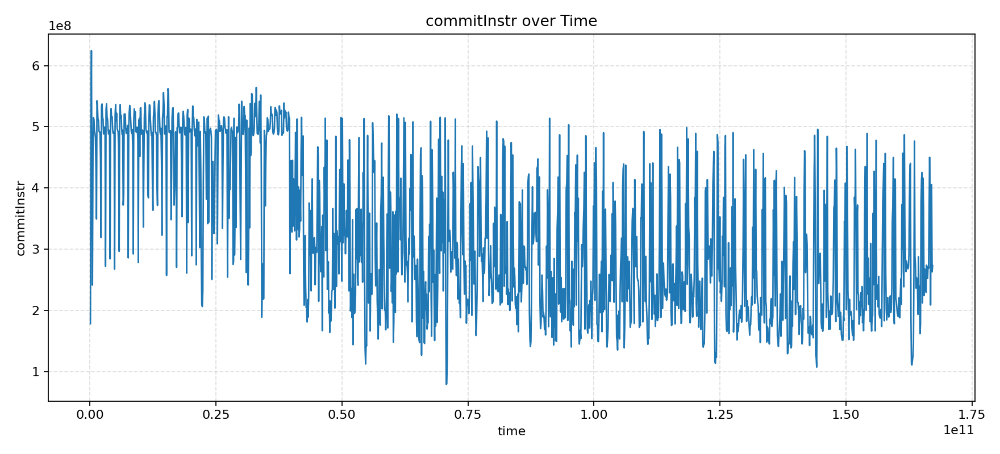
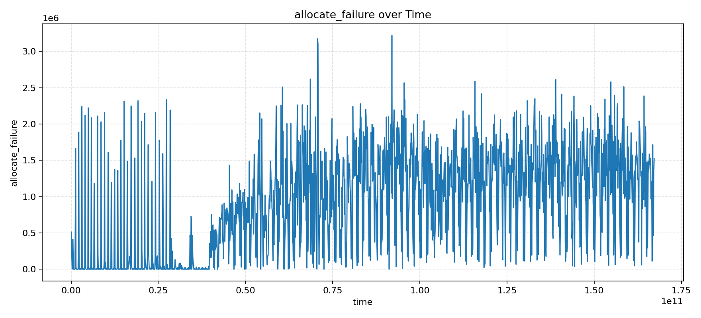
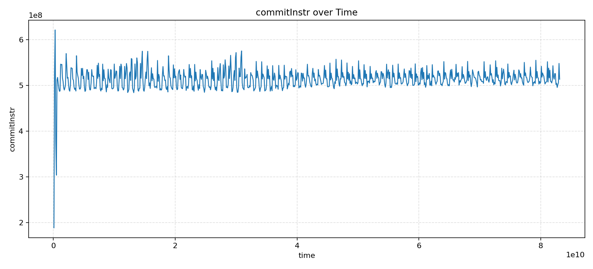
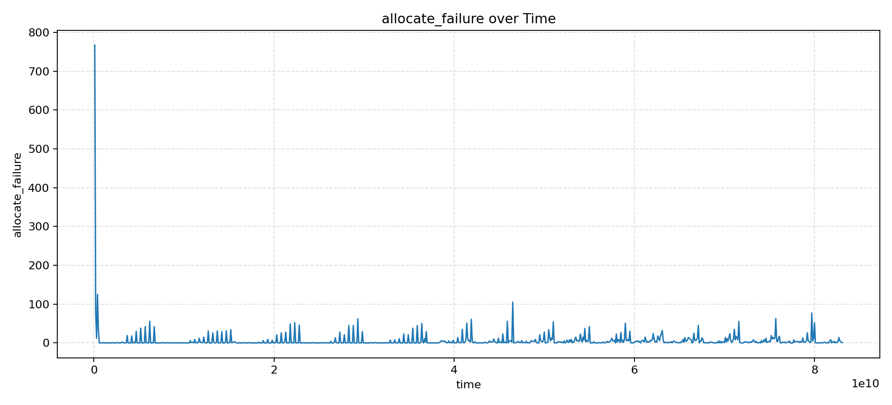

# 【香山双周报 99】20260330 期

欢迎来到香山双周报专栏，我们将通过这一专栏定期介绍香山的开发进展。本次是第 99 期双周报。

昆明湖 V2 已经回片！目前正在进行紧张刺激的测试工作，更多的信息将在后续披露，敬请期待！

关于香山近期开发进展，前端修复了一些 BPU 的性能 bug，后端优化了部分模块的时序，访存继续进行模块的重构与测试。

<!-- more -->

## 前端 TAGE 分配策略 bug 定位与修复

不久前，某关注香山进展的神秘团队向我们反馈了一个性能 bug。他们在 FPGA 上运行昆明湖 V3 时发现， V3 的性能甚至不如 V2。经过简单的定位，在 libquantum 这个测试程序中，V3 的分支预测准确率随着运行时间的增加有着显著的下降，从而导致 IPC 下降。

收到这个反馈后，我们立即展开了复现与定位。~~其实最先怀疑的是环境问题，因为 V3 在我们的切片性能评估流程中一切正常，但最终证明各项配置均正确~~。这一现象在 FPGA 上执行 30 分钟后才较为显著，但 FPGA 上调试手段有限。然而，如果要在仿真环境中运行，需要至少一个月才能复现。因此，我们最终决定在 Palladium 上进行复现，折算过来需要运行约一天左右。

一天后，我们成功复现了这个问题，下图是 libquantum 测试程序中 IPC 随时间的变化曲线，可以看到 IPC 在运行一段时间后有明显的下降。

而在众多性能计数器中，我们发现了 allocate_failure 这个计数器，它的变化趋势竟然与 IPC 的变化趋势高度相关！这个计数器统计了TAGE表项分配失败的次数，按照设计预期不应当有这么多。

经过定位，我们发现TAGE的分配条件有误，会导致已有表项无法被替换，从而导致新的分支训练不进TAGE。具体代码修改可以参考这个 [PR](https://github.com/OpenXiangShan/XiangShan/pull/5677)。修改后的 IPC 与 allocate_failure 的趋势如下图所示。

多么漂亮的两个曲线！我们非常感谢这个神秘团队的持续关注与积极反馈，也欢迎更多关注香山的朋友与我们一起将香山越做越好。

## 近期进展

### 前端

- RTL 新特性
  - 支持 UTAGE 以分支粒度进行预测（[#5513](https://github.com/OpenXiangShan/XiangShan/pull/5513)）
  - 支持设置 SC 阈值范围（[#5632](https://github.com/OpenXiangShan/XiangShan/pull/5632)）
  - 实现 SC IMLI 表（[#5671](https://github.com/OpenXiangShan/XiangShan/pull/5671)）
- Bug 修复
  - 修复 MBTB 中 baseTable 在正确预测时饱和计数器未更新的问题（[#5602](https://github.com/OpenXiangShan/XiangShan/pull/5602)）
  - 修复历史信息寄存器在遇到 s3 override 的处理逻辑（[#5625](https://github.com/OpenXiangShan/XiangShan/pull/5625)）
  - 修复 TAGE 表项分配逻辑，解决持续运行一段时间后分配失败率飙升的问题（[#5677](https://github.com/OpenXiangShan/XiangShan/pull/5677)）
- 时序/面积优化
  - 修复 SC 训练逻辑时序（[#5648](https://github.com/OpenXiangShan/XiangShan/pull/5648)）
- 代码质量
  - 修复 MBTB 编译期日志 cfiPosition 位宽显示错误的问题，不影响实际 RTL 功能（[#5638](https://github.com/OpenXiangShan/XiangShan/pull/5638)）
  - 修复 MBTB 编译期 warning（[#5543](https://github.com/OpenXiangShan/XiangShan/pull/5543)）
- 调试工具
  - 重构预测来源性能计数器（[#5639](https://github.com/OpenXiangShan/XiangShan/pull/5639)）

### 后端

- RTL 新特性
  - (V2) 添加 hartIDDmodeWidth 以选择 debug mode 可读的 mhartid 位数（[#5627](https://github.com/OpenXiangShan/XiangShan/pull/5627)）
- Bug 修复
  - 修复 v0 在 vldMergeUnit 中的数据输出问题（[#5675](https://github.com/OpenXiangShan/XiangShan/pull/5675)）
- 时序优化
  - 减少 BJU IssueQueue 的大小，修复 IssueQueue 的 ready 时序，修复 interrupt 选择的时序（[#5636](https://github.com/OpenXiangShan/XiangShan/pull/5636)）
  - 将 RatWrapper 从 RegRename 中移到 Rename 中以检查 Rename 时序（[#5637](https://github.com/OpenXiangShan/XiangShan/pull/5637)）
- 代码质量
  - 改善包含 Issue 部分在内的多处代码质量问题（[#5652](https://github.com/OpenXiangShan/XiangShan/pull/5652)）

### 访存与缓存

- RTL 新特性
  - MMU、LoadUnit、StoreQueue、L2 等模块重构与测试持续推进中
  - 将 mmioBridgeSize 调整到 16 以提升 NC 性能（[CoupledL2 #475](https://github.com/OpenXiangShan/CoupledL2/pull/475)）
- Bug 修复
  - 将部分 V2 的改动同步到 V3
  - CoupledL2 在重新写回时保持 LikelyShared（[CoupledL2 #474](https://github.com/OpenXiangShan/CoupledL2/pull/474)）
- 时序修复
  - 通过或操作而非加法生成 gpaddr（[#5644](https://github.com/OpenXiangShan/XiangShan/pull/5644)）
- 性能修复
  - 修复异步桥深度为 4 时的性能（[CoupledL2 #472](https://github.com/OpenXiangShan/CoupledL2/pull/472)）

## 性能评估

处理器及 SoC 参数如下所示：

| 参数      | 选项       |
| --------- | ---------- |
| commit    | 316946d28  |
| 日期      | 2026/02/11 |
| L1 ICache | 64KB       |
| L1 DCache | 64KB       |
| L2 Cache  | 1MB        |
| L3 Cache  | 16MB       |
| 访存单元  | 3ld2st     |
| 总线协议  | CHI        |
| 内存延迟  | DDR4-3200  |

性能数据如下所示：

| SPECint 2006 @ 3GHz | GCC15  |  XSCC  | GCC12  | SPECfp 2006 @ 3GHz | GCC15  |  XSCC  | GCC12  |
| :------------------ | :----: | :----: | :----: | :----------------- | :----: | :----: | :----: |
| 400.perlbench       | 47.62  | 46.95  | 43.70  | 410.bwaves         | 85.89  | 90.63  | 73.26  |
| 401.bzip2           | 27.11  | 27.84  | 27.45  | 416.gamess         | 56.09  | 52.32  | 55.07  |
| 403.gcc             | 51.16  | 37.45  | 48.58  | 433.milc           | 64.67  | 63.51  | 49.06  |
| 429.mcf             | 59.41  | 53.82  | 58.20  | 434.zeusmp         | 69.51  | 63.50  | 60.53  |
| 445.gobmk           | 35.73  | 36.86  | 37.72  | 435.gromacs        | 36.26  | 34.10  | 38.51  |
| 456.hmmer           | 52.74  | 62.74  | 42.84  | 436.cactusADM      | 75.29  | 86.48  | 53.73  |
| 458.sjeng           | 36.53  | 37.26  | 35.81  | 437.leslie3d       | 56.49  | 56.52  | 54.49  |
| 462.libquantum      | 135.14 | 293.38 | 133.96 | 444.namd           | 42.50  | 44.39  | 37.52  |
| 464.h264ref         | 62.14  | 70.50  | 62.67  | 447.dealII         | 63.78  | 68.00  | 65.01  |
| 471.omnetpp         | 40.96  | 39.01  | 43.05  | 450.soplex         | 48.91  | 57.65  | 52.82  |
| 473.astar           | 30.86  | 29.89  | 30.11  | 453.povray         | 72.61  | 66.92  | 61.73  |
| 483.xalancbmk       | 74.28  | 83.06  | 79.61  | 454.Calculix       | 44.12  | 39.19  | 19.43  |
| GEOMEAN             | 49.43  | 52.66  | 48.51  | 459.GemsFDTD       | 64.03  | 64.56  | 46.22  |
|                     |        |        |        | 465.tonto          | 51.74  | 34.81  | 36.76  |
|                     |        |        |        | 470.lbm            | 126.79 | 132.72 | 105.02 |
|                     |        |        |        | 481.wrf            | 55.19  | 41.29  | 48.79  |
|                     |        |        |        | 482.sphinx3        | 58.53  | 60.81  | 55.06  |
|                     |        |        |        | GEOMEAN            | 60.46  | 58.46  | 50.81  |

编译参数如下所示：

| 参数             | GCC12    | GCC15       | XSCC                |
| ---------------- | -------- | ----------- | ------------------- |
| 编译器           | gcc12    | gcc15       | xscc                |
| 编译优化         | O3       | O3          | O3                  |
| 内存库           | jemalloc | jemalloc    | jemalloc            |
| -march           | RV64GCB  | RV64GCB     | RV64GCB             |
| -ffp-contraction | fast     | fast        | fast                |
| 链接优化         | -        | -flto       | -flto               |
| 浮点优化         | -        | -ffast-math | -ffast-math         |
| -mcpu            | -        | -           | xiangshan-kunminghu |

注：我们使用 SimPoint 对程序进行采样，基于我们自定义的 checkpoint 格式制作检查点镜像，Simpoint 聚类的覆盖率为 100%。上述分数为基于程序片段的分数估计，非完整 SPEC CPU2006 评估，和真实芯片实际性能可能存在偏差。

## 相关链接

- 香山技术讨论 QQ 群：879550595
- 香山技术讨论网站：<https://github.com/OpenXiangShan/XiangShan/discussions>
- 香山文档：<https://xiangshan-doc.readthedocs.io/>
- 香山用户手册：<https://docs.xiangshan.cc/projects/user-guide/>
- 香山设计文档：<https://docs.xiangshan.cc/projects/design/>

编辑：徐之皓、吉骏雄、陈卓、余俊杰、李衍君
