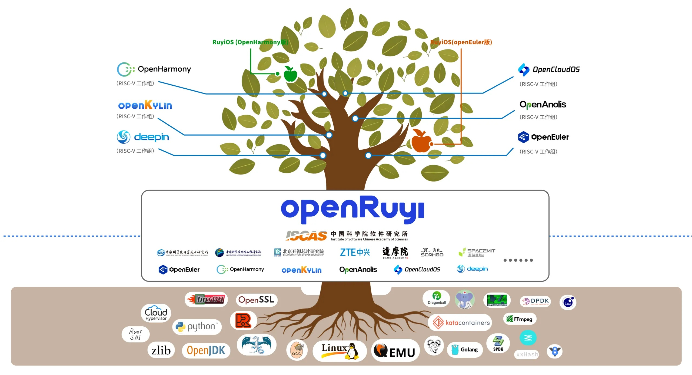
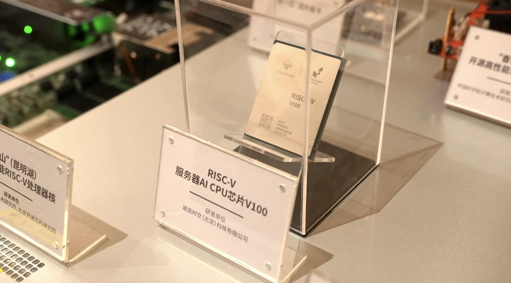

# 【香山双周报 99】20260330 期

欢迎来到香山双周报专栏，我们将通过这一专栏定期介绍香山的开发进展。本次是第 99 期双周报。

3 月 26 日，“香山”+“如意”在中关村论坛年会正式发布！阅读双周报的大家相信对香山已经很熟悉了，这里不再赘述，如意（openRuyi）则是由中科院软件所开发，为香山深度适配和优化的操作系统。这种软硬协同是 RISC-V 生态建设的关键一步，也是“香山+如意”开源社区的核心竞争力之一。我们希望能与整个社区一起，推动软硬件协同创新，打造一个开放、包容、繁荣的 RISC-V 生态。

在香山方面，此次发布包含“昆明湖”处理器核、全球首个数据中心开源片上互连网络“温榆河”和首款终端开源片上互连IP“珠江”。本次展出的基于“昆明湖”处理器核的服务器芯片 V100 由我们的合作企业进迭时空设计流片，实测单核性能达到 SPEC2006 16 分/GHz，是全球首个完全支持 RVA23 profile、单核性能最高的开源处理器核。

另外，下一代“昆明湖”联合研发计划在会上正式启动，我们将携手中国科学院计算技术研究所、软件研究所、信息工程研究所，以及进迭时空、奕斯伟计算、腾讯、砺睿微电子、中国移动、中国电信、阿里达摩院、摩尔线程、算能科技、蓝芯算力等产学研单位一起，推动香山核心技术的产业化落地，进一步提升香山系列在高端算力领域的竞争力，力争打造一个高性能 RISC-V 芯片的创新底座，从而支撑企业研发更具竞争力的产品。

关于香山近期开发进展，前端修复了一些 BPU 的性能 bug，后端优化了部分模块的时序，访存继续进行模块的重构与测试。

<!-- more -->

## 近期进展

### 前端

- RTL 新特性
  - 实现 SC Backward 表（[#5528](https://github.com/OpenXiangShan/XiangShan/pull/5528)）
- Bug 修复
  - （V2）修复 IFU 处理 MMIO 空间取指，取指地址+32B 跨过页边界，仅后一页出现异常时，向后端发送全0指令的问题（[#5687](https://github.com/OpenXiangShan/XiangShan/pull/5687)）
- 代码质量
  - 重构分支历史寄存器（[#5528](https://github.com/OpenXiangShan/XiangShan/pull/5528)）
- 调试工具
  - 修复 Utility 中性能计数器编译问题（[#5740](https://github.com/OpenXiangShan/XiangShan/pull/5740)）

### 后端

- Bug 修复
  - 修复 commitInstrBranch 并添加 branch_jump 性能计数器（[#5705](https://github.com/OpenXiangShan/XiangShan/pull/#5705)）
- 时序优化
  - 移除从 commonOutBundle 引出的的 dataSource 信号，去除冗余依赖（[#5704](https://github.com/OpenXiangShan/XiangShan/pull/#5704)）
- 代码质量
  - 移除 CSR 单元内的无用寄存器（[#5681](https://github.com/OpenXiangShan/XiangShan/pull/#5681)）

### 访存与缓存

- RTL 新特性
  - MMU、L2 等模块重构与测试持续推进中
  - 新版 LoadUnit 与 StoreQueue 合入主线并修复若干相关的问题（[#5548](https://github.com/OpenXiangShan/XiangShan/pull/5548)）
- Bug 修复
  - （V2）修复了 Store MMIO 没有标记 Rob 的问题（[#5640](https://github.com/OpenXiangShan/XiangShan/pull/5640)）
  - （V2）修复了 MisalignBuffer 的撤销逻辑（[#5674](https://github.com/OpenXiangShan/XiangShan/pull/5674)）
  - （V2）修复了 Uncache 模块中 mem_acquire 未触发时的前递顺序冒险问题（[#5630](https://github.com/OpenXiangShan/XiangShan/pull/5630)）
  - （V2）在 L1Prefetcher 中使用单独的信号来控制 RegEnable PC（[#5720](https://github.com/OpenXiangShan/XiangShan/pull/5720)）
  - 修复了非对齐访问 MMIO 区域时发出的异常类型（[#5700](https://github.com/OpenXiangShan/XiangShan/pull/5700)）
- 时序修复
  - 修复了 MemBlock 若干时序问题（[#5697](https://github.com/OpenXiangShan/XiangShan/pull/5697)）

## 性能评估

处理器及 SoC 参数如下所示：

| 参数      | 选项       |
| --------- | ---------- |
| commit    | 87d03b2cc  |
| 日期      | 2026/03/24 |
| L1 ICache | 64KB       |
| L1 DCache | 64KB       |
| L2 Cache  | 1MB        |
| L3 Cache  | 16MB       |
| 访存单元  | 3ld2st     |
| 总线协议  | CHI        |
| 内存延迟  | DDR4-3200  |

性能数据如下所示：

| SPECint 2006 @ 3GHz | GCC15  |  XSCC  | SPECfp 2006 @ 3GHz | GCC15  |  XSCC  |
| :------------------ | :----: | :----: | :----------------- | :----: | :----: |
| 400.perlbench       | 48.54  | 47.50  | 410.bwaves         | 85.76  | 90.75  |
| 401.bzip2           | 27.41  | 28.22  | 416.gamess         | 56.92  | 53.01  |
| 403.gcc             | 55.42  | 38.93  | 433.milc           | 64.88  | 63.62  |
| 429.mcf             | 59.81  | 54.32  | 434.zeusmp         | 70.31  | 64.42  |
| 445.gobmk           | 39.25  | 40.59  | 435.gromacs        | 36.39  | 34.26  |
| 456.hmmer           | 53.63  | 63.65  | 436.cactusADM      | 75.77  | 86.49  |
| 458.sjeng           | 39.50  | 39.74  | 437.leslie3d       | 56.50  | 52.29  |
| 462.libquantum      | 135.53 | 294.09 | 444.namd           | 42.58  | 44.54  |
| 464.h264ref         | 62.93  | 71.26  | 447.dealII         | 64.88  | 69.53  |
| 471.omnetpp         | 41.18  | 39.38  | 450.soplex         | 49.79  | 60.47  |
| 473.astar           | 31.04  | 30.22  | 453.povray         | 73.02  | 66.48  |
| 483.xalancbmk       | 74.59  | 84.30  | 454.Calculix       | 43.93  | 39.70  |
| GEOMEAN             | 50.84  | 53.98  | 459.GemsFDTD       | 64.37  | 64.29  |
|                     |        |        | 465.tonto          | 52.49  | 34.91  |
|                     |        |        | 470.lbm            | 126.77 | 132.75 |
|                     |        |        | 481.wrf            | 55.04  | 41.52  |
|                     |        |        | 482.sphinx3        | 58.62  | 61.20  |
|                     |        |        | GEOMEAN            | 60.79  | 58.63  |

编译参数如下所示：

| 参数             | GCC15       | XSCC                |
| ---------------- | ----------- | ------------------- |
| 编译器           | gcc15       | xscc                |
| 编译优化         | O3          | O3                  |
| 内存库           | jemalloc    | jemalloc            |
| -march           | RV64GCB     | RV64GCB             |
| -ffp-contraction | fast        | fast                |
| 链接优化         | -flto       | -flto               |
| 浮点优化         | -ffast-math | -ffast-math         |
| -mcpu            | -           | xiangshan-kunminghu |

注：我们使用 SimPoint 对程序进行采样，基于我们自定义的 checkpoint 格式制作检查点镜像，Simpoint 聚类的覆盖率为 100%。上述分数为基于程序片段的分数估计，非完整 SPEC CPU2006 评估，和真实芯片实际性能可能存在偏差。

## 相关链接

- 香山技术讨论 QQ 群：879550595
- 香山技术讨论网站：<https://github.com/OpenXiangShan/XiangShan/discussions>
- 香山文档：<https://xiangshan-doc.readthedocs.io/>
- 香山用户手册：<https://docs.xiangshan.cc/projects/user-guide/>
- 香山设计文档：<https://docs.xiangshan.cc/projects/design/>

编辑：徐之皓、吉骏雄、陈卓、余俊杰、李衍君
