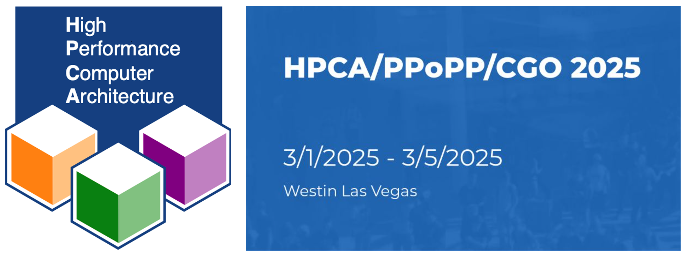
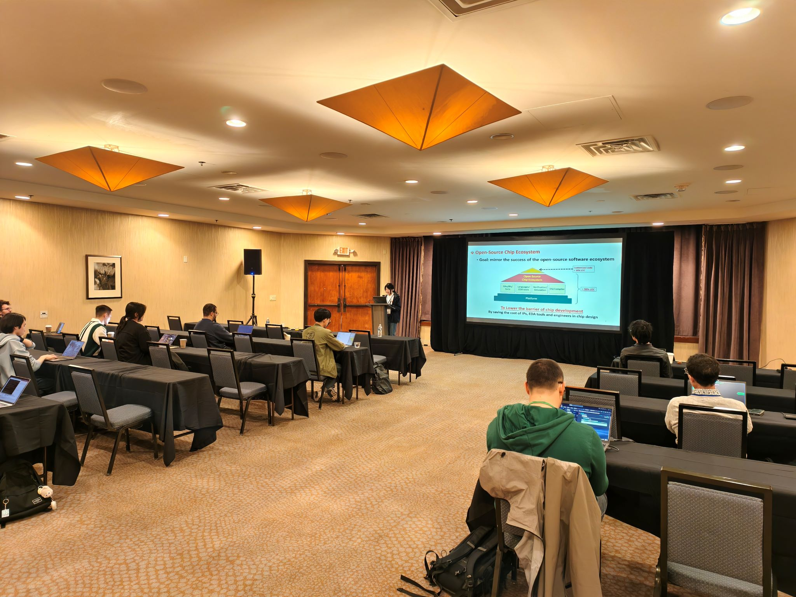
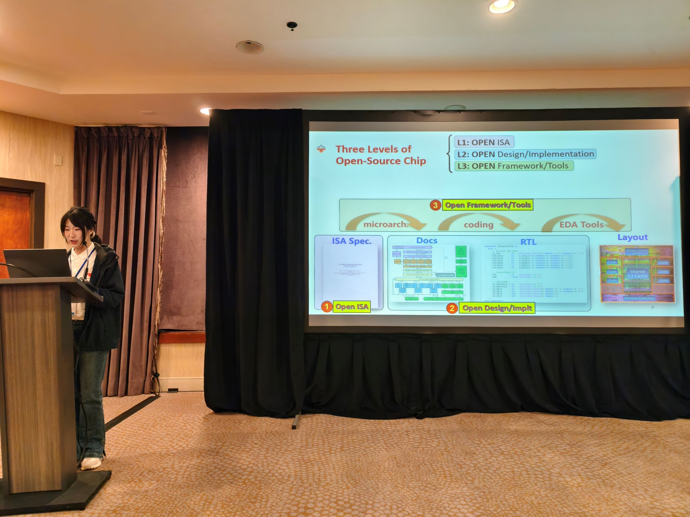
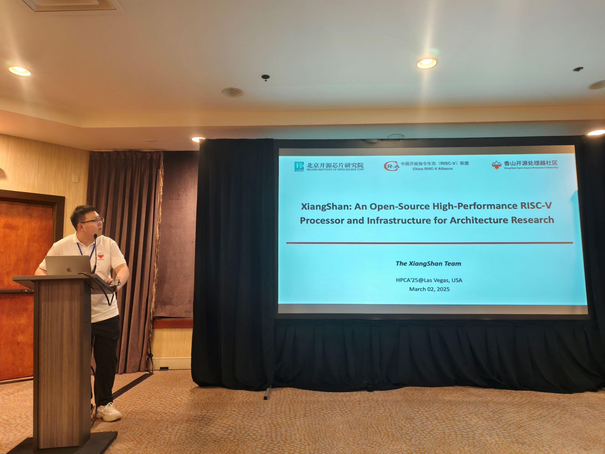
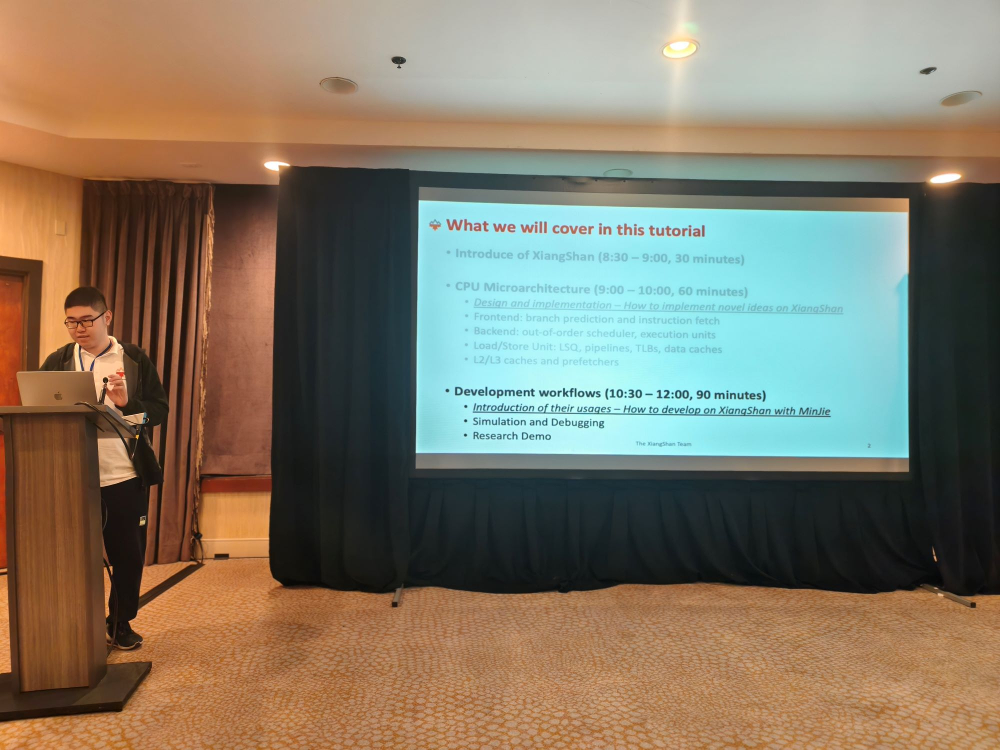
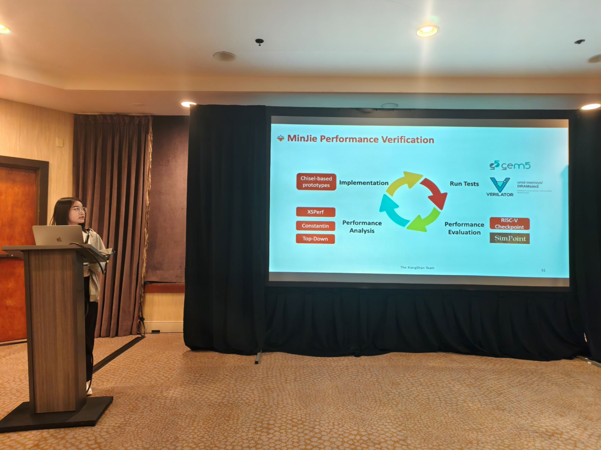
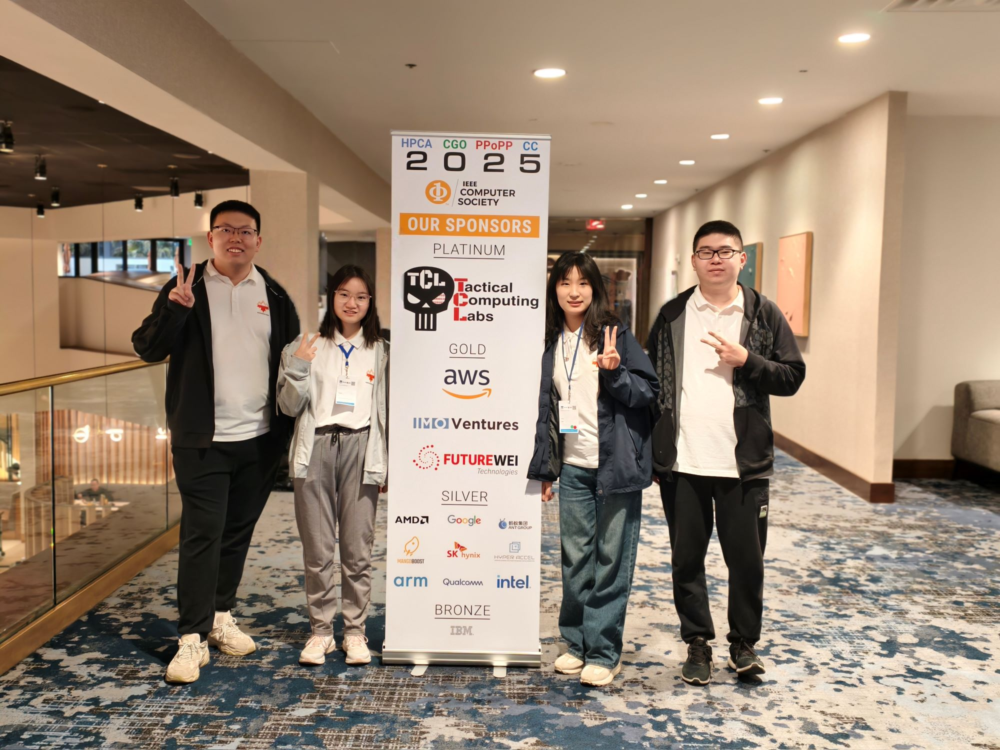

# 香山处理器团队参加 HPCA 2025 会议并成功举办 Tutorial

    第 31 届高性能计算机体系架构国际研讨会（HPCA 2025）于 2025 年 3 月 1 日至 5 日在美国拉斯维加斯举办。HPCA 是计算机体系结构领域最具影响力的国际顶级学术会议之一，为全球科学家和工程师提供了高质量的交流平台，展示该领域的最新研究成果。本次会议与 PPoPP、CGO、CC 等重要会议同期举办，促进跨领域的深入交流与合作。

    HPCA 2025 会议涵盖了高性能计算机体系架构的诸多关键领域，包括并行计算体系结构、多核与多处理器体系结构、高性能 I/O 系统、编译器与系统软件等诸多方面。会议汇聚了学术界与工业界的顶尖专家，共同探讨计算机体系结构的最新发展趋势与未来方向。

    香山开源高性能处理器团队的四位同学高泽宇、冯浩原、马月骁、李燕琴在本次会议中，作题名《XiangShan: An Open-Source High-Performance RISC-V Processor and Infrastructure for Architecture Research》的上手演示教程（Tutorial），受到来自蚂蚁、Arm、FutureWei、量子科技中心等公司的关注，也和 SNU、USC、POLIMI、NCSU、NTUT、HKUST、UR、SCIENCE TOKYO 等学校师生进行了交流。

<!-- more -->

    高泽宇同学介绍了开源芯片的愿景和香山处理器概述，同时简要介绍了香山处理器的敏捷验证平台，以及为学术研究提供的一系列基础设施环境。

    冯浩原同学详细介绍了香山处理器核的微架构以及三代香山架构的发展与演进。

    马月骁同学讲解并现场演示了香山在功能验证方面的敏捷开发工具链。

    李燕琴同学讲解并演示了香山处理器的敏捷性能评估与性能分析方法。

    报告结束后，几位同学与听众围绕微架构设计细节、敏捷开发流程等问题进行了交流。未来，香山团队会继续更新 Tutorial 内容，分享在微架构和敏捷开发框架方面的进展，与更多行业专家交流，持续发扬开源力量。

## 相关链接

    欢迎访问 HPCA'25 XiangShan Tutorial 网站：https://tutorial.xiangshan.cc/hpca25/ ，其中已上传本次 Tutorial 的 PPT。

    此外，我们将在 2025 年 3 月 30 日于荷兰鹿特丹举办的 ASPLOS’25 会议中再次举办 Tutorial，相关网站请关注：https://tutorial.xiangshan.cc/asplos25/ ，敬请期待！

编辑：冯浩原、林志达

审校：香山宣传工作组
