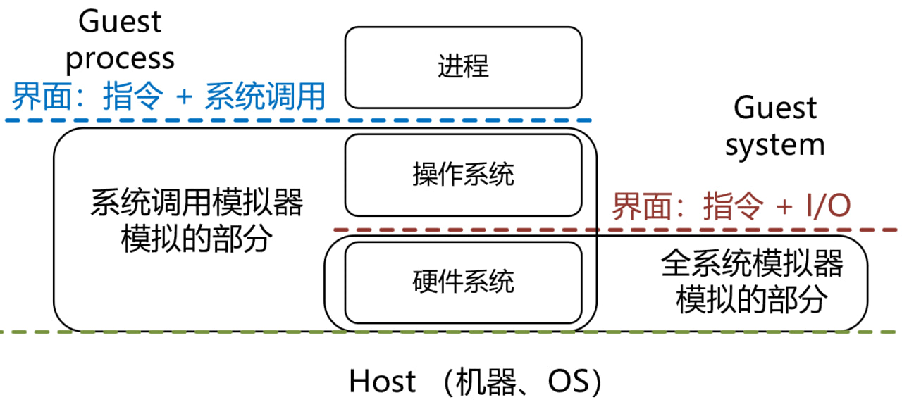

# 生成香山全系统负载和checkpoint的视频教程

最近，我们意识到让用户搞定香山处理器仿真环境是一件非常困难的事情。

困难来自多方面，其中一个重要原因就是我们的各个仿真平台都选择了全系统模拟（包括香山 RTL 和香山 GEM5）。
全系统（Full system，FS）模拟是一种模拟器的模式，与之相对的是系统调用模拟（System call emulation，SE）。

系统调用模拟（SE）是一种对用户非常便利的模式，用户只需要提供应用的可执行文件就可以直接运行。
但是SE对模拟器开发者带来了更多的负担。
以 GEM5 模拟器的 SE 模式实现为例，GEM5 劫持了各个指令集的系统调用指令，然后用 C/C++ 代码在宿主机模拟了 Linux 的系统调用。
如图所示，SE 模拟器既实现了一部分硬件的功能（大部分指令的执行），又实现了一部分 OS 的功能（系统调用）。
SE 模拟器与应用交互的界面是**指令集**和**系统调用**。
而在全系统（FS）模式下，模拟器模拟的仅仅是硬件系统，为了实现操作系统的功能，用户需要提供完整的系统镜像。
在 FS 模式下，模拟器与软件（操作系统+应用程序）交互的界面是**指令集**和**输入输出（I/O）**，
模拟器没有“命令行参数”、“系统调用”等概念。

在常见的模拟器中，GEM5 和 QEMU 能同时支持 FS 和 SE 两种模式，
GEM5 和 QEMU 的开发者为此付出了大量的努力。
但是在 RTL 仿真中实现 SE 模式近乎不可能，因为 RTL 仿真的目标是模拟硬件，
支持 SE 的 RTL 必然是不可综合的。

相对于 SE 模式，全系统模式的也有其优势：1) 只要用户打包好系统镜像，就拥有完整的系统调用，加上各种依赖库之后就能运行各种大型程序；
1) 对硬件系统而言，可以准确地建模虚存系统、I/O 和特权态下的指令带来的性能影响。
而代价则是用户需要准备完整的系统镜像，其中镜像包括了 bootloader、内核和应用程序。
综合考虑 RTL 仿真难以支持 SE，并且为了保证性能评估的准确性，香山处理器和香山 GEM5 选择了全系统模式。

全系统模式确实对用户构成了阻碍，
虽然我们提供了构建系统镜像的文档，并多次修改，但是我们发现用户仍然会遇到各种问题。例如：

- 有的报错与指令集扩展或者操作系统 ABI 有关，在我们团队内部从来没有遇到过，即使是我们自己也需要较长时间解决。
- 用户对全系统模拟的概念不理解，希望从模拟器的命令行直接给应用程序传命令行参数（其实只有 SE 模拟器支持）。
- 用户对 Linux 系统不熟悉，例如不会装库。
- 用户编译应用程序的参数不恰当。

究其原因，一方面是构建镜像的复杂性不低，容易出现问题；另一方面是香山用户的知识背景非常多样。
为了让不同背景的用户更顺利地制作全系统负载和 checkpoint，
我们制作了本次视频教程，帮助用户生成全系统模拟的 SPECCPU 和 checkpoint。
该视频的内容包括

- 构建 RISC-V Linux 和 bootloader
- 编译 SPECCPU 2006
- 将 SPECCPU 2006 和 Linux 打包生成镜像
- 用 NEMU 模拟器运行镜像，进行 SimPoint profiling 和生成 checkpoint

视频教程地址：[https://www.bilibili.com/video/BV1Wr421h7XN/](https://www.bilibili.com/video/BV1Wr421h7XN/)

视频中所使用的虚拟机镜像：[https://pan.baidu.com/s/1G6UU4J-tQwJhEXHaxqJ-6w?pwd=qes7](https://pan.baidu.com/s/1G6UU4J-tQwJhEXHaxqJ-6w?pwd=qes7)

责任声明：

- 本视频教程仅适用于香山处理器全系统环境的 SPECCPU 2006 的 checkpoint 构建，提供有限的社区支持。
- 使用本虚拟机只是权宜之计，我们仍然鼓励有相关知识背景的用户根据我们的文档自己搭建环境，以便获得更大的灵活性。
如果要构建其它大型程序，希望用户自己搭建环境，我们不通过虚拟机镜像提供相关支持。

原文链接：[https://shinezyy.github.io/ArchShineZ/post/the-cost-of-fs/](https://shinezyy.github.io/ArchShineZ/post/the-cost-of-fs/)

