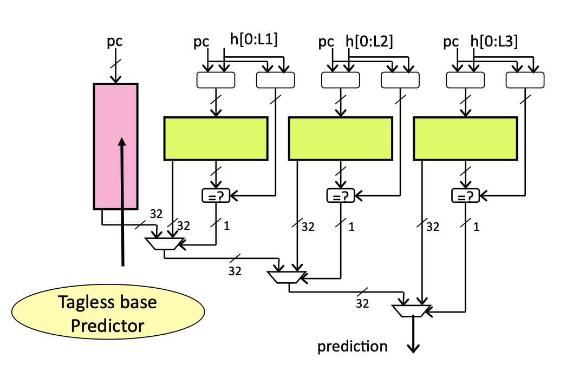

# 分支预测

这一章描述香山处理器分支预测单元的整体架构，其预测流水线如上图所示。

<!-- 南湖架构采取了一种分支预测和指令缓存解耦的取指架构，分支预测单元提供取指请求，写入一个队列，该队列将其发往取指单元，送入指令缓存。 -->
分支预测单元采用一种多级混合预测的架构，其主要组成部分包括 [下一行预测器](#nlp)（Next Line Predictor，以下简称 NLP）和 [精确预测器](#apd)（Accurate Predictor，以下简称 APD）。其中，[NLP](#nlp) 是一个 [uBTB](#ubtb) (micro BTB)，[APD](#apd) 由 [FTB](#ftb)[[1]](#ftbcite)、[TAGE-SC](#tage-sc)、[ITTAGE](#ittage)、[RAS](#ras) 组成。
[NLP](#nlp) 提供无空泡的预测，在预测请求的下一拍就可以得到预测结果。[APD](#apd) 各组成部分的延迟在 2~3 拍之间。其中，[FTB](#ftb)、[TAGE](#tage)、[RAS](#ras) 的延迟为 2 拍；[SC](#sc)、[ITTAGE](#ittage) 的延迟为 3 拍。
一次预测会经历三个流水级，每一个流水级都会产生新的预测内容。这些分布于不同流水级的预测器组成了一个[覆盖预测器](#overriding-predictor) (overriding predictor)。

除了是否和取指单元解耦之外，南湖架构和上一代（雁栖湖）架构分支预测器的最大区别在于[预测块](#pred-block)的定义方式。南湖架构中，BTB 被替换成了 [FTB](#ftb) (Fetch Target Buffer)，每一个 FTB 项都形成一个预测块，我们不仅对下一个块的起始地址做预测，同时也对当前块的结束点做预测。详见 [FTB](#ftb) 一节。

## 顶层模块 (BPU)
[BPU](#bpu) (Branch Prediction Unit) 是分支预测器的顶层模块，它包含覆盖预测逻辑和流水线握手逻辑，以及[全局分支历史](#global-history)的管理。

### 握手逻辑
[BPU](#bpu) 的各个流水级都会连接 [FTQ](ftq.md)，一旦第一个预测流水级存在有效预测结果，或者后续预测流水级产生不同的预测结果，和 [FTQ](ftq.md) 的握手信号有效位都会置高。

### 全局分支历史管理
南湖架构实现了接近完全准确的[全局分支历史](#global-history)，这个性质由以下两点保证：

- 推测更新：每次预测都会根据[预测块](#pred-block)内的条件分支指令个数和预测方向计算新的[全局历史](#global-history)，并在新的预测中使用
- 覆盖逻辑中加入[全局历史](#global-history)的比较：一旦位于后面的流水级推测更新后[全局历史](#global-history)与之前流水级的结果不同（条件分支个数或执行结果不同），同样会冲刷流水线并重新开始预测

之所以说“接近”完全准确，是因为 [BPU](#bpu) 会忽略那些从未跳转的条件分支指令，它们不会被记录在 [FTB](#ftb) 中，也就不会包含在[分支历史](#global-history)里。

## 下一行预测器 (NLP)
下一行预测器旨在用较小的存储开销提供一个无空泡的快速预测流。它的功能主要由 [uBTB](#ubtb) 提供。对于给定的起始地址 PC，[uBTB](#ubtb)对从 PC 开始的一个[预测块](#pred-block)做出整体预测。

### uBTB
它用分支历史和 PC 的低位异或索引存储表，从表中读出的内容直接提供了最精简的预测，包括下一个[预测块](#pred-block)的起始地址 nextAddr、这个[预测块](#pred-block)是否发生分支指令跳转 taken、（如果跳转）跳转指令相对起始地址的偏移 cfiOffset。另外还提供分支指令的相关信息以更新分支历史，包括是否在条件分支跳转 takenOnBr，以及块内包含分支指令的数目 brNumOH。

我们摒弃了 tag 匹配的做法，这会带来一个问题。在有 tag 匹配的情况下，如果一个[预测块](#pred-block)没有命中，会将下一个[预测块](#pred-block)的 PC 置为当前 PC 加最大预测宽度。为避免浪费，如果在[预测块](#pred-block)中没有分支指令，则训练时不会写入 uBTB。在这个前提下，如果没有 tag 匹配机制，则很容易把没有分支指令（在 tag 匹配机制下不命中）的[预测块](#pred-block)预测为另一个跳转的块。针对这种情况，我们引入了另一种预测机制，对当前 PC 是否可能存在有效的分支指令进行预测。这个预测机制的存储结构由取指 PC 直接索引，它的查询结果表示了该取指 PC 是否被写入过。在它指示该 PC 没被写入过的时候，会把下一个 PC 预测为当前 PC 加最大预测宽度。

## 精确预测器 (APD)
为提高总体预测准确率，减少预测错误带来的流水线冲刷，南湖架构实现了延迟更高，同时也更为精确的预测机制。

精确预测器包括取指目标缓冲 [FTB](#ftb)、条件分支方向预测器 [TAGE-SC](#tage-sc)、间接跳转预测器 [ITTAGE](#ittage) 和返回地址栈 [RAS](#ras)。

### FTB
[FTB](#ftb) 是 [APD](#apd) 的核心。[APD](#apd) 的其他预测部件所作出的预测全部依赖于 [FTB](#ftb) 提供的信息。[FTB](#ftb) 除了提供[预测块](#pred-block)内分支指令的信息之外，还提供[预测块](#pred-block)的结束地址。对于 [FTB](#ftb) 来说，[FTB](#ftb) 项的生成策略至关重要。南湖架构在原始论文[[1]](#ftbcite)的基础上，结合[[2]](#ftbcitequalcomm)的思想形成了现有的策略，记 [FTB](#ftb) 项的起始地址为 start，结束地址为 end，具体策略如下：

1. [FTB](#ftb) 项由 start 索引，start 在预测流水线中生成，实际上，start 基本遵循如下原则：
    - start 是上一个[预测块](#pred-block)的 end
    - start 是来自 [BPU](#bpu) 外部的重定向的目标地址；
2. [FTB](#ftb) 项内最多记录两条分支指令，其中第一条一定是条件分支；
3. end 一定满足三种条件之一：
    - end - start = 预测宽度
    - end 是第三条分支指令的 PC
    - end 是一条无条件跳转分支的下一条指令的 PC
  
和[[1]](#ftbcite)中一样，我们只存储结束地址的低位，而高位用起始地址的高位拼接得到。
和[[3]](#amd)相似，我们还对 [FTB](#ftb) 项中的条件分支指令记录“总是跳转”位，该位在第一次遇到该条件分支跳转时置 1，在它值为 1 的时候，该条件分支的方向总是预测为跳转，也不用它的结果训练条件分支方向预测器；
当该条件分支遇到一次执行结果为不跳转的时候，将该位置 0，之后它的方向由条件分支方向预测器预测。

### TAGE-SC
#### TAGE

#### SC

### ITTAGE

RISC-V指令集中jalr指令支持以寄存器取值加一立即数的方式指定无条件跳转指令目标地址。不同于在指令中直接编码跳转偏移量的jal指令，jalr的跳转地址需要借助寄存器访问间接获取，因而被称为间接跳转指令。跳转地址来自寄存器引入的地址多样性使得该指令的目标地址难以使用[uBTB](#ubtb)预测，需要使用其他预测机制。在香山处理器中，这一预测机制体现为[FTB](#ftb)，[RAS](#ras)与[ITTAGE](#ittage)预测器的协作。部分jalr指令具有固定的跳转地址，可以使用[FTB](#ftb)进行高正确率的预测，不需要高级预测器介入；函数调用和返回是jalr指令中较为常见的应用场景，具有显著的配对性，在南湖架构中使用[RAS](#ras)预测器进行预测；不符合以上特征的jalr指令交由[ITTAGE](#ittage)预测。

如上图所示，[ITTAGE](#ittage)预测器是[[4]](#ittage_orig)中提出，在[[5]](#ittage_improve)中详细叙述实现细节的间接分支预测器。它基于[TAGE](#tage)预测器基本原理，针对间接预测器所面临的地址预测问题而调整预测表项设计。具体地，如下图所示，[ITTAGE](#ittage)将[TAGE](#tage)中用于预测跳转方向的计数器替换为所预测的跳转地址。在当前的[FTB](#ftb)设计中，每个FTB项仅存储至多一条间接跳转指令信息，[ITTAGE](#ittage)预测器的预测宽度也相应设置为1，即每周期的输出最多为一条间接跳转指令提供预测结果。工作时，[ITTAGE](#ittage)使用与[TAGE](#tage)预测器相同的分支历史信息和[FTB](#ftb)项起始地址start生成index并在多个预测表中寻址，若多个表中出现命中，优先选择分支历史较长的预测表所给出的信息或根据[备选预测](#alt_pred)参数决定采用次长历史预测结果。[ITTAGE](#ittage)更新也仿效[TAGE](#tage)预测器，当出现误预测时会在预测表中尝试添加新表项，但仅在其对应useful bit为0时才会实际完成替换，useful bit会周期性清零以实现不活跃表项回收利用。

[ITTAGE](#ittage)预测器具体到每个流水阶段的核心动作如下：

**Stage 0**：接收[FTB](#ftb)项起始地址start和经折叠的分支历史，生成对应的index传入利用SRAM实现的预测表作为地址寻址

**Stage 1**：获得由各SRAM预测表读出的表项数据，利用Reg暂存

**Stage 2**：利用[ITTAGE](#ittage)表项数据根据历史长度自高到低选出至多2个命中结果并决策选出最终结果，生成index、是否使用[备选预测](#alt_pred)等meta数据暂存到Reg

**Stage 3**：将预测结果更新到[FTB](#ftb)项并将暂存的meta数据更新到meta通道，[ITTAGE](#ittage)预测流程结束

**Update Stage 0**：训练数据中包含间接误预测时，从meta数据中提取作出该预测时index、是否使用[备选预测](#alt_pred)等信息，从训练数据中提取正确target等信息暂存到寄存器中

**Update Stage 1**：利用暂存的更新信息生成SRAM预测表项更新信号

**Update Stage 2**：预测表项完成更新

### RAS

<h2 id=predictor-update>预测器的训练</h2>
总的来说，为防止错误执行路径对预测器内容的污染，各部分预测器在[预测块](#pred-block)的所有指令提交后进行训练。
它们的训练内容来自自身的预测信息和[预测块](#pred-block)中指令的译码结果和执行结果，它们会被从 [FTQ](ftq.md) 中读出，并送回 [BPU](#bpu)。
其中，自身的预测信息会在预测后打包传进 [FTQ](ftq.md) 中存储；指令的译码结果来自 IFU 的预译码模块，在取到指令后写回 [FTQ](ftq.md)；而执行结果来自各个执行单元。

在 [BPU](#bpu) 收到来自其外部的重定向请求时，会把曾进行过推测更新的元素（全局历史、RAS等）进行恢复。

## 名词解释

<b id="pred-block">预测块</b> 分支预测单元 ([BPU](#bpu)) 每次给取指目标缓冲 ([FTQ](ftq.md)) 的请求基本单位，它描述了一个取指请求的范围，以及其中分支指令的情况

<b id="overriding-predictor">覆盖预测器</b> 一种多个不同延迟的预测器的组织形式，延迟大的、相对更准确的预测器被放在后面的流水级，其产生的预测结果会与前面的预测器进行比较，如果不同则会冲刷流水线，整体预测结果以最准确的预测器为准

<b id="global-history">全局分支历史</b> 指令流中所有条件分支指令的执行结果序列，每一条分支指令的执行结果作为一位（0/1）存在于全局分支历史中，一般以移位寄存器的方式实现

<b id="alt_pred">备选预测</b> TAGE/ITTAGE预测器一种优化，当对长历史预测结果信心不足时选择次长历史下的命中结果作为最终预测，可提升整体预测正确率

## 引用
<b id="ftbcite">1</b> Reinman G, Austin T, Calder B. A scalable front-end architecture for fast instruction delivery[J]. ACM SIGARCH Computer Architecture News, 1999, 27(2): 234-245.

<b id="ftbcitequalcomm">2</b> Perais A, Sheikh R, Yen L, et al. Elastic instruction fetching[C]//2019 IEEE International Symposium on High Performance Computer Architecture (HPCA). IEEE, 2019: 478-490.

<b id="amd">3</b> Software Optimization Guide for AMD Family 19h Processors (PUB), Chap. 2.8.1.5, [https://www.amd.com/system/files/TechDocs/56665.zip](https://www.amd.com/system/files/TechDocs/56665.zip)

<b id="ittage_orig">4</b> Seznec A, Michaud P. A case for (partially) TAgged GEometric history length branch prediction[J]. The Journal of Instruction-Level Parallelism, 2006, 8: 23.

<b id="ittage_improve">5</b> Seznec A. A 64-Kbytes ITTAGE indirect branch predictor[C]//JWAC-2: Championship Branch Prediction. 2011.