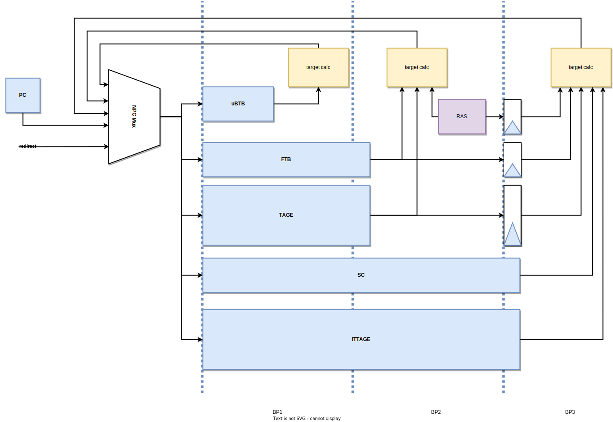
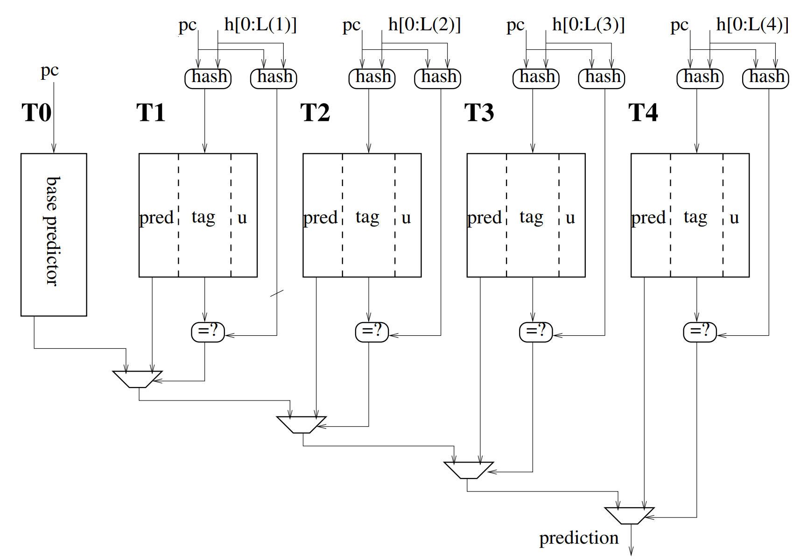

# 分支预测 (Branch Prediction)
<figure markdown>
  { width="800" }
  <figcaption>BPU 流水线示意图</figcaption>
</figure>

这一章描述香山处理器分支预测单元的整体架构，其预测流水线如上图所示。

<!-- 南湖架构采取了一种分支预测和指令缓存解耦的取指架构，分支预测单元提供取指请求，写入一个队列，该队列将其发往取指单元，送入指令缓存。 -->
分支预测单元采用一种多级混合预测的架构，其主要组成部分包括 [下一行预测器](#nlp)（Next Line Predictor，以下简称 NLP）和 [精确预测器](#apd)（Accurate Predictor，以下简称 APD）。其中，[NLP](#nlp) 是一个 [uBTB](#ubtb) (micro BTB)，[APD](#apd) 由 [FTB](#ftb)[^ftbcite]、[TAGE-SC](#tage-sc)、[ITTAGE](#ittage)、[RAS](#ras) 组成。NLP 提供无空泡的预测，在预测请求的下一拍就可以得到预测结果。APD 各组成部分的延迟在 2~3 拍之间。其中，FTB、TAGE、RAS 的延迟为 2 拍；SC、ITTAGE 的延迟为 3 拍。一次预测会经历三个流水级，每一个流水级都会产生新的预测内容。这些分布于不同流水级的预测器组成了一个[覆盖预测器](#overriding-predictor) (overriding predictor)。

除了是否和取指单元解耦之外，南湖架构和上一代（雁栖湖）架构分支预测器的最大区别在于[预测块](#pred-block)的定义方式。南湖架构中，BTB 被替换成了 FTB (Fetch Target Buffer)，每一个 FTB 项都形成一个预测块，我们不仅对下一个块的起始地址做预测，同时也对当前块的结束点做预测。详见 [FTB](#ftb) 一节。

## 顶层模块 (BPU)
BPU (Branch Prediction Unit) 是分支预测器的顶层模块，它包含覆盖预测逻辑和流水线握手逻辑，以及全局分支历史的管理。

### 握手逻辑
BPU 的各个流水级都会连接 [FTQ](ftq.md)，一旦第一个预测流水级存在有效预测结果，或者后续预测流水级产生不同的预测结果，和 [FTQ](ftq.md) 的握手信号有效位都会置高。

### 全局分支历史管理
南湖架构实现了接近完全准确的[全局分支历史](#global-history)，这个性质由以下三点保证：

- **推测更新**：每次预测都会根据[预测块](#pred-block)内的条件分支指令个数和预测方向计算新的全局历史，并在新的预测中使用
- **覆盖逻辑中加入全局历史的比较**：一旦位于后面的流水级推测更新后全局历史与之前流水级的结果不同（条件分支个数或执行结果不同），同样会冲刷流水线并重新开始预测
- **预测后存储全局历史的副本**：在预测结束后，当次预测使用的全局历史会存储到 [FTQ](ftq.md) 中，在误预测恢复时读出并送回 BPU

之所以说“接近”完全准确，是因为 BPU 会忽略那些从未跳转的条件分支指令，它们不会被记录在 FTB 中，也就不会包含在分支历史里。

## 下一行预测器 (NLP)
下一行预测器旨在用较小的存储开销提供一个无空泡的快速预测流。它的功能主要由 [uBTB](#ubtb) 提供。对于给定的起始地址 PC，uBTB对从 PC 开始的一个[预测块](#pred-block)做出整体预测。

### uBTB
它用分支历史和 PC 的低位异或索引存储表，从表中读出的内容直接提供了最精简的预测，包括下一个预测块的起始地址 `nextAddr`、这个预测块是否发生分支指令跳转 `taken`、（如果跳转）跳转指令相对起始地址的偏移 `cfiOffset`。另外还提供分支指令的相关信息以更新分支历史，包括是否在条件分支跳转 `takenOnBr`，以及块内包含分支指令的数目 `brNumOH`。

我们摒弃了 tag 匹配的做法，这会带来一个问题。在有 tag 匹配的情况下，如果一个[预测块](#pred-block)没有命中，会将下一个预测块的 PC 置为当前 PC 加[预测宽度](#pred-width)。为避免浪费，如果在预测块中没有分支指令，则训练时不会写入 uBTB。在这个前提下，如果没有 tag 匹配机制，则很容易把没有分支指令（在 tag 匹配机制下不命中）的预测块预测为另一个跳转的块。针对这种情况，我们引入了另一种预测机制，对当前 PC 是否可能存在有效的分支指令进行预测。这个预测机制的存储结构由取指 PC 直接索引，它的查询结果表示了该取指 PC 是否被写入过。在它指示该 PC 没被写入过的时候，会把下一个 PC 预测为当前 PC 加预测宽度。

## 精确预测器 (APD)
为提高总体预测准确率，减少预测错误带来的流水线冲刷，南湖架构实现了延迟更高，同时也更为精确的预测机制。

精确预测器包括取指目标缓冲 [FTB](#ftb)、条件分支方向预测器 [TAGE-SC](#tage-sc)、间接跳转预测器 [ITTAGE](#ittage) 和返回地址栈 [RAS](#ras)。

### FTB
FTB 是 APD 的核心。APD 的其他预测部件所作出的预测全部依赖于 FTB 提供的信息。FTB 除了提供[预测块](#pred-block)内分支指令的信息之外，**还提供预测块的结束地址**。对于 FTB 来说，FTB 项的生成策略至关重要。南湖架构在原始论文[^ftbcite]的基础上，结合这篇论文[^ftbcitequalcomm]的思想形成了现有的策略，记 FTB 项的起始地址为 *`start`*，结束地址为 *`end`*，具体策略如下：

- **FTB 项由 *`start`* 索引，*`start`* 在预测流水线中生成，实际上，*`start`* 基本遵循如下原则之一：**
    - *`start`* 是上一个预测块的 *`end`*
    - *`start`* 是来自 BPU 外部的重定向的目标地址；
- **FTB项内最多记录两条分支指令，其中第一条一定是条件分支；**
!!! note inline end "注意"
    这种训练策略下，同一条分支指令可能存在于多个 FTB 项内。
- ***end* 一定满足三种条件之一：**
    - *`end`* - *`start`* = 预测宽度
    - *`end`* 是从 *`start`* 开始的预测宽度范围内第三条分支指令的 PC
    - *`end`* 是一条无条件跳转分支的下一条指令的 PC，同时它在从 *`start`* 开始的预测宽度范围内

  
和论文中的实现[^ftbcite]一样，我们只存储结束地址的低位，而高位用起始地址的高位拼接得到。和 AMD[^amd] 的做法相似，我们还对 [FTB](#ftb) 项中的条件分支指令记录“总是跳转”位，该位在第一次遇到该条件分支跳转时置 1，在它值为 1 的时候，该条件分支的方向总是预测为跳转，也不用它的结果训练条件分支方向预测器；当该条件分支遇到一次执行结果为不跳转的时候，将该位置 0，之后它的方向由条件分支方向预测器预测。

### TAGE-SC
TAGE-SC 是南湖架构条件分支的主预测器，它的大致逻辑继承自上一代雁栖湖架构的 TAGE-SC-L。目前的实现中，TAGE 的延迟是 2 拍，SC 的延迟是 3 拍。
!!! note "为什么没有循环预测器？"
    南湖架构去掉了循环预测器，这是因为在目前的架构下 FTB 项的定义方式会导致一条条件分支指令同时存在于多个 FTB 项内，这会为准确记录某一条循环分支指令的循环次数带来困难。而在雁栖湖架构中，对每一条指令都会做出预测，一条分支指令在 BTB 中只会出现一次，因此没有上述的问题。
<figure markdown>
  { width="600px" }
  <figcaption>TAGE 基本逻辑示意图</figcaption>
</figure>
TAGE 利用历史长度呈几何级数增加的多个预测表，可以挖掘极长的分支历史信息。它的基本逻辑如上图所示。它由一个基预测表和多个历史表组成，基预测表用 PC 索引，而历史表用 PC 和一定长度的分支历史折叠后的结果异或索引，不同历史表使用的分支历史长度呈几何级数关系。在预测时，还会用 PC 和每个历史表对应的分支历史的另一种折叠结果异或计算 tag，与表中读出的 tag 进行匹配，如果匹配成功则该表命中。最终的结果取决于命中的历史长度最长的预测表的结果。在南湖架构中，每次预测最多同时预测 2 条条件分支指令。在访问 TAGE 的各个历史表时，用预测块的起始地址作为 PC，同时取出两个预测结果，它们所用的分支历史也是相同的。
!!! note "两条分支使用相同历史预测的原因"
    理论上，每一条分支都应该使用最新的分支历史，因为一般意义上，在分支历史序列中离当前分支较近的位会有更大的概率影响当前分支的结果。对于第二条分支来说，最新的分支历史需要包含第一条分支的结果。在这里，两条条件分支的预测可以采用相同的分支历史是因为，如果需要第二条分支的跳转结果，那么第一条分支一定不跳转，所以对第二条分支来说最新的分支历史位一定是 0，这一点是确定的，所以并没有引入特别多的信息。测试结果也表明，对两者使用不同分支历史预测的准确率收益几乎可以忽略，却引入了复杂的逻辑。

TAGE 还有一个[备选预测](#alt_pred)逻辑，我们参考 L-TAGE[^ltage] 的设计实现了 `USE_ALT_ON_NA` 寄存器，动态决定是否在最长历史匹配结果信心不足时使用备选预测。在实现中处于时序考虑，始终用基预测表的结果作为备选预测，这带来的准确率损失很小。

TAGE 表项中包含一个 `useful` 域，它的值不为 0 表示该项是一个有用的项，便不会被训练时的分配算法当作空项分配出去。在训练时，我们用一个饱和计数器动态监测分配的成功/失败次数，当分配失败的次数足够多，计数器达到饱和时，我们把所有的 `useful` 域清零。

SC 是统计校正器，当它认为 TAGE 有较大的概率误预测时，它会反转最终的预测结果。它的实现基本参考了 O-GEHL 预测器[^o_gehl]的结构，本质上是 perceptron 预测逻辑[^perceptron]的变体。

!!! note "折叠历史"
    TAGE 类预测器的每一个历史表都有一个特定的历史长度，为了与 PC 异或后进行历史表的索引，很长的分支历史序列需要被分成很多段，然后全部异或起来。每一段的长度一般等于历史表深度的对数。由于异或的次数一般较多，为了避免预测路径上多级异或的时延，我们会直接存储折叠后的历史。由于不同长度历史折叠方式不同，所需折叠历史的份数等于 (历史长度,折叠后长度) 元组去重后的个数。在更新一位历史时只需要把折叠前的最老的那一位和最新的一位异或到相应的位置，再做一个移位操作即可。

### ITTAGE
RISC-V 指令集中 `jalr` 指令支持以寄存器取值加一立即数的方式指定无条件跳转指令目标地址。不同于在指令中直接编码跳转偏移量的 `jal` 指令，`jalr` 的跳转地址需要借助寄存器访问间接获取，因而被称为间接跳转指令。由于寄存器的值可变，于是相同 `jalr` 指令的跳转地址可能很多样，所以 FTB 记录固定地址的机制难于准确预测这种指令的目标地址。在香山处理器中，`jalr` 指令的预测机制体现为 FTB，RAS 与 ITTAGE 的协作。FTB 会记载 `jalr` 指令的最近一次跳转地址，部分 `jalr` 指令的跳转地址相对固定，仅靠 FTB 就足以达到很高的预测准确率；函数返回是 `jalr` 指令中较为常见的应用场景，它和函数调用指令有着显著的配对性，可以使用具有栈结构的 RAS 进行预测；不符合以上特征的 `jalr` 指令交由 ITTAGE 预测。

ITTAGE[^tage][^ittage_improve] 是一种准确率很高的间接跳转预测器，它的基本结构如上图所示。ITTAGE 在 TAGE 的主要区别在于，每个表项在 TAGE 表项的基础上加入了所预测的跳转地址。

<!-- {width="500"} -->

由于每个 FTB 项仅存储至多一条间接跳转指令信息，[ITTAGE](#ittage) 预测器每周期也最多预测一条间接跳转指令的目标地址。ITTAGE 和 TAGE 的内部逻辑基本相同，此处不再重复。

<!-- [ITTAGE](#ittage) 预测器具体到每个流水阶段的核心动作如下：

**Stage 0**：接收 [FTB](#ftb) 项起始地址 start 和经折叠的分支历史，生成对应的 index 传入利用 SRAM 实现的预测表作为地址寻址

**Stage 1**：获得由各 SRAM 预测表读出的表项数据，利用 Reg 暂存

**Stage 2**：利用 [ITTAGE](#ittage) 表项数据根据历史长度自高到低选出至多2个命中结果并决策选出最终结果，生成 index、是否使用[备选预测](#alt_pred)等 meta 数据暂存到Reg

**Stage 3**：将预测结果更新到 [FTB](#ftb) 项并将暂存的 meta 数据更新到 meta 通道，[ITTAGE](#ittage) 预测流程结束

**Update Stage 0**：训练数据中包含间接误预测时，从 meta 数据中提取作出该预测时 index、是否使用[备选预测](#alt_pred)等信息，从训练数据中提取正确 target 等信息暂存到寄存器中

**Update Stage 1**：利用暂存的更新信息生成 SRAM 预测表项更新信号

**Update Stage 2**：预测表项完成更新 -->

### RAS
RAS 是一个寄存器堆实现的栈存储结构，它对 `call` 指令的下一条指令的地址进行记录，在 [FTB](#ftb) 认为预测块会在 `call` 指令跳转时压栈，并在 [FTB](#ftb) 认为预测块在 `ret` 指令跳转时弹出。每一项包含一个地址和一个计数器，当重复压栈同一个地址时，栈指针不变，计数器加一，用于处理程序中递归调用的情况。每次预测后，栈顶项和栈指针都会存入 [FTQ](ftq.md) 的存储结构，用于误预测时恢复。

<h2 id=predictor-update>预测器的训练</h2>
总的来说，为防止错误执行路径对预测器内容的污染，各部分预测器在[预测块](#pred-block)的所有指令提交后进行训练。它们的训练内容来自自身的预测信息和[预测块](#pred-block)中指令的译码结果和执行结果，它们会被从 [FTQ](ftq.md) 中读出，并送回 [BPU](#bpu)。其中，自身的预测信息会在预测后打包传进 [FTQ](ftq.md) 中存储；指令的译码结果来自 IFU 的预译码模块，在取到指令后写回 [FTQ](ftq.md)；而执行结果来自各个执行单元。

在 [BPU](#bpu) 收到来自其外部的重定向请求时，会把曾进行过推测更新的元素（[全局历史](#global-history)、[RAS](#ras) 栈顶项等）进行恢复。

## 名词解释

<b id="pred-block">预测块</b> 分支预测单元 (BPU) 每次给取指目标队列 (FTQ) 的请求基本单位，它描述了一个取指请求的范围，以及其中分支指令的情况

<b id="pred-width">预测宽度</b> 每次预测提供给取指单元的最大指令流宽度，在南湖架构中与取指宽度相同，都为 32 字节。当 FTB 预测未命中时，目标地址默认为当前地址和预测宽度相加

<b id="overriding-predictor">覆盖预测器</b> 一种多个不同延迟的预测器的组织形式，延迟大的、相对更准确的预测器被放在后面的流水级，其产生的预测结果会与前面的预测器进行比较，如果不同则会冲刷流水线，整体预测结果以最准确的预测器为准

<b id="global-history">全局分支历史</b> 指令流中所有条件分支指令的执行结果序列，每一条分支指令的执行结果作为一位（0/1）存在于全局分支历史中，一般以移位寄存器的方式实现

<b id="alt_pred">备选预测</b> TAGE 类预测器一种优化，当对长历史预测结果信心不足时选择次长历史下的命中结果作为最终预测，可提升整体预测正确率

## 引用
[^ftbcite]: Reinman G, Austin T, Calder B. A scalable front-end architecture for fast instruction delivery[J]. ACM SIGARCH Computer Architecture News, 1999, 27(2): 234-245.

[^ftbcitequalcomm]: Perais A, Sheikh R, Yen L, et al. Elastic instruction fetching[C]//2019 IEEE International Symposium on High Performance Computer Architecture (HPCA). IEEE, 2019: 478-490.

[^amd]: Software Optimization Guide for AMD Family 19h Processors (PUB), Chap. 2.8.1.5, [https://www.amd.com/system/files/TechDocs/56665.zip](https://www.amd.com/system/files/TechDocs/56665.zip)

[^tage]: Seznec A, Michaud P. A case for (partially) TAgged GEometric history length branch prediction[J]. The Journal of Instruction-Level Parallelism, 2006, 8: 23.

[^ltage]: Seznec A. A 256 kbits l-tage branch predictor[J]. Journal of Instruction-Level Parallelism (JILP) Special Issue: The Second Championship Branch Prediction Competition (CBP-2), 2007, 9: 1-6.

[^tage_sc]: Seznec A. A new case for the tage branch predictor[C]//Proceedings of the 44th Annual IEEE/ACM International Symposium on Microarchitecture. 2011: 117-127.

[^o_gehl]: Seznec A. The O-GEHL branch predictor[J]. The 1st JILP Championship Branch Prediction Competition (CBP-1), 2004.

[^perceptron]: Jiménez D A, Lin C. Dynamic branch prediction with perceptrons[C]//Proceedings HPCA Seventh International Symposium on High-Performance Computer Architecture. IEEE, 2001: 197-206.

[^ittage_improve]: Seznec A. A 64-Kbytes ITTAGE indirect branch predictor[C]//JWAC-2: Championship Branch Prediction. 2011.

--8<-- "docs/frontend/abbreviations.md"
