# 取指目标队列 (FTQ)
这一章描述香山处理器取指目标队列 (Fetch Target Queue)的实现。
<figure markdown>
  { width="700" }
  <figcaption>FTQ 与其它模块的交互</figcaption>
</figure>

## 职能描述
FTQ 是分支预测和取指单元之间的缓冲队列，它的主要职能是**暂存 BPU 预测的取指目标**，并根据这些取指目标**给 IFU 发送取指请求**。它的另一重要职能是**暂存 BPU 各个预测器的预测信息**，在指令提交后把这些信息送回 BPU 用作预测器的训练，因此它需要**维护指令从预测到提交的完整的生命周期**。

## 内部结构
FTQ 是一个队列结构，但队列中每一项的内容是根据其自身特点存储在不同的存储结构中的。这些存储结构主要包括以下几种：

- **ftq_pc_mem**: 寄存器堆实现，存储与指令地址相关的信息，包括如下的域
  
    - `startAddr` 预测块起始地址
    - `nextLineAddr` 预测块下一个缓存行的起始地址
    - `isNextMask` 预测块每一条可能的指令起始位置是否在按预测宽度对齐的下一个区域内
    - `fallThruError` 预测出的下一个顺序取指地址是否存在错误

- **ftq_pd_mem**: 寄存器堆实现，存储取指单元返回的预测块内的各条指令的译码信息，包括如下的域

    - `brMask` 每条指令是否是条件分支指令
    - `jmpInfo` 预测块末尾无条件跳转指令的信息，包括它是否存在、是 `jal` 还是 `jalr`、是否是 `call` 或 `ret` 指令
    - `jmpOffset` 预测块末尾无条件跳转指令的位置
    - `jalTarget` 预测块末尾 `jal` 的跳转地址
    - `rvcMask` 每条指令是否是压缩指令

- **ftq_redirect_sram**: SRAM 实现，存储那些在重定向时需要恢复的预测信息，主要包括和 RAS 和分支历史相关的信息

- **ftq_meta_1r_sram**: SRAM 实现，存储其余的 BPU 预测信息

- **ftb_entry_mem**: 寄存器堆实现，存储预测时 FTB 项的必要信息，用于提交后训练新的 FTB 项

另外还有一些例如队列指针、队列中各项的状态之类的信息用寄存器实现。

## 指令在 FTQ 中的生存周期
指令以[预测块](./bp.md#pred-block)为单位，从 BPU 预测后便送进 FTQ，直到指令所在的[预测块](./bp.md#pred-block)中的所有指令全部在后端提交完成，FTQ 才会在存储结构中完全释放该[预测块](./bp.md#pred-block)所对应的项。这个过程中发生的事如下：

1. 预测块从 BPU 发出，进入 FTQ，`bpuPtr` 指针加一，初始化对应 FTQ 项的各种状态，把各种预测信息写入存储结构；如果预测块来自 BPU 覆盖预测逻辑，则恢复 `bpuPtr` 和 `ifuPtr`
2. FTQ 向 IFU 发出取指请求，`ifuPtr` 指针加一，等待预译码信息写回
3. IFU 写回预译码信息，`ifuWbPtr` 指针加一，如果预译码检测出了预测错误，则给 BPU 发送相应的重定向请求，恢复 `bpuPtr` 和 `ifuPtr`
4. 指令进入后端执行，如果后端检测出了误预测，则通知 FTQ，给 IFU 和 BPU 发送重定向请求，恢复 `bpuPtr` 和 `ifuPtr`
5. 指令在后端提交，通知 FTQ，等 FTQ 项中所有的有效指令都已提交，`commPtr` 指针加一，从存储结构中读出相应的信息，送给 BPU 进行训练

预测块 `n` 内指令的生存周期会涉及到 FTQ 中的 `bpuPtr`、`ifuPtr`、`ifuWbPtr` 和 `commPtr` 四个指针，当 `bpuPtr` 开始指向 `n+1` 时，预测块内的指令进入生存周期，当 `commPtr` 指向 `n+1` 后，预测块内的指令完成生存周期。

## FTQ 的其它功能
- 由于 BPU 基本无阻塞，它经常能走到 IFU 的前面，于是 BPU 提供的这些还没发到 IFU 的取指请求就可以用作指令预取，FTQ 中实现了这部分逻辑，直接给指令缓存发送预取请求
- FTQ 汇总了前端的大多数信息，因此实现了很多仿真时可以获取的性能计数器，具体参见[源代码](https://github.com/OpenXiangShan/XiangShan/blob/20bb5c4c094f06264df0e406d0df058f04ccc21c/src/main/scala/xiangshan/frontend/NewFtq.scala#L1024-L1206)

--8<-- "docs/frontend/abbreviations.md"