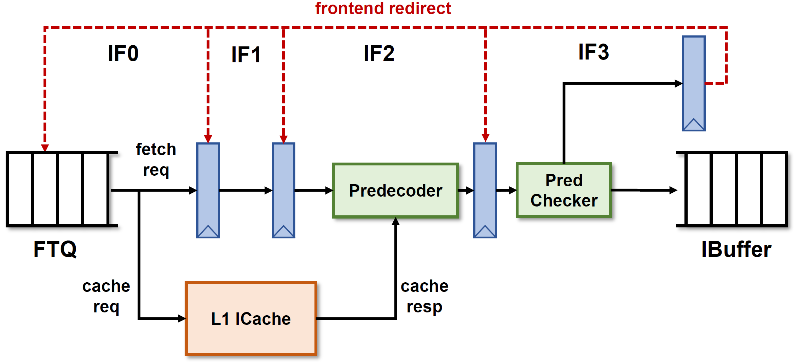

# 取指令单元（Instruction Fetch Unit）文档

这一章描述香山处理器取指单元（IFU）的实现,取值单元流水线如上图所示。

南湖架构的 IFU 采用了4级流水线的结构，相较于雁栖湖版本 IFU 的设计做了非常大的简化，这得益于采用分支预测-指令缓存解耦的取指令架构。

一个取指令请求从 FTQ 发出之后在 IFU 中经历了下面几个阶段：

- 从 FTQ 发送过来的取指令请求包含了一个 32Bytes 指令码 （称为一个指令 packet ） 的起始地址和下一个跳转目标的地址，
- 在 `IFU0` 阶段同时发送请求给 IFU 流水线和 ICache 模块。 
- `IF1` 阶段会做一些简单计算（例如这个指令 packet 里每个2 Bytes, 即每一条可能的指令的 PC ）。 
- `IF2` 阶段等到指令缓存返回最多两个 Cacheline 的数据（因为可能存在这个[指令 packet 跨行](#crossfetch)的情况）之后，第一步先做指令切分，将在取指令地址之外的指令码抛弃得到有效范围的指令码。送入预译码器进行[预译码](#predecode),同时将16 bits的压缩指令扩展为32 bits的指令。
- `IF3` 阶段首先会将预译码结果送到[分支预测检查器](#predchecker)里，发现错误就会在下一拍刷新IFU流水线并把信息发送给FTQ刷新预测器并重新取指令。未发现错误的缓存在指令缓冲队列（IBuffer）里等待译码。
- `IF3` 阶段还会根据地址翻译的结果向指令MMIO模块发起取指令请求，同时转变为[MMIO取指令模式](#mmiofetch)，指令一条一条顺序执行。
- IFU 控制逻辑还需要[处理半条RVI指令](#half)的情况。

<h2 id=predecode>预译码</h2>

预译码器将经过切分的16个 16 bits 指令码进行译码，得到部分指令信息（是否是跳转指令、跳转指令类型以及是否是压缩指令等），对于跳转指令还会计算它的目标地址。主要是为了给[分支预测检查器](#predchecker)提供指令信息和正确的目标地址以及及时更新预测器中的指令信息。

另一方面，预译码器也会将压缩指令（如果这个packet里有的话）扩展为 32 bits 的长指令以便于后续简化译码逻辑。

<h2 id=predchecker>分支预测检查</h2>

分支预测检查器在拿到指令的预译码信息之后主要针对以下几个错误检查：

- jump 指令预测不跳转的错误：针对 `jal` 和 `ret` 这两种种必定跳转的指令检查，如果这个 packet 的[有效指令范围](#validinstr)内有这两种指令，且预测为不跳转，则视为预测错误。
- 非跳转指令的预测错误：如果预测为跳转的指令不在有效指令范围内，或者在有效指令范围内但是不是一条跳转指令，则视为预测错误。
- 目标地址错误：对于可以通过指令码知道目标地址的跳转指令（除了 `jalr` 之外的跳转指令），如果在有效指令范围内且预测跳转并且跳转目标地址和正确地址不匹配，则视为预测错误。

在发现错误后，分支预测检查器挑选出指令顺序最靠前的预测错误指令，把错误信息（错误指令在 packet 里的位置、指令预译码信息、正确的目标地址）传递给 FTQ ，同时清空 IFU 流水线。IFU 等待 FTQ 重新发取指令请求。

<h2 id=crossfetch>跨行指令处理（Cross-Cacheline Fetch）</h2>
由于我们的指令 packet 包括了32 Bytes的指令码，相当于半个cacheline（64 Bytes）的大小，如果这个 packet的起始地址在后半个cacheline里，那么完全有可能发生packet的范围跨过两个cacheline的情况，因此在指令缓存支持一次取两个cacheline以保证这种情况下的指令吞吐。具体做法是当FTQ发现 packet的起始地址在后半个cacheline里，就发起对指令缓存两个相邻cacheline的请求。

<h2 id=validinstr>有效指令范围</h2>
一个取指令 packet 的有效范围由FTQ给出的起始地址和跳转指令的index（如果有跳转的话）共同确定，如果这个packet没有跳转指令，则默认指令有效范围为起始地址开始的256 bits。

有效指令范围可能被IFU的检查重新确定，主要包括：
* 分支预测检查发现有未预测跳转的 `jal` 和 `ret` 指令时，需要重新将有效指令范围缩短到第一条这样的跳转指令；
* 前一个 packet有半条RVI的情况，紧随其后的这个 packet 的第一个 16 bits不在有效指令范围内。
* MMIO请求的packet的指令有效范围只有32 bits

<h2 id=mmiofetch>MMIO取指令</h2>
在 `IF3` 阶段，如果ITLB发现这个地址是MMIO空间的，IFU就启动MMIO取指令模式，向指令MMIO模块发送请求，指令MMIO模块向MMIO总线发送 `Get` 请求64 bits的数据，等待总线返回后根据IFU的请求地址对数据进行裁剪，返回指令码。IFU 将指令码进行扩展之后发送给指令缓冲队列。同时，IFU阻塞流水线，侦听ROB的commit信号，直到指令执行完后发送前端重定向取下一条指令。

MMIO请求每次只取一条指令，因此在这种模式下处理器的指令执行速度会变得非常慢。

<h2 id=half>半条RVI指令的处理</h2>
当一个指令 packet 在 `IF3` 阶段发现它的最后 2 Bytes 是一条 RVI 指令的前半部分时，我们把这条RVI指令算在这个packet里，同时我们取两个cacheline的机制保证后半部分是一定可以被取到的，因此我们只需要在发生这种情况的时候置一个标识位，当下一个packet来的时候把第一个个2 Bytes排除在指令的有效范围之外即可。

