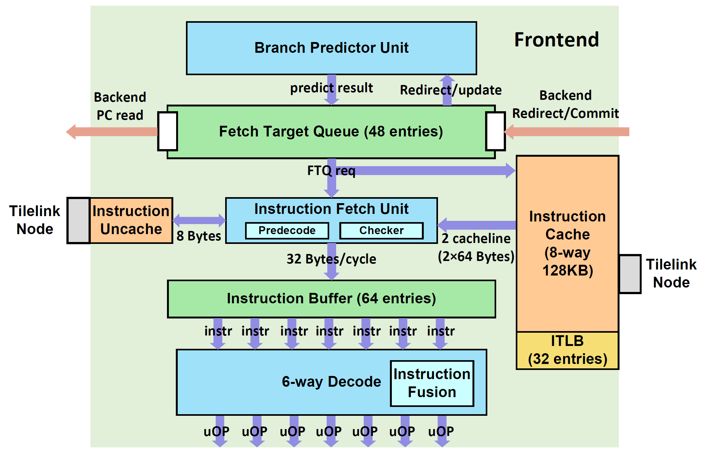

# 前端架构文档

这一章描述香山处理器前端（Frontend）的整体架构。前端的模块关系和数据通路由下图所示：

南湖架构采取了一种分支预测和指令缓存解耦的取指架构，分支预测单元提供取指请求，写入一个队列，该队列将其发往取指单元，送入指令缓存。
取出的指令码通过预译码初步检查分支预测的错误并及时冲刷预测流水线，检查后的指令送入指令缓冲并传给译码模块，最终形成后端的指令供给。

这一章包括以下几个部分：

* [分支预测](bp.md)
* [取指目标队列](ftq.md)
* [取指令单元](ifu.md)
* [指令缓存](icache.md)
* [译码单元](decode.md)

一些名词会在文档中以缩写形式出现，这些缩写下方会有一个下划线，将鼠标停留在上面就可以看到缩写的全称。