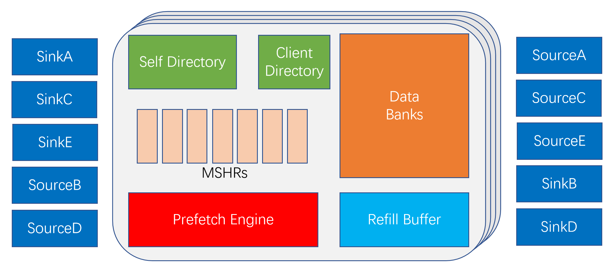

# L2/L3 Cache 总体架构

XiangShan 南湖架构的 L2/L3 Cache (即 [huancun 子项目](https://github.com/OpenXiangShan/HuanCun)) 是参考 [block-inclusive-cache-sifive](https://github.com/sifive/block-inclusivecache-sifive) 设计的基于目录的 Non-inclusive Cache (inclusive directory, non-inclusive data)。

huancun 以 Tilelink 为总线一致性协议，并可以通过添加自定义 Tilelink user-bit 解决在 L1 Cache 大于 32KB 时产生的 [Cache Alias 问题](./cache_alias.md)。

huancun 的总体结构如下图所示：

huancun 可根据请求的地址低位为索引分 Slice 以提升并发度。每个 Slice 内部的 [MSHR](./mshr.md) 数量可配，负责具体的任务管理。

[DataBanks ](./data.md)负责存储具体数据，可以通过参数配置 Bank 数量从而提升读写并行度。

[RefillBuffer ](./misc.md#refill_buffer)负责暂存 Refill 的数据，以直接 Bypass 到上层 Cache 而不需要经过 SRAM 写入。

Sink/Source\* 相关模块为 Tilelink [通道控制模块](./channels.md)，负责与标准 Tilelink 接口进行交互，一方面将外部请求转换为
Cache 内部信号，另一方面接收 Cache 内部请求转换为 Tilelink 请求发出到接口。

在[目录组织](./directory.md)上，huancun 将上层数据与本层数据的目录分开存储，
Self Directory/Client Directory 分别为当前层级 Cache Data 所对应的目录和上层 Cache Data 所对应的目录。

另外，[预取器](./prefetch.md)采用了 BOP(Best-Offset Prefetching) 算法，可通过参数进行配置或裁减。

## huancun 的总体工作流程为：

1. [通道控制模块](./channels.md)接受 Tilelink 请求，将其转换为 Cache 内部请求。

2. [MSHR Alloc 模块](./misc.md#alloc)为内部请求分配一个 [MSHR](./mshr.md)。

3. [MSHR](./mshr.md) 根据不同请求的需求发起不同的任务，任务类型包括 Data 读写、向上下层 Cache 发送新请求或返回响应、触发或更新预取器等。

4. 当一个请求所需的全部操作在 [MSHR](./mshr.md) 中完成时，[MSHR](./mshr.md) 被释放，等待接收新的请求。
