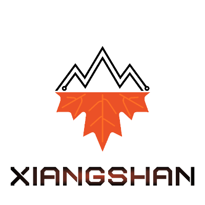

---
hide:
  - navigation
---

# 欢迎访问香山官方文档！

## Recent Updates

**我们将继续在ASPLOS'24会议期间同地举办香山项目的上手教程. Look forward to seeing you at ASPLOS'24 in San Diego, USA. Learn more on [the ASPLOS'24 Tutorial Page](tutorials/asplos24.md).**

我们在HPCA'24会议期间同地举办香山项目的上手教程. We have hosted tutorials at HPCA'24 in Edinburgh, Scotland. Learn more on [the HPCA'24 Tutorial Page](tutorials/hpca24.md).

我们在MICRO'23会议期间同地举办了一次香山项目的上手教程，并介绍了第三代（昆明湖）架构的最新进展. We have hosted tutorials at MICRO'23 with latest update on the third generation (Kunminghu) architecture. Learn more on [the MICRO'23 Tutorial Page](tutorials/micro23.md).

我们在APSLOS'23会议期间同地举办了一次香山项目的上手教程. We have hosted tutorials at ASPLOS'23. Learn more on [the ASPLOS'23 Tutorial Page](tutorials/asplos23.md).

**For publications by the XiangShan team, check out [the Publications Page](tutorials/publications.md).**

## 导引 Introduction

这是香山的官方文档仓库，包括香山项目的整体介绍、代码仓库概览、集成指南、上手教程、处理器核介绍、开发工具链介绍等内容。请通过左边菜单栏切换访问对应内容。如果您是在移动端打开，由于文档框架的限制，需要您通过左上角返回键回到父级菜单切换页面。

This is the official documentation repository for Xiangshan. It includes an overview of the Xiangshan project, code repository, integration guide, getting started tutorial, processor core introduction, development toolchain introduction, and other related content. Please use the left-side menu to navigate to the corresponding sections. If you are accessing the website on a mobile device, due to the limitations of the documentation framework, use the back button in the upper left corner to return to the parent menu and switch pages.

## 香山是什么 About XiangShan

2019 年，在中国科学院支持下，**由 [中国科学院计算技术研究所](http://www.ict.ac.cn/) 牵头发起 “香山” 高性能开源 RISC-V 处理器项目**，研发出目前国际上性能最高的开源高性能 RISC-V 处理器核 “香山”，在全球最大的开源项目托管平台 GitHub 上获得超过 4100 个星标（Star），形成超过 550 个分支（Fork），成为国际上最受关注的开源硬件项目之一，得到国内外企业的积极支持 —— 16 家企业联合发起开源芯片创新联合体[北京开源芯片研究院（Beijing Institute of Open Source Chip, BOSC）](https://www.bosc.ac.cn/)，围绕“香山” 进一步联合开发，形成示范应用，加速 RISC-V 生态建设。

In 2019, with the support of the Chinese Academy of Sciences (CAS), the Institute of Computing Technology (ICT) of CAS initiated the "XiangShan" high-performance open-source RISC-V processor project. The project successfully developed the XiangShan processor core, which is currently one of the highest-performing open-source RISC-V processor cores worldwide. It has received over 4100 stars and more than 550 forks on GitHub, making it one of the most renowned open-source hardware projects. XiangShan has gained active support from domestic and international enterprises. A consortium of 16 companies has jointly initiated an open-source chip innovation alliance, collaborating on further development around XiangShan to create demonstration applications and accelerate the RISC-V ecosystem. The nonprofit organization [Beijing Institute of Open Source Chip (BOSC)](https://www.bosc.ac.cn/) was founded with industry-leading companies as its founding members. Working closely with the industry, BOSC will further develop XiangShan.

我们的目标是成为 **面向世界的体系结构创新开源平台**，服务于工业界、学术界、个人爱好者等的体系结构研究需求。此外，我们希望在香山的开发过程中，**探索高性能处理器的敏捷开发流程**，建立一套基于开源工具的高性能处理器设计、实现、验证流程，大幅提高处理器开发效率、降低处理器开发门槛。

Our goal is to become a global open-source architecture innovation platform that serves the needs of industry, academia, and individual enthusiasts in architecture research. Additionally, we aim to explore an agile development process for high-performance processors during the development of XiangShan. This involves establishing a high-performance processor design, implementation, and verification flow based on open-source tools to enhance development efficiency and lower barriers to entry.

**香山将保持半年左右的微结构迭代周期、流片周期，持续进行微结构创新与敏捷开发方法实践。** 香山处理器的正式开发从 2020 年 6 月开始，1e3fad1 是我们 [第一个提交](https://github.com/OpenXiangShan/XiangShan/commit/1e3fad102a1e42f73b646332d264923bfbe9c77e) 的哈希值，代码仓库中在此之前的提交均属于 [2019 年第一期一生一芯计划产出的果壳处理器](https://github.com/OSCPU/NutShell)。在香山处理器中，包括 CPU 流水线前端、后端、访存流水线、L1 Cache、L2/L3 Cache 等在内的关键代码均由香山团队独立实现，我们对代码的所有修改历史均在 Git 提交记录中可见。香山处理器的物理设计流程主要由我们在鹏城实验室的后端与 SoC 工程师团队完成。我们希望通过持续不断的优化与流片验证，逐步提高香山处理器的 PPA 水平，让香山成为一个开源的工业级别处理器，并成为面向世界的体系结构创新开源平台。

XiangShan will maintain a microarchitecture iteration cycle of approximately six months, including tape-out cycles, to continuously drive microarchitecture innovation and agile development practices. The development of the XiangShan processor began in June 2020, with the initial commit hash being [1e3fad1](https://github.com/OpenXiangShan/XiangShan/commit/1e3fad102a1e42f73b646332d264923bfbe9c77e). The previous commits belong to [the NutShell repository](https://github.com/OSCPU/NutShell) from the first [One Student One Chip](https://ysyx.oscc.cc/) project. Key code components of the XiangShan processor, including the CPU frontend, backend, memory access pipeline, L1 Cache, L2/L3 Cache, and more, have been independently implemented by the XiangShan team. The physical design process of the XiangShan processor is primarily carried out by the backend and SoC engineering teams at the Peng Cheng Laboratory. Through ongoing optimization and tape-out validation, we aim to gradually improve the XiangShan processor's performance, power, and area (PPA) levels, making it an open-source industrial-competitive processor and a global open-source architecture innovation platform.

**香山处理器第一版（雁栖湖架构）** 面向单核场景，支持 RV64GC 指令集，已在 2021 年 7 月投片，在 28nm 的工艺节点下达到 1.3GHz 的频率。2022 年 1 月，雁栖湖芯片回片并成功点亮，能够正确运行 Linux/Debian 等复杂操作系统，在 DDR4-1600 环境下初步实测 SPEC CPU2006 性能超过 7 分 @1GHz。设计代码开源地址在[这里](https://github.com/OpenXiangShan/XiangShan/releases/tag/v1.0)。

The first generation of the XiangShan processor (Yanqihu architecture) supports the RV64GC instruction set and has been taped out in July 2021, achieving a frequency of 1.3GHz on a 28nm process node. In January 2022, it was successfully brought out. It boots Linux/Debian operating systems and runs SPEC CPU2006 for 7@1Hz. The source code is [here](https://github.com/OpenXiangShan/XiangShan/releases/tag/v1.0).

**香山处理器第二版（南湖架构）** 支持 RV64GCBK 指令集，V1 版本面向双核场景，已在 2023 年 2 月完成 RTL 代码冻结，2023 年 6 月完成 GDSII 冻结，并于 2023 年 11 月投片，在 14nm 工艺节点下频率达到 2GHz。南湖架构的设计代码开源地址在[这里](https://github.com/OpenXiangShan/XiangShan/releases/tag/v2.0)。南湖 V2 版本包含了 MBIST 等改进设计，已在 2023 年 2 月完成 RTL 代码冻结，并于 2023 年 4 月投片，2023 年 10 月回片并成功点亮启动 Linux，目前正在进行板卡的进一步功能和性能测试。设计代码开源地址在[这里](https://github.com/OpenXiangShan/XiangShan/releases/tag/v2.1)。南湖 V3 版本将包含更多的微结构、PPA改进，目前项目正在进行中。

The second generation (Nanhu architecture) supports the RV64GCBK instruction set and completed RTL code freezing in February 2023. The GDSII is fixed in June 2023. It has been taped out in November 2023, achieving a frequency of 2GHz on a 14nm process node. The source code is [here](https://github.com/OpenXiangShan/XiangShan/releases/tag/v2.0).
Nanhu V2 adds support for more functionalities such as MBIST. Its design has been frozen in February 2023, and it was taped out in April 2023. The chip was back and brought up in October 2023. It is currently being further tested. The source code of Nanhu v2 is [here](https://github.com/OpenXiangShan/XiangShan/releases/tag/v2.1). Nanhu V3 will include more microarchitecture and PPA improvements and is currently in progress.

**香山处理器第三版（昆明湖架构）** 正在进行中，我们非常欢迎来自社区的贡献。

The third generation (Kunminghu) is in progress. We welcome your contributions.

**香山处理器将始终坚持开源，坚定地开源我们所有的设计、验证、基础工具代码。** 我们非常感谢社区对香山的贡献，在硬件设计方面，香山处理器的部分模块设计受到了开源处理器、公开论文等的启发，曾参考了现有的开源 rocket-chip、berkeley-hardfloat、SiFive block-inclusivecache 等代码。我们在 Chisel 开源社区的现有总线工具、浮点运算单元、系统缓存等基础上，修改完善了它们的功能，同时优化了频率、吞吐等性能指标。与此同时，我们非常欢迎社区基于香山进行开发或者使用香山项目的代码。在众多开源协议中，我们选择了 [木兰宽松许可证第 2 版](http://license.coscl.org.cn/MulanPSL2)，希望（1）始终保持香山处理器的开放性，木兰宽松许可证不具有传染性，用户可以放心使用；（2）立足中国国内、面向全世界，木兰宽松许可证以中英文双语表述，中英文版本具有同等法律效力。

**Xiangshan processors will always adhere to open source, and firmly open source all our design, verification, and basic tool codes.** We are very grateful to the community for their contributions to Fragrant Hills. In terms of hardware design, some module designs of XiangShan processors have been inspired by open source processors and public papers. We have referred to existing open source rocket-chip, berkeley-hardfloat, SiFive block-inclusivecache and other codes. Based on the existing bus tools, floating-point unit, and system cache in the Chisel open source community, we have modified and improved their functions, and optimized performance indicators such as frequency and throughput. At the same time, we welcome the community to develop based on XiangShan or use the code of the XiangShan project. Among many open source agreements, we have chosen [Mulan Permissive Software License v2] (http://license.coscl.org.cn/MulanPSL2), hoping to (1) keep the XiangShan processor open, Mulan Permissive Software License v2 is not contagious, and users can use it with confidence; (2) Based in China and facing the world, Mulan Permissive Software License v2 is expressed in both Chinese and English, and the Chinese and English versions have the same legal effect.

**香山处理器积极地拥抱开源社区，非常欢迎来自社区的贡献。** 我们看到，一些开源 RISC-V 处理器项目很少接收外部代码提交，我们理解这一现象背后有观念与技术上的多重原因，如担心开发计划冲突、处理器设计需要兼顾多方面需求、难以评估外部贡献的质量等。对于香山项目来说，在观念方面，我们非常欢迎外部贡献，如提交问题、提交特性需求、提交代码等，每一条意见与建议我们都会认真考虑与评估。举例来说，Chisel 对工业界仍然是一个新东西，如果您更熟悉 Verilog/SystemVerilog、但希望为香山提交代码贡献，我们欢迎您向 [这个仓库](https://github.com/OpenXiangShan/XS-Verilog-Library) 提交 Pull Request。在技术层面，我们希望探索一套评估代码改动质量的流程与工具，由基础流程来确定是否接受一个代码提交。举例来说，我们希望在不久的未来，开放一套更快速、更准确的性能采样框架，来评估一个架构改动带来的性能收益，当代码提交满足不破坏已有的模块性和扩展性、具有较为一定性能收益、具有良好的代码风格等条件时，我们将接收这一代码修改。如果用一句话总结我们的开发者策略，我们非常欢迎任何对香山有益的讨论、问题提交、代码修改等。

**XiangShan actively embraces the open source community and welcomes contributions from the community.** We have seen that some open source RISC-V processor projects rarely receive external code submissions. We understand that there are multiple conceptual and technical reasons behind this phenomenon. For the XiangShan project, we welcome external contributions, such as submitting questions, submitting feature requirements, submitting code, etc. We will seriously consider and evaluate every opinion and suggestion. For example, Chisel is still new to the industry, if you are more familiar with Verilog/SystemVerilog but want to submit code contributions to XiangShan, we welcome you to [this repo](https://github.com/OpenXiangShan/XS-Verilog-Library) submit a Pull Request. At the technical level, we hope to explore a set of processes and tools for evaluating the quality of code changes, and the basic process determines whether to accept a code submission. For example, we hope that in the near future, we will open a faster and more accurate performance sampling framework to evaluate the performance benefits brought about by an architecture change. We will accept this code modification when it has certain performance benefits, good code style and other conditions. If we sum up our developer strategy in one sentence, we welcome any discussion, issue submission, code modification, etc. that are beneficial to XiangShan.

**除了微结构探索之外，香山项目还希望探索并建立一套高性能处理器的敏捷开发流程。** 香山处理器的目标是成为面向世界的体系结构创新开源平台，基础能力、设施、流程的建立是香山处理器长期高质量发展的关键，我们将保持长期稳定的投入，不断努力建立处理器敏捷开发的基础设施、基础流程。在香山项目初期，我们沿用了果壳处理器的开发与验证框架。在香山项目的推进过程中，我们对其进行了大量改进，添加了包括仿真检查点、压缩文件加载、多核验证支持等功能。目前，香山处理器的验证环境相比果壳处理器已有大量改进，丰富的基础工具支撑起了香山这一复杂度量级的敏捷验证流程。此外，UCB 和 Chipyard 框架是我们学习的榜样，我们参考或使用了他们发起的很多开源项目。我们希望，随着香山项目的推进与深入，我们能够推动开源社区的不断进步，与开源社区一道，推动建立高性能处理器的敏捷开发流程与基础设施。

**In addition to microstructure exploration, the XiangShan project also hopes to explore and establish an agile development process for high-performance processors.** The goal of XiangShan Processor is to become an open source platform for architecture innovation facing the world. The establishment of basic capabilities, facilities, and processes is the key to the long-term high-quality development of Fragrant Hills Processor. We will maintain long-term and stable investment and continue to strive to build processors The infrastructure and basic process of agile development. In the early stage of the XiangShan project, we followed the development and verification framework of the NutShell processor. During the advancement of the XiangShan project, we have made a lot of improvements to it, adding features including simulation checkpoints, compressed file loading, multi-core verification support, and more. At present, the verification environment of XiangShan processor has been greatly improved compared with that of NutShell processor, and rich basic tools support XiangShan's agile verification process of this complex scale. In addition, the UCB and Chipyard frameworks are role models for us to learn from, and we refer to or use many open source projects initiated by them. We hope that with the advancement and deepening of the XiangShan project, we can promote the continuous progress of the open source community, and together with the open source community, promote the establishment of an agile development process and infrastructure for high-performance processors.

**我们清楚地认识到，香山处理器距离业界主流水平还有很大的差距，比如在很多技术点的方案选择上，我们做的不够好。香山处理器的目标是成为面向世界的体系结构创新开源平台，我们非常欢迎来自业界前辈、高性能处理器爱好者、开源社区等提出建议和意见，只要对香山处理器项目是有益的，我们都会接受并且改进，同时，我们也欢迎并且鼓励更多的人一起加入香山处理器的开发，推动香山项目的持续创新。**

**We clearly realize that there is still a big gap between XiangShan processors and the mainstream level of the industry. For example, we are not good enough in the selection of solutions for many technical points. The goal of XiangShan Processor is to become an open source platform for architecture innovation facing the world. We welcome suggestions and opinions from industry seniors, high-performance processor enthusiasts, and open source communities. As long as it is beneficial to the XiangShan Processor Project, we will Accept and improve. At the same time, we also welcome and encourage more people to join in the development of XiangShan processors to promote the continuous innovation of the XiangShan project. **

## 推荐关于香山的报道

香山始终坚持实事求是的原则，始终保持建立开源平台、探索敏捷开发的初衷，不希望在宣传上出现任何可能导致误解的内容。

自香山在 2021 年 6 月举办的 RISC-V 中国峰会上正式发布以来，我们在社交媒体、自媒体、新闻媒体上看到了很多对香山处理器的报道，其中有一些是作者的 “自我发挥”，存在误导读者的可能性。为此我们特意创建了一个 [辟谣专区](https://github.com/OpenXiangShan/XiangShan-doc/tree/main/clarifications)，用来澄清一些广为流传的误会。

我们推荐以下关于香山处理器的报道，来自于我们的官方发布和科普渠道：

- 包云岗老师在 [2023 年 RISC-V 欧洲峰会上的报告](https://mp.weixin.qq.com/s/v2zKCnQM2QCRaY8e0ZmuQA)
- 包云岗老师亲自撰写的 [香山处理器相关介绍](https://www.zhihu.com/question/466393646/answer/1955410750)
- 中国开放指令生态（RISC-V）联盟的官方公众号的 [文章](https://mp.weixin.qq.com/s/MAkxKZ1eS4UwBkvgD91Xng)
- 香山处理器的 [源码](https://github.com/OpenXiangShan)

香山的核心理念之一是开源、开放，针对这一话题，我们推荐阅读 [孙凝晖院士的《论开源精神》](https://mp.weixin.qq.com/s/1Irs9a0EKoB7P-J_4ju66A)。
