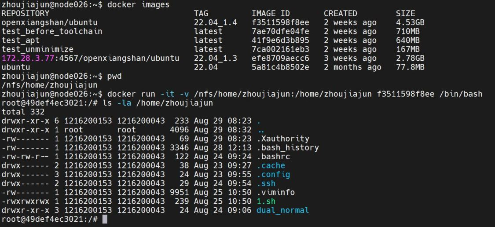
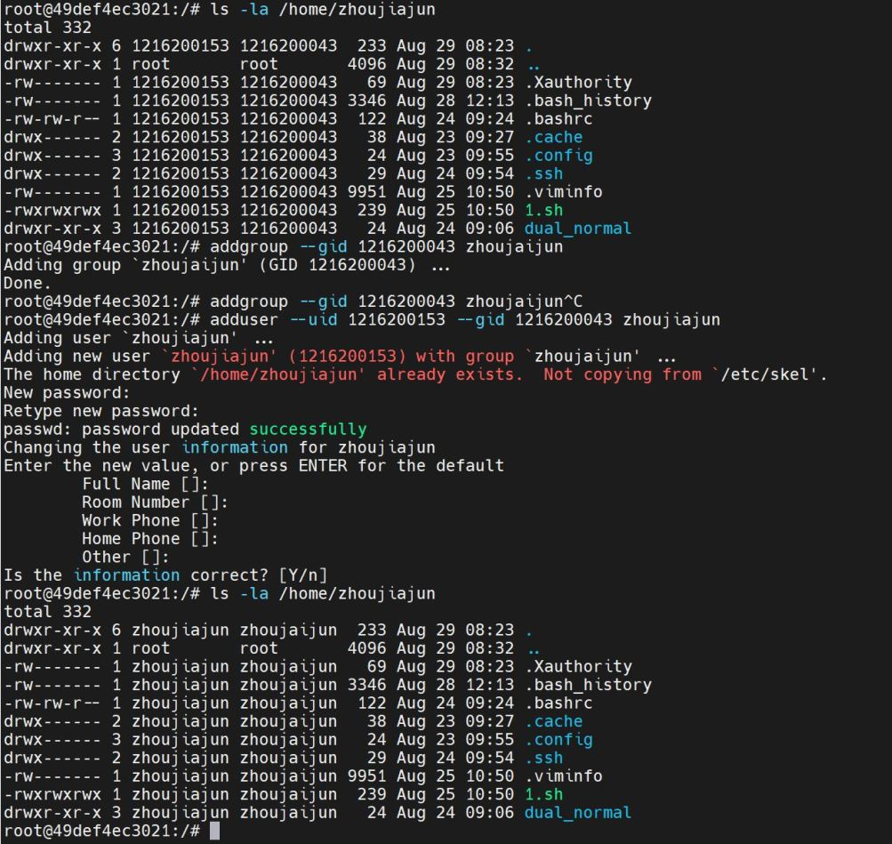
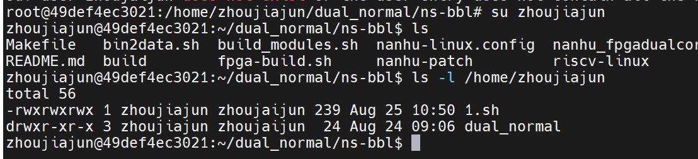
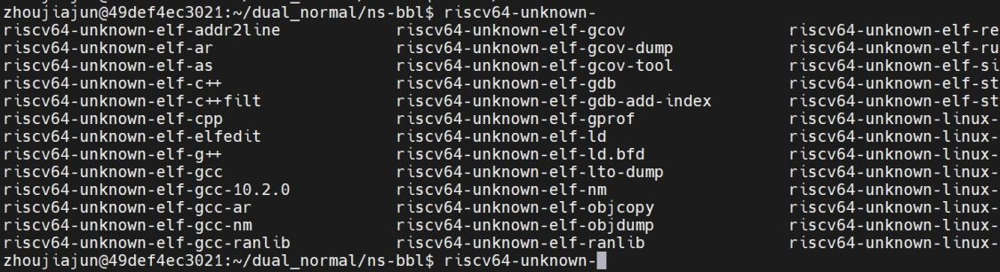
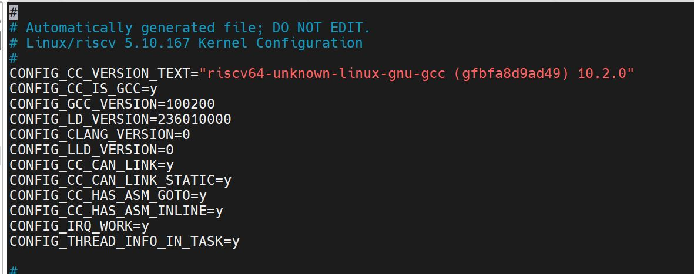

# Docker Instruction
## 准备
在需要部署的服务器上安装docker应用
## 服务器导入docker镜像
云盘下载链接：(7z自解压文件)
[阿里云盘分享](https://www.aliyundrive.com/s/1abKfjYKWJ6)
Docker镜像MD5SUM：3ebafca4bfaa53c93abaf6ab3a3a8626
进入服务器后执行以下命令，结果如下
```
docker load --input <服务器镜像路径(蓝字部分)>
docker images   # 执行后可以看到image_id,大小为4.53GB
pwd	  #执行后得到<宿主机上文件夹的绝对路径>
docker run -it -v <宿主机上文件夹的绝对路径>:</home/your_name(尽量填名字方便找)> image_id /bin/bash
```

## 进入容器，完成用户切换
```
addgroup --gid 5 your_name
adduser --uid 4 --gid 5 your_name
su your_name   #切换到用户, 至此环境部署完毕
```


## 添加环境变量
```
vim ~/.bashrc
export  RISCV="/opt/riscv"
export PATH=$RISCV/bin:$PATH
export CROSS_COMPILE=riscv64-unknown-linux-gnu-
export ARCH=riscv
source  ~/.bashrc
```

## 获取源码并编译
### 获取源码并cp到服务器下
```
git clone git@github.com:OpenXiangShan/ns-bbl.git -b nanhu-dualcore-fpga
cd ns-bbl
rm -r riscv-linux riscv-pk riscv-rootfs
git clone git@github.com:openxiangshan/riscv-linux.git -b linux-5.10.167
git clone git@github.com:openxiangshan/riscv-pk.git -b nanhu-mini-sys
git clone git@github.com:openxiangshan/riscv-rootfs.git -b nanhu-nfs
mkdir build
cd ../
scp -r ns-bbl/ your_name@<服务器IP>:<宿主机上文件夹的绝对路径>
```
### 定制app 到rootfs.cpio （选做）
准备，在docker中先交叉编译定制app，生成可执行文件
```
例：将i2cdelect命令加入 rootfs.cpio
cpio -imdv < rootfs.cpio  //解压原始rootfs.cpio
chmod 777 i2cdelect | cp i2cdelect /usr/bin/  //可执行文件需要赋777权限
sudo chown -R root:root .
find . | cpio -o -H newc > ../rootfs.cpio  //打包新的rootfs.cpio
cp ../rootfs.cpio ns-bbl  //拷贝使用
```
### 编译
```
cd riscv-linux
make nanhu_fpga_defconfig
cd ../
make sw -j200  #完成后buid目录下有linux.bin
```

### 生成烧录FPGA的txt文件
在linux环境下使用下面的工具，将linux.bin生成烧录FPGA的txt文件
[bin2fpgadata.tar.gz](https://raw.githubusercontent.com/OpenXiangShan/XiangShan-doc/main/docs/integration/resources/bin2fpgadata.tar.gz)
```
#生成data.txt
<bin2fpgadata路径>/bin2fpgadata -i linux.bin
```
## 测试
按照[基于南湖的FPGA开源最小系统构建](https://bosc.yuque.com/staff-xmw8rg/uzgwxz/gdedotu916gyc2h0?view=doc_embed&inner=D0sGN)中演示的操作，将生成好的txt文件放到最小系统中就能进行测试
