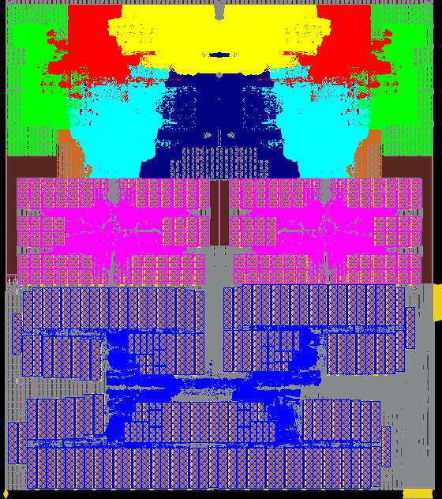
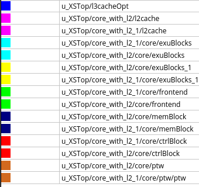

# Reference Floorplan

This section presents the floorplan of NANHU. The floorplan is for reference only, and we don't guarantee its effectiveness on any process node.

## Dual-Core NANHU

Below shows the reference floorplan for NANHU. It is configured with dual cores with 1MB L2 cache for each of them. The L3 cache is 6MB. Different colors represent various submodules in XSCore, as listed in the second figure.

Figure: a reference floorplan for dual-core NANHU

Figure: coloring of the floorplan
