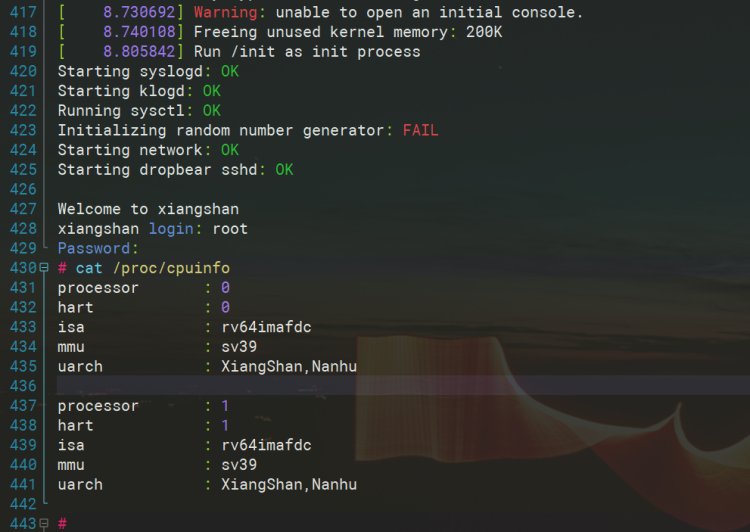
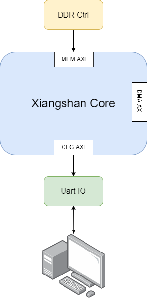
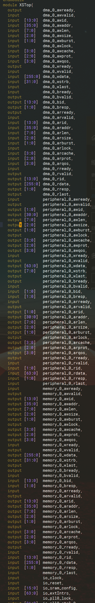
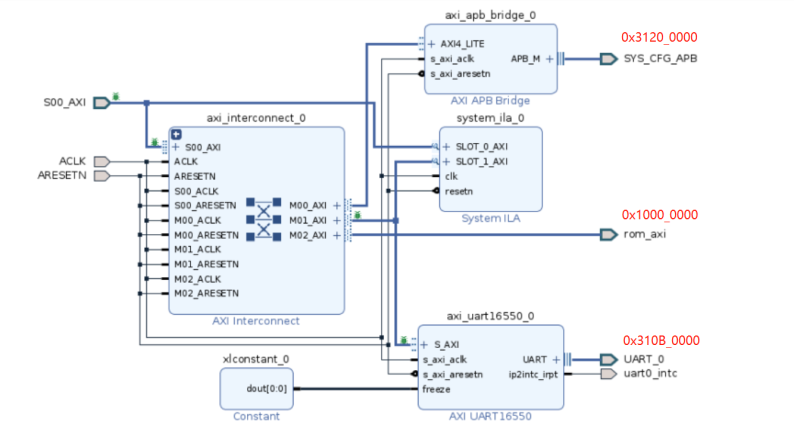
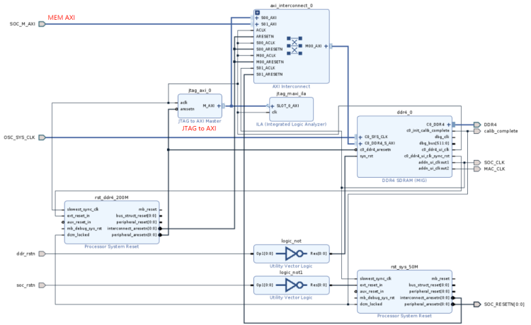

# FPGA Prototype

基于南湖的 FPGA 开源最小系统构建指引

## 基本步骤 Steps

### 编译香山南湖RTL

(1) 主分支（昆明湖架构）在持续开发中，南湖架构的流片版本设计在 nanhu 分支，其适配 FPGA 环境的分支在 [nanhu-clockdiv2](https://github.com/OpenXiangShan/XiangShan/tree/nanhu-clockdiv2)

注意：因为 FPGA 代码和仿真代码不是同一套，如果使用同一个 XiangShan 仓库，需要 `rm -rf build` 删除已有输出文件

(2) 从GitHub上拉取仓库

```sh
git clone https://github.com/OpenXiangShan/XiangShan
cd XiangShan
export NOOP_HOME=$(pwd)
git checkout nanhu-clockdiv2
make init
make clean
make verilog NUM_CORES=2 # Dual-Core XiangShan
```

(3) 对生成好后的代码进行些修改，让 Vivado 在例化时调用 ultra ram 的资源。例如：将array_开头的文件中，声明位宽64bit的深度大于1024的ram，强制vivado使用ultra ram来例化，减少bram的使用

修改 `array_16_ext.v`:


### 拷贝 Vivado 相关脚本，生成 Vivado 项目，编译二进制流

```sh
# prepare the scripts
git clone https://github.com/OpenXiangShan/env-scripts.git
cd xs_nanhu_fpga
make update_core_flist CORE_DIR=$NOOP_HOME/build
make nanhu CORE_DIR=$NOOP_HOME/build

# generate the FPGA bitstream
make bitstream CORE_DIR=$NOOP_HOME/build
```

注意：生成时间较长，根据机器性能不同，需要花费 8~12h 的时间完成 bit 的生成

### 下载测试

脚本：[onboard-ai1-119.tcl](https://raw.githubusercontent.com/OpenXiangShan/env-scripts/main/fpga/onboard-ai1-119.tcl)

实例内存镜像txt：[data.txt](https://raw.githubusercontent.com/OpenXiangShan/XiangShan-doc/main/docs/integration/resources/data.zip) （下载zip文件，然后解压成txt）

`-tclargs` 之后的第一个路径 `<vivado_build_folder>` 为存放 Vivado 所生成的 bit 及 ltx 文件的位置

```sh
vivado -mode batch -source ./onboard-ai1-119.tcl -tclargs <vivado_build_folder> ./data.txt
```

连接串口，115200, N, 8, 1

<font color=red>*用户名：root*</font>

<font color=red>*密码：bosc*</font>

系统完成加载后，能够看到如下的信息。可以 `cat /proc/cpuinfo` 得到当前的 CPU 信息：



## FPGA 最小系统原理

### XiangShan Core Interface

香山CPU核心的对外接口，主要包括 MEM AXI、DMA AXI 及 CFG AXI 三部分。分别用于对接 DDR 控制器、DMA 数据通路及 IO 操作。





我们在搭建最小系统时，由于没有大数据吞吐的操作，因此主要使用了其中的 MEM AXI 及 CFG AXI 两个接口。

### XiangShan 地址映射表（CFG AXI）

下面是 XiangShan 的地址映射表。在构建最小系统时，我们只需要其中的几个外设：`SYS_CFG`、`QSPI_FLASH` 以及 `UART`。因此我们在 Vivado 中构建对接 CFG AXI 的桥，将上面所述的三个外设按照 XiangShan 的地址映射表引出。

`QSPI_FLASH` 主要存储 bootrom，Vivado工程里，我们使用带初始值的bram来模拟。

`SYS_CFG` 只使用到了 0x0000_0000 偏移的版本信息。

```cpp
#ifndef _XS_MEMMAP_H_
#define _XS_MEMMAP_H_

#define  QSPI_FLASH_BASE 0x10000000

#define         DMA_BASE 0x30040000
#define       SDMMC_BASE 0x30050000
#define         USB_BASE 0x30060000

#define        QSPI_BASE 0x31000000
#define        GMAC_BASE 0x31010000
#define        HDMI_BASE 0x31020000
#define    HDMI_PHY_BASE 0x31030000
#define          DP_BASE 0x31040000

#define        DDR0_BASE 0x31060000
#define    DDR0_PHY_BASE 0x31070000

#define         I2S_BASE 0x310A0000
#define       UART0_BASE 0x310B0000
#define       UART1_BASE 0x310C0000
#define       UART2_BASE 0x310D0000
#define        I2C0_BASE 0x310E0000
#define        I2C1_BASE 0x310F0000
#define        I2C2_BASE 0x31100000
#define        I2C_BASE  I2C0_BASE
#define        GPIO_BASE 0x31110000
#define         CRU_BASE 0x31120000
#define         WDT_BASE 0x31130000

#define   USB2_PHY0_BASE 0x31140000
#define   USB2_PHY1_BASE 0x31150000
#define   USB3_PHY0_BASE 0x31180000
#define   USB3_PHY1_BASE 0x31190000
#define   SOC_REG_BASE   0x31200000
#define   PCIE0_CFG_BASE 0x311C0000
#define   PCIE1_CFG_BASE 0x311D0000
#define      SYSCFG_BASE 0x31200000
#define    PMA_CFG0_BASE 0x38021000
#define    PMA_CFG2_BASE 0x38021010
#define PMA_ADDR_BASE(x) (0x38021100 + 8 * x)

#define      CPU_CFG_BASE 0x3a000000

#define       PCIE0_BASE 0x40000000
#define       PCIE1_BASE 0x60000000
#define         DDR_BASE 0x80000000

#define UART_BASE UART0_BASE

#define SYNC_ADDR QSPI_FLASH_BASE + 0x07000000
#endif //_XS_MEMMAP_H_
```



### XiangShan MEM AXI 接口设计

MEM AXI 的接口比较简单，主要是将 XiangShan 连接到 DDR 控制器上。在 FPGA 上会增加一个 JTAG to AXI 的 IP，来实现将 Linux 的镜像文件加载到 DDR 地址的操作。



### 从下载脚本，看启动过程

(1) 获取 bit 文件路径

```tcl
# param
# first : xiangshan's bit
# second : workload's data.txt
set xs_path [lindex $argv 0]
puts "xiangshan path:"
puts $xs_path
set bit_path $xs_path/xs_fpga_top_debug.bit
set ltx_path $xs_path/xs_fpga_top_debug.ltx
puts "bit_path:"
puts $bit_path
puts "ltx_path:"
puts $ltx_path
```

(2) 打开对应服务器的 hw_server，烧写 FPGA

```tcl
open_hw_manager
connect_hw_server -url localhost:3121 -allow_non_jtag
current_hw_target [get_hw_targets */xilinx_tcf/Xilinx/00500208D0BAA]
set_property PARAM.FREQUENCY 10000000 [get_hw_targets */xilinx_tcf/Xilinx/00500208D0BAA]
open_hw_target
set_property PROBES.FILE $ltx_path [get_hw_devices xcvu19p_0]
set_property FULL_PROBES.FILE $ltx_path [get_hw_devices xcvu19p_0]
set_property PROGRAM.FILE $bit_path [get_hw_devices xcvu19p_0]
program_hw_devices [get_hw_devices xcvu19p_0]
```

其中第 2 行，`localhost:3121` 表示需要在服务器本地运行。如果需要远程的 hw_server，需要在服务器上开启 hw_server 的服务。再将 localhost 可以更改为对应服务器的 IP 地址，就能够在内网的任意一台计算机上执行该烧写的脚本。

第 4、5 行为对应 JTAG 下载电缆的属性参数。可以通过 Vivado，打开 hw_manager 进行确认。


脚本中的内容需要和图中的 3、4 项一致。其中 `PARAM.FREQUENCY` 可以通过 4 的下拉菜单选取一个支持的速率填入。

(3) 复位系统及DDR

```tcl
refresh_hw_device [lindex [get_hw_devices xcvu19p_0] 0]
display_hw_ila_data [ get_hw_ila_data hw_ila_data_1 -of_objects [get_hw_ilas -of_objects [get_hw_devices xcvu19p_0] -filter {CELL_NAME=~"xs_soc_debug/U_JTAG_DDR_SUBSYS/jtag_ddr_subsys_i/jtag_maxi_ila"}]]
display_hw_ila_data [ get_hw_ila_data hw_ila_data_2 -of_objects [get_hw_ilas -of_objects [get_hw_devices xcvu19p_0] -filter {CELL_NAME=~"u_ila_0"}]]
startgroup
set_property OUTPUT_VALUE 0 [get_hw_probes vio_sw6 -of_objects [get_hw_vios -of_objects [get_hw_devices xcvu19p_0] -filter {CELL_NAME=~"u_vio"}]]
commit_hw_vio [get_hw_probes {vio_sw6} -of_objects [get_hw_vios -of_objects [get_hw_devices xcvu19p_0] -filter {CELL_NAME=~"u_vio"}]]
endgroup
after 500
# hold 500ms
startgroup
set_property OUTPUT_VALUE 1 [get_hw_probes vio_sw6 -of_objects [get_hw_vios -of_objects [get_hw_devices xcvu19p_0] -filter {CELL_NAME=~"u_vio"}]]
commit_hw_vio [get_hw_probes {vio_sw6} -of_objects [get_hw_vios -of_objects [get_hw_devices xcvu19p_0] -filter {CELL_NAME=~"u_vio"}]]
endgroup
after 500
startgroup
set_property OUTPUT_VALUE 0 [get_hw_probes vio_sw4 -of_objects [get_hw_vios -of_objects [get_hw_devices xcvu19p_0] -filter {CELL_NAME=~"u_vio"}]]
commit_hw_vio [get_hw_probes {vio_sw4} -of_objects [get_hw_vios -of_objects [get_hw_devices xcvu19p_0] -filter {CELL_NAME=~"u_vio"}]]
endgroup
after 500
startgroup
set_property OUTPUT_VALUE 1 [get_hw_probes vio_sw4 -of_objects [get_hw_vios -of_objects [get_hw_devices xcvu19p_0] -filter {CELL_NAME=~"u_vio"}]]
commit_hw_vio [get_hw_probes {vio_sw4} -of_objects [get_hw_vios -of_objects [get_hw_devices xcvu19p_0] -filter {CELL_NAME=~"u_vio"}]]
endgroup
after 500
```

完成烧写后，会执行 refresh 及显示 debug core 的操作。nanhu 的设计里，有两个与下载代码相关的 debug core。一个是第 2 行的 JTAG axi，一个是第 3 行的 vio。

对系统复位 vio 进行复位，系统状态清零。vio_sw6 先置 0，500ms 后再置 1。

对 DDR 进行复位，DDR 状态清零，重新进行初始化。vio_sw4 先置 0，500ms 后再置 1。

(4) 下载 txt 镜像到 DDR

```tcl
puts "workload path:"
puts [lindex $argv 1]
set file_name [lindex $argv 1]
proc write_to_ddr {fn} {
  set fdata [open $fn r]
  while {[eof $fdata] != 1} {
    gets $fdata aline
    set AddrString [lindex $aline 0]
    gets $fdata dline
    set DataString [lindex $dline 0]
    create_hw_axi_txn wr_txn [get_hw_axis hw_axi_1] -address $AddrString -data $DataString -len 256 -burst INCR -size 32 -type write
    run_hw_axi wr_txn
    delete_hw_axi_txn wr_txn
  }
  close $fdata
}

if {[catch {[write_to_ddr $file_name]} errmsg]} {
  puts "ErrorMsg: $errmsg"
}
puts "After Error"
```

第 1~3 行，获取 txt 文件的路径。

第 4~16 行，读取 txt 文件内容，通过 JTAG AXI 向 DDR 里进行写入

第 18~21 行，写 DDR 到最后会出错，捕捉错误，让脚本继续执行

(5) 复位 CPU

```tcl
startgroup
set_property OUTPUT_VALUE 0 [get_hw_probes vio_sw5 -of_objects [get_hw_vios -of_objects [get_hw_devices xcvu19p_0] -filter {CELL_NAME=~"u_vio"}]]
commit_hw_vio [get_hw_probes {vio_sw5} -of_objects [get_hw_vios -of_objects [get_hw_devices xcvu19p_0] -filter {CELL_NAME=~"u_vio"}]]
endgroup
after 500
#hold 500ms
startgroup
set_property OUTPUT_VALUE 1 [get_hw_probes vio_sw5 -of_objects [get_hw_vios -of_objects [get_hw_devices xcvu19p_0] -filter {CELL_NAME=~"u_vio"}]]
commit_hw_vio [get_hw_probes {vio_sw5} -of_objects [get_hw_vios -of_objects [get_hw_devices xcvu19p_0] -filter {CELL_NAME=~"u_vio"}]]
endgroup
after 500
```

对系统复位 vio 进行复位，vio_sw5 先置 0，500ms 后再置 1。

完成复位后，CPU 会从 0x1000_0000 地址开始，重新执行启动代码。
