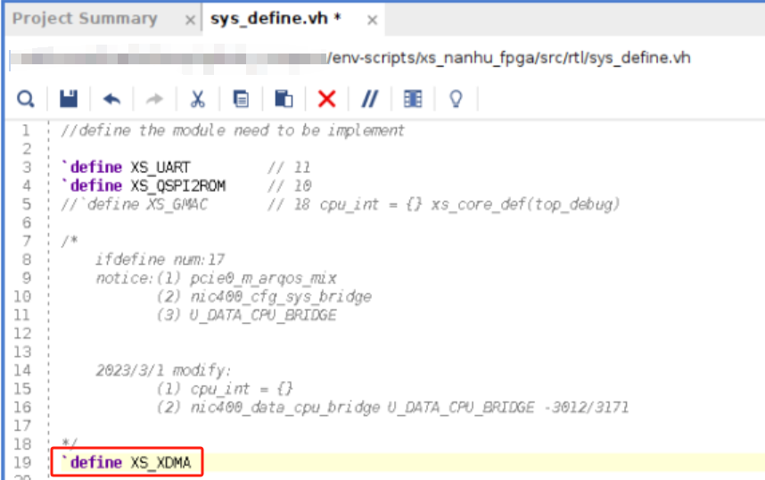
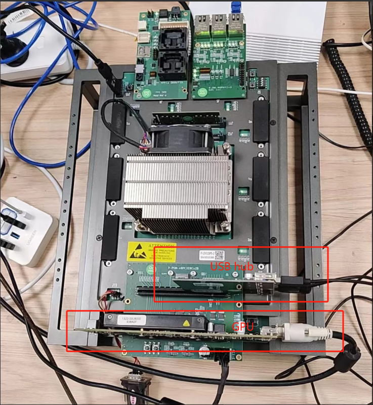
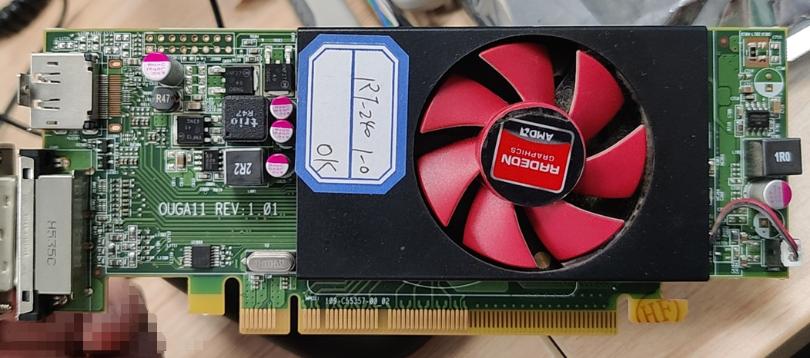
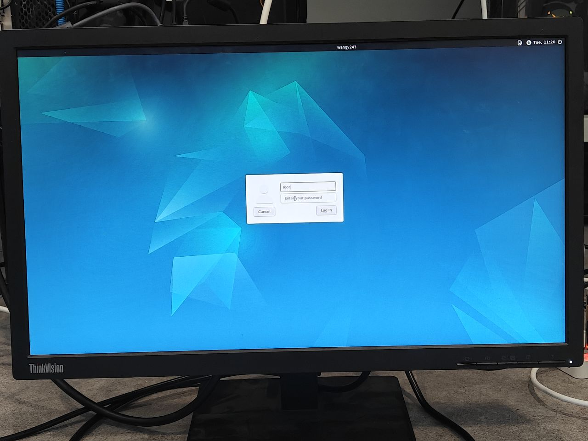
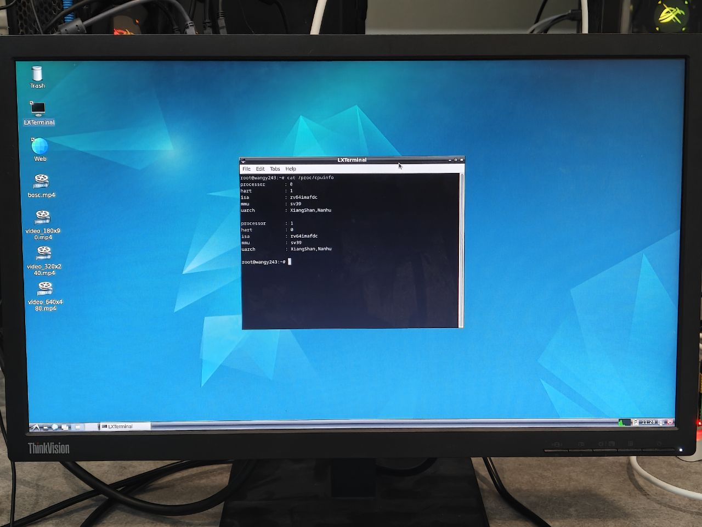

# FPGA IO System

基于香山的 FPGA 开源IO系统构建指引

## 基本步骤 Steps 

### 编译香山南湖RTL（如果已在最小系统里生成，可跳过）

(1) 主分支（昆明湖架构）在持续开发中，南湖架构的流片版本设计在 nanhu 分支，其适配 FPGA 环境的分支在 [nanhu-clockdiv2](https://github.com/OpenXiangShan/XiangShan/tree/nanhu-clockdiv2)

**注意：**

> 因为 FPGA 代码和仿真代码不是同一套，如果使用同一个 XiangShan 仓库，需要 `rm -rf build` 删除已有输出文件

> 双核南湖代码根据FPGA资源容量做了相应的裁剪，目前双核以[09d2a32142c64fca898e17c0b943e61ddc331958](https://github.com/OpenXiangShan/XiangShan/commit/09d2a32142c64fca898e17c0b943e61ddc331958)提交进行FPGA验证。


(2) 从GitHub上拉取仓库

```sh
git clone https://github.com/OpenXiangShan/XiangShan
cd XiangShan
export NOOP_HOME=$(pwd)
git checkout 09d2a32142c64fca898e17c0b943e61ddc331958
make init
make clean
make verilog NUM_CORES=2 # Dual-Core XiangShan Nanhu
```

(3) 对生成好后的代码进行些修改，让 Vivado 在例化时调用 ultra ram 的资源。例如：将array_开头的文件中，声明位宽64bit的深度大于1024的ram，强制vivado使用ultra ram来例化，减少bram的使用

修改 `array_16_ext.v`:


### 拷贝 Vivado 相关脚本，生成 Vivado 项目

```sh
# prepare the scripts
git clone https://github.com/OpenXiangShan/env-scripts.git
cd xs_nanhu_fpga
make update_core_flist CORE_DIR=$NOOP_HOME/build
make nanhu CORE_DIR=$NOOP_HOME/build

```

### 修改宏定义，使能PCIe



### 生成bit

打开vivado，执行Generate Bitstream

或者：

```sh
# generate the FPGA bitstream
make bitstream CORE_DIR=$NOOP_HOME/build
```


> 注意：生成时间较长，根据机器性能不同，需要花费 12~18h 的时间完成 bit 的生成


## FPGA环境准备（以S2C平台为例）

### S2C FPGA验证平台，按照下图进行连接设备



至少需要包含：

1. DDR4内存条
2. P-PGM-x8PCIERCx2B PCIe转接子卡
3. R7-240 AMD GPU（见下图）
4. [PCIEx1转4口USB3.0扩展卡](https://item.jd.com/5779082.html)
5. [USB转RS232串口电缆](https://item.jd.com/938674.html#crumb-wrap)
6. 32G U盘（插在4上）
7. USB键盘鼠标（插在4上）
8. 最高支持1080P的显示器（更高分辨率会导致系统异常）



> [USB转RJ45](https://item.jd.com/100120307963.html)可以插在4上，提供网络通信功能（内核有对应型号的驱动，非必须）

### 软件准备
#### 系统U盘

阿里云盘链接：[https://www.aliyundrive.com/s/7io98dZ4pBN](https://www.aliyundrive.com/s/7io98dZ4pBN)

提取码: j19g

U盘文件系统

下载文件为`boot.exe`的7zip自解压包，解压后使用ubuntu的PC，使用dd命令将img文件写入到U盘

例如：

其中of和if指向的文件名分别是img路径和U盘的设备名

```shell
dd if=boot.img of=/dev/sda
```

#### 启动的txt文件

参考该说明生成对应的txt文件，[https://xiangshan-doc.readthedocs.io/zh-cn/latest/integration/docker/](https://xiangshan-doc.readthedocs.io/zh-cn/latest/integration/docker/)

其中，pk分支切换到2RC上，其余可以保持不变

```shell
git clone git@github.com:openxiangshan/riscv-pk.git -b 2RC
```

我们也提供编译好的版本：[data.txt](https://raw.githubusercontent.com/OpenXiangShan/XiangShan-doc/main/docs/integration/resources/data_dual_rc.zip) （下载zip文件，然后解压成txt）

### 下载测试

脚本：[onboard-ai1-119.tcl](https://raw.githubusercontent.com/OpenXiangShan/env-scripts/main/fpga/onboard-ai1-119.tcl)

`-tclargs` 之后的第一个路径 `<vivado_build_folder>` 为存放 Vivado 所生成的 bit 及 ltx 文件的位置

```sh
vivado -mode batch -source ./onboard-ai1-119.tcl -tclargs <vivado_build_folder> ./data.txt
```

连接串口，115200, N, 8, 1

输入用户名、密码（如需要）

<font color=red>*用户名：root*</font>

<font color=red>*密码：123456*</font>

系统完成加载后，通过显示器能够看到如下的界面



通过terminal输入命令，能够看到CPU信息，南湖双核系统



