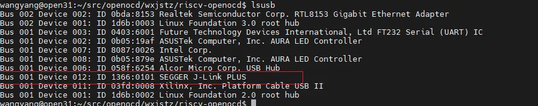
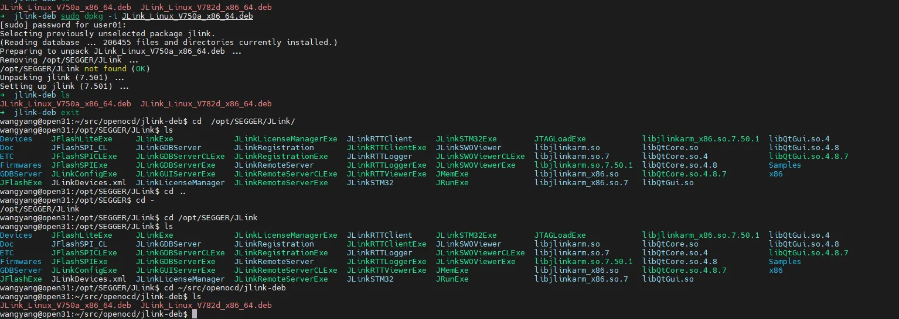
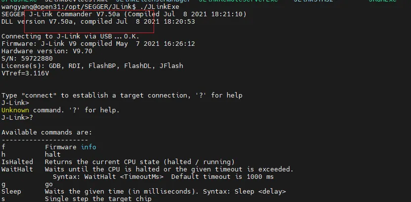
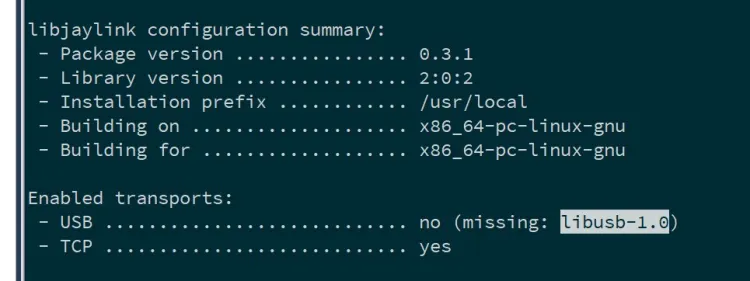
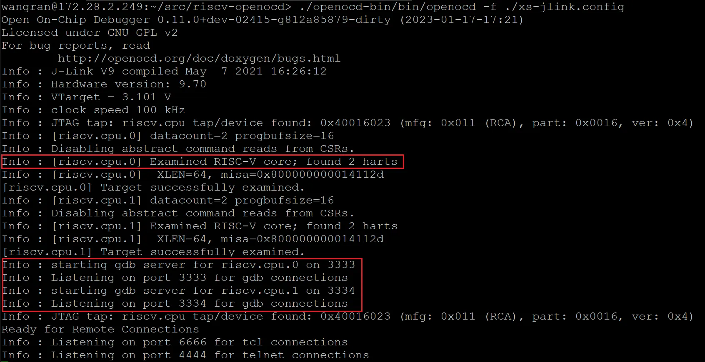
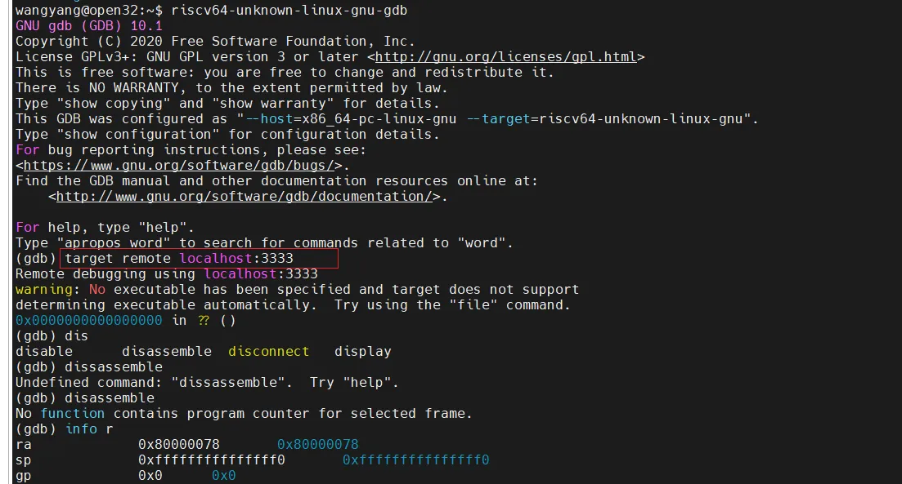

## 1. 安装[J-Link](https://baike.baidu.com/item/jlink%E4%BB%BF%E7%9C%9F%E5%99%A8/10410763#:~:text=J-Link%E4%B8%BA%E5%BE%B7,%E4%BB%A5%E4%BF%9D%E9%9A%9C%E6%82%A8%E7%9A%84%E6%9D%83%E7%9B%8A%E3%80%82) (SEGGER公司开发的JTAG仿真器)

### 1.1 安装J-Link软件包

1）下载deb包 [https://www.segger.com/downloads/jlink/](https://www.segger.com/downloads/jlink/)

2） sudo dpkg -i JLink_Linux_V750a_x86_64.deb

3） 检测有没有安装上：找到路径 /opt/SEGGER/JLink/ ；终端执行JLinkExe，能进入则成功。







### 1.2 引出JTAG信号

[最小系统](https://github.com/OpenXiangShan/env-scripts)的工程已经引出了CPU JTAG的相关信号，如果要用到自己FPGA平台的外设还需要修改对应的[约束文件](https://github.com/OpenXiangShan/env-scripts/blob/main/xs_nanhu_fpga/src/constr/xiangshan.xdc)，用来配合自己的FPGA环境。

与JTAG相关的约束，如果和我们的环境不同，需要按照自己的环境进行修改。

```
set_property PACKAGE_PIN F54 [get_ports JTAG_TCK]
set_property PACKAGE_PIN A54 [get_ports JTAG_TMS]
set_property PACKAGE_PIN H54 [get_ports JTAG_TDI]
set_property PACKAGE_PIN C54 [get_ports JTAG_TDO]
set_property PACKAGE_PIN G54 [get_ports JTAG_TRSTn]

set_property IOSTANDARD LVCMOS18 [get_ports JTAG_TCK]
set_property IOSTANDARD LVCMOS18 [get_ports JTAG_TMS]
set_property IOSTANDARD LVCMOS18 [get_ports JTAG_TDI]
set_property IOSTANDARD LVCMOS18 [get_ports JTAG_TDO]
set_property IOSTANDARD LVCMOS18 [get_ports JTAG_TRSTn]
```

## 2. 安装OpenOCD软件

### 2.1 下载OpenOCD 源码仓库

下载openocd源码

[https://github.com/openocd-org/openocd.git](https://github.com/openocd-org/openocd.git)

```shell
git clone https://github.com/openocd-org/openocd.git
```

### 2.2 搭建OpenOCD源码编译环境

```shell
cd openocd

./bootstrap

./configure --prefix=/home/[**your path**]/openocd/riscv-openocd/openocd-bin --enable-verbose --enable-verbose-usb-io --enable-verbose-usb-comms --enable-remote-bitbang --enable-ftdi --disable-werror --enable-jlink --enable-static
```

### 2.3 编译OpenOCD源码

```shell
make
sudo make install
```

编译结果位于./riscv-openocd/openocd-bin/bin/openocd

### 2.4 其他

配置过程中如果遇到configure: error: libjaylink-0.2 is required for the SEGGER J-Link Programmer

表示缺少libjaylink依赖项，可以按照以下步骤安装依赖库

1. 进入openocd代码中libjaylink库

```shell
cd src/jtag/drivers/libjaylink
```

2. libjaylink需要autotools和libtool才能编译，所以确保你安装了这些工具：

```shell
sudo apt install automake autoconf libtool pkg-config
```

3. 配置编译和安装

```shell
./autogen.sh
./configure
make
sudo make install
```

>配置过程要保证USB未开启，否则无法找到jlink。如遇到缺libusb库导致的USB未开启，需要安装对应库



4. libusb库安装

进入[https://github.com/libusb/libusb/releases](https://github.com/libusb/libusb/releases)

下载release包，比如[libusb-1.0.27.tar.bz2](https://github.com/libusb/libusb/releases/download/v1.0.27/libusb-1.0.27.tar.bz2)

 配置、编译和安装

```shell
./configure --build=x86_64-linux --disable-udev
make
make install
```

## 3、使用指导

[https://openocd.org/doc/html/index.html](https://openocd.org/doc/html/index.html)

[https://openocd.org/doc/doxygen/html/index.html](https://openocd.org/doc/doxygen/html/index.html)

遇到问题1：使能--enable-ftdi 如下问题

configure: error: libusb-1.x is required for the MPSSE mode of FTDI based devices

解决办法：

```
 sudo apt install libusb-1.0-0-dev
```
### 3.1 烧写支持JTAG功能的硬件镜像

生产硬件连接正确的bit，并确保外部连线正确

### 3.2 启动OpenOCD (记得传入运行时配置脚本作为参数)

南湖双核版:  [xs-jlink.config.dualcore.txt](https://raw.githubusercontent.com/OpenXiangShan/XiangShan-doc/main/docs/integration/resources/xs-jlink.config.dualcore.txt)

```
export LD_LIBRARY_PATH=/usr/local/lib/

./openocd-bin/bin/openocd -f ./xs-jlink.config.dualcore.txt
```



### 3.3 创建并编译测试用小程序

**创建c代码文件: hello.c**

```
char buf[0x100];

int main(void)
{
    int f = 0x33;
    asm volatile("nop");
    asm volatile("li s0, 0x0");
    asm volatile("li sp, 0x80000100");
    asm volatile("addi sp, sp, -32");
    asm volatile("sd s0, 24(sp)");
    asm volatile("addi s0, sp, 32");
    asm volatile("nop");
    asm volatile("nop");
    asm volatile("j .");
    asm volatile("nop");
    f++;
    asm volatile("nop");
    while(f){}
    asm volatile("nop");
    asm volatile("nop");
    asm volatile("nop");
    asm volatile("nop");
    while(1){}
    return 0;
}

```

**创建链接脚本: hello.lds**

```
OUTPUT_ARCH( "riscv" )

SECTIONS
{
  . = 0x80000000;
  .text : { *(.text) }
  . = 0x80000400;
  .data : { *(.data) }
}

```

**编译**

```
riscv64-unknown-linux-gnu-gcc -g -O0 -o hello.o -c hello.c	# 生成目标文件
riscv64-unknown-linux-gnu-gcc -g -Og -T hello.lds -nostartfiles -o hello.elf hello.o # 生成elf可执行文件
```

至此用于加载的测试程序文件hello.elf已经生成好了, 之后可以用GDB命令(load hello.elf)加载到DDR内存中指定位置进行测试, 此外也请将hello.c文件拷贝到GDB工作文件夹中, 以便后续的单步调试可以显示C代码信息.

涉及到写8字节数据，需修改编译参数：

如下代码13行

```
#define REG32(addr)       (*(volatile unsigned long *)(unsigned long)(addr))
#define read_csr(reg) ({ unsigned long __tmp; \
  asm volatile ("csrr %0, " #reg : "=r"(__tmp)); \
  __tmp; })

#define write_csr(reg, val) ({ \
  asm volatile ("csrw " #reg ", %0" :: "rK"(val)); })

int main(void)
{
    unsigned long pmp  = 0;
    int data = 0, i = 0;
    write_csr(0x7c0, 0x80b080f08000000UL);
    //pmp = read_csr(0x7c0);
    data = 1;
    for(i=0; i < 1000; i++)
            data++;
    return 0;
}

```

对应编译参数如下：

```
riscv64-unknown-elf-gcc -g -MMD -MP -Wall -Werror -D__NO_INLINE__ -mcmodel=medany -O2 -std=gnu99 -Wno-unused -Wno-attributes -fno-delete-null-pointer-checks -fno-PIE  -march=rv64imac -mabi=lp64  -fno-stack-protector -U_FORTIFY_SOURCE -g  -c hello.c
riscv64-unknown-elf-gcc -g -Wl,--build-id=none -nostartfiles -nostdlib -static  -march=rv64imac -mabi=lp64 -fno-stack-protector -o hello hello.o  -g -lgcc -Wl,--defsym=MEM_START=0x80000000,-T,./hello.lds
riscv64-linux-gnu-objdump -l -S  hello > he.lst
```

### 3.4 启动GDB (client)

```
source /home/tools/scripts/env.sh # 添加工具链路径到环境变量$PATH中 
riscv64-unknown-linux-gnu-gdb # 在这里可以根据需要决定是否添加参数 "./hello.elf" 添加后会在后面的单步调试时显示对应c代码的信息
```


   - 注: 如果启动gdb时遇到找不到libpython2.7.so.1.0的错误, [可尝试安装以下包解决](https://blog.csdn.net/WM2014123/article/details/102984086):


```
sudo apt-get install libpython2.7
sudo apt-get install libatlas3-base
```

进入GDB命令行后, 使用以下命令连接CPU core

```
target remote:3333   # 这里连接的是core 0 ,如果想连接core 1, 请另运行一个GDB程序, 3333改成3334
```



至此可以调试了。

### 3.5 GDB常用命令

**加载bbl,24M，大约加载8min**

```
(gdb) load gdbload/bbl
Loading section .text, size 0x360 lma 0x80000000
Loading section .text, size 0x67b4 lma 0x80000360
Loading section .rodata, size 0xee5 lma 0x80006b18
Loading section .htif, size 0x10 lma 0x80008000
Loading section .data, size 0x1f13 lma 0x80009000
Loading section .sdata, size 0x4 lma 0x8000af14
Loading section .payload, size 0x19a lma 0x80025000
Start address 0x0000000080000000, load size 39610
Transfer rate: 48 KB/sec, 4951 bytes/write.
(gdb) i r pc
pc             0x80000000       0x80000000
(gdb) si
[riscv.cpu.0] writing 0x4000b0c3 to register dcsr
[riscv.cpu.0] writing 0xffffffe05911a920 to register s0
[riscv.cpu.0] writing 0x1715314d1d7a4 to register s1

Program received signal SIGINT, Interrupt.
0x0000000080000220 in ?? ()
(gdb) i r pc
pc             0x80000220       0x80000220
(gdb) /20i 0x80000000
Undefined command: "".  Try "help".
(gdb) x /20i 0x80000000
   0x80000000:  j       0x80000220
   0x80000004:  csrrw   sp,mscratch,sp
   0x80000008:  beqz    sp,0x800001e0
   0x8000000c:  sd      a0,80(sp)
   0x80000010:  sd      a1,88(sp)
   0x80000014:  csrr    a1,mcause
   0x80000018:  bgez    a1,0x800000bc
   0x8000001c:  slli    a1,a1,0x1
   0x80000020:  li      a0,14
...

0x00000000800022d8 in ?? ()
(gdb) i r sp
sp             0x8000cdc0       0x8000cdc0
(gdb) x /20i 0x80000310
   0x80000310:  j       0x800022d8
   0x80000314:  li      a2,8
   0x80000318:  csrw    mie,a2
   0x8000031c:  wfi
   0x80000320:  auipc   a4,0x14
   0x80000324:  addi    a4,a4,-800
   0x80000328:  ld      a4,0(a4)
   0x8000032c:  beqz    a4,0x8000031c
   0x80000330:  auipc   a4,0x14
   0x80000334:  addi    a4,a4,-808
   0x80000338:  ld      a4,0(a4)
   0x8000033c:  srl     a4,a4,a3
   0x80000340:  andi    a4,a4,1
   0x80000344:  bnez    a4,0x8000031c
   0x80000348:  fence
   0x8000034c:  li      a2,8
   0x80000350:  bgeu    a3,a2,0x80000358
   0x80000354:  j       0x8000243a
   0x80000358:  wfi
   0x8000035c:  j       
```

**加载被调试程序到DDR中, 同时读取程序的符号信息**

```
load hello.elf
```

**读取并显示有CPU寄存器值**

```
i registers
```

**读pc寄存器**

```
i r pc
```

**修改pc寄存器, 使其指向地址0x8000000e**

```
set var $pc=0x8000000e
```

**读取DDR指定区域指令或数据 (help x可以看更多帮助信息)**

```
x /20i 0x80000000        # 读取20条指令, 用汇编语言显示
x /10xb 0x80000000       # 读取10字节数据, 用十六进制显示
x /10cb 0x80000000       # 读取10字节数据, 用十进制及ASCII码显示
x /10xh 0x80000000       # 读取10个双字节数据, 用十六进制显示
x /10xw 0x80000000       # 读取10个四字节数据, 用十六进制显示
x /20xg 0x80000000       # 读取20个八字节数据, 用十六进制显示
x /20i $pc-14
```

**写入DDR指定区域**

```
set {char}0x80000000=0x11           # char类型是写入一个字节
set {short}0x80000000=0x2222        # short类型是写入两个字节
set {int}0x80000000=0x44444444      # int类型是写入四个字节
set {long}0x80000000=0x8888888888888888      # long类型是八个字节
x/4g 0x80000000                     # 查看上述结果
```

**单步执行指令**

```
n  # 或者si
```
**在指定内存地址上设置软件断点**

```
b * 0x80000020
```

**清除指定地址上的软件断点**

```
clear * 0x80000020
```

**从当前位置继续执行程序**

```
c
```

### 3.6 gdb读取csr指令

```
(gdb)  i r satp
satp           0x0      0
(gdb) i r mcause
mcause         0x9      9
(gdb) i r scause
scause         0x8000000000000005       -9223372036854775803

```

openocd使用手册
[https://openocd.org/doc/pdf/openocd.pdf](https://openocd.org/doc/pdf/openocd.pdf)
