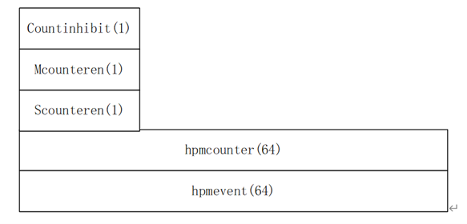
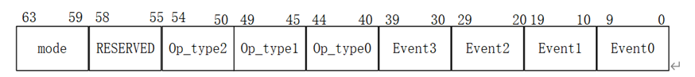

# CPU Core Overview   CPU核心总览

XiangShan-2 (NANHU) supports single-core and dual-core configurations, where each core has its own private L1/L2 cache. L3 is shared by multiple cores. 第二代香山（南湖）支持单核和双核配置，每个核心都有自己的私有L1/L2高速缓存。L3缓存由多个核心共享。

NANHU communicates with the uncore through 3 AXI interfaces, including the memory port, the DMA port and the peripheral port. It also has clock, reset, and JTAG interfaces. Please refer to the integration guide for more detailed information. 南湖通过3个AXI接口与非核心部分通信，包括内存端口、DMA端口和外设端口。它还具有时钟、复位和JTAG接口。更多详细信息请参阅集成指南。

NANHU targets 2GHz@14nm, and 2.4GHz~2.8GHz@7nm. 南湖的目标是在14nm工艺下频率达到2GHz，在7nm工艺下频率达到2.4GHz到2.8GHz。

## Typical Configurations &nbsp; 典型配置
Below is the typical NANHU core configurations: 以下是南湖核心的典型配置：

| Feature | NANHU (XiangShan-2) |
| ------- | ------------------- |
| Pipeline stage   流水级数 | 11 |
| Decoder width   译码宽度| 6 |
| Rename width   重命名宽度| 6 |
| ROB   重排序缓冲| 256 |
| Physical register   物理寄存器宽度| 192(integer), 192(float) |
| Load Queue   加载队列| 80 |
| Store Queue   存储队列| 64|
| L1 Instruction Cache   L1指令高速缓存| 64KB/128KB (4/8-way) |
| L1 Data Cache   L1数据高速缓存| 64KB/128KB(4/8 way) |
| L2 Cache   L2高速缓存| 512KB/1MB, 8-way, non inclusive |
| L3 Cache   L3高速缓存| 2MB~8MB, 8-way, non inclusive |
| Physical RF size   物理寄存器堆大小| 192x64 bits, 14R8W |
| ECC Support   ECC支持| Y |
| Virtual Memory Support   虚拟内存支持| Y |
| Physical memory protection   物理内存保护| Y |
| Virtualization   虚拟化| N |
| Vector   向量化| N |

## ISA Support &nbsp; ISA支持

| Instruction Set | Description |
| ------- | ------------------- |
| I | Integer   整数指令|
| M | Integer Multiplication and Division   整数乘法与除法指令|
| A | Atomics   原子指令|
| F | Single-Precision Floating-Point    单精度浮点数指令|
| D | Double-Precision Floating-Point    双精度浮点数指令|
| C | 16-bit Compressed Instructions    16位压缩指令|
| Zba | Bitmanip Extension - address generation    位操作扩展-地址生成指令|
| Zbb | Bitmanip Extension - basic bit manipulation    位操作扩展-基本位操作指令|
| Zbc | Bitmanip Extension - carryless multiplication    位操作扩展-无进位乘法指令|
| Zbs | Bitmanip Extension - single-bit instructions    位操作扩展-单比特指令|
| zbkb | Cryptography Extensions - Bitmanip instructions    加密扩展-位操作指令|
| Zbkc | Cryptography Extensions - Carry-less multiply instructions    加密扩展-无进位乘法指令|
| zbkx | Cryptography Extensions - Crossbar permutation instructions    加密扩展-交叉排列指令|
| zknd | Cryptography Extensions - AES Decryption    加密扩展-AES解密指令|
| zkne | Cryptography Extensions - AES Encryption    加密扩展-AES加密指令|
| zknh | Cryptography Extensions - Hash Function Instructions    AES扩展-哈希函数指令|
| zksed | Cryptography Extensions - SM4 Block Cipher Instructions    加密扩展-SM4块密码指令|
| zksh | Cryptography Extensions - SM3 Hash Function Instructions    加密扩展-SM3哈希函数指令|
| svinval | Fine-Grained Address-Translation Cache Invalidation    细粒度地址转换缓存失效指令|
## Instruction Latency &nbsp; 指令延迟

Most arithmetic instructions are single-cycle (`Latency = 1`).
Multi-cycle instructions are listed as follows. 绝大部分算术指令都是单周期指令（`延迟为1`）。多周期指令在下表中列出：

| Instruction(s) / Operations | Latency | Descriptions |
| -------------- | ------- | ------------ |
| `LD` | 4 (to ALU and LD), 5 (others) | Load operations (to use)   加载操作（用于执行）|
| `MUL` | 2 | Integer multiplier   整数乘法|
| `DIV` | 4~20 | Integer divider (SRT16)   整数除法（SRT16）|
| `FMA` | 5 | Floating-point multiply-add instruction (cascade FMA)   浮点乘法加法指令(cascade FMA)|
| `FADD`, `FMUL` | 3 | Floating-point add/multiply operations   浮点加法/乘法运算|
| `FDIV/SQRT` | 3~18 | Floating-point div/sqrt operations   浮点除法/平方根运算|
| `CLZ(W)`, `CTZ(W)`, `CPOP(W)`, `XPERM(8/4)`, `CLMUL(H/R)` | 2 | Complex bit manipulation   复杂位操作|
| `AES64*`, `SHA256*`, `SHA512*`, `SM3*`, `SM4*` | 2 | Complex scalar crypto operations   复杂标量加密操作|

## Priviledge Mode &nbsp; 特权等级

NANHU supports three levels of privilege mode: machine (M), supervisor (S), and user (U). 南湖支持三级特权模式：machine(M), supervisor(S), 和user(U)。

## Microarchitecture &nbsp; 微架构

Please refer to Section CPU Core for more details. 更多细节请参阅CPU Core章节

## Cache Controller &nbsp; 高速缓存控制器

There is a cache controller connected to L3 Cache, which used to perform Cache Maintenance Operation (CMO). Programmers ought to use MMIO based memory access to trigger operation required. 南湖的缓存控制器与L3高速缓存相连，用于执行缓存维护操作（CMO）。编程人员应使用基于 MMIO 的内存访问来触发所需的操作。

The following is a register table of the L3 cache controller. 下面是 L3 缓存控制器的寄存器列表。

| Address | Width | Attr. | Description |
| ------- | ----- | ----- | ----------- |
| 0x3900_0100 | 8B | RW | `Tag` register of the interest cache block   感兴趣缓存块的`标签寄存器`|
| 0x3900_0108 | 8B | RW | `Set` register of the interest cache block   感兴趣（or关注）缓存块的`组寄存器`|
| 0x3900_0110 | 8B | RW | `Way` register of the interest cache block (deprecated)   感兴趣缓存的`路寄存器`|
| 0x3900_0118 - 0x3900_0150 | 64B in total | RW | `Data` register of the interest cache block (deprecated)   感兴趣缓存块的`数据寄存器`|
| 0x3900_0180 | 8B | RO | `Flag` register indicates ready for receiving next command   指示可以接收下一命令的`标志寄存器`   Value 1 indicates ready, 0 indicates not ready   值为1表示就绪，值为0表示未就绪 |
| 0x3900_0200 | 8B | WO | `Command` register for cache operation 用于缓存操作的`指令寄存器` Supported commands are: 支持的指令有： Command Number 16 (`CMD_CMO_INV`) Command Number 17 (`CMD_CMO_CLEAN`) Command Number 18 (`CMD_CMO_FLUSH`)   |

A standard Cache operation follows the following process: 标准的缓存操作过程如下：

1. Inquire the `Flag` register, which indicates ready for receiving requests when valid   查询`标志寄存器`，该寄存器有效时表示已准备好接收请求

2. Set `Tag` register to the tag of the interest cache block   将`标签寄存器`设置为感兴趣缓存块的标签

3. Set `Set` register to the set of the interest cache block   将`组寄存器`设置为感兴趣缓存块的组

4. Write command number to `Command` register   将指令编号写入`指令寄存器`

Afterwards, the command is desired to be done. 此后，指令执行完毕

There are three commands available. 缓存控制器有三个可用的操作：

1. Command Number 16 (`CMD_CMO_INV`): Invalidate the cache block from cache hierarchy (Note that this operation may break cache coherence). 使缓存块从缓存层次结构中失效（注意，此操作可能会破坏缓存一致性）。

2. Command Number 17 (`CMD_CMO_CLEAN`): make cache block data in memory up-to-date. In other words, write back a block to memory if it is dirty in cache hierarchy. In current implementation, this command behaves just like `CMD_CMO_FLUSH`. 换句话说，如果缓存块在缓存层次结构中是脏的，则将其写回内存。在目前的实现中，该命令的行为与 `CMD_CMO_FLUSH` 类似

3. Command Number 18 (`CMD_CMO_FLUSH`): flush the cache block to memory. In other words, write back a block to memory and invalidate the block. 将缓存块刷新到内存中。换句话说，就是将数据块写回内存并使其失效。

## Hardware Performance Monitor (HPM) &nbsp; 硬件性能计数器

### Architecture &nbsp; 架构

Using distributed HPM (hardware performance monitor).
There is an independent HPM in each block, and the HPM can also contain mirrored values of some other CSRs (the mirrored registers can only be modified by instructions).
Each HPM contains multiple performance counter registers for counting internal events.
For the number of performance counters, refer to the number of performance events to be counted simultaneously for different blocks.
Each performance counter contains the following registers: 南湖使用分布式 HPM（硬件性能监视器）。
每个区块都有一个独立的HPM，HPM还可以包含一些其他CSR的镜像值（镜像寄存器只能通过指令修改）。
每个 HPM包含多个性能计数寄存器，用于统计内部事件。
性能计数器的数量请参考不同区块需要同时统计的性能事件数量。
每个性能计数器包含以下寄存器：

Each hpmevent is 64 bits. In order to count the events combined by multiple events, the event fields are now split according to the function. The split is as follows. 每个 hpmevent 寄存器为 64 位。为了统计由多个事件组合成的事件， event域目前根据功能进行划分。划分方法如下。

Mode represents that the corresponding performance counter is to be counted in a specific mode. Onehot encoding is adopted, and the encoding table is as follows. Mode表示相应的性能计数器在特定模式下计数，采用Onehot编码，编码表如下。

***Table.1 Performance counter register 表1.性能计数寄存器***

| Privilege Mode | Mode Coding | Event Coding |
| -------------- | ----------- | ------------ |
| M              | Mode[4]     | Mode[63]     |
| H              | Mode[3]     | Mode[62]     |
| S              | Mode[2]     | Mode[61]     |
| U              | Mode[1]     | Mode[60]     |
| D              | Mode[0]     | Mode[59]     |

Event indicates the performance event code to be counted, with a total of four event fields. Where event equals 0 means no event, event equals all 1, means cycle. The Event coding table needs to be supplemented later. When an illegal value is written, the write operation is ignored.
Events are classified by block. Between two consecutive blocks, there can be overlapping parts. The overlap is used for performance counter statistics between blocks.
The optype encoding table is as follows: Event表示被统计性能事件的编码，一共有四个event域。其中一个event为0表示无事件，为全1表示循环。事件编码表需要日后补充。当写入非法值时，写入操作将被忽略。
事件按块分类.两个连续的块之间可能存在重叠部分，该部分用于块间的性能计数器统计。
操作类型编码表如下：

***Table.2 Mode and Event Coding 表2.Mode和Event编码表***

| Optype    | Mode Coding |
| --------- | ----------- |
| `'b00000` | Or          |
| `'b00001` | And         |
| `'b00002` | Xor         |
| `'b00003` | Add         |
| `'b00004` | Sub         |

***Table.3 Optype encoding table 表3.操作类型编码表***

| Name | Address | Width | Description |
| ---- | ------- | ----- | ----------- |
| Mhpmcounter31-3 | 0xB03-0xB1F | 64 | 64-bit accumulator. Counts based on selected events. The maximum data accumulated at one time is not fixed.   64 位累加器。根据所选事件进行计数。每次累加的最大值不固定。|
| Mhpmevent31-3 | 0x323-0x33F | 64 | Event selection, decides under what conditions to count.   事件选择，决定在什么条件下计数。|
| Mcountinhibit | 0x320 | 32 | Each bit controls whether the performance counter can be accumulated. 1: The accumulator does not change; 0: Accumulator counts up according to performance.   每一位控制性能计数器是否可以累加。1：累加器不变；0：累加器根据性能计数。|
| Mcounteren | 0x306 | 32 | Controls whether the S state has permission to access the corresponding performance counter. 0: S-state program access to hpmcounter register will report an illegal instruction; 1: S-state programs can access hpmcounter.   控制S态是否有权限访问相应的性能计数器。0：S态程序访问hpmcounter寄存器将报告非法指令；1：S态程序可以访问hpmcounter。|
| Scounteren | 0x106 | 32 | According to the value of Mcounteren, it is used to control whether the U state has permission to access the corresponding performance counter. Mcounteren[i] & Scounteren[i] == 0: An illegal instruction exception will be reported when a U-state program accesses the hpmcounter[i] register; Mcounteren[i] & Scounteren[i] == 1: U-state programs can access hpmcounter[i].   根据Mcounteren的值控制U态是否有权限访问相应的性能计数器。Mcounteren[i] & Scounteren[i] == 0：当U态程序访问 hpmcounter[i]寄存器时，将报告非法指令异常；Mcounteren[i] & Scounteren[i] == 1：U 状态程序可以访问 hpmcounter[i]。|
| pmcounter31-3 | 0xC03-0xC1F | 64 | Mirror for Mhpmcounter31-3.   Mhpmcounter31-3的镜像。|

### Linux Support &nbsp; Linux支持

We have provided an example implementation with [riscv-pk](https://github.com/OpenXiangShan/riscv-pk/commit/a337108f76c6c122d62139c33edc53569e380f2f) and [riscv-linux](https://github.com/OpenXiangShan/riscv-linux/commit/4dbf16e3bde5ee45022de88c3f25b8518aa8344d). If you have any issues regarding the SBI and Linux syscall implementations, please refer to the source code. 我们提供了一个使用[riscv-pk](https://github.com/OpenXiangShan/riscv-pk/commit/a337108f76c6c122d62139c33edc53569e380f2f)和[riscv-linux](https://github.com/OpenXiangShan/riscv-linux/commit/4dbf16e3bde5ee45022de88c3f25b8518aa8344d)实现的示例。如果您对SBI和Linux系统调用的实现有任何疑问，请参阅源代码。

We have also provided [an example of the user program](https://github.com/OpenXiangShan/XiangShan-doc/tree/main/docs/integration/examples-hpm) to configure and read the performance counters.
`hpmdriver.h` includes macro definition, configuring, reading or clearing methods of performance counters, and wraps syscall; `set_hpm.c` and `read_hpm.c` are for configuring and reading HPM, respectively. 我们同样提供了一个配置和读取性能计数器的[用户程序示例](https://github.com/OpenXiangShan/XiangShan-doc/tree/main/docs/integration/examples-hpm)。`hpmdriver.h` 包括宏定义、配置、读取或清除性能计数器的方法以及封装系统调用；`set_hpm.c` 和 `read_hpm.c` 分别用于配置和读取 HPM。

### List of the Performance Counters &nbsp; 性能计数器列表

**For the update-to-date implemented performance counters, please see the Chisel elaboration logs when generating the verilog.** **有关最新实现的性能计数器，请参阅生成verilog时Chisel的详细说明日志。**

**The table below presents an example of events.** Please note that hardware performance monitors are highly configurable, so the information provided may **NOT** perfectly align with real-world cases. If you require additional counters, we recommend directly modifying the Chisel code. **下表列出了一个事件示例。** 请注意，硬件性能监视器是高度可配置的，因此提供的信息可能与实际情况**不完全一致**。如果需要额外的计数器，我们建议直接修改 Chisel 代码。

Please refer to the source code for the detailed update conditions of these counters. We want to emphasize that we cannot guarantee the accuracy of the existing performance counters. It is important to understand that utilizing these counters is done at your own risk, and we advise taking necessary precautions. 有关这些计数器的详细更新条件，请参阅源代码。我们想强调的是，我们无法保证现有性能计数器的准确性。请务必理解，使用这些计数器的风险由您自行承担，我们建议您采取必要的预防措施。

***Table.4 Example of the Performance Event Table 表4.性能事件表示例***

| BlockName | Event |
| --------- | ----- |
| Frontend | FrontendBubble |
| IFU | frontendFlush |
| IFU | to_ibuffer_package_num |
| IFU | crossline |
| IFU | lastInLine |
| Ibuffer | ibuffer_flush |
| Ibuffer | ibuffer_hungry |
| IFU | to_ibuffer_cache_miss_num |
| Icache | icache_miss_req |
| icache | Icache_miss_penalty |
| FTQ | bpu_to_ftq_stall |
| FTQ | mispredictRedirect |
| FTQ | replayRedirect |
| FTQ | predecodeRedirect |
| FTQ | to_ifu_bubble |
| FTQ | to_ifu_stall |
| FTQ | from_bpu_real_bubble |
| FTQ | BpInstr |
| FTQ | BpRight |
| FTQ | BpWrong |
| FTQ | BpBInstr |
| FTQ | BpBRight |
| FTQ | BpBWrong |
| FTQ | BpJRight |
| FTQ | BpJWrong |
| FTQ | BpIRight |
| FTQ | BpIWrong |
| FTQ | BpCRight |
| FTQ | BpCWrong |
| FTQ | BpRRight |
| FTQ | BpRWrong |
| FTQ | ftb_false_hit |
| FTQ | ftb_hit" |
| TAGE | tage_table_hits |
| TAGE | commit_use_altpred_b0 |
| TAGE | commit_use_altpred_b1 |
| SC | sc_update_on_mispred |
| SC | sc_update_on_unconf |
| BPU | s2_redirect |
| uBTB | ftb_commit_hits |
| uBTB | ftb_commit_misses |
| uBTB | ubtb_commit_hits |
| uBTB | ubtb_commit_misses |
| IBUFFER | ibuffer_empty |
| IBUFFER | ibuffer_12_valid |
| IBUFFER | ibuffer_24_valid |
| IBUFFER | ibuffer_36_valid |
| IBUFFER | ibuffer_full |
| FusionDecoder | fused_instr |
| DecodeStage | waitInstr |
| DecodeStage | stall_cycle |
| DecodeStage | utilization |
| DecodeStage | storeset_ssit_hit |
| DecodeStage | ssit_update_lxsx |
| DecodeStage | ssit_update_lysx |
| DecodeStage | ssit_update_lxsy |
| DecodeStage | ssit_update_lysy |
| Rename | in |
| Rename | waitInstr |
| Rename | stall_cycle_dispatch |
| Rename | stall_cycle_fp |
| Rename | stall_cycle_int |
| Rename | stall_cycle_walk |
| BusyTable | busy_count |
| StdFreeList | utilization |
| StdFreeList | allocation_blocked |
| StdFreeList | can_alloc_wrong |
| Dispatch1 | storeset_load_wait |
| Dispatch1 | storeset_store_wait |
| Dispatch1 | in |
| Dispatch1 | empty |
| Dispatch1 | utilization |
| Dispatch1 | waitInstr |
| Dispatch1 | stall_cycle_lsq |
| Dispatch1 | stall_cycle_roq |
| Dispatch1 | stall_cycle_int_dq |
| Dispatch1 | stall_cycle_fp_dq |
| Dispatch1 | stall_cycle_ls_dq |
| DispatchQueue_int | in |
| DispatchQueue_int | out |
| DispatchQueue_int | out_try |
| DispatchQueue_int | fake_block |
| DispatchQueue_int | queue_size_4 |
| DispatchQueue_int | queue_size_8 |
| DispatchQueue_int | queue_size_12 |
| DispatchQueue_int | queue_size_16 |
| DispatchQueue_int | queue_size_full |
| DispatchQueue_fp | in |
| DispatchQueue_fp | out |
| DispatchQueue_fp | out_try |
| DispatchQueue_fp | fake_block |
| DispatchQueue_fp | queue_size_4 |
| DispatchQueue_fp | queue_size_8 |
| DispatchQueue_fp | queue_size_12 |
| DispatchQueue_fp | queue_size_16 |
| DispatchQueue_fp | queue_size_full |
| DispatchQueue_lsu | in |
| DispatchQueue_lsu | out |
| DispatchQueue_lsu | out_try |
| DispatchQueue_lsu | fake_block |
| DispatchQueue_lsu | queue_size_4 |
| DispatchQueue_lsu | queue_size_8 |
| DispatchQueue_lsu | queue_size_12 |
| DispatchQueue_lsu | queue_size_16 |
| DispatchQueue_lsu | queue_size_full |
| Dispatch2Ls | in |
| Dispatch2Ls | out |
| Dispatch2Ls | out_load0 |
| Dispatch2Ls | out_load1 |
| Dispatch2Ls | out_store0 |
| Dispatch2Ls | out_store1 |
| Dispatch2Ls | blocked |
| roq | interrupt_num |
| roq | exception_num |
| roq | flush_pipe_num |
| roq | replay_inst_num |
| roq | clock_cycle |
| roq | commitUop |
| roq | commitInstr |
| roq | commitInstrMove |
| roq | commitInstrMoveElim |
| roq | commitInstrFused |
| roq | commitInstrLoad |
| roq | commitInstrLoadWait |
| roq | commitInstrStore |
| roq | writeback |
| roq | walkInstr |
| roq | walkCycle |
| roq | queue_1/4 |
| roq | queue_1/2 |
| roq | queue_3/4 |
| roq | queue_full |
| rs | alu0_rs_full |
| rs | alu1_rs_full |
| rs | alu2_rs_full |
| rs | alu3_rs_full |
| rs | load0_rs_full |
| rs | load1_rs_full |
| rs | store0_rs_full |
| rs | store1_rs_full |
| rs | mdu_rs_full |
| rs | misc_rs_full |
| rs | fmac0_rs_full |
| rs | fmac1_rs_full |
| rs | fmac2_rs_full |
| rs | fmac3_rs_full |
| rs | fmisc0_rs_full |
| rs | fmac1_rs_full |
| PageTableWalker | fsm_count |
| TLB | first_access |
| TLB | access |
| TLB | first_miss |
| TLB | miss |
| TLBStorage | access |
| TLBStorage | hit |
| PageTableCache | access |
| PageTableCache | l1_hit |
| PageTableCache | l2_hit |
| PageTableCache | l3_hit |
| PageTableCache | sp_hit |
| PageTableCache | pte_hit |
| L2TLBMissQueue | mq_in_count |
| L2TLBMissQueue | mem_count |
| L2TLBMissQueue | mem_cycle |
| MemBlock | load_rs_deq_count |
| MemBlock | store_rs_deq_count |
| StoreQueue | vaddr_match_failed |
| StoreQueue | vaddr_match_really_failed |
| StoreQueue | queue_1/4 |
| StoreQueue | queue_1/2 |
| StoreQueue | queue_3/4 |
| StoreQueue | queue_full |
| LoadQueue | rollback |
| LoadQueue | queue_1/4 |
| LoadQueue | queue_1/2 |
| LoadQueue | queue_3/4 |
| LoadQueue | queue_full |
| LoadQueue | refill |
| LoadQueue | utilization_miss |
| LoadUnit | in |
| LoadUnit | tlb_miss |
| LoadUnit | in |
| LoadUnit | dcache_miss |
| LoadPipe | load_req |
| LoadPipe | load_hit_way |
| LoadPipe | load_replay_for_data_nack |
| LoadPipe | load_replay_for_no_mshr |
| LoadPipe | load_hit |
| LoadPipe | load_miss |
| NewSbuffer | do_uarch_drain |
| NewSbuffer | sbuffer_req_valid |
| NewSbuffer | sbuffer_req_fire |
| NewSbuffer | sbuffer_merge |
| NewSbuffer | dcache_req_valid |
| NewSbuffer | dcache_req_fire |
| NewSbuffer | StoreQueueSize |
| WritebackQueue | wb_req |
| WritebackQueue | wb_release |
| WritebackQueue | wb_probe_resp |
| MainPipe | pipe_req |
| MainPipe | pipe_total_penalty |
| dcache | MissQueue | miss_req |
| dcache | MissQueue | miss_penalty |
| dcache | MissQueue | load_miss_penalty_to_use |
| dcache | MissQueue | pipeline_penalty |
| dcache | MissQueue | queue_full |
| dcache | Probe | probe_req |
| dcache | Probe | probe_penalty |
