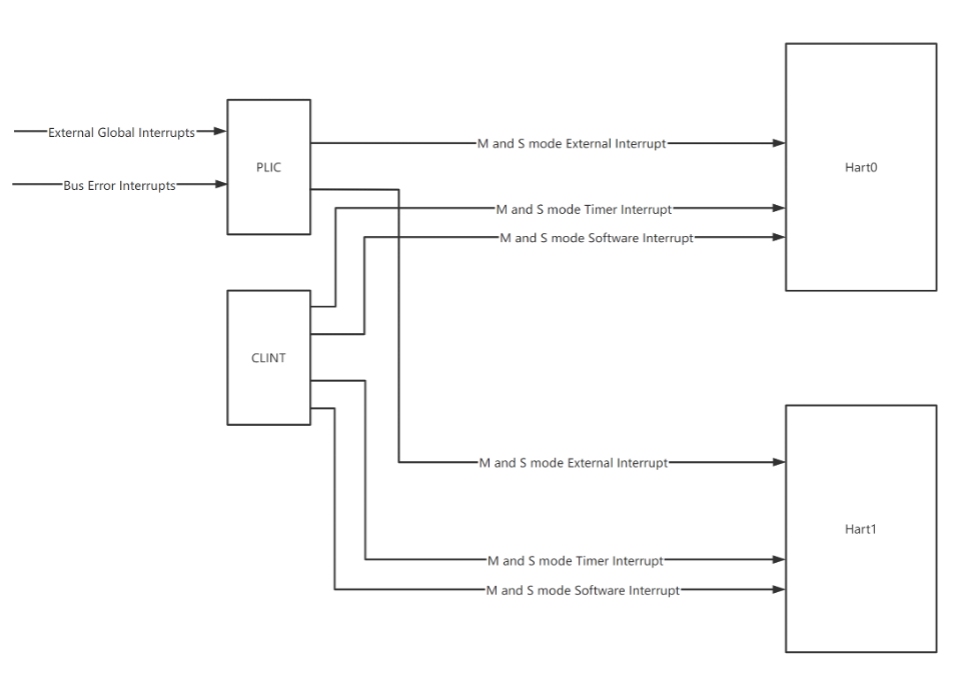

# SoC Integration

This section describes the functional details of NANHU top-level interfaces.
It's worth noting these are the typical configurations and the user may specify different architecture parameters.

## Clock and Reset

NANHU has two clock domains:

* One clock domain for the cpu core (`io_clock`). All clock in CPU core is `io_clock`.

* One clock domain for jtag (`io_systemjtag_jtag_TCK`).

NANHU has the following reset signals.
All Reset signals are Asynchronous Resets.

* `io_reset` is internally synced with the clock `io_clock`. Active high.

* `io_systemjtag_reset` is internally synced with the clock `io_systemjtag_jtag_TCK`. Active high.

There are two types of synchronizers in the RTL. All instances are used to synchronize the reset.

* `AsyncResetSynchronizerPrimitiveShiftReg` (synchronize reset from `jtag_clock` to `io_clock`, from low frequency to high frequency)

* `ResetGen/ResetGenDFT` (used to synchronize for both `jtag_clock` and `io_clock`, depending on the instantiations)

## AXI Interface

For our definitions of the three ports,

- 256-bit AXI Memory Port: for CPU to access DDR (CPU is the master)

Address space: DDR space (0x8000_0000 to 0xf_ffff_ffff)

AXI ID width: 6-bit

Number of outstanding transactions: 56 (max. supported by L3 cache)

Max transaction size: 64 bytes

Number of IDs: 64

Max number of outstanding transactions per ID: 1

- 64-bit AXI Peripheral Port: for CPU to access peripherals (CPU is the master)

Address space: peripheral slaves space (0x0000_0000 to 0x7fff_ffff)

AXI ID width: 2-bit

Number of outstanding: 1 for instruction and 1 for data for each core

Max transaction size: 8 bytes

Number of IDs: 4 (though the ID is 4-bit, most of them are not used)

Max number of outstanding transactions per ID: 1

- 256-bit AXI DMA Port: for peripherals to access CPU/DDR (CPU is the slave)

Address space: DDR space (0x8000_0000 to 0xf_ffff_ffff)

AXI ID width: 8-bit

Number of outstanding supported by CPU: 32

Different transaction sizes and transactions per ID are supported. They are changed into 256-bit TileLink transactions internally. One AXI transaction may be split into multiple TileLink transactions.

This DMA port allows the peripherals to access DDR under coherency with the CPU caches. They can send standard AXI aw/w/ar requests to this port to write/read the DDR. Memory coherency is supported in the DMA port by the L3 cache. No explicit action is needed to sync the data with CPU.

Note that data in core store queue and committed store buffer is not under coherency with the CPU caches. That is to say, to read newly stored data from DMA port, a fence instruction must be used in software.

## Memory Map

There are three main regions:

* Peripheral slaves space 0x0000_0000 to 0x7fff_ffff

* DDR space: 0x8000_0000 to 0xf_ffff_ffff

* DMA to access DDR: 0x8000_0000 to 0xf_ffff_ffff

Peripherals in the Peripheral address space is mostly determined by the SoC.

Default PMA is configured according to NANHU mamory map. Illegal memory access will cause access fault exceptions.
Please remember to update the default PMA settings if you need to change the peripheral address mappings.

Internal peripheral address space:

| Device | Start Address | End Address |
| ------- | ---------- | -------- |
| CLINT | 0x3800_0000 | 0x3800_ffff |
| BEU | 0x3801_0000 | 0x3801_ffff |
| Debug Module | 0x3802_0000 | 0x3802_0fff |
| L3CacheCtrl | 0x3900_0000 | 0x3900_0fff |
| PLIC | 0x3c00_0000 | 0x3fff_ffff |

## Interrupt

There are local (CLINT) and global (PLIC) interrupt controllers available with NANHU core.
The PLIC and CLINT as shown in the below figure are for dual-core configuration.

Local interrupt sources in NANHU includes timer interrupt and software interrupt.
All the local interrupts are generated by CLINT for S-mode and M-mode.

Global interrupt controller follows the [RISC-V Platform-Level Interrupt Controller Specification](https://github.com/riscv/riscv-plic-spec/blob/master/riscv-plic.adoc).
PLIC is connected via 64-bit TileLink.

Below is the interrupt number mapping in PLIC.
Interrupt 0 is always reserved by the PLIC.

| Interrupt No. | name | description |
| ------- | ---------- | -------- |
| 0 | Reserved | - |
| 1~64 | external interrupt | From top-level io_extIntrs |
| 65 | bus error interrupt 0 | Core 0 bus error interrupt |
| 66 | bus error interrupt 1 | Core 1 bus error interrupt |

The global interrupt sources in NANHU includes external global interrupts and bus error interrupts.
External global interrupts are generated by external devices.
The bus error interrupts are generated by CPU hart0 and hart1.

## Debug

NANHU implements [RISC-V External Debug Support Version 0.13.2](https://riscv.org/wp-content/uploads/2019/03/riscv-debug-release.pdf).
