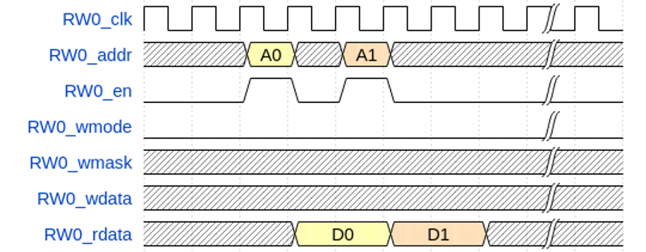
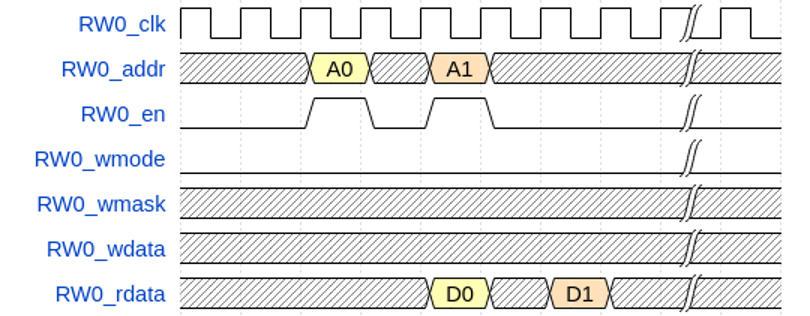
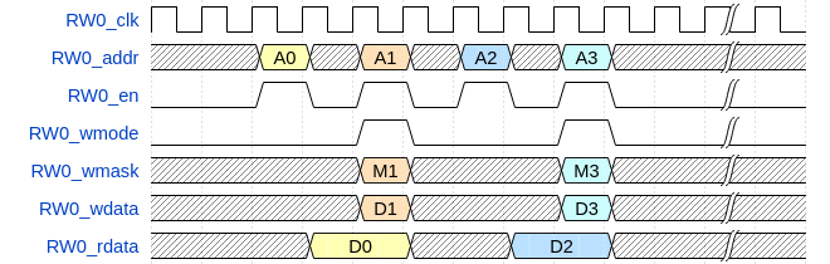
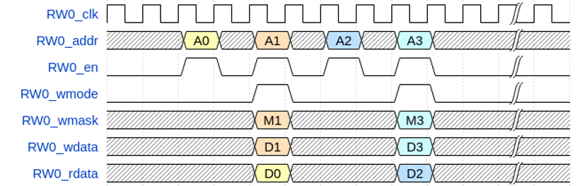

# Synthesis Guide 逻辑综合指南

This section describes the necessary information to synthesize the NANHU design. 本节介绍综合南湖设计所需的信息。

## Clock and Reset &nbsp; 时钟与复位

Please refer to the SoC Section for clock and reset configurations. 时钟与复位的配置请参考SoC章节。

## L3 Cache SRAM Timing
The L3 cache in NANHU is by default configured to be accessed (read or write) once during every two cycles. 南湖的L3缓存默认配置为每两个周期访问一次（读取或写入）

* SRAM Writing &nbsp; SRAM写

* SRAM Reading &nbsp; SRAM读

There are two possible cases for SRAM reading, depending on the relation between read latency of SRAM itself and the frequency of processor. Although the behavior of SRAM under two situation is different, both of them are correct since the L3 Cache only use the rdata after two cycles. 根据 SRAM 本身的读取延迟与处理器频率之间的关系，SRAM 的读取可能有两种情况。虽然两种情况下 SRAM 的行为不同，但它们都是正确的，因为 L3 高速缓存只在两个周期后使用读取的数据。

Case 1: Latency(SRAM) < CycleTime(processor) &nbsp; SRAM延迟 < 处理器周期

Case 2: Latency(SRAM) > CycleTime(processor) &nbsp; SRAM延迟 > 处理器周期

* SRAM Read + Write SRAM读写

Case 1: Latency(SRAM) < CycleTime(processor) &nbsp; SRAM延迟 < 处理器周期

Case 2: Latency(SRAM) > CycleTime(processor) &nbsp; SRAM延迟 > 处理器周期

