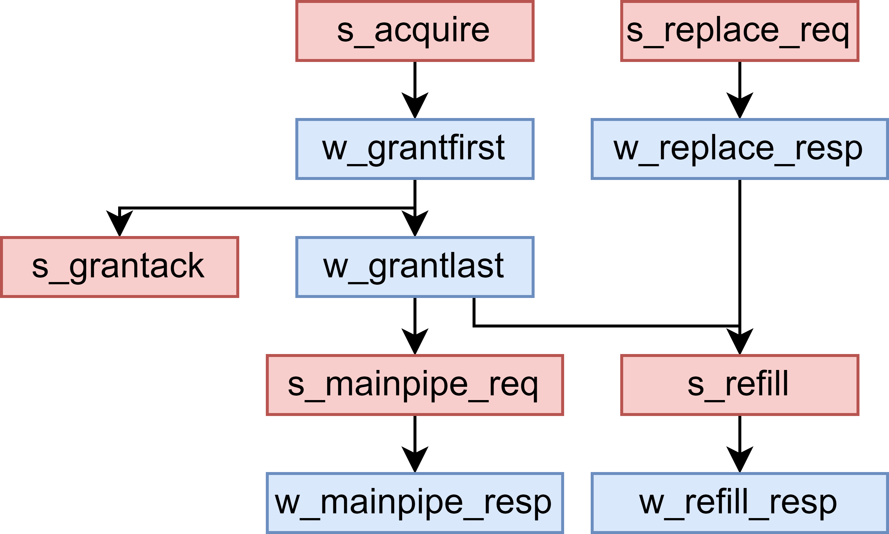

# Miss Queue

NanHu 架构中 Miss Queue 包含 16 项 Miss Entry, 每一项 Miss Entry 负责接收 miss 的 load、store 和原子请求, 从 L2 Cache 取回需要回填的数据, 并将缺失的 load 数据返回给 Load Queue.

以 load 为例, 普通的 miss 请求在 Miss Queue 中的处理流程如下:

* 在 Miss Queue 中分配一项空的 Miss Entry, 并在 Miss Entry 中记录相关信息;
* 根据 `way_en` 所在的块是否有效, 判断是否需要替换, 如果要替换则向 Main Pipe 发送 replace 请求;
* 发送 replace 请求的同时向 L2 发送 Acquire 请求, 如果是对整个 block 的覆盖写则发送 AcquirePerm (L2 将会省去一次 sram 读操作), 否则发送 AcquireBlock;
* 等待 L2 返回权限 (Grant) 或者数据加权限 (GrantData);
* 如果是 load miss, 在收到 GrantData 每一个 beat 后要将数据转发给 Load Queue;
* 在收到 Grant / GrantData 第一个 beat 后向 L2 返回 GrantAck;
* 在收到 Grant / GrantData 最后一个 beat, 并且 replace 请求已经完成后, 向 Refill Pipe 发送 refill 请求, 并等待应答, 完成数据回填;
* 释放 Miss Entry.

store miss 和 load miss 流程基本一致, 区别在于不需要把回填的数据转发给 Load Queue. 此外, store miss 在最终完成回填后要向 Store Buffer 返回应答, 表示 store 已完成.

原子指令的 miss 在 miss queue 中的处理流程如下:

* 在 Miss Queue 中分配一项空的 Miss Entry, 并在 Miss Entry 中记录相关信息;
* 向 L2 发送 AcquireBlock 请求;
* 等待 L2 返回 GrantData;
* 在收到 GrantData 第一个 beat 后向 L2 返回 GrantAck;
* 在收到 GrantData 最后一个 beat 后向 Main Pipe 发送请求, 在 Main Pipe 中同时完成替换和回填, 完成后向 Miss Entry 返回应答;
* 释放 Miss Entry.

上述 miss 请求处理流程由 Miss Entry 中的一组状态寄存器进行控制, 这部分将在 [Miss Queue 状态维护](#miss-queue-状态维护) 具体介绍.

## Miss Queue 状态维护

Miss Entry 由一系列状态寄存器控制需要完成哪些操作, 以及这些操作之间的执行顺序. 如下图所示, `s_*` 寄存器表示需要调度的请求, `w_*` 寄存器表示要等待的应答, 这些寄存器在初始状态下被置为 `true.B`, 在为请求分配一项 Miss Entry 时, 会将相应的 `s_*` 和 `w_*` 寄存器置为 `false.B`, 前者表示某一个向外的请求还没有发出去, 后者表示要等待的某个响应还没有握手.

<!-- 

 -->

Miss Entry 中各个事件是依据一定的依赖关系先后执行的. 上图是一个 DAG 的流程图, 箭头表示前面一个状态寄存器置为 `true.B` 后才可以做下一个事件.

状态|说明
-|-
`s_acquire`|向 L2 发送 AcquireBlock / AcquirePerm, 如果 miss 的块要对整个块写覆盖就只需要 AcquirePerm
`w_grantfirst`|接收到 GrantData 的第一个 beat
`w_grantlast`|接收到 GrantData 的最后一个 beat
`s_grantack`|表示收到 L2 的数据后向 L2 返回应答, 在收到 Grant 的第一个 beat 时就可以返回 GrantAck了
`s_mainpipe_req`|将原子请求发送到 Main Pipe 回填到 DCache
`w_mainpipe_resp`|表示将原子请求发送到 Main Pipe 回填到 DCache 后, 接收到 Main Pipe 的应答
`s_replace_req`|需要做替换, load / store 请求在进入 Miss Queue 之前会根据替换算法选择好替换路, 进入 Miss Queue 后直接向 Replace Pipe 发送请求
`w_replace_resp`|完成替换
`s_refill`|load / store 请求需要发送到 Refill Pipe 进行回填
`w_refill_resp`|表示回填完成.

## Miss Queue 分配逻辑

XiangShan 的 DCache Miss Queue 支持一定程度的请求合并, 从而提高 miss 请求处理的效率. 这一小节将介绍 NanHu 架构中 Miss Entry 的分配和合并策略, 以及什么情况下应该拒绝新的 miss 请求.

### 请求合并条件

当已分配的 Miss Entry (请求 A) 和新的 miss 请求 B 的块地址相同时, 在下述两种情况下可以进行合并:

1. 请求 A 的 Acquire 请求还没有握手, 且 A 是 load 请求, B 是 load 或 store 请求;
2. 请求 A 的 Acquire 已经发送出去了, 但是还没有收到 Grant(Data), 或者收到 Grant(Data) 了但还没有转发给 Load Queue, 且 A 是 load 或 store 请求, B 是 load 请求.

第 1 个条件可以合并是因为只要 Acquire 还没有握手, 就可以修改 Acquire 请求的各个参数. 需要注意的是一项处理 load miss 的 Miss Entry 在合并了 store miss 了之后, 还是需要把回填数据发送给 Load Queue.

第 2 个条件可以合并是因为, 只要该地址的 Miss Entry 还没有把数据发送给 Load Queue, 就可以合并新的 load 请求进来, 在 Miss Queue 拿到回填数据后会一次性唤醒所有 Load Queue 中等待该数据的 load.

### 请求拒绝条件

新的 miss 请求在下述两种情况下会被 Miss Queue 拒绝:

1. 新的 miss 请求和某个 Miss Entry 中请求的块地址相同, 但是不满足[请求合并条件](#请求合并条件);
2. 新的 miss 请求的块和某个 Miss Entry 中请求的块地址不同, 但是在 DCache 中位于相同的 slot (即两者位于相同的 set 和 way).

第 1 种情况: Miss Entry 由于某种原因已经不能再合并相同地址的 miss 请求了, 但是 load 流水线以及 store 流水线 (Main Pipe) 不能因为 Miss Queue 而阻塞, 所以 Miss Queue 需要拒绝该 miss 请求, 该 load / store 请求会等待一段时间后重发.

第 2 中情况: 在 NanHu 版本中, 为了从 L2 拿上来缺失的块后立马写入 DCache, load / store miss 请求会在进入 Miss Queue 之前就决定好替换路, 这样在拿到回填数据之后就不用再做一遍 tag 比较然后再决定替换路. 这会引入新的问题: 假设两个位于同一个 set 但不同 tag 的 load 请求, 先后在 Load Pipeline 上 miss 了, 但是两个 load 决定替换相同的 way, 并分别分配了一项 Miss Entry, 最终导致后 refill 的块把先 refill 的块覆盖掉了. 这不但会引入性能问题, 而且如果先 refill 的块带有脏数据的话还会导致脏数据丢失, 会引入正确性问题. 因此要设定第 2 个条件, 保证 Miss Queue 中没有两个相同 slot 的地址.

### Miss Queue 空项分配条件

当新的 miss 请求满足上述[合并条件](#请求合并条件)或者[拒绝条件](#请求拒绝条件)时, 相应地接收或拒绝请求即可. 这里的合并和拒绝的条件是完全互斥的, 两者不会有冲突.

最后, 在没有 Miss Entry 想要合并或者拒绝新的 miss 请求的情况下:

* 如果 Miss Queue 有空项, 分配新的 Miss Entry;
* 如果 Miss Queue 已满, 拒绝新的 miss 请求, 该请求会在一定时间后 replay.

## Miss Queue 触发替换

在 NanHu 版本中, 对于 load / store miss, Miss Queue 分配好新的 Miss Entry 时就会决定好要替换的路, 以便在收到要回填的块后立马进行回填. 为此, DCache 需要提前进行替换, 至少要在回填发生之前将替换块读出来. 因此这一版中 Miss Entry 分配好之后立马就可以进行替换, 即向 Main Pipe 发送 replace 请求.

为了性能考虑, 我们不希望替换块被过早地无效掉, 以免在向下访问 L2 / L3 的时间里核内又访问了替换块, 导致乒乓效应, 产生新的不必要的 miss 请求. 因此, 这里所说的替换并不是真的把替换块无效掉, 而是先把替换块的数据读出来, 并暂时放在写回队列中 sleep. 在替换请求 sleep 期间, 其他请求还是可以正常访问 DCache 中的替换块, 只要把对替换块的写同步一份到写回队列中即可. 当回填块拿上来以后, 就可以唤醒写回队列里 sleep 的块了, 写回队列开始向下 Release 替换块, 同时 Miss Queue 请求 Refill Pipe 完成回填, 回填的同时替换块就会被覆盖掉了.

## Miss Queue Refill

参见 [Refill Pipe](./refill_pipe.md).