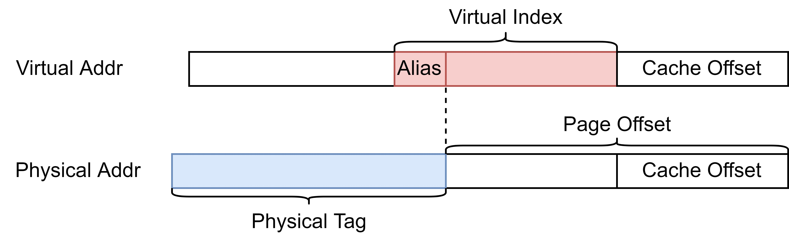

# Probe Queue

Probe Queue 包含 16 项 Probe Entry, 负责接收来自 L2 Cache 的 Probe 请求, 并将 Probe 请求转成内部信号发送到 Main Pipe, 在 Main Pipe 中修改被 Probe 块的权限.

## Probe 请求的调度

Probe Queue 接收到来自 L2 的 Probe 请求后的处理流程如下:

* 分配一项空的 Miss Entry;
* 向 Main Pipe 发送 probe 请求, 由于时序考虑该请求会被延迟一拍;
* 等待 Main Pipe 返回应答;
* 释放 Miss Entry.

## 补充

### Alias 的处理

NanHu 架构采用了 128KB 的 VIPT cache, 从而引入了 cache 别名问题, NanHu 架构从硬件角度解决别名问题. 如下图所示, L2 Cache 的目录会维护每一个物理块对应的别名位 (即虚地址索引超出页偏移的部分), 保证某一个物理地址在 L1 Cache 中只有一种别名位. 当 L1 Cache 在某个物理地址上想要获取不同的别名位, 即不同的 virtual index 时, L2 Cache 会将另一个 virtual index 对应的 cache 块 probe 下来.

由于 L2 发送的 Probe 请求都是按照物理地址, 但是 L1 会按照 VIPT 的方式访问 cache, 所以 L1 还需要知道被 probe 块的别名位. NanHu 架构利用 TileLink 协议中 B 通道的 data 域来传送 2-bit 的别名位, Probe Queue 收到请求后会将别名位和页偏移部分进行拼位, 从而得到访问 DCache 需要用到的索引.

### 原子指令支持

在 XiangShan 的设计中, 原子操作 (包括 lr-sc) 是在 DCache 中完成的. 执行 LR 指令时会保证目标地址已经在 DCache 中, 此时为了简化设计, LR 在 Main Pipe 中会注册一个 reservation set, 记录 LR 的地址, 并阻塞对该地址的 Probe. 为了避免带来死锁, Main Pipe 会在等待 SC 一定时间后不再阻塞 Probe (由参数 `LRSCCycles` 和 `LRSCBackOff` 决定), 此时再收到 SC 指令则均被视为 SC fail. 因此, 在 LR 注册 reservation set 后等待 SC 配对的时间里需要阻塞 Probe 请求对 DCache 进行操作.