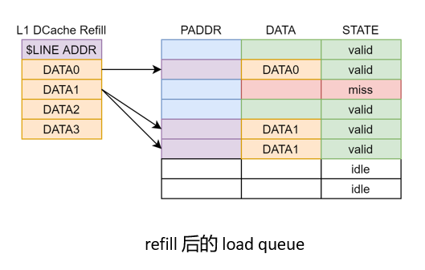

# Load Pipeline

本章介绍香山处理器南湖架构 load 流水线的设计以及 load 指令的处理流程.

香山处理器(雁栖湖架构)包含两条 load 流水线, 每条 load 流水线分成3个流水级:

  

## 流水线的划分

load 指令执行流水线各级划分如下:

### Stage 0

* 指令和操作数被从保留站读出
* 加法器将操作数与立即数相加，计算虚拟地址
* 虚拟地址送入 TLB 进行 TLB 查询
* 虚拟地址送入数据缓存进行 Tag 查询

### Stage 1

* TLB 产生物理地址
* 完成快速异常检查
* 物理地址送进数据缓存进行 Data 查询
* 物理地址送进 store queue / committed store buffer 开始进行 store 到 load 的前递操作
* 根据一级数据缓存返回的命中向量以及初步异常判断的结果，产生提前唤醒信号送给保留站
* 如果在这一级就出现了会导致指令从保留站重发的事件，通知保留站这条指令需要重发（feedbackFast）

### Stage 2

* 完成异常检查
* 根据一级数据缓存及前递返回的结果选择数据
* 根据 load 指令的要求，对返回的结果做裁剪操作
* 更新 load queue 中对应项的状态
* 结果 (整数) 写回到公共数据总线
* 结果 (浮点) 送到浮点模块

### Stage 4 (由于时序原因被延迟的 stage 3 操作)

* 根据 dcache 的反馈结果，更新 load queue 中对应项的状态（参见后续说明TODO）
* 根据 dcache 的反馈结果，反馈到保留站，通知保留站这条指令是否需要重发（feedbackSlow）

## Load 的执行流程

读tag
读data
获得读结果，选择并写回

### DCache Miss 的处理

如果 load miss, 

#### 更新 load queue 的状态

load stage 1 可以获得一个早期的 miss 信号。在发生 miss 时不允许提前唤醒。

load stage 2，如果发现 miss：

* 不会写回结果到寄存器堆
* 不占用 load 指令写回端口
* 更新 load queue 的状态，在 load queue 中等待 dcache refill

#### 侦听 dcache refill

在 load queue 中侦听 L1 DCache refill 结果如下所示:

  

  

一次 refill 会将数据传递到所有等待这一 cacheline 的 load queue 项。这些项的数据状态被标识为有效, 随后可以被写回。如果指令xie hui duan k此前已经进行了 store 到 load 的前递，load queue 负责在 refill 时合并前递结果，参见“Store 到 Load 的前递”一节。

#### 写回 miss 的 load 指令

选择逻辑

争用写回端口

### Store 到 Load 的前递 (Store To Load Forward, STLF)

store 到 load 的前递操作被分配到三级流水执行。在前递操作期间前递逻辑会并行检查 committed store buffer 和 store queue 中是否存在当前 load 需要的数据。如果存在，则将这些数据合并到这一次 load 的结果中。

#### 虚地址前递，实地址检查

为了时序考虑，使用虚地址进行前递，实地址检查来进行前递。

基本思路
需要恢复

TODO：图

虚地址前递的数据通路如下：load 流水线的 stage 0 会根据指令的 sqIdx，生成数据前递所使用的 mask。在 load 流水线的 stage 1，虚拟地址和 mask 被发送到 store queue 和 committed store buffer 进行前递查询。在 load 流水线的 stage 2，store queue 和 committed store buffer 产生前递查询结果，这些结果会和 dcache 读出的结果合并。

虚地址前递的控制通路如下：

检查发现错误后，触发回滚并刷新 committed store buffer。这样的操作会将引发错误的虚地址从 store queue 和 committed store buffer 中排除出去。

> 作为对比，实地址前递的流程如下： load 流水线的 stage 0 会根据指令的 sqIdx，生成数据前递所使用的 mask。在 load 流水线的 stage 1，TLB 反馈回物理地址，此物理地址和 mask 被发送到 store queue 和 committed store buffer 进行前递查询。在 load 流水线的 stage 2，store queue 和 committed store buffer 产生前递查询结果，这些结果会和 dcache 读出的结果合并。控制和数据通路均遵循这一流程。

#### 前递结果的保存

如果 DCache miss, 保留 forward 结果。 Forward 的结果（mask 和 data）会被写入到 load queue 中。后续 dcache refill 结果时，load queue 会负责合并 refill 上来的数据和 forward 的结果，最终生成完整的 load 结果。

#### dcache miss 但前递完全命中时的优化

时序考虑：来不及将这种指令标成命中状态

交给 load queue 去做处理

load queue 会立刻发现这样的指令不需要等待 dcache refill 的结果。这样的指令可以被直接选取并写回。

### store-load 违例检查和恢复

#### 违例检查流程

在 store 指令到达 stage 1 时开始进行 load 违例检查. 如果在检查过程中发现了 load 违例, 则触发 load 违例的 store 不会在 ROB 中被标记为*可以提交*的状态. 同时, 回滚操作会立刻被触发, 无需等待触发 load 违例的 store 指令提交.

#### 违例检查失败恢复

### load-load 违例检查和恢复

TODO

#### 违例检查流程

#### 违例检查失败恢复

#### 违例检查资源争用

### load 写回端口的争用

南湖架构提供了两个 load 写回端口。这个端口负责将 load 的结果写回到保留站，寄存器堆，并通知 ROB 指令已经完成执行。load 流水线的 stage 2 和 load queue 都可以使用这个端口写回结果。两者会争抢这一端口的使用权。

正常情况下，流水线中的 load 指令拥有更高的优先级。

## 不同情况下 Load 指令在流水线中的处理流程

### 从保留站重发(replay)机制介绍

在一些事件发生时, 我们将从保留站中重发这些 load 指令:

* TLB miss
* L1 DCache MSHR full
* DCache bank conflict
* 前递时发现地址匹配但数据未就绪 (Data invalid)

这些事件的共同特点是:
* 发生频率不高(相比于正常的访存指令)
* 这些事件发生时访存指令无法正常执行 
* 在一段时间后再执行相同的访存指令, 这些事件不会发生
    * 例如, TLB miss 事件会在 PTW 完成 TLB 重填之后消失

从保留站重发机制的作用是让这些指令在保留栈中稍作等待, 在一定的周期之后重新执行. 这一机制的实现如下: 一条指令从访存 RS 中发射之后仍然需要保留在 RS 中, 访存指令在离开流水线时向 RS 反馈是否需要从保留站重发. 需要从保留站重发的指令会在 RS 中继续等待在一定时间间隔之后重新发射.

目前，load 流水线中有两个向保留站反馈是否需要重发指令的端口。这两个端口分别位于 load stage 1 (feedbackFast)和 load stage 3（feedbackSlow）。在 load stage 0 和 load stage 1 可以被检查出的需要重发的指令会通过 load stage 1 的 feedbackFast 端口将重发请求反馈到保留站。在 load stage 2 才能被检查出的重发请求将在 load stage 3 的 feedbackSlow 端口反馈到保留站。两个端口的设计是为了让保留站能更早地重发一些需要重发的指令。

除了是否要进行指令重发的信息，重发反馈端口还包括以下信息：

* 使用保留站 index（rsIdx）索引要重发的指令在保留站中的位置
* 使用 sourceType 域区分不同的重发原因shi yong quan
* 为 load 发现之前的 store 地址就绪但数据未就绪的情况，提供了反馈这条 store sqIdx 的接口

> 注意：这一机制可能在下一版设计中发生变动

### TLB miss 的处理

使用 feedbackSlow 端口

从保留站重发

TLB miss 重发的延迟设计

TLB 传来的快速唤醒信号处理

### bank conflict 的处理

冲突种类

允许同时执行的情况

时序上的考虑

使用 feedbackFast 端口

从保留站重发

重发无延迟。保留站在收到 bank 冲突重发请求时可以立即重发这条指令。

### dcache MSHR 满/冲突的处理

dcache MSHR 满/冲突的原因参见 dcache/MSHR 部分（TODO）

发生时的处理：
因为时序原因（参见 dcache MSHR 部分），状态的更新延后进行。

使用 feedbackSlow 端口

从保留站重发

重发无延迟。保留站在收到 dcache MSHR 满重发请求时可以立即重发这条指令。

### store 地址就绪但数据未就绪

这些指令不会更新 load queue 也不会写回。

将会在 load stage 3 通过 feedbackSlow 通知保留站，这条指令正在等待此前的某条 store 指令的数据就绪。

在进行检查的过程中，这个 load 所依赖的 store 的 sqIdx 会被一并查出。

使用 feedbackSlow 端口

从保留站重发

重发有延迟。保留站可以根据查出的 sqIdx 等待到对应的 store data 产生之后再重新发射这条 load 指令。

### 异常的处理

异常的种类

* 来自地址检查的异常
* 来自错误处理的异常

异常使用单独的异常通路，时序比 data 通路宽松。

地址检查结果的分级生成（参见MMU部分）。

### 预取指令的处理

屏蔽例外

不会重发

### Trigger 的设置

TODO

## 硬件性能计数器

计数器名称|描述
-|-
load_s0_in_fire|
load_to_load_forward|
stall_dcache|
addr_spec_success|
addr_spec_failed|
load_s1_in_fire|
load_s1_tlb_miss|
load_s2_in_fire|
load_s2_dcache_miss|
load_s2_replay|
load_s2_replay_tlb_miss|
load_s2_replay_cache|