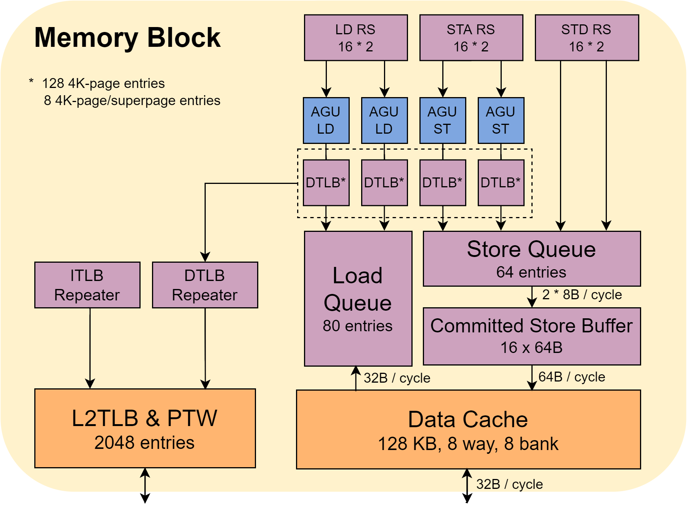

# 总体架构

香山处理器的 `Memblock` 包含核内的访存流水线及队列, 以及与访存流水线紧耦合的一级数据缓存. 我们使用 `访存单元` 一词来指代 `Memblock`这一部分.

  

香山处理器(南湖架构)核内的访存单元如上图所示. 其中包含两条 [load 流水线](./fu/load_pipeline.md), 彼此分离的两条 [sta 流水线](./fu/store_pipeline.md#Sta-Pipeline) 和两条 [std 流水线](./fu/store_pipeline.md#Std-Pipeline). [load queue](./lsq/load_queue.md) 和 [store queue](./lsq/store_queue.md) 负责维护访存指令的顺序信息. load queue 会在 load 指令在一级缓存中缺失时负责监听后续的重填结果并执行写回操作. store queue 负责在指令提交之前暂存 store 的数据, 并为 store 向 load 的前递提供数据. 

在 store 指令提交之后, store queue 会将其中的数据搬运到 [committed store buffer](./lsq/committed_store_buffer.md). committed store buffer 会以缓存行为单位对 store 的写请求进行合并, 在接近满的时候将合并后的多个 store 写请求一并写入到一级数据缓存中.

[一级数据缓存](../memory/dcache/dcache.md) 对核内访存组件暴露两个位宽为64的读端口和一个与一级数据缓存行宽度相同的写端口, 以及一个数据重填端口. 数据重填端口的宽度数据缓存和 l2 缓存之间的总线宽度决定. 目前, 南湖架构的数据重填端口宽度为 256 bit. 一级数据缓存使用 TileLink 总线协议.

[MMU](./mmu/mmu.md), 亦即 Memory Management Unit，在处理器中主要负责将虚拟地址翻译成物理地址，然后用这个物理地址去访存。同时也会进行权限检查，比如是否可写，可执行. 香山的 [MMU](./mmu/mmu.md) 包含 [TLB](./mmu/tlb.md), [L2TLB](./mmu/l2tlb.md), [Repeater](./mmu/mmu.md#repeater), [PMP & PMA](./mmu/pmp_pma.md) 等组件.

多个组件共同配合实现了香山处理器的乱序访存机制, 参见 [访存机制介绍](./mechanism.md) 一节. 除此之外, 有关 [访存违例预测](./mdp/mdp.md) 的实现也在此描述.

!!! note
    实际交付后端的 Verilog 代码中涉及到一些关键路径上代码的替换.

最新的访存单元设计可以参考这一报告： [香山访存单元微结构介绍（英文）](https://github.com/OpenXiangShan/XiangShan-doc/blob/main/slides/20230426-LSU_of_Xiangshan_Processor.pdf).
