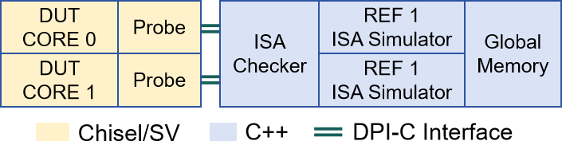

# 协同仿真框架 (DiffTest)

香山处理器使用 DiffTest 协同仿真框架进行仿真验证. DiffTest 的原理参见 [DiffTest 的原理介绍](https://oscpu.github.io/ysyx/events/2021-07-17_Difftest/DiffTest-%E4%B8%80%E7%A7%8D%E9%AB%98%E6%95%88%E7%9A%84%E5%A4%84%E7%90%86%E5%99%A8%E9%AA%8C%E8%AF%81%E6%96%B9%E6%B3%95.pdf).

关于 DiffTest 的使用方法，请参考 [DiffTest 仓库](https://github.com/OpenXiangShan/difftest)的 README。

## DiffTest FPGA/Emulator 加速简介
 FPGA/Emulator 等硬件仿真平台对处理器核硬件电路仿真具有较好加速效果，将该类平台用于 DiffTest 协同仿真验证时，主要瓶颈在于硬件电路仿真及软件侧参考模型之间的通信交互，占据 98 \% 的仿真时间。本工作通过通信打包、验证状态融合、出错重放等通信优化方法，在将软硬件通信开销降低 99.84 \% 的同时，保持指令级别的出错调试能力。

 基于 Palladium Z2 的评估结果，该工作优化后香山协同仿真速度达到 677  kHz，相对于 DiffTest 未优化状态实现 107.4 倍加速，相对于 16 线程 Verilator 实现 423 倍的加速，该工作已开源并应用于香山处理器开发验证，发现 151 处复杂 Bug。

### DiffTest 框架布局
 DiffTest 是一个针对 RISC-V 处理器的协同仿真框架，支持待测设计 (DUT) 和参考模型 (包括 Spike、NEMU) 的协同仿真，在每条指令执行后比对二者验证状态，覆盖 32 种检查状态，包括指令提交、TLB 检查、缓存一致性、向量化、虚拟化等。下图展示 DiffTest 框架部署于双核 DUT 的布局示意，信息探针 probe 将从 DUT 中提取验证状态，并通过软硬件通信接口 (例如 DPI-C)  传输至软件侧，规则检查器 ISA checker 将驱动参考模型执行相同的指令，并比对二者验证状态。

<figure markdown>
  { width="600" }
  <figcaption>DiffTest 双核 DUT 布局示意 </figcaption>
</figure>

### 软件仿真及硬件仿真对比
 在基于软件 RTL 仿真器 (例如 Verilator、VCS) 的验证流程中，硬件电路逻辑 (Chisel/SV) 也将编译为对应的软件仿真代码，整体框架均部署于软件环境。此时，DiffTest 仿真速度主要受制于大规模电路的仿真速度，使用 16-thread Verilator 仿真时，单核香山仿真速度仅 4.4 KHz，双核香山仿真速度仅 1.6 KHz。

为加速电路部分仿真，DiffTest 采用硬件平台，如 Cadence Palladium， 部署硬件电路逻辑，并将 REF 部署于软件部分，验证状态通过软硬件通信通路传输。Palladium 对硬件仿真起到较好加速效果，Palladium Z2 仿真双核香山速度达到 800 KHz，且支持 DPI-C 通信方式，易于实现 DiffTest 框架的部署。然而，Palladium 部署 DiffTest 后速度仅有 6 KHz，软硬件通信耗时大于 98%，成为主要瓶颈。

### 优化原理及效果
为此，我们开发针对硬件仿真平台的 DiffTest 通信优化方法：
+ 通过多个通信函数的打包合并优化频繁通信产生的软硬件同步开销；
+ 通过验证状态的融合和重复数据过滤降低通信数据量；
+ 支持融合状态出错时刻的逐指令重放，在加速的同时保持指令级调试粒度；
+ 支持平台原生的 GFIFO 等非阻塞通信方式，优化硬件无效阻塞。

基于 Palladium Z2 的评估结果，优化后香山协同仿真速度达到 677  kHz，相对于 DiffTest 未优化状态实现 107.4 倍加速，相对于 16 线程 Verilator 实现 423 倍的加速，将协同仿真额外耗时降低  99.84%。在仿真加速的同时，DiffTest 保持指令级别的错误定位能力。该工作已开源并应用于香山处理器开发验证，发现 151 处复杂 Bug。

### 当前及下一步工作
当前工作已完成 Palladium 的主要性能优化部分，接近平台理想性能，应用于香山的日常开发验证流程中，正在继续进行面积资源占用优化。工作参与者主要包含游昆霖、徐易难、冯柯翰、蔡洛珊等。

下一步 DiffTest 通信优化方法将迁移适配至 FPGA，进一步利用 FPGA 加速能力加速协同仿真。目前已经完成了整体软硬件通路适配并跑通基本流程，正在进一步调优中。

## 运行前准备工作

### FPGA-DIFF:

#### 安装xilinx dma驱动
https://github.com/Xilinx/dma_ip_drivers
```shell
cd dma_ip_drivers/XDMA/linux-kernel/xdma
make -j16
sudo make install
```
此项命令需添加到开机任务中
```shell
/sbin/modprobe xdma poll_mode=1
```
#### 安装 vivado (需自行准备安装包  2020.2以上版本)
添加vivado lib到环境(版本号根据实际更换)
```shell
export VIVADO_PATH=/Xilinx/vivado/2020.2/
export LD_LIBRARY_PATH=$VIVADO_PATH/lib/lnx64.o:$LD_LIBRARY_PATH
```
#### 启动 hw_server实例
```shell
$VIVADO_PATH bin/unwrapped/lnx64.o/hw_server -s tcp::3125
```

## 编译及运行命令
### 生成 RTL
```shell
make sim-verilog PLDM_ARGS="--difftest-config EBINDSR --fpga-platform" PLDM=1 WITH_CHISELDB=0 WITH_CONSTANTIN=0
```
根据加速配置，增量开启不同功能的 difftest-config 如下：
+ 无优化配置：ZE
+ 开启 Batch：EBI
+ 开启 NonBlock：EBIN
+ 开启 Delta：EBIND
+ 开启 Squash：EBINDS
+ 开启 Replay：EBINDSR

以上各项优化可自由组合配置，常用配置包含：ZEN、ZENSR、EBIND、EBINDSR；
其中，Z 和 BI 两种配置传输的最终数据一致，BI 能够将所有通信函数合并为唯一的通信接口，但同时引入较大的面积开销；
SR 配置能够在多指令状态融合的同时保持出错位置的逐指令复现，如遇到少数无法正确定位的错误，删除 SR 即可保证正确定位。
### Palladium 编译运行
```shell
make pldm-build DIFFTEST_PERFCNT=1 WITH_CHISELDB=0 WITH_CONSTANTIN=0

make pldm-run PLDM_EXTRA_ARGS="+diff=../../ready-to-run/riscv64-nemu-interpreter-so +workload=../../ready-to-run/linux.bin"
```
运行命令中路径为 XiangShan/build/pldm-compile 的相对路径或绝对路径，+diff 和 +workload 分别指定参考模型及测试负载路径。
### Fpga 编译运行
在上位机运行时，需要传入的flash与fpga上固化的flash保持相同
```shell
make fpga-build FPGA=1 DIFFTEST_PERFCNT=1 USE_THREAD_MEMPOOL=1

./fpga-host --diff ./ready-to-run/riscv64-nemu-interpreter-so -i ./ready-to-run/microbench.bin --flash flash.bin
```
## 加速原理
### 通信开销分析
DiffTest 部署至硬件仿真平台，如 Cadence Palladium Z2 时，仅 DUT 部分的硬件仿真速度可以达到 800 KHz，然而整体协同仿真速度只有 6 KHz，根据仿真用时拆解，高达 98% 的仿真时间用于软硬件通信。

根据硬件仿真平台的运行原理，协同仿真引入的额外通信开销主要可以分解为三部分：
+ 通信同步开销：由通信函数调用产生，主要通过将多个通信调用进行打包优化 (Batch)
+ 数据传输开销：大规模数据传输产生的传输开销，主要通过将同一类 DiffTestBundle 进行语义合并 (Squash) 以及过滤同一类 Bundle 前后提交之间的重复数据 (Delta) 进行优化。
+ 硬件阻塞开销：硬件侧阻塞以等待软件侧比对结果的延迟，默认方案采用锁步式比对策略 (step-and-compare)，在每一步得到比对结果后才进行下一步仿真。主要通过非阻塞传输 (NonBlock) 进行优化。
### 优化整体示意
针对上述三项开销，DiffTest 分别提出 Batch、Squash/Delta、NonBlock 进行优化，同时通过 Replay 模块在加速同时保持逐指令的错误调试能力。DiffTest 面向硬件仿真平台的优化框架及工作流程如下图所示。

<figure markdown>
  { width="600" }
  <figcaption>DiffTest 面向硬件仿真平台的通信优化框架 </figcaption>
</figure>

<figure markdown>
  { width="600" }
  <figcaption>DiffTest 通信优化工作流 </figcaption>
</figure>


### Batch: 动态打包多类 DiffTestBundle，减少通信次数
+ 功能：Batch 支持将同一拍及不同拍的 DiffTestBundle 进行拼接，打包为一个固定大小的数据包，其长度为数据通路位宽 (如 DPI-C 函数参数大小)。平均可以将 44 次通信调用打包为一个 4 KByte 的数据包传输。
+ 实现：
    + 多层次拼接：Batch 将 DiffTestBundle 分别按照同一类别、同一周期及同一次传输进行组织拼接，以利用每一层次的特点简化打包复杂度。例如同一类别的 Bundle 具有相同的结构和位宽，通过计算有效前缀个数即可确定数据拼接位置，无需进行位宽的累加。同一周期的数据将共同检查，可以复用相同的解析逻辑。同一次传输的数据长度固定，Batch支持将收集后的同一拍数据拆分至不同次传输，以充分利用数据通路打包更多通信。
    + 动态解析：由于不同数据包中拼接的 DiffTestBundle 组成不同，需要进行动态解析。Batch 将为每类 DiffTestBundle 生成对应的 metadata 和解析函数。在硬件侧打包时，metadata 将同时嵌入数据包中；在软件侧数据包解析中，将根据 metadata 调用对应的解析函数，从无格式的 Batch 数据包中提取特定长度的数据，并恢复为对应的 DiffTestBundle 格式。
### Squash/Delta: 融合检查状态，消除重复数据，减少数据量
+ 功能：
    + Squash 支持将同一 Bundle 的多次提交进行融合，例如对于指令 InstrCommit，Squash 支持将多条指令序列进行融合，通过 `nfused` 记录融合数量，并保留指令最终 pc 及寄存器写回值等信息。同时，Squash 支持在融合时保证部分关键状态同步至软件侧，例如 MMIO 外设访问、外部中断、多核场景下访存值等，用于将参考模型与处理器状态对齐。Squash 平均可以将调用次数及数据量降低18倍，至多可以将 256 条指令融合为一次提交。
    + Delta 支持在同一个 Bundle 的前后传输之间过滤重复数据。例如对于寄存器堆等检查状态，存在大量不变的值。Delta可以过滤约 60% 的重复数据。
+ 实现：
    + 状态依赖处理：进行 Squash 状态融合时，需要保留状态间依赖关系。例如 InstrCommit 与对应 Int/Fp/VecWriteBack 需要同时提交，CSR 仅在指令和异常时更新。为维护状态间的依赖关系，在 `Preprocess.scala` 维护物理寄存器堆，建立指令与最新的写回值对应关系；为处理 CSR 等状态正确更新，在 `Difftest.scala` 中通过 `updateDependency` 刻画每个状态更新条件。
    + Squash 动态调度：在 Squash 进行状态融合时，存在部分不可融合状态，如异常中断、MMIO 外设访问等，此类状态需完整同步至软件侧，Squash 将立即提交此类状态以避免被后续值覆盖。由于 DiffTest 检查依赖多个状态的共同作用，未优化情形下不可融合状态将中断相关状态的融合并一同提交。为提升状态融合率，Squash 支持调度不可压缩状态提交并缓存至软件侧，同时继续相关状态的压缩。为维护相关状态的共同作用，Squash 将为状态添加指令戳 `stamp` 表示作用顺序，在软件侧根据 `stamp` 恢复作用顺序。
    + Delta 差分传输：Delta 将重复率较高的 DiffTestBundle 标记为可差分传输，见 `Difftest.scala` 中 `supportsDelta`，该类状态中的每个 element 单独拆分，并与前序状态进行比较，仅传输变化的 element。在生成的 `difftest-delta.h`中，将根据变化的 element 更新缓存至，并恢复完整的 DiffTestBundle。
### NonBlock: 非阻塞传输，消除阻塞延迟
+ 功能：NonBlock 功能采用非阻塞通信函数进行软硬件之间的数据传输。相较于原有的锁步比对 (step-and-compare) 策略，NonBlock 采用异步策略，仅在出错或仿真结束时由软件侧异步返回结果，其余状态下可以在软件侧比对时继续硬件侧运行，从而掩盖硬件阻塞延迟。
+ 实现：非阻塞通信需要结合平台通信特性，例如在 Palladium 平台，需要通信函数声明为无返回值类型，并采用平台指令声明为 GFIFO 类型；在 FPGA 平台，为支持非阻塞功能，需要增加反压功能避免硬件速度高于软件导致的数据丢失。为支持软硬件的并行读写，软件侧需要设置缓冲区，在硬件调用传输函数写入的同时，支持软件侧的读取处理。
### Replay：出错重放功能，保持指令级调试精度
+ 功能：在 DiffTestBundle 中，携带调试辅助信息，支持在出错时报告不一致的检查状态、指令和周期信息，从而确定波形调试的模块位置和时间范围。然而，Squash 将多个检查状态进行融合，将出错范围由特定指令扩大到指令序列，无法报告具体的出错原因和时间信息。Replay 功能支持将出错的 Squash 状态序列逐指令重新传输处理，从而保证指令级别的可调试性。
+ 实现：
    + Replay 范围确定：为确定需要重新传输处理的范围，Replay功能为每条指令对应状态分配一个token。在 Squash 融合时，token 将以范围进行表示。当 Squash 状态出错时，软件侧通知硬件侧 token 范围进行重传。此外，由于非阻塞传输机制，在 Squash 状态出错后仍存在部分无效的 Squash 传输，将基于 token 进行过滤。
    + 参考模型状态恢复：为重新处理出错状态对应的未优化序列，需要将参考模型恢复至处理出错状态前的状态，主要难点在于内存状态的恢复，由于出错可能在任意一次检查时发生，高频次的快照开销大。Replay 采用回滚的方式进行内存恢复，在每次内存修改前记录该地址原值，出错时刻进行逆序恢复，从而轻量级的恢复参考模型状态。

## 开发者工具
### 性能计数器
+ DiffTest提供涵盖软件侧及硬件侧的性能计数器，用于统计软硬件通信的性能指标及影响因素。其中，软件侧计数器将记录 DPI-C 函数的通信次数、传输数据量等信息，硬件侧计数器将用于统计性能影响因素，例如 Squash 模块的融合中断原因统计，Batch 模块的打包利用率等。这些统计信息将用于指导各项优化措施的调优。
+ 使用方法：软件侧性能计数器可以在软件代码编译时添加 `DIFFTEST_PERFCNT=1` 打开，硬件侧计数器需要在生成 RTL 的时候，在 `--difftest-config` 中添加 `P` 开启。
### SQL 离线分析
+ DiffTest 支持将所有 DPI-C 传输的 DiffTestBundle 记录至 Sql 数据库中，支持离线查看每个 DiffTestBundle 结构体的成员数值。基于 Sql 记录的数据，可以添加脚本分析重复率，结构体语义相关性等信息，辅助 Squash、Delta等功能优化，以更好的数据量传输验证信息。
+ 使用方法：软件代码编译时添加 `DIFFTEST_QUERY=1`
### Trace 调试支持
+ 调试 DiffTest 本身硬件侧逻辑时，携带不变的 DUT 一同编译将产生较大的无效资源和时间开销。为支持独立迭代调试 DiffTest 硬件侧逻辑，DiffTest 支持在第一次 DUT 和 DiffTest 同时运行时记录 DUT 的验证状态 Trace，在后续迭代时，基于 Trace 单独生成和调试 DiffTest 硬件逻辑。
+ 使用方法
    + 记录 Trace：为初次运行生成 RTL 时，在 `--difftest-config` 中添加 `T`；
    + 单独生成 difftest 硬件侧逻辑
```shell
make difftest_verilog PROFILE=../build/generated-src/difftest_profile.json NUM_CORES=1 CONFIG=L
```
其中 CONFIG 需要添加 L，可以组合其余CONFIG，PROFILE 为 DiffTestBundle 端口信息。

基于上述工具，开发者可以基于香山运行产生的验证状态 Trace，单独评估及改进 DiffTest 验证逻辑，并基于 Sql 语义分析和性能计数器挖掘潜在的优化可能性，从而加速 DiffTest 硬件加速效率。

## 参考资料
- DiffTest 的基本原理： [一生一芯计划讲义](https://ysyx.oscc.cc/slides/2205/12.html)
- DiffTest 验证流程及原理进阶讨论： [论文1 (MICRO'22)](https://ieeexplore.ieee.org/document/9923860), [论文2 (JCST'23)](https://jcst.ict.ac.cn/en/article/doi/10.1007/s11390-023-3285-8)
- SMP-DiffTest 支持多处理器的差分测试方法: [PPT](https://github.com/OpenXiangShan/XiangShan-doc/blob/main/slides/20210624-RVWC-SMP-Difftest%20%E6%94%AF%E6%8C%81%E5%A4%9A%E5%A4%84%E7%90%86%E5%99%A8%E7%9A%84%E5%B7%AE%E5%88%86%E6%B5%8B%E8%AF%95%E6%96%B9%E6%B3%95.pdf), [视频](https://www.bilibili.com/video/BV1NM4y1T7Hz/)
- 面向硬件仿真平台的 DiffTest 优化: [PPT](https://github.com/OpenXiangShan/XiangShan-doc/raw/main/slides/20240827-CadenceLIVEChina-%E9%9D%A2%E5%90%91Palladium%E7%9A%84%E9%AB%98%E6%80%A7%E8%83%BD%E5%A4%84%E7%90%86%E5%99%A8%E8%BD%AF%E7%A1%AC%E4%BB%B6%E5%8D%8F%E5%90%8C%E9%AA%8C%E8%AF%81%E6%A1%86%E6%9E%B6%E9%83%A8%E7%BD%B2%E4%B8%8E%E5%8A%A0%E9%80%9F%E6%96%B9%E6%B3%95.pdf), [视频](https://www.cadence.com/en_US/home/multimedia-secured.html/content/dam/cadence-www/global/zh_CN/videos/about-cadence/cadencelive/secured/2024/china/verification/ve06-deployment-and-acceleration-of-high-perfomance-processor.mp4)